# Lesson 10: Advanced CAN Topics and Troubleshooting

## Advanced CAN Concepts

This final lesson covers advanced topics essential for professional CAN implementation including security, advanced protocols, integration strategies, and comprehensive troubleshooting techniques.

## CAN Security

### Security Vulnerabilities

CAN was not designed with security in mind, creating potential vulnerabilities:

| Vulnerability | Description | Risk Level |
|---------------|-------------|------------|
| **No Authentication** | Any node can send any message | High |
| **No Encryption** | All data transmitted in plaintext | Medium |
| **Bus Access** | Physical access allows full monitoring | High |
| **Message Injection** | Malicious messages can be inserted | High |
| **Denial of Service** | High-priority messages can block bus | Medium |
| **Replay Attacks** | Previously captured messages can be resent | Medium |

### Security Countermeasures

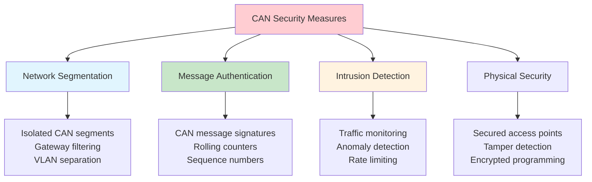

### Secure CAN Implementation

```cpp
#include <cstdint>
#include <array>

// Example: Message authentication implementation
class SecureCANMessage {
private:
    std::uint32_t message_id;        // CAN ID
    std::uint8_t  sequence_number;   // Prevents replay attacks
    std::array<std::uint8_t, 6> data; // Actual payload (reduced for MAC)
    std::uint8_t  mac;              // Message authentication code

public:
    SecureCANMessage(std::uint32_t id, std::uint8_t seq, 
                    const std::array<std::uint8_t, 6>& payload) :
        message_id(id), sequence_number(seq), data(payload), mac(0) {}
    
    // Calculate message authentication code
    std::uint8_t calculateMAC(std::uint32_t key) const {
        // Simplified MAC calculation (use proper crypto in production)
        std::uint32_t hash = key ^ message_id ^ sequence_number;
        for (const auto& byte : data) {
            hash = (hash << 1) ^ byte;
        }
        return static_cast<std::uint8_t>(hash & 0xFF);
    }
    
    // Set MAC after calculation
    void setMAC(std::uint32_t key) {
        mac = calculateMAC(key);
    }
    
    // Validate received message
    bool validateMessage(std::uint32_t key) const {
        std::uint8_t expected_mac = calculateMAC(key);
        return (mac == expected_mac);
    }
    
    // Getters
    std::uint32_t getMessageID() const { return message_id; }
    std::uint8_t getSequenceNumber() const { return sequence_number; }
    const std::array<std::uint8_t, 6>& getData() const { return data; }
    std::uint8_t getMAC() const { return mac; }
};
```

## Advanced CAN Protocols

### Other CAN-based Protocols

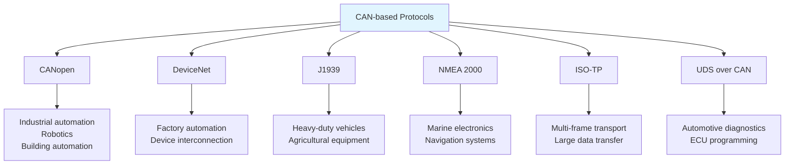

### J1939 Protocol Overview

J1939 is widely used in heavy-duty vehicles and equipment:

| Feature | J1939 | CANopen |
|---------|-------|---------|
| **Identifier** | 29-bit extended | 11-bit standard |
| **Data Length** | 8 bytes (CAN), 64+ (transport) | 8 bytes |
| **Address** | Source address based | Node ID based |
| **Transport** | Multi-packet support | SDO for large data |
| **Application** | Vehicles, agriculture | Industrial automation |

### ISO Transport Protocol (ISO-TP)

For transferring data larger than 8 bytes over CAN:

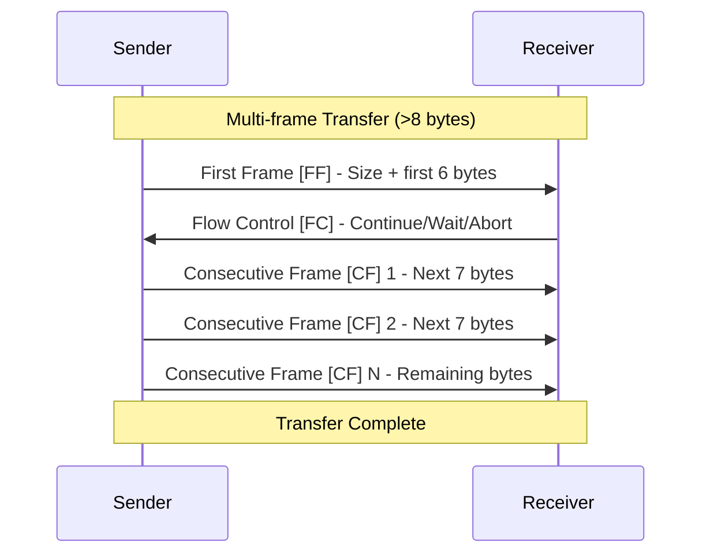

## Time Synchronization

### Precision Time Protocol (PTP) over CAN

For applications requiring precise time synchronization:

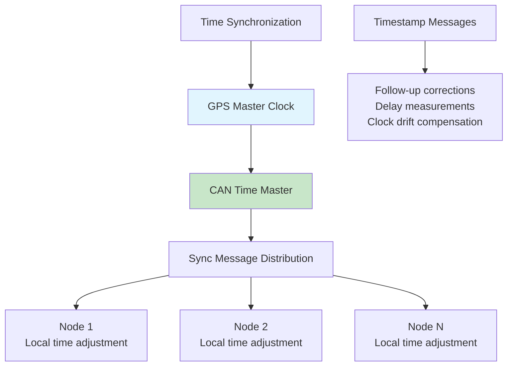

### Time-Triggered CAN (TTCAN)

TTCAN provides deterministic, time-triggered communication:

```mermaid
gantt
    title TTCAN Time-Triggered Schedule
    dateFormat X
    axisFormat %s
    
    section System Matrix
    Reference Message  :ref, 0, 1
    
    section Exclusive Windows
    High Priority Msg  :hp1, 1, 2
    Control Message    :ctrl, 2, 3
    High Priority Msg  :hp2, 3, 4
    
    section Arbitrating Window
    Best Effort Traffic :arb, 4, 8
    
    section Next Cycle
    Reference Message  :ref2, 8, 9
```

## Advanced Diagnostics

### Comprehensive Error Analysis

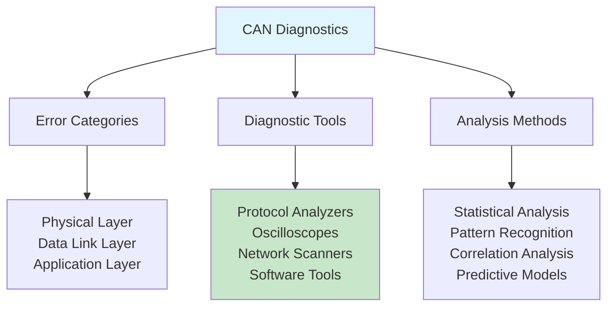

### Error Pattern Analysis

| Error Pattern | Possible Causes | Diagnostic Steps |
|---------------|-----------------|------------------|
| **Intermittent Errors** | Loose connections, EMI | Oscilloscope, continuity test |
| **Burst Errors** | Cable damage, termination | Signal integrity analysis |
| **Systematic Errors** | Timing issues, software bugs | Protocol analysis, code review |
| **Node-specific Errors** | Faulty transceiver, controller | Node isolation testing |
| **Load-dependent Errors** | Insufficient bus capacity | Traffic analysis, timing study |

### Network Health Monitoring

```cpp
#include <cstdint>
#include <iostream>
#include <iomanip>

// Example: Network health monitoring system
class NetworkHealthMonitor {
private:
    // Error counters
    std::uint32_t total_frames;
    std::uint32_t error_frames;
    std::uint32_t bus_off_events;
    std::uint32_t overrun_errors;
    
    // Performance metrics
    float    bus_utilization;
    std::uint16_t max_response_time;
    std::uint16_t avg_response_time;
    
    // Node status
    std::uint8_t  active_nodes;
    std::uint8_t  error_passive_nodes;
    std::uint8_t  bus_off_nodes;
    
    // Timestamp
    std::uint32_t last_update;

    // Thresholds
    static constexpr float ERROR_RATE_THRESHOLD = 0.01f;
    static constexpr float BUS_UTILIZATION_THRESHOLD = 70.0f;

public:
    NetworkHealthMonitor() : 
        total_frames(0), error_frames(0), bus_off_events(0), overrun_errors(0),
        bus_utilization(0.0f), max_response_time(0), avg_response_time(0),
        active_nodes(0), error_passive_nodes(0), bus_off_nodes(0), 
        last_update(0) {}
    
    void updateNetworkHealth() {
        // Calculate error rate
        float error_rate = (total_frames > 0) ? 
            static_cast<float>(error_frames) / total_frames : 0.0f;
        
        // Check thresholds
        if (error_rate > ERROR_RATE_THRESHOLD) {
            logWarning("High error rate: " + std::to_string(error_rate * 100.0f) + "%");
        }
        
        if (bus_utilization > BUS_UTILIZATION_THRESHOLD) {
            logWarning("High bus utilization: " + std::to_string(bus_utilization) + "%");
        }
        
        if (bus_off_nodes > 0) {
            logError(std::to_string(bus_off_nodes) + " nodes in bus-off state");
        }
    }
    
    // Setters
    void setTotalFrames(std::uint32_t frames) { total_frames = frames; }
    void setErrorFrames(std::uint32_t errors) { error_frames = errors; }
    void setBusUtilization(float utilization) { bus_utilization = utilization; }
    void setBusOffNodes(std::uint8_t nodes) { bus_off_nodes = nodes; }
    
    // Getters
    float getErrorRate() const { 
        return (total_frames > 0) ? 
            static_cast<float>(error_frames) / total_frames : 0.0f; 
    }
    float getBusUtilization() const { return bus_utilization; }
    std::uint8_t getActiveNodes() const { return active_nodes; }
    
private:
    void logWarning(const std::string& message) {
        std::cout << "WARNING: " << message << std::endl;
    }
    
    void logError(const std::string& message) {
        std::cout << "ERROR: " << message << std::endl;
    }
};
```

## Troubleshooting Methodology

### Systematic Troubleshooting Process

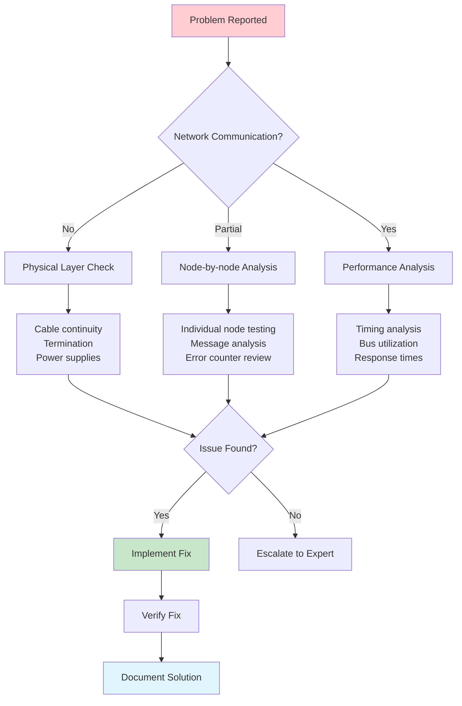

### Common Issues and Solutions

#### Physical Layer Issues

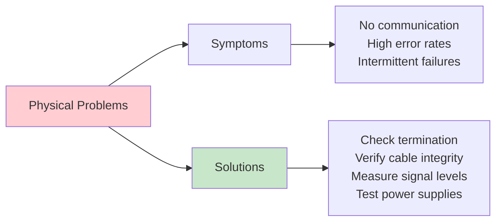

#### Common Troubleshooting Scenarios

| Symptom | Probable Cause | Investigation Steps | Solution |
|---------|----------------|-------------------|-----------|
| **No Communication** | Power, cables, termination | Check voltages, continuity, resistance | Fix physical connections |
| **High Error Rate** | EMI, poor grounding, bad cables | Oscilloscope analysis, shielding check | Improve shielding/grounding |
| **Intermittent Failures** | Loose connections, vibration | Stress testing, connector inspection | Secure connections |
| **Bus-off Conditions** | Software bugs, electrical issues | Error counter analysis, node isolation | Fix software/hardware |
| **Slow Response** | High bus load, timing issues | Traffic analysis, priority review | Optimize message scheduling |

## Diagnostic Tools and Techniques

### Professional Diagnostic Equipment

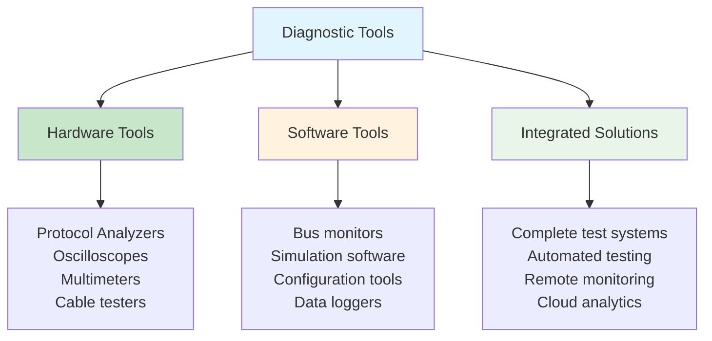

### Signal Analysis Techniques

#### Oscilloscope Analysis

Key measurements for CAN signal quality:

| Parameter | Measurement | Normal Range | Investigation Required |
|-----------|-------------|--------------|----------------------|
| **Differential Voltage** | Dominant state | 1.5V - 2.5V | Outside range |
| **Common Mode Voltage** | Both states | 2.0V - 3.0V | Outside range |
| **Rise/Fall Time** | 10%-90% transition | <250ns | Slower times |
| **Bit Time Accuracy** | Bit duration | ±0.5% | Higher deviation |
| **Eye Diagram** | Signal integrity | Clear opening | Closed eye |

### Remote Monitoring and Diagnostics

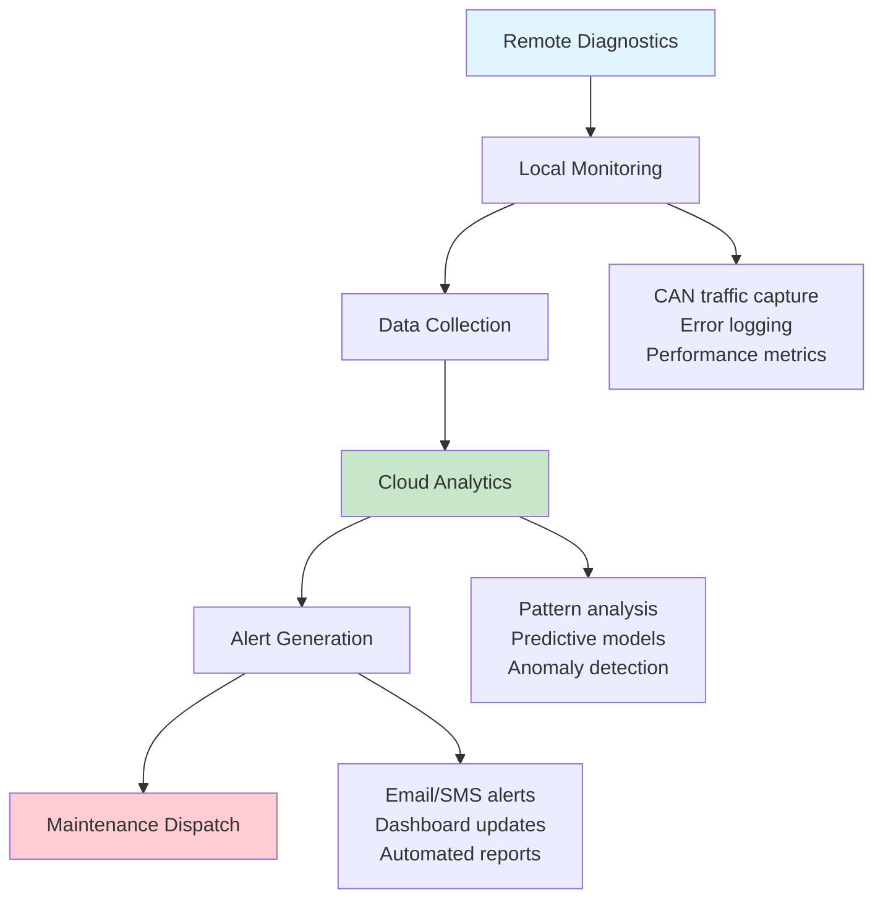

## Performance Optimization

### Advanced Optimization Techniques

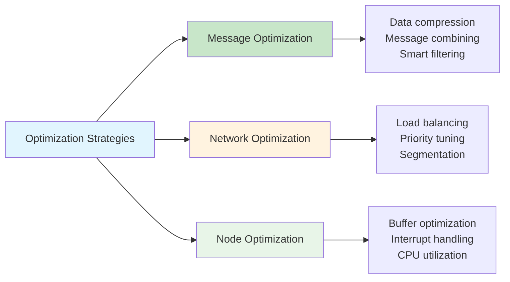

### Performance Monitoring Metrics

```cpp
#include <cstdint>
#include <vector>
#include <string>
#include <algorithm>
#include <iostream>

// Example: Performance monitoring implementation
struct PerformanceRecord {
    std::uint32_t timestamp;
    std::uint16_t message_id;
    std::uint8_t  dlc;
    std::uint16_t response_time_us;
    std::uint8_t  error_flags;
    
    PerformanceRecord(std::uint32_t ts, std::uint16_t id, std::uint8_t len,
                     std::uint16_t response_time, std::uint8_t errors) :
        timestamp(ts), message_id(id), dlc(len), 
        response_time_us(response_time), error_flags(errors) {}
};

class PerformanceMonitor {
private:
    // Rolling statistics
    std::uint32_t total_messages;
    std::uint32_t total_errors;
    float avg_response_time;
    std::uint16_t max_response_time;
    float bus_utilization;
    
    // Alert thresholds
    std::uint16_t max_response_threshold;
    float max_utilization_threshold;
    float max_error_rate_threshold;

public:
    PerformanceMonitor() : 
        total_messages(0), total_errors(0), avg_response_time(0.0f),
        max_response_time(0), bus_utilization(0.0f),
        max_response_threshold(5000), // 5ms default
        max_utilization_threshold(80.0f), // 80% default
        max_error_rate_threshold(0.01f) {} // 1% default
    
    void analyzePerformance(const std::vector<PerformanceRecord>& records) {
        if (records.empty()) return;
        
        // Calculate statistics
        std::uint32_t total_response_time = 0;
        std::uint16_t max_time = 0;
        std::uint32_t error_count = 0;
        
        for (const auto& record : records) {
            total_response_time += record.response_time_us;
            max_time = std::max(max_time, record.response_time_us);
            if (record.error_flags) {
                error_count++;
            }
        }
        
        avg_response_time = static_cast<float>(total_response_time) / records.size();
        max_response_time = max_time;
        float error_rate = static_cast<float>(error_count) / records.size();
        
        total_messages += records.size();
        total_errors += error_count;
        
        // Check thresholds and generate alerts
        if (max_time > max_response_threshold) {
            generateAlert("Response time exceeded threshold: " + 
                         std::to_string(max_time) + "μs");
        }
        
        if (error_rate > max_error_rate_threshold) {
            generateAlert("Error rate exceeded threshold: " + 
                         std::to_string(error_rate * 100.0f) + "%");
        }
        
        if (bus_utilization > max_utilization_threshold) {
            generateAlert("Bus utilization exceeded threshold: " + 
                         std::to_string(bus_utilization) + "%");
        }
    }
    
    // Setters for thresholds
    void setResponseThreshold(std::uint16_t threshold) { 
        max_response_threshold = threshold; 
    }
    void setUtilizationThreshold(float threshold) { 
        max_utilization_threshold = threshold; 
    }
    void setErrorRateThreshold(float threshold) { 
        max_error_rate_threshold = threshold; 
    }
    
    // Getters
    float getAverageResponseTime() const { return avg_response_time; }
    std::uint16_t getMaxResponseTime() const { return max_response_time; }
    float getBusUtilization() const { return bus_utilization; }

private:
    void generateAlert(const std::string& message) {
        std::cout << "ALERT: " << message << std::endl;
    }
};
```

## Future CAN Technologies

### Emerging Technologies

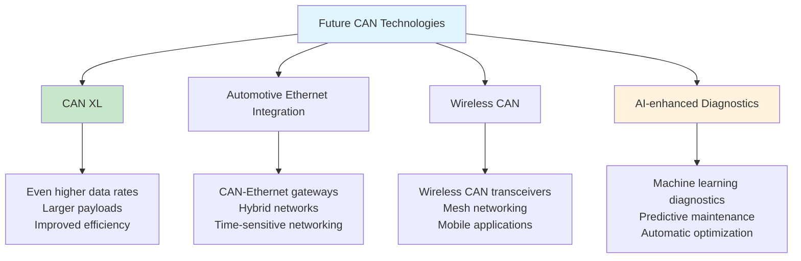

### Integration with Modern Technologies

| Technology | Integration Approach | Benefits |
|------------|---------------------|----------|
| **IoT** | CAN-to-cloud gateways | Remote monitoring, analytics |
| **AI/ML** | Predictive diagnostics | Proactive maintenance |
| **Digital Twins** | Real-time data synchronization | Virtual commissioning |
| **Blockchain** | Secure data logging | Tamper-proof records |
| **Edge Computing** | Local processing | Reduced latency |

## Best Practices Summary

### Design Best Practices

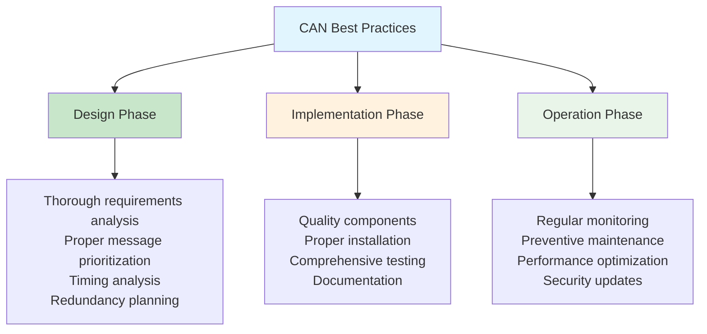

### Professional Development Path

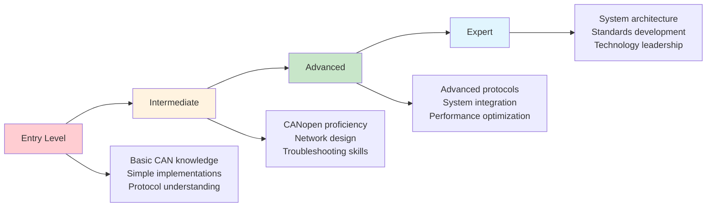

## Final Assessment and Certification

### Knowledge Areas Covered

- ✅ CAN protocol fundamentals and frame structure
- ✅ Physical layer design and network topology
- ✅ Arbitration mechanisms and error handling
- ✅ CAN-FD enhanced protocol features
- ✅ CANopen application layer and object dictionary
- ✅ Robotics applications and system integration
- ✅ Network design methodology and implementation
- ✅ Advanced topics and troubleshooting techniques

### Practical Skills Developed

- ✅ CAN network analysis and design
- ✅ Message prioritization and timing optimization
- ✅ CANopen device configuration and integration
- ✅ Troubleshooting and diagnostic techniques
- ✅ Performance monitoring and optimization
- ✅ Safety system implementation
- ✅ Documentation and compliance management

## Course Completion

Congratulations! You have completed the comprehensive CAN bus professional course. You now have the knowledge and skills to:

1. **Design** robust CAN networks for industrial and robotics applications
2. **Implement** CAN and CANopen systems with proper configuration
3. **Troubleshoot** complex network issues using systematic approaches
4. **Optimize** network performance for demanding applications
5. **Integrate** CAN systems into larger automation architectures

### Continuing Education

- Stay updated with latest CAN standards and technologies
- Participate in CiA (CAN in Automation) events and training
- Engage with professional communities and forums
- Pursue advanced certifications in specific application domains
- Contribute to open-source CAN tools and documentation

## Resources for Further Learning

### Professional Organizations
- **CiA (CAN in Automation)** - Official CAN standards organization
- **IEEE Industrial Electronics Society** - Advanced automation topics
- **IEC Technical Committees** - International standards development

### Technical Resources
- **CAN Newsletter** - Monthly industry updates
- **Vector Knowledge Base** - Comprehensive technical articles
- **CAN Wiki** - Community-driven documentation
- **GitHub CAN Projects** - Open-source implementations

The journey to CAN mastery is ongoing. Continue learning, practicing, and contributing to the CAN community!

## Final Practical Exercise

Design a complete CAN network for an autonomous mobile robot with the following requirements:
- 6-axis robotic arm with force feedback
- 360-degree LiDAR sensor
- Stereo vision system
- Differential drive with encoders
- Safety system with emergency stops
- Battery monitoring and charging interface
- Real-time telemetry to control station

Include network topology, message design, timing analysis, and troubleshooting procedures.