# Lesson 10: Advanced CAN Topics and Troubleshooting

## Advanced CAN Concepts

This final lesson covers advanced topics essential for professional CAN implementation including security, advanced protocols, integration strategies, and comprehensive troubleshooting techniques.

## CAN Security

### Security Vulnerabilities

CAN was not designed with security in mind, creating potential vulnerabilities:

| Vulnerability | Description | Risk Level |
|---------------|-------------|------------|
| **No Authentication** | Any node can send any message | High |
| **No Encryption** | All data transmitted in plaintext | Medium |
| **Bus Access** | Physical access allows full monitoring | High |
| **Message Injection** | Malicious messages can be inserted | High |
| **Denial of Service** | High-priority messages can block bus | Medium |
| **Replay Attacks** | Previously captured messages can be resent | Medium |

### Security Countermeasures

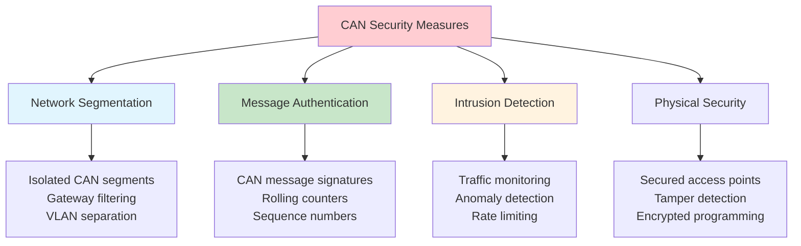

### Secure CAN Implementation

```c
// Example: Message authentication implementation
typedef struct {
    uint32_t message_id;        // CAN ID
    uint8_t  sequence_number;   // Prevents replay attacks
    uint8_t  data[6];          // Actual payload (reduced for MAC)
    uint8_t  mac;              // Message authentication code
} secure_can_message_t;

// Calculate message authentication code
uint8_t calculate_mac(uint32_t id, uint8_t seq, uint8_t* data, 
                     uint8_t len, uint32_t key) {
    // Simplified MAC calculation (use proper crypto in production)
    uint32_t hash = key ^ id ^ seq;
    for (int i = 0; i < len; i++) {
        hash = (hash << 1) ^ data[i];
    }
    return (uint8_t)(hash & 0xFF);
}

// Validate received message
bool validate_message(secure_can_message_t* msg, uint32_t key) {
    uint8_t expected_mac = calculate_mac(msg->message_id, 
                                        msg->sequence_number,
                                        msg->data, 6, key);
    return (msg->mac == expected_mac);
}
```

## Advanced CAN Protocols

### Other CAN-based Protocols

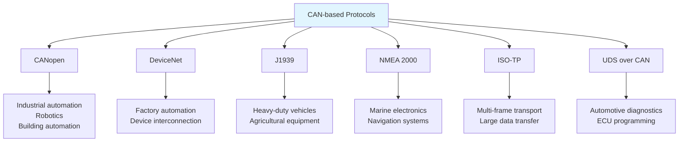

### J1939 Protocol Overview

J1939 is widely used in heavy-duty vehicles and equipment:

| Feature | J1939 | CANopen |
|---------|-------|---------|
| **Identifier** | 29-bit extended | 11-bit standard |
| **Data Length** | 8 bytes (CAN), 64+ (transport) | 8 bytes |
| **Address** | Source address based | Node ID based |
| **Transport** | Multi-packet support | SDO for large data |
| **Application** | Vehicles, agriculture | Industrial automation |

### ISO Transport Protocol (ISO-TP)

For transferring data larger than 8 bytes over CAN:

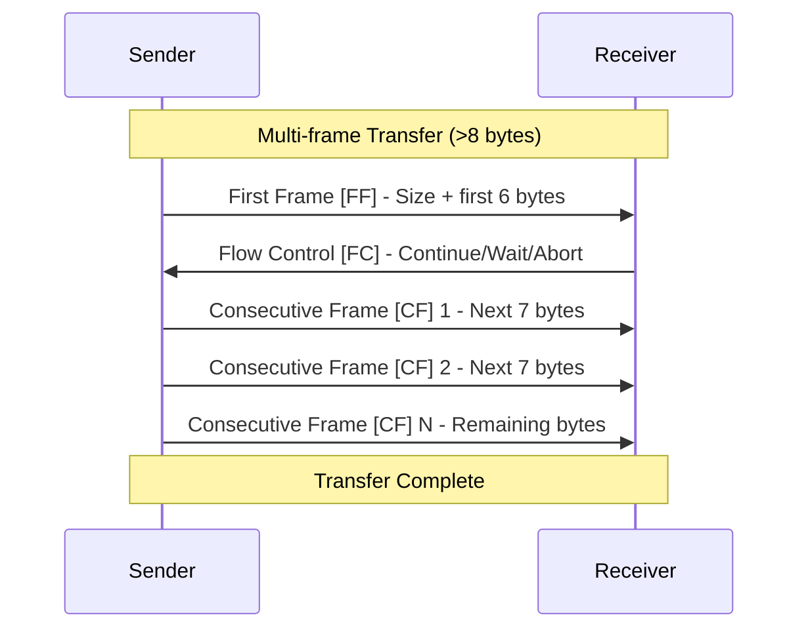

## Time Synchronization

### Precision Time Protocol (PTP) over CAN

For applications requiring precise time synchronization:

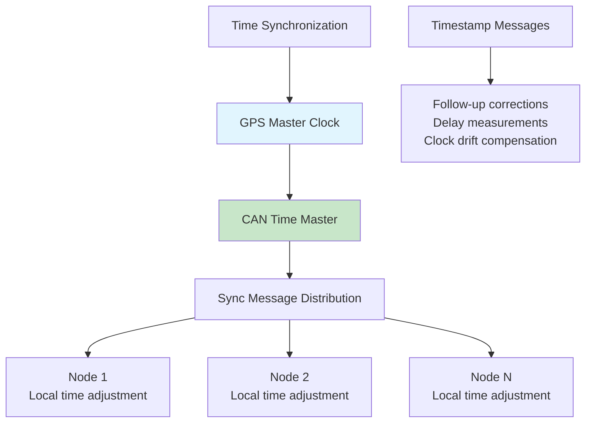

### Time-Triggered CAN (TTCAN)

TTCAN provides deterministic, time-triggered communication:

```mermaid
gantt
    title TTCAN Time-Triggered Schedule
    dateFormat X
    axisFormat %s
    
    section System Matrix
    Reference Message  :ref, 0, 1
    
    section Exclusive Windows
    High Priority Msg  :hp1, 1, 2
    Control Message    :ctrl, 2, 3
    High Priority Msg  :hp2, 3, 4
    
    section Arbitrating Window
    Best Effort Traffic :arb, 4, 8
    
    section Next Cycle
    Reference Message  :ref2, 8, 9
```

## Advanced Diagnostics

### Comprehensive Error Analysis

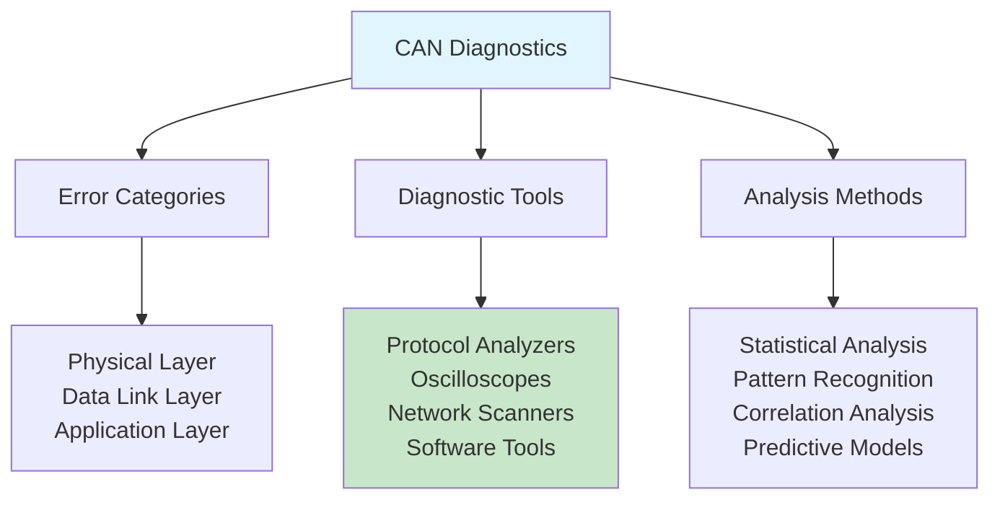

### Error Pattern Analysis

| Error Pattern | Possible Causes | Diagnostic Steps |
|---------------|-----------------|------------------|
| **Intermittent Errors** | Loose connections, EMI | Oscilloscope, continuity test |
| **Burst Errors** | Cable damage, termination | Signal integrity analysis |
| **Systematic Errors** | Timing issues, software bugs | Protocol analysis, code review |
| **Node-specific Errors** | Faulty transceiver, controller | Node isolation testing |
| **Load-dependent Errors** | Insufficient bus capacity | Traffic analysis, timing study |

### Network Health Monitoring

```c
// Example: Network health monitoring system
typedef struct {
    // Error counters
    uint32_t total_frames;
    uint32_t error_frames;
    uint32_t bus_off_events;
    uint32_t overrun_errors;
    
    // Performance metrics
    float    bus_utilization;
    uint16_t max_response_time;
    uint16_t avg_response_time;
    
    // Node status
    uint8_t  active_nodes;
    uint8_t  error_passive_nodes;
    uint8_t  bus_off_nodes;
    
    // Timestamp
    uint32_t last_update;
} network_health_t;

void update_network_health(network_health_t* health) {
    // Calculate error rate
    float error_rate = (float)health->error_frames / health->total_frames;
    
    // Check thresholds
    if (error_rate > 0.01) {
        log_warning("High error rate: %.2f%%", error_rate * 100);
    }
    
    if (health->bus_utilization > 70.0) {
        log_warning("High bus utilization: %.1f%%", health->bus_utilization);
    }
    
    if (health->bus_off_nodes > 0) {
        log_error("%d nodes in bus-off state", health->bus_off_nodes);
    }
}
```

## Troubleshooting Methodology

### Systematic Troubleshooting Process

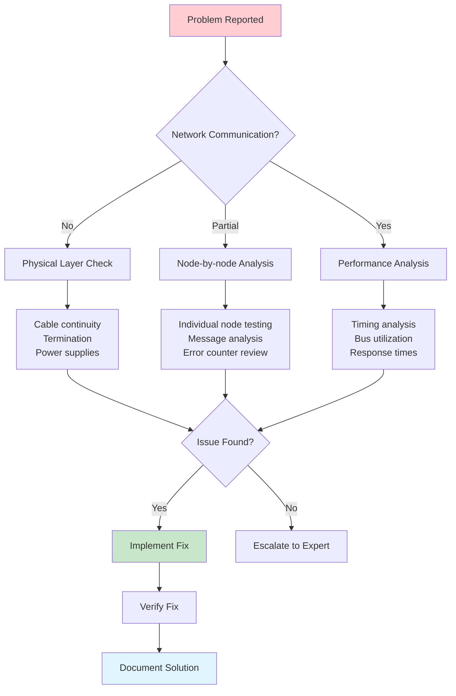

### Common Issues and Solutions

#### Physical Layer Issues

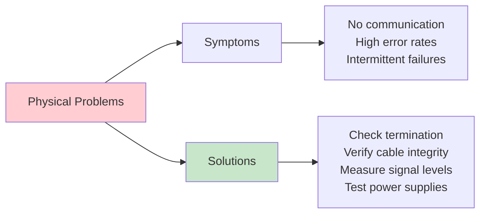

#### Common Troubleshooting Scenarios

| Symptom | Probable Cause | Investigation Steps | Solution |
|---------|----------------|-------------------|-----------|
| **No Communication** | Power, cables, termination | Check voltages, continuity, resistance | Fix physical connections |
| **High Error Rate** | EMI, poor grounding, bad cables | Oscilloscope analysis, shielding check | Improve shielding/grounding |
| **Intermittent Failures** | Loose connections, vibration | Stress testing, connector inspection | Secure connections |
| **Bus-off Conditions** | Software bugs, electrical issues | Error counter analysis, node isolation | Fix software/hardware |
| **Slow Response** | High bus load, timing issues | Traffic analysis, priority review | Optimize message scheduling |

## Diagnostic Tools and Techniques

### Professional Diagnostic Equipment

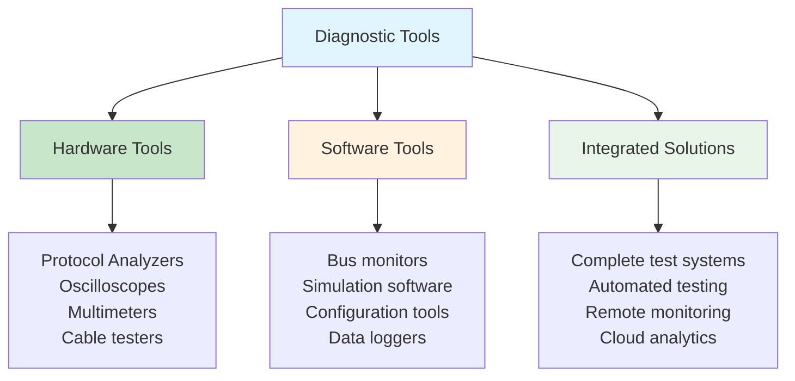

### Signal Analysis Techniques

#### Oscilloscope Analysis

Key measurements for CAN signal quality:

| Parameter | Measurement | Normal Range | Investigation Required |
|-----------|-------------|--------------|----------------------|
| **Differential Voltage** | Dominant state | 1.5V - 2.5V | Outside range |
| **Common Mode Voltage** | Both states | 2.0V - 3.0V | Outside range |
| **Rise/Fall Time** | 10%-90% transition | <250ns | Slower times |
| **Bit Time Accuracy** | Bit duration | ±0.5% | Higher deviation |
| **Eye Diagram** | Signal integrity | Clear opening | Closed eye |

### Remote Monitoring and Diagnostics

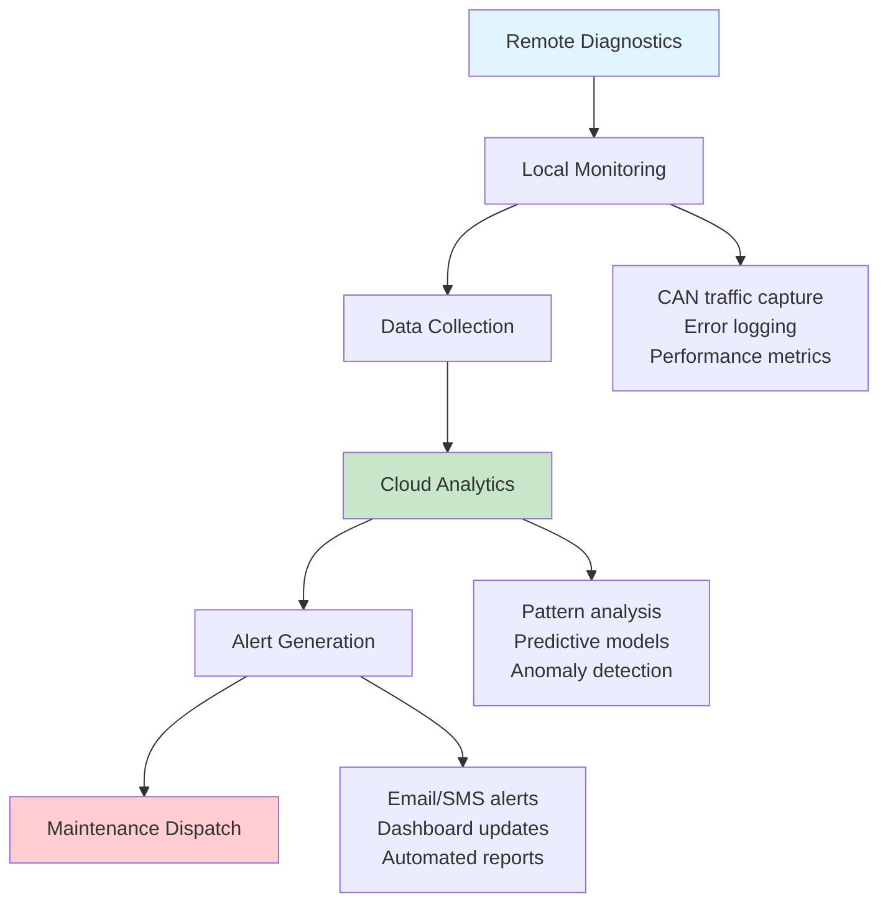

## Performance Optimization

### Advanced Optimization Techniques

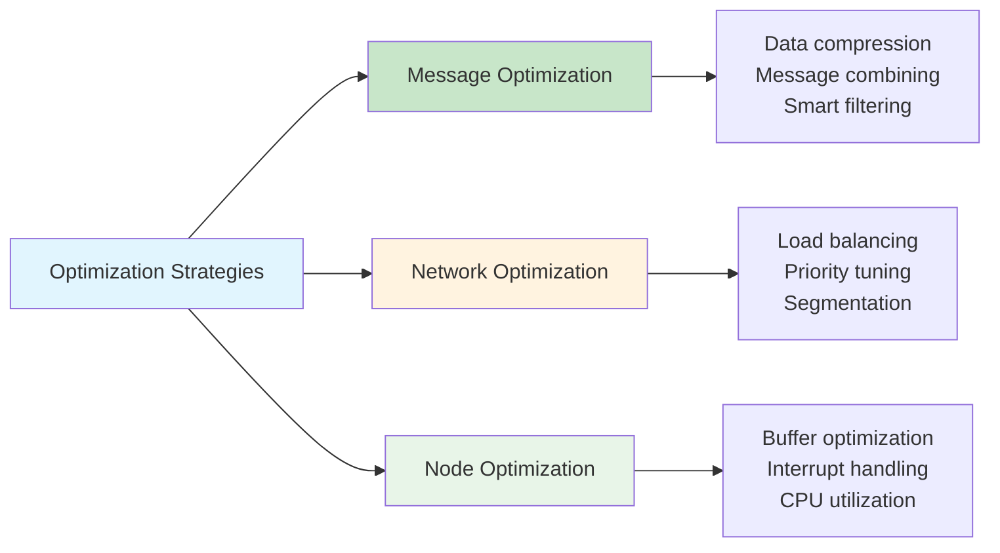

### Performance Monitoring Metrics

```c
// Example: Performance monitoring implementation
typedef struct {
    uint32_t timestamp;
    uint16_t message_id;
    uint8_t  dlc;
    uint16_t response_time_us;
    uint8_t  error_flags;
} performance_record_t;

typedef struct {
    // Rolling statistics
    uint32_t total_messages;
    uint32_t total_errors;
    float    avg_response_time;
    uint16_t max_response_time;
    float    bus_utilization;
    
    // Alert thresholds
    uint16_t max_response_threshold;
    float    max_utilization_threshold;
    float    max_error_rate_threshold;
} performance_monitor_t;

void analyze_performance(performance_monitor_t* monitor,
                        performance_record_t* records,
                        uint32_t count) {
    // Calculate statistics
    uint32_t total_response_time = 0;
    uint16_t max_time = 0;
    uint32_t error_count = 0;
    
    for (uint32_t i = 0; i < count; i++) {
        total_response_time += records[i].response_time_us;
        if (records[i].response_time_us > max_time) {
            max_time = records[i].response_time_us;
        }
        if (records[i].error_flags) {
            error_count++;
        }
    }
    
    monitor->avg_response_time = (float)total_response_time / count;
    monitor->max_response_time = max_time;
    float error_rate = (float)error_count / count;
    
    // Check thresholds and generate alerts
    if (max_time > monitor->max_response_threshold) {
        generate_alert("Response time exceeded threshold");
    }
    
    if (error_rate > monitor->max_error_rate_threshold) {
        generate_alert("Error rate exceeded threshold");
    }
}
```

## Future CAN Technologies

### Emerging Technologies

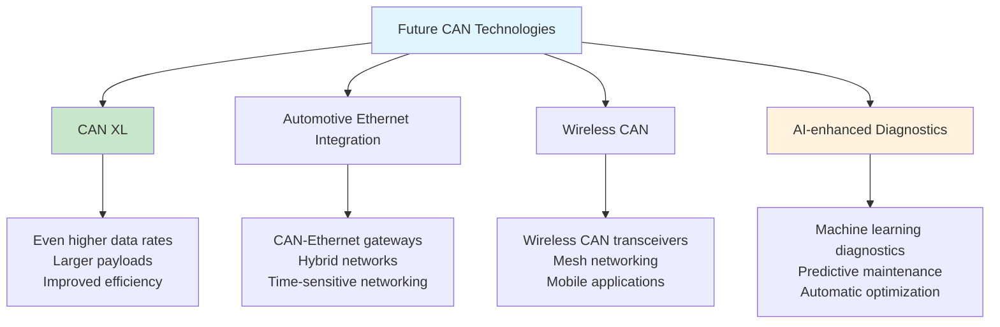

### Integration with Modern Technologies

| Technology | Integration Approach | Benefits |
|------------|---------------------|----------|
| **IoT** | CAN-to-cloud gateways | Remote monitoring, analytics |
| **AI/ML** | Predictive diagnostics | Proactive maintenance |
| **Digital Twins** | Real-time data synchronization | Virtual commissioning |
| **Blockchain** | Secure data logging | Tamper-proof records |
| **Edge Computing** | Local processing | Reduced latency |

## Best Practices Summary

### Design Best Practices

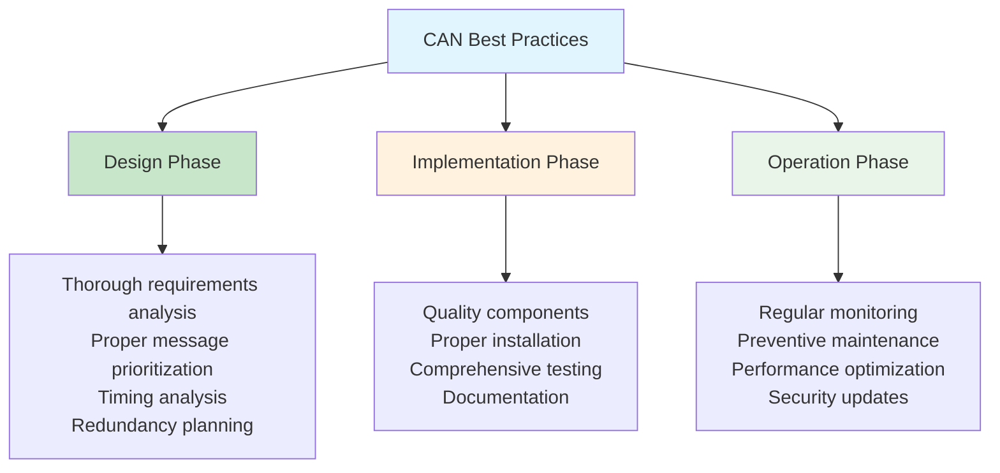

### Professional Development Path

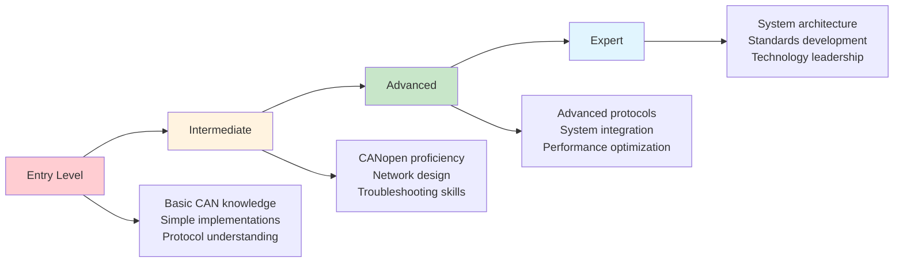

## Final Assessment and Certification

### Knowledge Areas Covered

- ✅ CAN protocol fundamentals and frame structure
- ✅ Physical layer design and network topology
- ✅ Arbitration mechanisms and error handling
- ✅ CAN-FD enhanced protocol features
- ✅ CANopen application layer and object dictionary
- ✅ Robotics applications and system integration
- ✅ Network design methodology and implementation
- ✅ Advanced topics and troubleshooting techniques

### Practical Skills Developed

- ✅ CAN network analysis and design
- ✅ Message prioritization and timing optimization
- ✅ CANopen device configuration and integration
- ✅ Troubleshooting and diagnostic techniques
- ✅ Performance monitoring and optimization
- ✅ Safety system implementation
- ✅ Documentation and compliance management

## Course Completion

Congratulations! You have completed the comprehensive CAN bus professional course. You now have the knowledge and skills to:

1. **Design** robust CAN networks for industrial and robotics applications
2. **Implement** CAN and CANopen systems with proper configuration
3. **Troubleshoot** complex network issues using systematic approaches
4. **Optimize** network performance for demanding applications
5. **Integrate** CAN systems into larger automation architectures

### Continuing Education

- Stay updated with latest CAN standards and technologies
- Participate in CiA (CAN in Automation) events and training
- Engage with professional communities and forums
- Pursue advanced certifications in specific application domains
- Contribute to open-source CAN tools and documentation

## Resources for Further Learning

### Professional Organizations
- **CiA (CAN in Automation)** - Official CAN standards organization
- **IEEE Industrial Electronics Society** - Advanced automation topics
- **IEC Technical Committees** - International standards development

### Technical Resources
- **CAN Newsletter** - Monthly industry updates
- **Vector Knowledge Base** - Comprehensive technical articles
- **CAN Wiki** - Community-driven documentation
- **GitHub CAN Projects** - Open-source implementations

The journey to CAN mastery is ongoing. Continue learning, practicing, and contributing to the CAN community!

## Final Practical Exercise

Design a complete CAN network for an autonomous mobile robot with the following requirements:
- 6-axis robotic arm with force feedback
- 360-degree LiDAR sensor
- Stereo vision system
- Differential drive with encoders
- Safety system with emergency stops
- Battery monitoring and charging interface
- Real-time telemetry to control station

Include network topology, message design, timing analysis, and troubleshooting procedures.