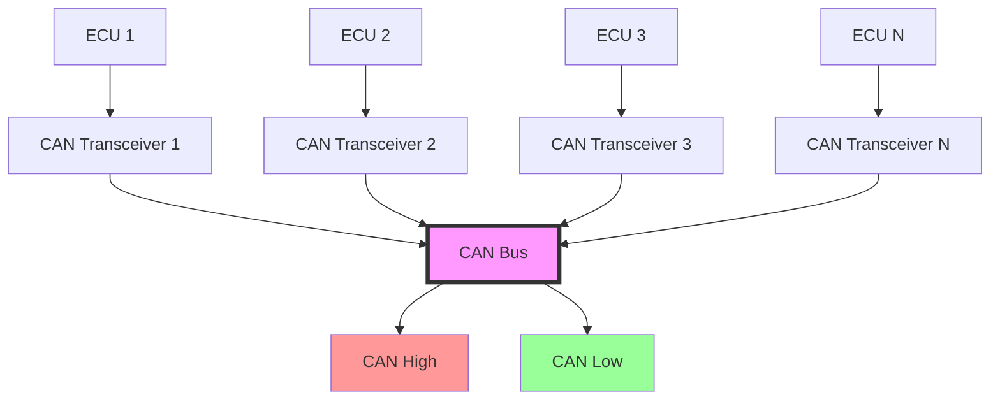
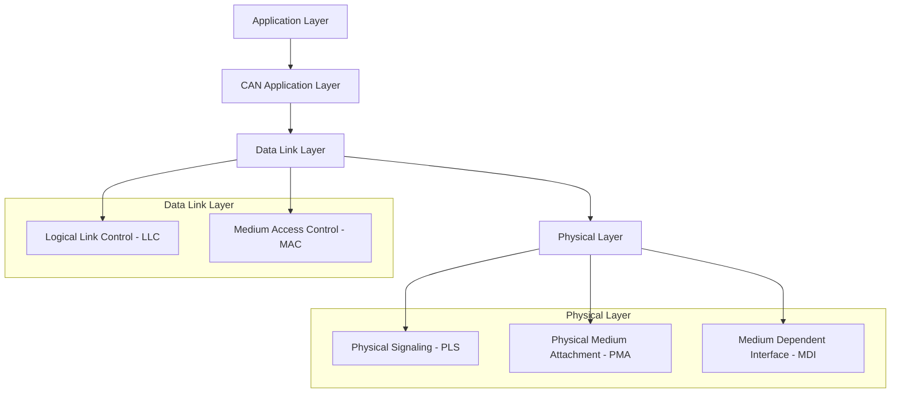
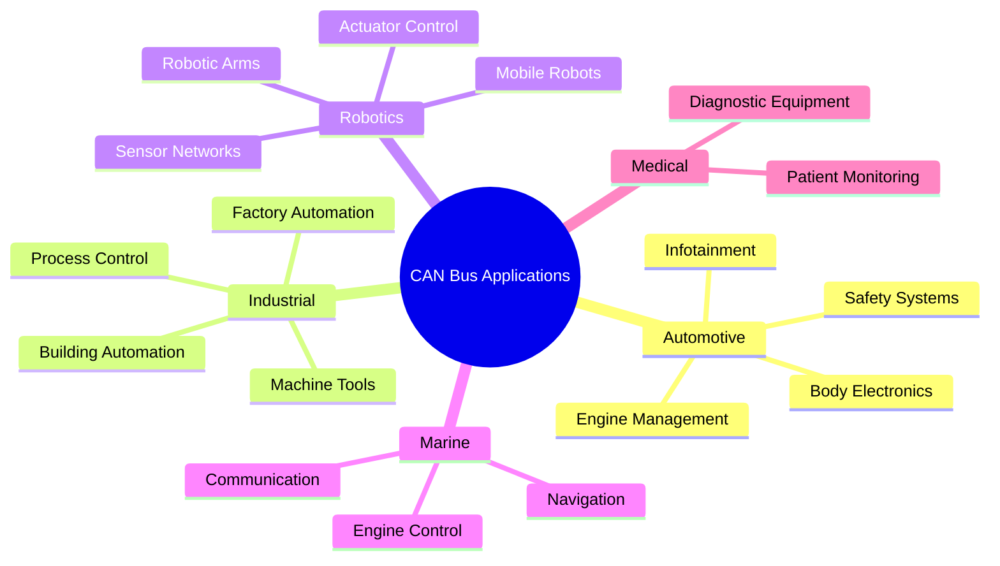
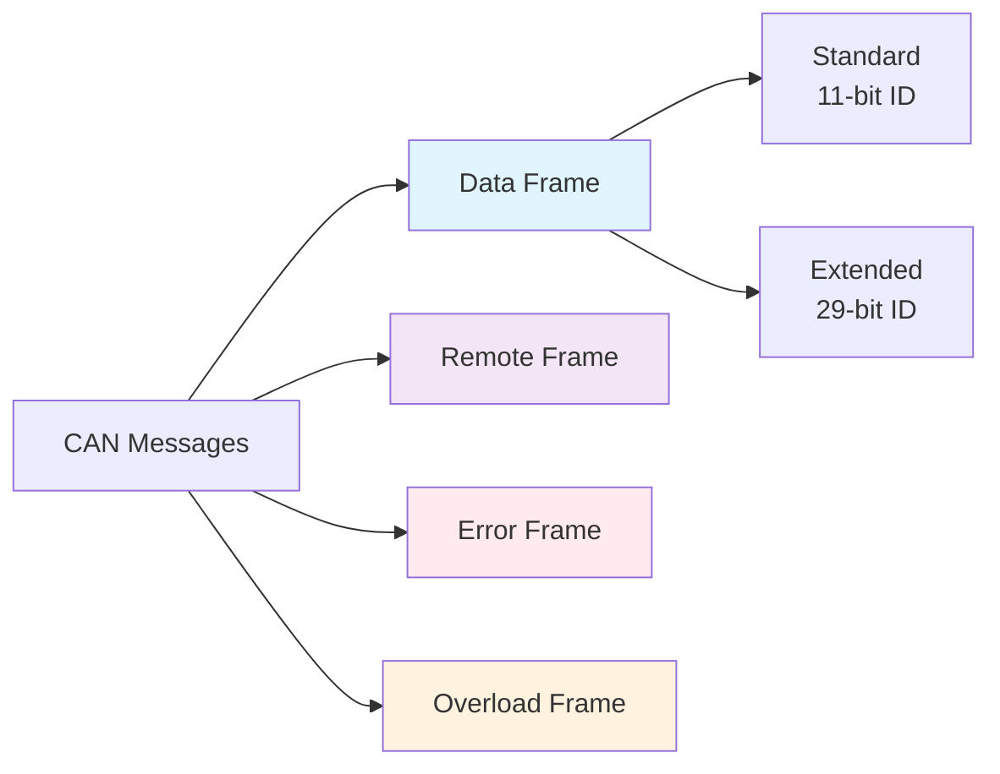
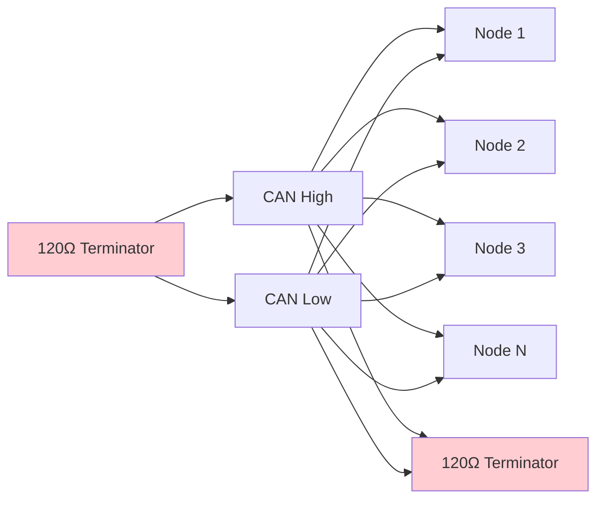

# Lesson 1: Introduction to CAN Bus

## What is CAN Bus?

Controller Area Network (CAN) is a robust vehicle bus standard designed to allow microcontrollers and devices to communicate with each other in applications without a host computer. Originally developed by Bosch in the 1980s for automotive applications, CAN has become the backbone of modern vehicle electronics and industrial automation systems.

## Key Characteristics

| Feature | Description |
|---------|-------------|
| **Multi-master** | Any node can initiate communication |
| **Message-based** | Data is broadcast, not addressed to specific nodes |
| **Priority-based** | Higher priority messages get bus access first |
| **Error detection** | Built-in error detection and handling mechanisms |
| **Real-time** | Deterministic communication timing |
| **Fault tolerance** | Continues operation even with node failures |

## CAN Bus Architecture

## CAN Protocol Layers

The CAN protocol follows a simplified OSI model structure:

## Why Use CAN Bus?

### Advantages

| Advantage | Benefit |
|-----------|---------|
| **Reduced Wiring** | Single twisted pair vs. point-to-point connections |
| **Real-time Performance** | Predictable message delivery times |
| **Error Handling** | Automatic error detection and recovery |
| **Scalability** | Easy to add/remove nodes |
| **Cost Effective** | Reduces overall system complexity |
| **Standardized** | ISO 11898 standard ensures interoperability |

### Common Applications

## CAN Bus vs. Other Protocols

| Protocol | Speed | Nodes | Distance | Use Case |
|----------|-------|-------|----------|----------|
| **CAN** | 1 Mbps | 110+ | 1000m | Real-time control |
| **Ethernet** | 1+ Gbps | Unlimited | 100m+ | High-speed data |
| **RS-485** | 10 Mbps | 32 | 1200m | Industrial control |
| **USB** | 480 Mbps | 127 | 5m | Peripheral connection |
| **I2C** | 3.4 Mbps | 1008 | 1m | Board-level communication |

## CAN Message Types

## Network Topology

CAN uses a **linear bus topology** with termination resistors:

## Key Concepts to Remember

1. **Broadcast Communication**: All messages are broadcast to all nodes
2. **Message Filtering**: Nodes filter messages based on identifiers
3. **Non-destructive Arbitration**: Multiple nodes can attempt transmission simultaneously
4. **Dominant/Recessive Bits**: Physical layer uses voltage levels for bit representation
5. **Bus Access**: Highest priority message wins arbitration

## Learning Objectives Achieved

- ✅ Understand what CAN bus is and its fundamental characteristics
- ✅ Know the basic architecture and protocol layers
- ✅ Recognize advantages and common applications
- ✅ Understand basic message types and network topology

## Next Steps

In [Lesson 2: CAN Frame Structure and Message Format](2_can_frame_structure.md), we'll dive deep into the detailed structure of CAN messages and how data is organized and transmitted.

## Practice Questions

1. What are the main advantages of CAN bus over point-to-point communication?
2. How many nodes can typically be connected to a single CAN network?
3. What is the maximum data rate of standard CAN?
4. Why are termination resistors needed in CAN networks?
5. What makes CAN suitable for real-time applications?