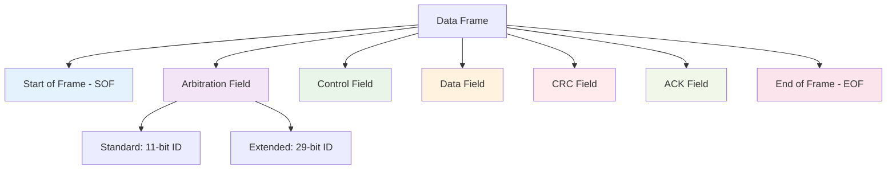
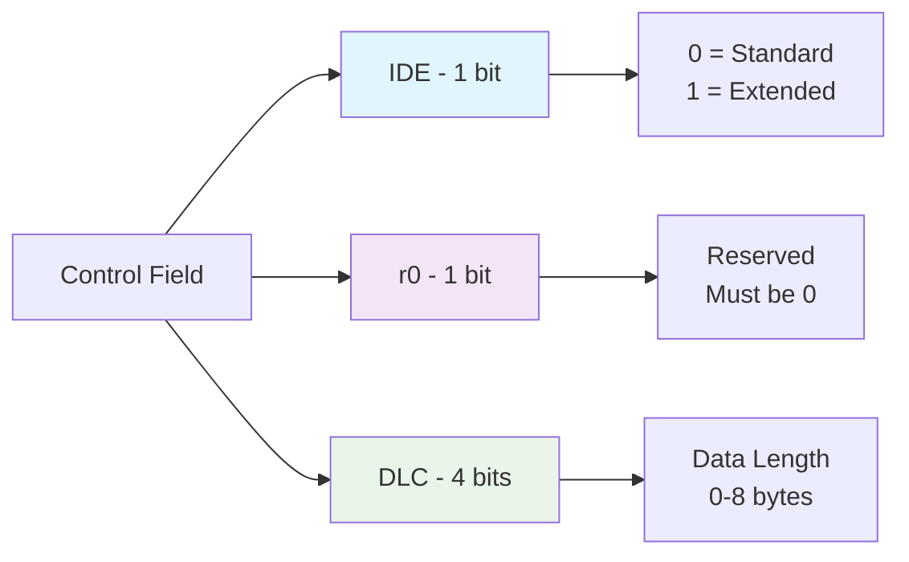
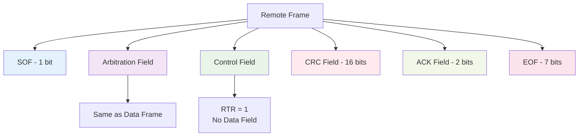
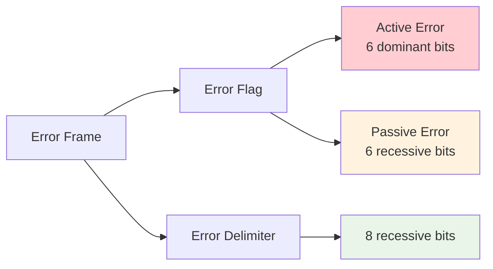
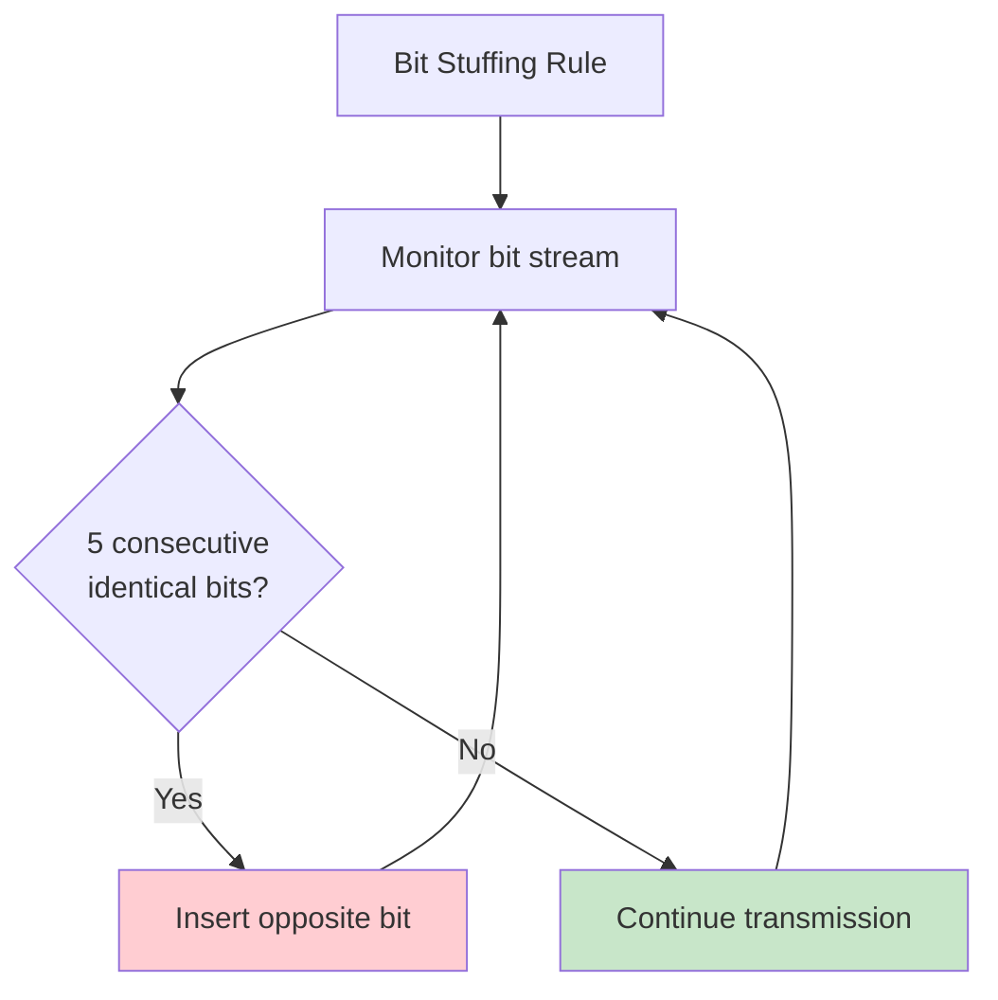

# Lesson 2: CAN Frame Structure and Message Format

## CAN Frame Types Overview

CAN protocol defines four types of frames for different communication purposes:

| Frame Type | Purpose | When Used |
|------------|---------|-----------|
| **Data Frame** | Carries actual data | Normal operation |
| **Remote Frame** | Requests data from another node | Data polling |
| **Error Frame** | Signals transmission errors | Error detection |
| **Overload Frame** | Introduces delay between frames | Flow control |

## Data Frame Structure

The Data Frame is the most important frame type for carrying application data:



## Standard vs Extended Frame Format

### Standard Frame (CAN 2.0A)

```
┌─────┬─────────────┬───┬─────┬────────────┬─────────┬─────┬─────────┐
│ SOF │ 11-bit ID   │RTR│ IDE │ r0 │ DLC  │ DATA    │ CRC │ ACK│EOF │
├─────┼─────────────┼───┼─────┼────┼─────┼─────────┼─────┼────┼────┤
│  1  │     11      │ 1 │  1  │ 1  │  4  │ 0-8 bytes│ 16  │ 2  │ 7  │
└─────┴─────────────┴───┴─────┴────┴─────┴─────────┴─────┴────┴────┘
```

### Extended Frame (CAN 2.0B)

```
┌─────┬─────────────┬───┬───┬─────────────────────┬───┬───┬────┬────────────┬─────────┬─────┬─────────┐
│ SOF │ 11-bit ID   │SRR│IDE│    18-bit ID       │RTR│r1 │r0  │    DLC     │  DATA   │ CRC │ ACK│EOF │
├─────┼─────────────┼───┼───┼─────────────────────┼───┼───┼────┼────────────┼─────────┼─────┼────┼────┤
│  1  │     11      │ 1 │ 1 │        18          │ 1 │ 1 │ 1  │     4      │0-8 bytes│ 16  │ 2  │ 7  │
└─────┴─────────────┴───┴───┴─────────────────────┴───┴───┴────┴────────────┴─────────┴─────┴────┴────┘
```

## Field-by-Field Breakdown

### Start of Frame (SOF)
- **Length**: 1 bit
- **Value**: Always dominant (0)
- **Purpose**: Synchronizes all nodes to start of message

### Arbitration Field

#### Standard Format
| Field | Bits | Description |
|-------|------|-------------|
| **Identifier** | 11 | Message priority and content identifier |
| **RTR** | 1 | Remote Transmission Request |

#### Extended Format
| Field | Bits | Description |
|-------|------|-------------|
| **Base ID** | 11 | Upper 11 bits of 29-bit identifier |
| **SRR** | 1 | Substitute Remote Request |
| **IDE** | 1 | Identifier Extension (0=Standard, 1=Extended) |
| **Extended ID** | 18 | Lower 18 bits of 29-bit identifier |
| **RTR** | 1 | Remote Transmission Request |

### Control Field



### Data Length Code (DLC) Table

| DLC Value | Data Bytes | Binary |
|-----------|------------|--------|
| 0 | 0 | 0000 |
| 1 | 1 | 0001 |
| 2 | 2 | 0010 |
| 3 | 3 | 0011 |
| 4 | 4 | 0100 |
| 5 | 5 | 0101 |
| 6 | 6 | 0110 |
| 7 | 7 | 0111 |
| 8 | 8 | 1000 |

### Data Field
- **Length**: 0-8 bytes (0-64 bits)
- **Purpose**: Contains the actual message payload
- **Byte Order**: MSB first (big-endian)

### CRC Field
- **Length**: 16 bits (15-bit sequence + 1 delimiter)
- **Purpose**: Error detection using polynomial division
- **Polynomial**: x¹⁵ + x¹⁴ + x¹⁰ + x⁸ + x⁷ + x⁴ + x³ + 1

### ACK Field
- **Length**: 2 bits (ACK slot + ACK delimiter)
- **Purpose**: Acknowledgment from receiving nodes
- **Behavior**: Transmitter sends recessive, receivers respond with dominant

### End of Frame (EOF)
- **Length**: 7 bits
- **Value**: All recessive (1)
- **Purpose**: Marks end of message

## Remote Frame Structure

Remote frames request data from other nodes:



## Error Frame Structure



## Bit Stuffing Rule

CAN uses bit stuffing to maintain synchronization:



### Example of Bit Stuffing

```
Original:  1 1 1 1 1 0 0 1
Stuffed:   1 1 1 1 1 0 0 0 1
                     ↑
                 Stuffed bit
```

## Message Priority and Arbitration

Lower numerical values have higher priority:

| Priority Level | ID Range | Typical Use |
|----------------|----------|-------------|
| **Highest** | 0x000-0x0FF | Emergency/Safety |
| **High** | 0x100-0x1FF | Control signals |
| **Medium** | 0x200-0x5FF | Sensor data |
| **Low** | 0x600-0x7FF | Status/Diagnostic |

## Practical Examples

### Example 1: Engine RPM Message

```
Message ID: 0x123 (Engine RPM)
Data: 2500 RPM (0x09C4)
DLC: 2 bytes

Frame Structure:
┌─────┬─────────┬───┬───┬───┬─────┬─────────┬─────────┬─────┬─────────┐
│ SOF │   ID    │RTR│IDE│r0 │ DLC │  DATA   │   CRC   │ ACK │   EOF   │
├─────┼─────────┼───┼───┼───┼─────┼─────────┼─────────┼─────┼─────────┤
│  0  │0x123(11)│ 0 │ 0 │ 0 │0010 │0x09 0xC4│ calculated│ 0 1 │1111111 │
└─────┴─────────┴───┴───┴───┴─────┴─────────┴─────────┴─────┴─────────┘
```

### Example 2: Extended ID Message

```
Message ID: 0x18FF1234 (J1939 format)
Data: Temperature = 85°C
DLC: 1 byte

Extended Frame:
┌─────┬─────────┬───┬───┬─────────────────────┬───┬───┬───┬─────┬──────┬─────────┬─────┬─────────┐
│ SOF │Base ID  │SRR│IDE│    Extended ID      │RTR│r1 │r0 │ DLC │ DATA │   CRC   │ ACK │   EOF   │
├─────┼─────────┼───┼───┼─────────────────────┼───┼───┼───┼─────┼──────┼─────────┼─────┼─────────┤
│  0  │0x18F(11)│ 1 │ 1 │   0xF1234(18)      │ 0 │ 0 │ 0 │0001 │ 0x55 │calculated│ 0 1 │1111111 │
└─────┴─────────┴───┴───┴─────────────────────┴───┴───┴───┴─────┴──────┴─────────┴─────┴─────────┘
```

## Frame Timing

```mermaid
gantt
    title CAN Frame Transmission Timeline
    dateFormat X
    axisFormat %s
    
    section Frame Components
    SOF           :milestone, sof, 0, 1
    Arbitration   :arb, after sof, 12
    Control       :ctrl, after arb, 6
    Data          :data, after ctrl, 64
    CRC           :crc, after data, 16
    ACK           :ack, after crc, 2
    EOF           :eof, after ack, 7
    
    section Timing
    Bit Time      :crit, 0, 108
```



## Key Learning Points

1. **Frame Structure**: Understanding each field's purpose and size
2. **Standard vs Extended**: When to use each format
3. **Bit Stuffing**: Automatic synchronization mechanism
4. **Priority System**: Lower ID = higher priority
5. **Error Detection**: CRC and ACK mechanisms ensure reliability

## Common Frame Format Errors

| Error Type | Description | Detection |
|------------|-------------|-----------|
| **CRC Error** | Data corruption during transmission | CRC mismatch |
| **Form Error** | Invalid frame structure | Fixed bit violations |
| **Stuff Error** | Bit stuffing rule violation | >5 consecutive bits |
| **ACK Error** | No acknowledgment received | Missing ACK |

## Learning Objectives Achieved

- ✅ Understand complete CAN frame structure
- ✅ Differentiate between standard and extended formats
- ✅ Know bit stuffing mechanism
- ✅ Understand priority and arbitration basics
- ✅ Recognize different frame types and their purposes

## Next Steps

In [Lesson 3: CAN Physical Layer and Network Topology](3_can_physical_layer.md), we'll explore the electrical characteristics and network design considerations for robust CAN implementations.

## Practice Exercises

1. Calculate the total frame length for a standard data frame with 8 bytes of data
2. Determine which message wins arbitration: ID 0x123 vs ID 0x124
3. Identify bit stuffing positions in the sequence: 11111000111
4. Convert an extended ID 0x1FFFFFFF to base and extended ID components
5. Design message IDs for a robot with priorities: emergency stop, motor control, sensor data