# Lesson 3: CAN Physical Layer and Network Topology

## Physical Layer Overview

The CAN physical layer defines the electrical characteristics, signal levels, and timing parameters that enable reliable communication across the network. Understanding these aspects is crucial for designing robust CAN systems.

## CAN Bus Electrical Properties

### Signal Levels

CAN uses differential signaling with two wires: CAN High (CAN_H) and CAN Low (CAN_L).

| State | CAN_H Voltage | CAN_L Voltage | Differential Voltage | Bit Value |
|-------|---------------|---------------|---------------------|-----------|
| **Dominant** | 3.5V | 1.5V | 2.0V | 0 |
| **Recessive** | 2.5V | 2.5V | 0.0V | 1 |

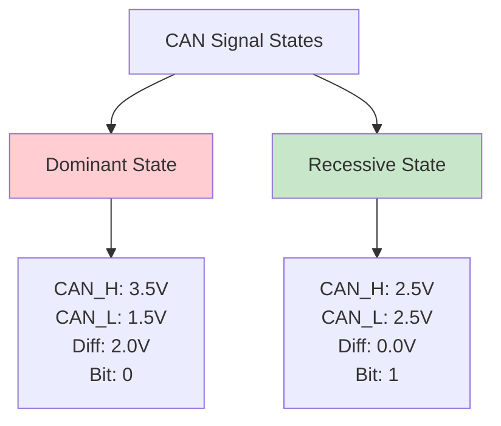

### Why Differential Signaling?

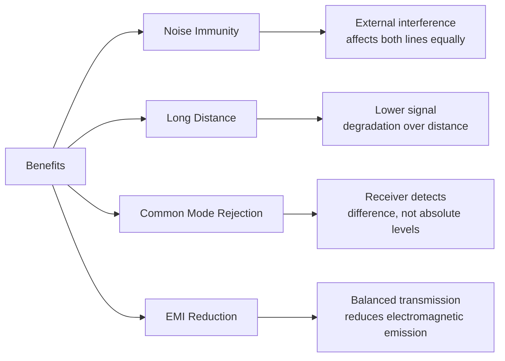

## CAN Transceiver Architecture

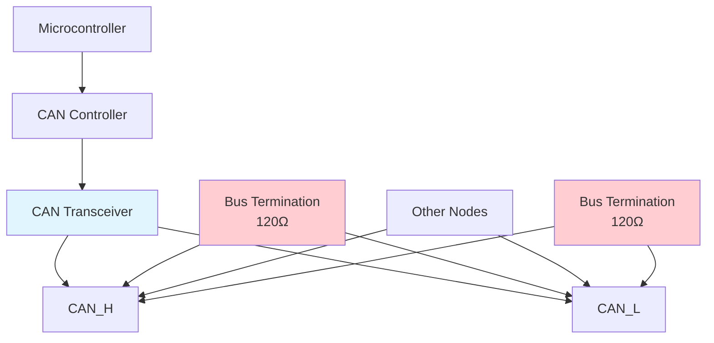

## Common CAN Transceiver Types

| Transceiver | Standard | Speed | Features |
|-------------|----------|-------|----------|
| **MCP2551** | ISO 11898 | 1 Mbps | Basic, low-cost |
| **TJA1050** | ISO 11898 | 1 Mbps | Automotive grade |
| **SN65HVD230** | ISO 11898 | 1 Mbps | 3.3V operation |
| **MCP2562** | ISO 11898 | 1 Mbps | Fault protection |
| **TJA1042** | ISO 11898 | 5 Mbps | CAN-FD capable |

## Network Topology

### Linear Bus Topology

CAN networks use a **linear bus topology** with proper termination:

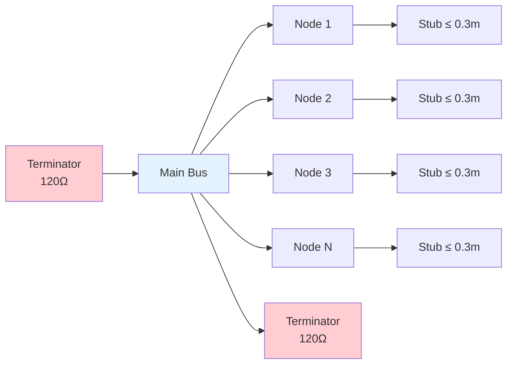

### Stub Length Limitations

| Bus Speed | Maximum Stub Length |
|-----------|-------------------|
| 1 Mbps | 0.3 m |
| 500 kbps | 0.6 m |
| 250 kbps | 1.2 m |
| 125 kbps | 2.4 m |

## Bus Termination

### Why Termination is Critical

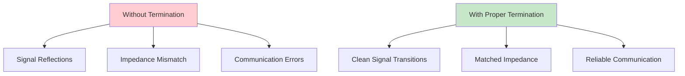

### Termination Methods

#### Standard Termination (120Ω)


#### Split Termination (Automotive)
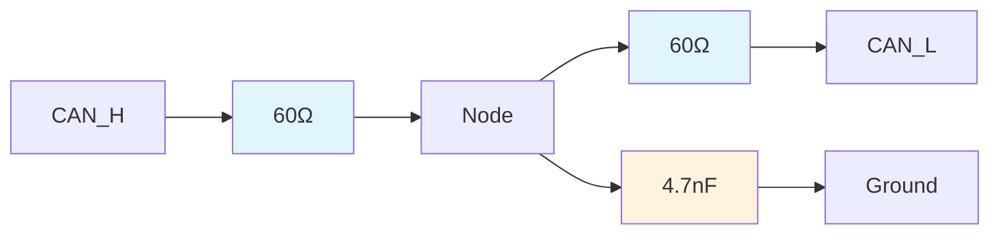

## Bit Timing and Synchronization

### Bit Time Structure

Each bit time is divided into segments:

```mermaid
gantt
    title CAN Bit Time Segments
    dateFormat X
    axisFormat %s
    
    section Bit Segments
    Sync Segment     :sync, 0, 1
    Prop Segment     :prop, after sync, 2
    Phase Seg 1      :ph1, after prop, 3
    Phase Seg 2      :ph2, after ph1, 2
    
    section Sample Point
    Sample Point     :milestone, sample, 6, 0
```

### Timing Parameters

| Parameter | Description | Range |
|-----------|-------------|-------|
| **Sync Segment** | Synchronization | 1 TQ |
| **Prop Segment** | Propagation delay compensation | 1-8 TQ |
| **Phase Seg 1** | Buffer before sample point | 1-8 TQ |
| **Phase Seg 2** | Buffer after sample point | 1-8 TQ |
| **Sample Point** | Bit value sampling location | 60-90% |

### Time Quantum (TQ) Calculation

```
TQ = 2 × (BRP + 1) / f_osc

Where:
- BRP = Baud Rate Prescaler
- f_osc = Oscillator frequency
```

## Speed vs Distance Relationship

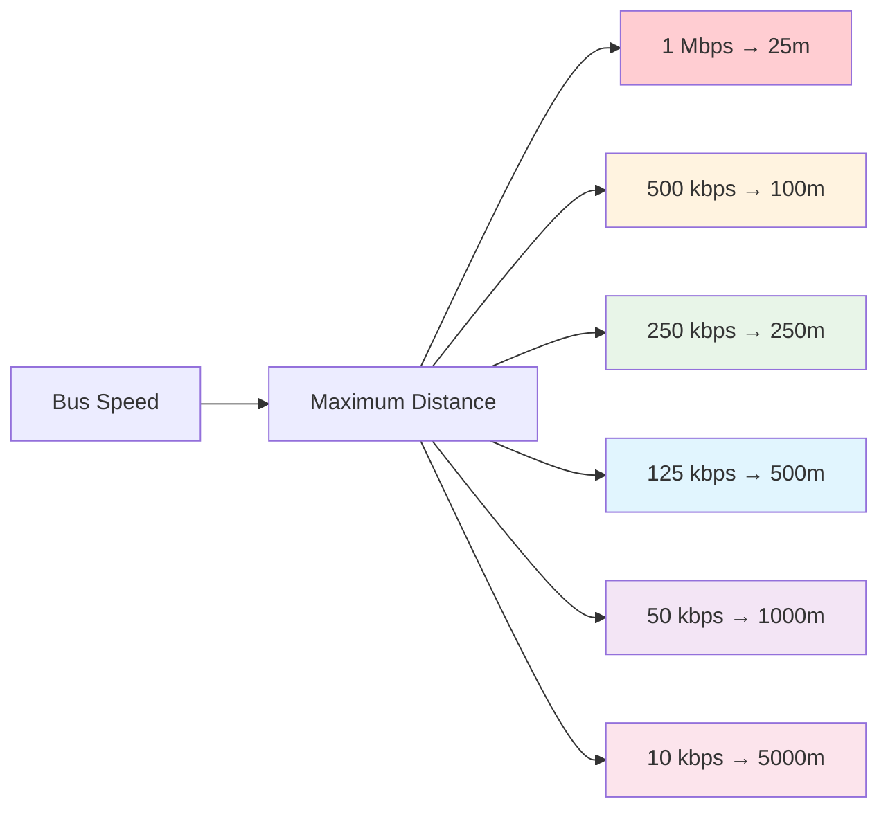

## Cable Specifications

### Recommended Cable Types

| Application | Cable Type | Impedance | Characteristics |
|-------------|------------|-----------|-----------------|
| **Automotive** | Twisted pair | 120Ω ± 5% | Shielded, flame retardant |
| **Industrial** | DeviceNet cable | 120Ω ± 5% | Rugged, EMI resistant |
| **Marine** | Marine grade | 120Ω ± 5% | Water resistant, tinned copper |
| **Aerospace** | Aerospace grade | 120Ω ± 5% | Lightweight, high temperature |

### Cable Construction

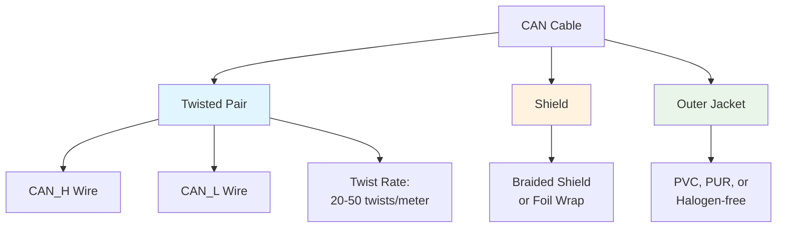

## Grounding and Shielding

### Proper Grounding Strategy

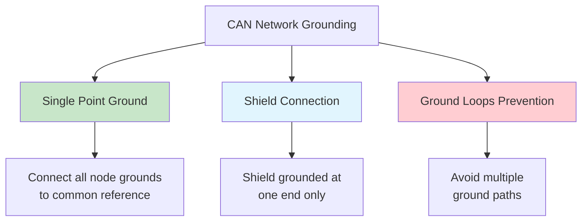

## Environmental Considerations

### Operating Conditions

| Parameter | Automotive | Industrial | Military |
|-----------|------------|------------|----------|
| **Temperature** | -40°C to +125°C | -40°C to +85°C | -55°C to +125°C |
| **Humidity** | 95% RH | 85% RH | 95% RH |
| **Vibration** | 20G | 10G | 30G |
| **EMI Immunity** | High | Medium | Very High |

## Common Physical Layer Issues

### Signal Quality Problems

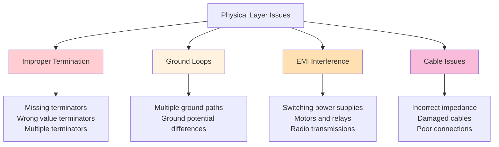

## Network Design Guidelines

### Best Practices Checklist

| Guideline | Requirement | Importance |
|-----------|-------------|------------|
| **Topology** | Linear bus only | Critical |
| **Termination** | Exactly 2 × 120Ω resistors | Critical |
| **Stub Length** | ≤ 0.3m at 1 Mbps | High |
| **Cable Impedance** | 120Ω ± 5% | High |
| **Grounding** | Single point reference | High |
| **Shielding** | Ground at one end only | Medium |

## Voltage Supply Considerations

### Power Supply Requirements

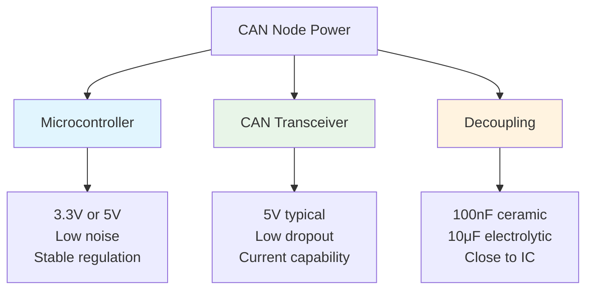

## Testing Physical Layer

### Measurement Points

| Test | Measurement | Expected Value |
|------|-------------|----------------|
| **Bus Resistance** | CAN_H to CAN_L | 60Ω (with nodes) |
| **Termination** | Each end | 120Ω |
| **Dominant Voltage** | CAN_H - CAN_L | 2.0V ± 0.5V |
| **Recessive Voltage** | CAN_H - CAN_L | 0.0V ± 0.5V |
| **Rise/Fall Time** | 10%-90% | < 250ns |

## Learning Objectives Achieved

- ✅ Understand CAN electrical characteristics and differential signaling
- ✅ Know proper network topology and termination requirements
- ✅ Understand bit timing and synchronization mechanisms
- ✅ Recognize speed vs distance limitations
- ✅ Know cable specifications and grounding best practices
- ✅ Identify common physical layer issues and solutions

## Next Steps

In [Lesson 4: CAN Arbitration and Error Handling](4_can_arbitration_error_handling.md), we'll explore how CAN manages multiple simultaneous transmissions and maintains network reliability through sophisticated error detection and handling mechanisms.

## Practical Exercises

1. Calculate the maximum network length for a 250 kbps CAN network
2. Determine the total bus resistance for a network with 8 nodes
3. Design termination for a high-EMI environment
4. Calculate bit timing parameters for 500 kbps with 16 MHz crystal
5. Troubleshoot a network with intermittent communication errors