# Lesson 4: CAN Arbitration and Error Handling

## CAN Arbitration Overview

CAN arbitration is the mechanism that allows multiple nodes to compete for bus access simultaneously without causing collisions. This **non-destructive arbitration** process ensures that the highest priority message is transmitted while lower priority messages automatically back off.

## How Arbitration Works

### Wired-AND Logic

CAN bus implements **wired-AND logic** where:
- **Dominant (0)** beats **Recessive (1)**
- Any node transmitting dominant forces the bus to dominant state
- Multiple nodes can read the bus while transmitting

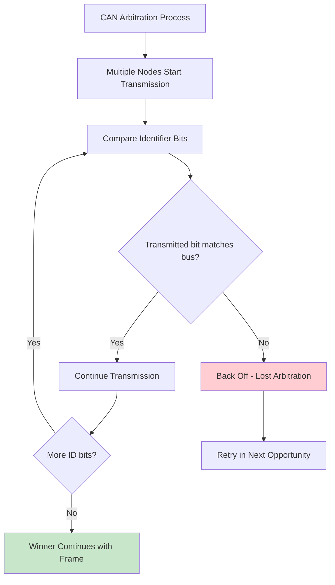

### Arbitration Example

Consider three nodes attempting to transmit simultaneously:

| Bit Position | Node A (ID: 0x123) | Node B (ID: 0x124) | Node C (ID: 0x120) | Bus State |
|--------------|---------------------|---------------------|---------------------|-----------|
| 10 | 0 | 0 | 0 | 0 (dominant) |
| 9 | 0 | 0 | 0 | 0 (dominant) |
| 8 | 0 | 0 | 0 | 0 (dominant) |
| 7 | 1 | 1 | 1 | 1 (recessive) |
| 6 | 0 | 0 | 0 | 0 (dominant) |
| 5 | 0 | 0 | 0 | 0 (dominant) |
| 4 | 0 | 0 | 0 | 0 (dominant) |
| 3 | 0 | 0 | 0 | 0 (dominant) |
| 2 | 1 | 1 | **0** | **0** (C wins) |
| 1 | **Backs off** | **Backs off** | 0 | 0 |
| 0 | - | - | 0 | 0 |

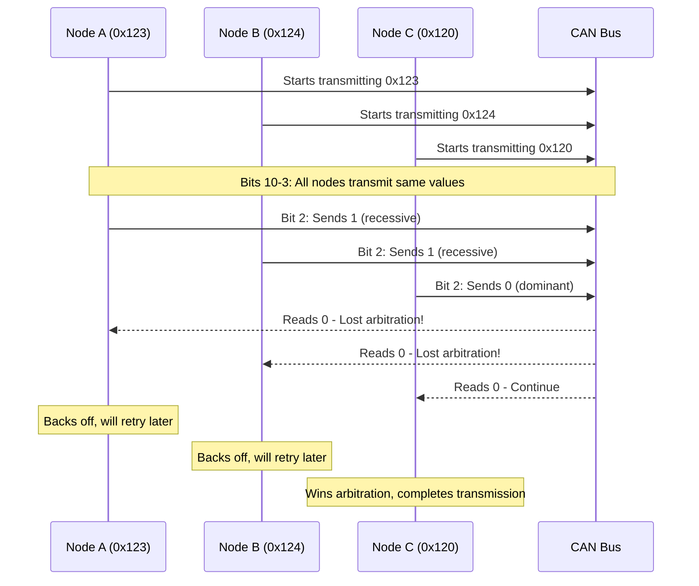

## Priority Determination

### Standard Frame Priority

For standard 11-bit identifiers, priority is determined by:

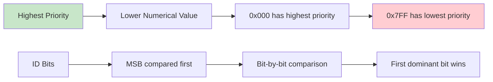

### Extended Frame Priority

Extended frames have lower priority than standard frames with the same base ID:

| Frame Type | Base ID | Extended ID | Overall Priority |
|------------|---------|-------------|------------------|
| Standard | 0x123 | - | **Higher** |
| Extended | 0x123 | 0x45678 | Lower |

## Error Detection Mechanisms

CAN implements multiple layers of error detection to ensure data integrity:

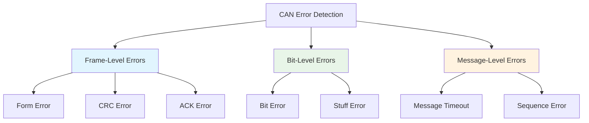

## Error Types in Detail

### 1. Bit Error

Occurs when a transmitted bit differs from the received bit.

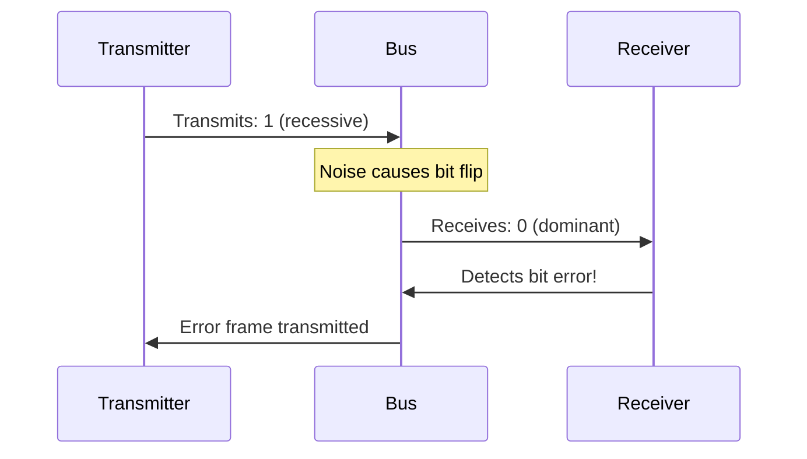

### 2. Stuff Error

Violation of bit stuffing rule (more than 5 consecutive identical bits).

```
Correct:   1 1 1 1 1 0 0 0 1 1 1 1 1 0
           └─────┘   ↑         └─────┘   ↑
           5 bits   stuff      5 bits   stuff
           
Error:     1 1 1 1 1 1 0 1 1 1 1 1 1 1
           └───────┘           └───────┘
           6 bits!             7 bits!
```

### 3. CRC Error

Cyclic Redundancy Check detects data corruption:

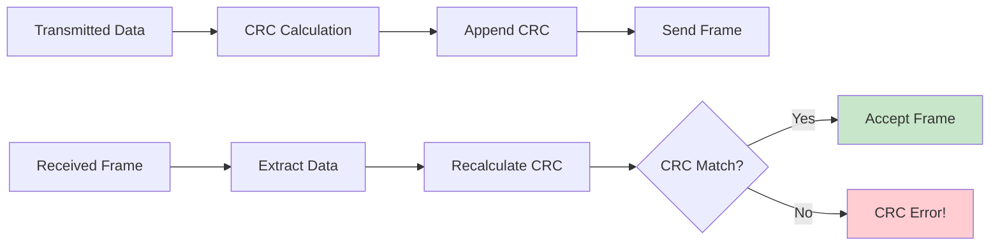

### 4. Form Error

Invalid frame format (e.g., dominant bit in EOF field):

| Field | Expected | Error Condition |
|-------|----------|-----------------|
| **EOF** | 7 recessive bits | Any dominant bit |
| **IFS** | 3 recessive bits | Dominant in first 3 bits |
| **Reserved bits** | Must be dominant | Recessive bit |

### 5. ACK Error

No acknowledgment received from other nodes:

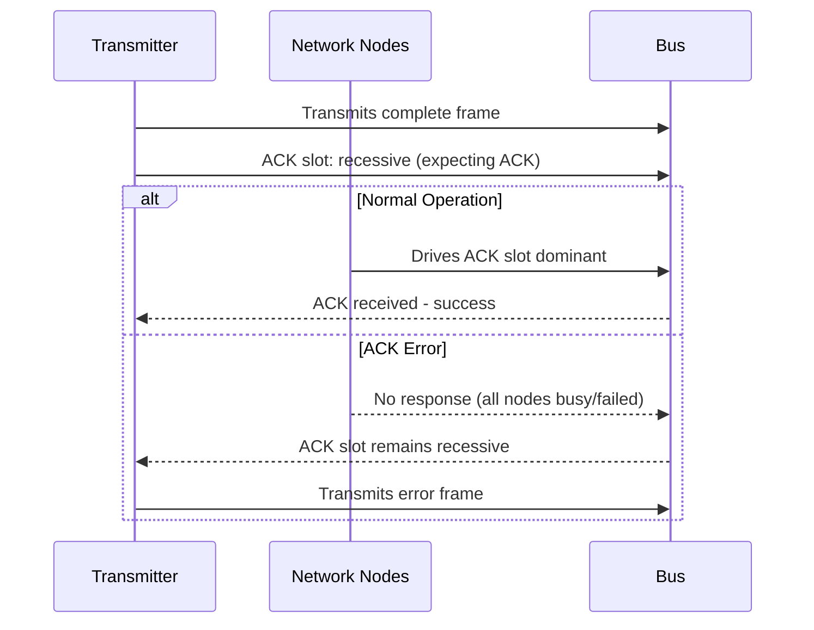

## Error Handling States

CAN controllers implement error handling through state machines:

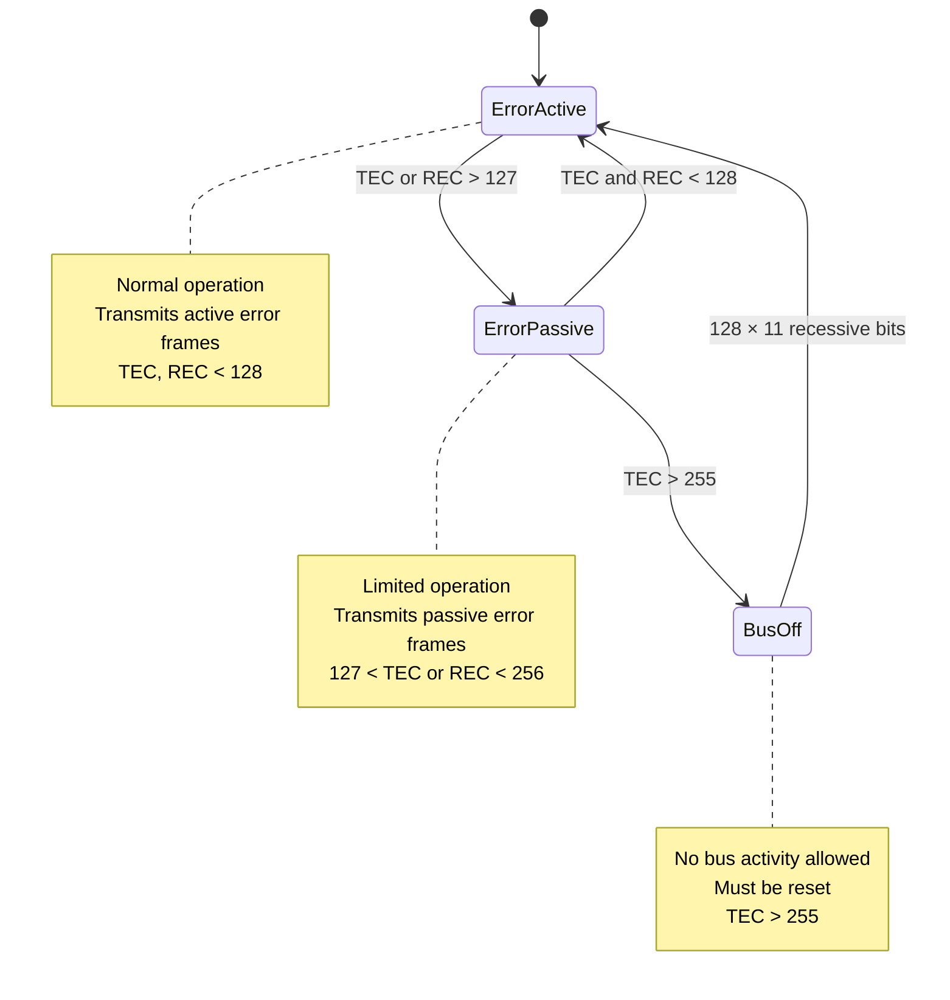

## Error Counters

CAN maintains two error counters per node:

| Counter | Description | Increment Rules | Decrement Rules |
|---------|-------------|-----------------|-----------------|
| **TEC** | Transmit Error Counter | +8 per transmit error | -1 per successful transmission |
| **REC** | Receive Error Counter | +1 per receive error | -1 per successful reception |

### Error Counter Rules

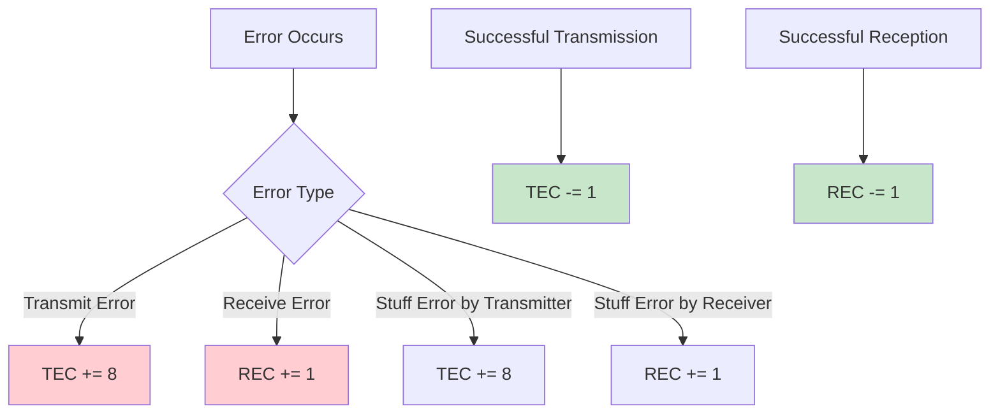

## Error Frames

### Active Error Frame

Transmitted by error-active nodes:

```
┌─────────────┬─────────────┐
│ Error Flag  │   Error     │
│  (6 bits)   │ Delimiter   │
│ dominant    │  (8 bits)   │
│             │ recessive   │
└─────────────┴─────────────┘
```

### Passive Error Frame

Transmitted by error-passive nodes:

```
┌─────────────┬─────────────┐
│ Error Flag  │   Error     │
│  (6 bits)   │ Delimiter   │
│ recessive   │  (8 bits)   │
│             │ recessive   │
└─────────────┴─────────────┘
```

## Error Recovery Mechanisms

### Automatic Retransmission

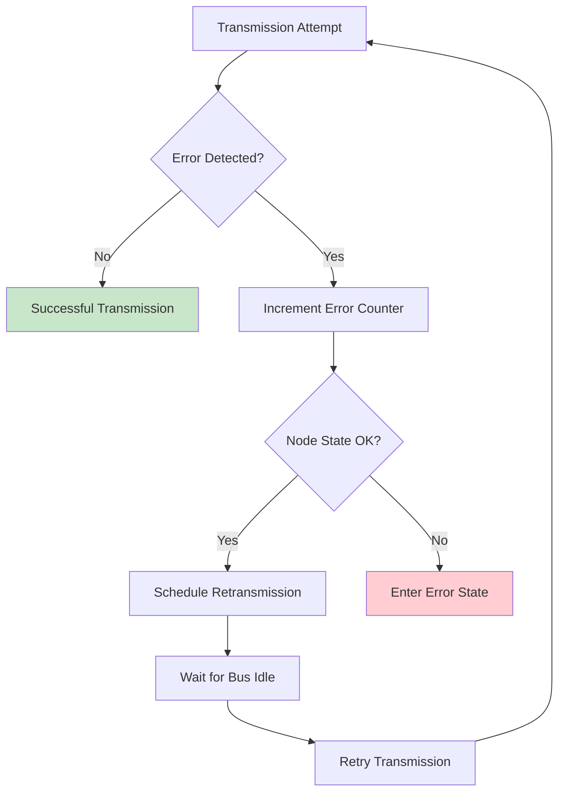

### Bus Recovery Procedure

For bus-off recovery:

1. **Enter Bus-Off State**: TEC > 255
2. **Monitor Bus**: Wait for 128 × 11 consecutive recessive bits
3. **Reset Counters**: TEC = 0, REC = 0
4. **Return to Error-Active**: Resume normal operation

## Network-Level Error Handling

### Error Confinement

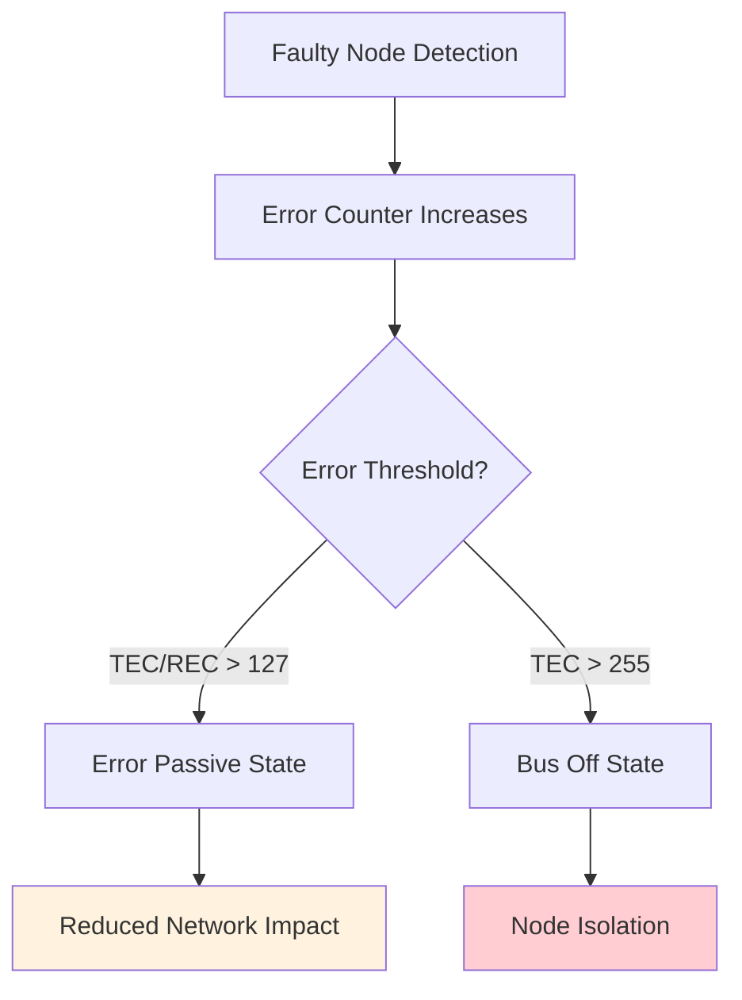

### Babbling Node Protection

Prevention of nodes continuously transmitting errors:

| Protection Method | Implementation |
|-------------------|----------------|
| **Error Counters** | Automatic state transitions |
| **Watchdog Timers** | External monitoring |
| **Bus Monitoring** | Network-level supervision |
| **Protocol Validation** | Frame format checking |

## Error Statistics and Monitoring

### Key Metrics to Monitor

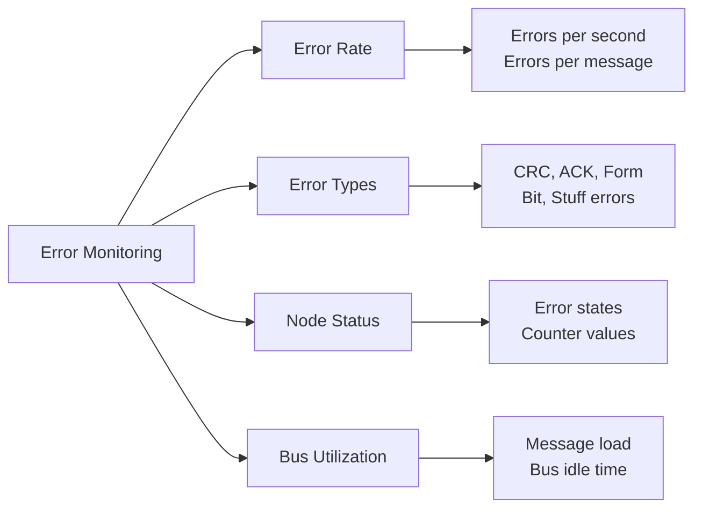

### Diagnostic Information

| Metric | Normal Range | Warning Threshold | Critical Threshold |
|--------|--------------|-------------------|-------------------|
| **Error Rate** | < 0.1% | 0.1% - 1% | > 1% |
| **TEC/REC** | < 96 | 96 - 127 | > 127 |
| **Bus Utilization** | < 80% | 80% - 95% | > 95% |
| **Response Time** | < 10ms | 10ms - 50ms | > 50ms |

## Common Error Scenarios

### Scenario 1: Intermittent Connection

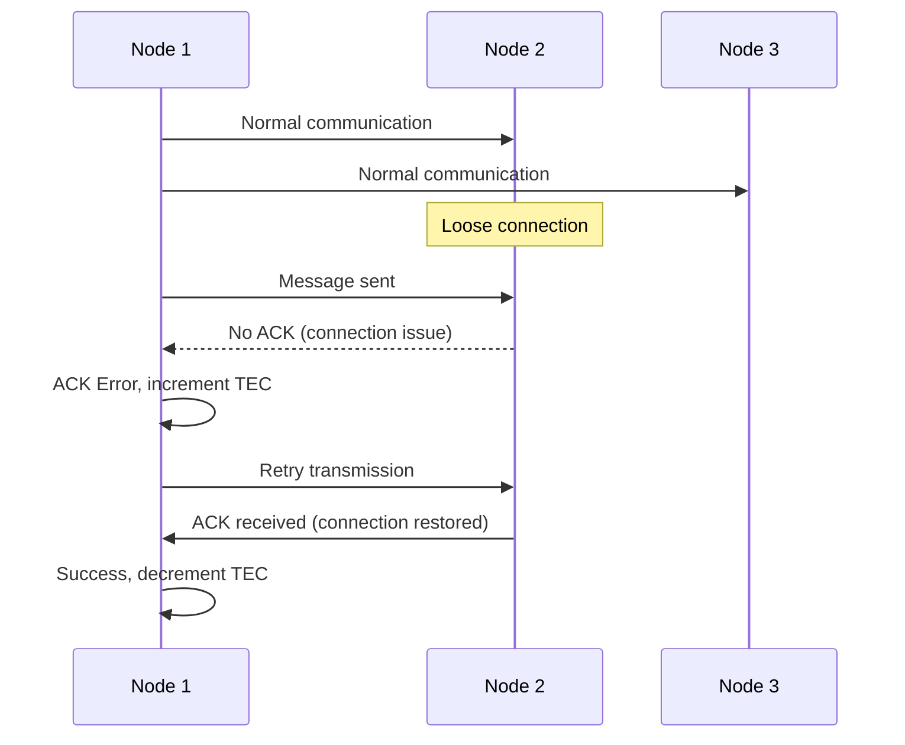

### Scenario 2: EMI Interference

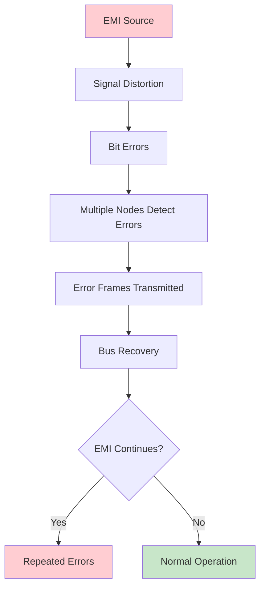

## Learning Objectives Achieved

- ✅ Understand non-destructive arbitration mechanism
- ✅ Know different error types and detection methods
- ✅ Understand error states and counter mechanisms
- ✅ Recognize error recovery procedures
- ✅ Know how to monitor and diagnose network errors

## Next Steps

In [Lesson 5: CAN-FD (Flexible Data-Rate) Protocol](5_can_fd_protocol.md), we'll explore the enhanced CAN-FD protocol that provides higher data rates and larger payload capacity while maintaining backward compatibility.

## Practical Exercises

1. Determine the arbitration winner between IDs: 0x100, 0x101, 0x0FF
2. Calculate error counter values after 10 transmit errors and 5 successful transmissions
3. Design error handling strategy for a safety-critical robotics application
4. Analyze error patterns to identify potential network issues
5. Implement error monitoring and logging for CAN network diagnostics