# Lesson 5: CAN-FD (Flexible Data-Rate) Protocol

## What is CAN-FD?

CAN with Flexible Data-Rate (CAN-FD) is an enhanced version of the classical CAN protocol that provides:
- **Higher data throughput** (up to 5 Mbps)
- **Larger payload** (up to 64 bytes vs 8 bytes)
- **Improved error detection** with additional CRC
- **Backward compatibility** with existing CAN networks

## CAN vs CAN-FD Comparison

| Feature | CAN 2.0 | CAN-FD |
|---------|---------|--------|
| **Max Data Rate** | 1 Mbps | 5+ Mbps |
| **Max Payload** | 8 bytes | 64 bytes |
| **Frame Format** | Fixed | Flexible |
| **CRC Length** | 15 bits | 17/21 bits |
| **Error Detection** | Good | Enhanced |
| **Backward Compatibility** | N/A | Yes (mixed networks) |

## CAN-FD Frame Structure

### CAN-FD Data Frame

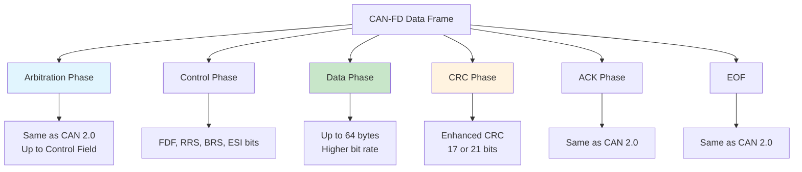

### Detailed Frame Format

```
┌─────┬─────────────┬─────┬─────┬─────┬─────┬─────┬─────┬─────────┬─────────┬─────┬─────────┐
│ SOF │Arbitration  │ r1  │ FDF │ r0  │ BRS │ ESI │ DLC │  DATA   │   CRC   │ ACK │   EOF   │
│     │   Field     │     │     │     │     │     │     │ (0-64B) │ (17/21) │     │         │
├─────┼─────────────┼─────┼─────┼─────┼─────┼─────┼─────┼─────────┼─────────┼─────┼─────────┤
│  1  │  11 or 29   │  1  │  1  │  1  │  1  │  1  │  4  │ 0-512   │ 18/22   │  2  │    7    │
└─────┴─────────────┴─────┴─────┴─────┴─────┴─────┴─────┴─────────┴─────────┴─────┴─────────┘
```

## CAN-FD Control Field Bits

### New Control Bits

| Bit | Name | Description |
|-----|------|-------------|
| **FDF** | FD Format | 1 = CAN-FD frame, 0 = CAN 2.0 frame |
| **BRS** | Bit Rate Switch | 1 = Switch to fast bit rate for data phase |
| **ESI** | Error State Indicator | Error state of transmitting node |
| **r1, r0** | Reserved | Must be transmitted as 0 |

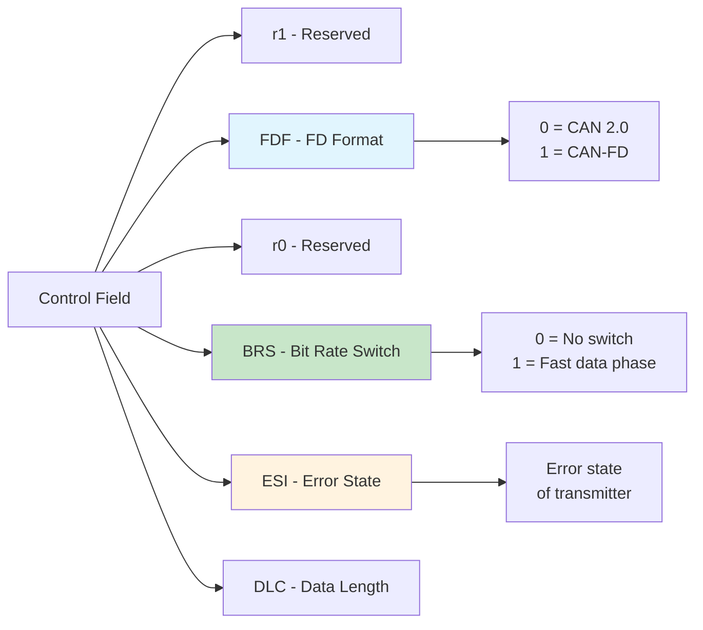

## Data Length Code (DLC) in CAN-FD

CAN-FD extends the DLC to support larger payloads:

| DLC | Data Bytes | DLC | Data Bytes |
|-----|-----------|-----|-----------|
| 0 | 0 | 8 | 8 |
| 1 | 1 | 9 | 12 |
| 2 | 2 | 10 | 16 |
| 3 | 3 | 11 | 20 |
| 4 | 4 | 12 | 24 |
| 5 | 5 | 13 | 32 |
| 6 | 6 | 14 | 48 |
| 7 | 7 | 15 | 64 |

## Bit Rate Switching

CAN-FD allows different bit rates for different phases:

```mermaid
gantt
    title CAN-FD Bit Rate Switching
    dateFormat X
    axisFormat %s
    
    section Arbitration Phase
    Nominal Bit Rate  :arb, 0, 20
    
    section Data Phase  
    Fast Bit Rate     :data, 20, 40
    
    section CRC/ACK Phase
    Nominal Bit Rate  :ack, 40, 50
```

### Typical Bit Rate Combinations

| Arbitration Rate | Data Rate | Use Case |
|-----------------|-----------|----------|
| 500 kbps | 2 Mbps | Automotive |
| 250 kbps | 1 Mbps | Industrial |
| 1 Mbps | 5 Mbps | High-performance |
| 125 kbps | 1 Mbps | Long distance |

## Enhanced CRC

CAN-FD uses improved CRC algorithms:

### CRC Selection

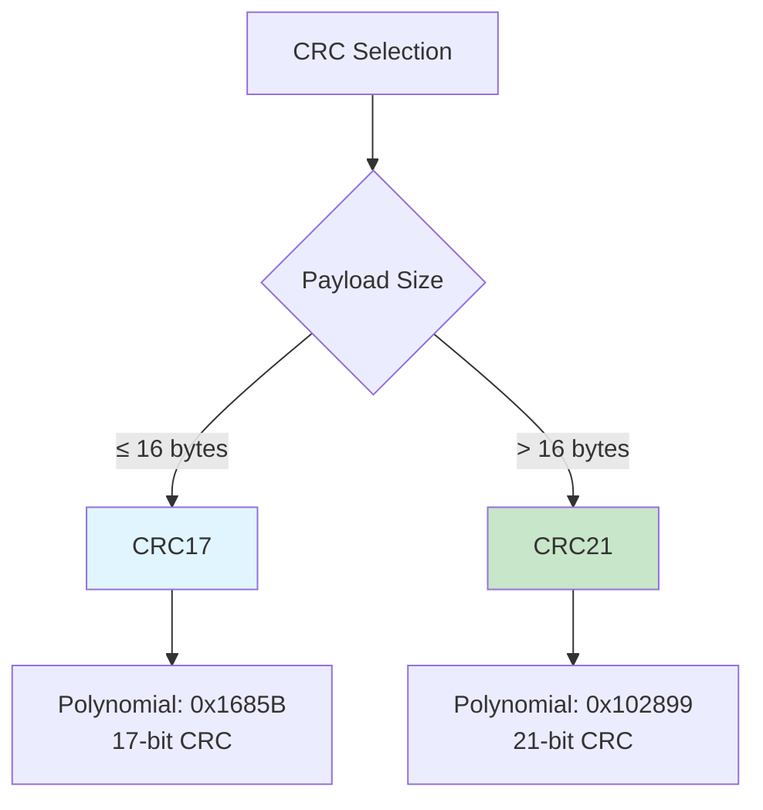

### CRC Comparison

| CRC Type | Polynomial | Length | Error Detection |
|----------|------------|--------|-----------------|
| **CAN 2.0** | 0x4599 | 15 bits | Good |
| **CAN-FD CRC17** | 0x1685B | 17 bits | Better |
| **CAN-FD CRC21** | 0x102899 | 21 bits | Best |

## Stuff Count and Stuff Bits

CAN-FD introduces **stuff count** to improve error detection:

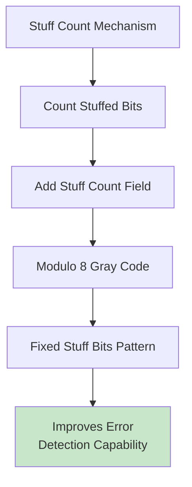

### Stuff Count Example

```
Data with stuffing: 1100001110000111111
Stuff count: 3 (3 stuff bits added)
Gray code: 010 (3 in Gray code)
```

## CAN-FD Compatible Transceivers

### Transceiver Requirements

| Feature | CAN 2.0 | CAN-FD |
|---------|---------|--------|
| **Bit Rate** | Up to 1 Mbps | Up to 5+ Mbps |
| **Rise/Fall Time** | < 250 ns | < 100 ns |
| **Propagation Delay** | Not critical | < 200 ns |
| **Loop Delay** | Not specified | < 250 ns |

### Popular CAN-FD Transceivers

| Part Number | Manufacturer | Max Speed | Features |
|-------------|--------------|-----------|----------|
| **TJA1044** | NXP | 5 Mbps | Automotive qualified |
| **TCAN334** | Texas Instruments | 5 Mbps | Industrial |
| **MCP2542FD** | Microchip | 5 Mbps | Wake-up capability |
| **SN65HVD234** | Texas Instruments | 2 Mbps | Low power |

## Network Topology Considerations

### Mixed CAN/CAN-FD Networks

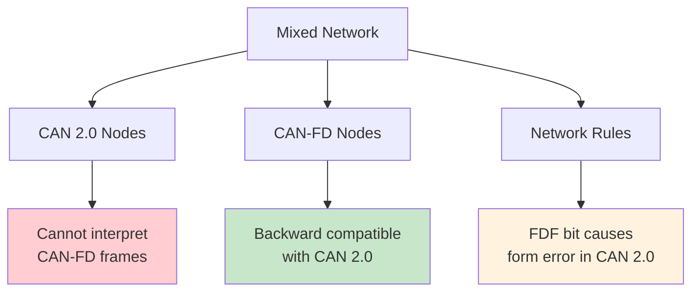

### Network Segmentation

For mixed networks, consider segmentation:

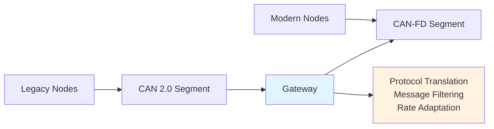

## Performance Benefits

### Throughput Comparison

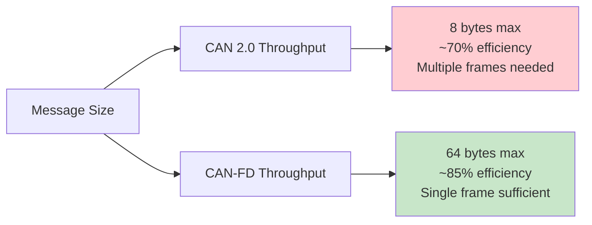

### Real-World Performance

| Scenario | CAN 2.0 (1 Mbps) | CAN-FD (1/5 Mbps) | Improvement |
|----------|-------------------|-------------------|-------------|
| **Small Data (≤8B)** | 0.7 Mbps | 0.85 Mbps | 21% |
| **Medium Data (16B)** | 0.35 Mbps | 1.6 Mbps | 357% |
| **Large Data (64B)** | 0.175 Mbps | 3.2 Mbps | 1,729% |

## Implementation Considerations

### Controller Requirements

Modern CAN-FD controllers must support:

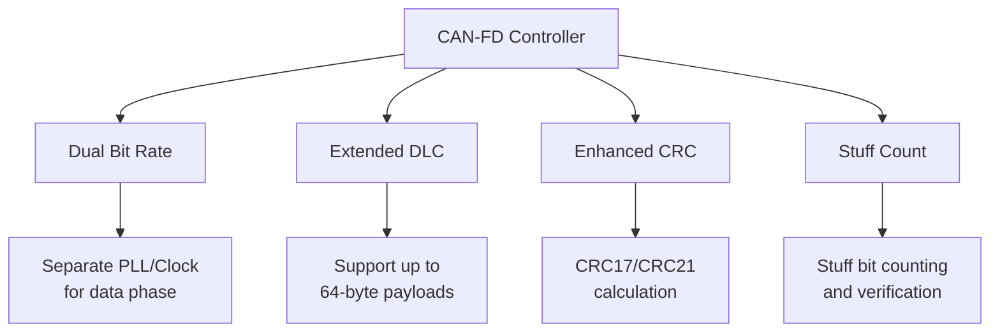

### Software Considerations

| Aspect | CAN 2.0 | CAN-FD |
|--------|---------|--------|
| **Buffer Size** | 8 bytes | Up to 64 bytes |
| **Timing** | Fixed | Dual timing parameters |
| **Error Handling** | Standard | Enhanced error states |
| **Frame Validation** | Basic | Extended validation |

## Error Handling Enhancements

### Improved Error Detection

CAN-FD provides better error detection through:

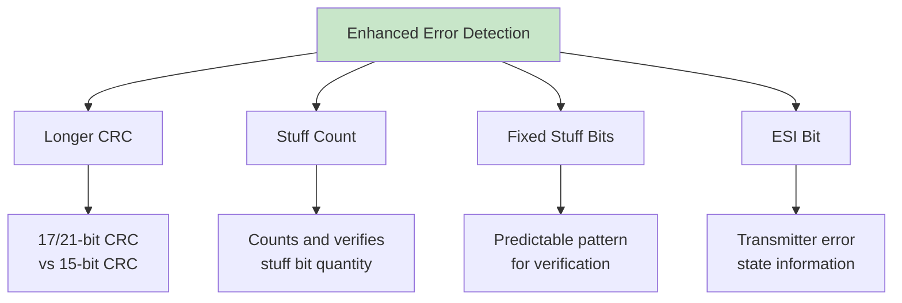

### Error State Indicator (ESI)

The ESI bit provides error state information:

| ESI Value | Transmitter State | Meaning |
|-----------|------------------|---------|
| **0** | Error Active | Normal operation |
| **1** | Error Passive | Elevated error count |

## Practical Examples

### Example 1: High-Speed Data Transfer

```
Scenario: Transferring 32 bytes of sensor data

CAN 2.0 Approach:
- 4 frames × 8 bytes = 32 bytes
- Frame overhead × 4 = significant overhead
- Total time: ~400 μs at 1 Mbps

CAN-FD Approach:
- 1 frame × 32 bytes = 32 bytes
- Single frame overhead
- Total time: ~85 μs at 1/5 Mbps
- 79% time reduction!
```

### Example 2: Firmware Update

```
Scenario: 1 MB firmware update over CAN

CAN 2.0:
- 131,072 frames (8 bytes each)
- ~15 minutes at optimal conditions

CAN-FD:
- 16,384 frames (64 bytes each)
- ~2 minutes at optimal conditions
- 87% time reduction!
```

## Migration Strategy

### Gradual Migration Path

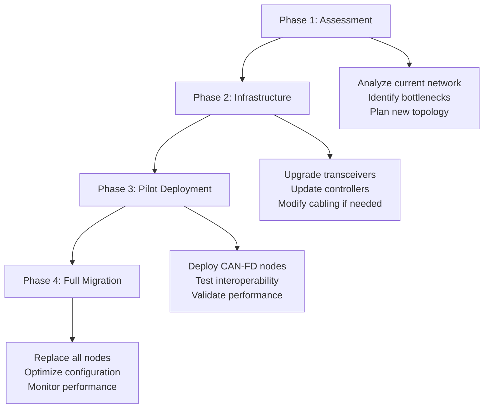

## Learning Objectives Achieved

- ✅ Understand CAN-FD enhancements over CAN 2.0
- ✅ Know CAN-FD frame structure and new fields
- ✅ Understand bit rate switching mechanism
- ✅ Recognize performance benefits and use cases
- ✅ Know implementation and migration considerations

## Next Steps

In [Lesson 6: CANopen Protocol Introduction](6_canopen_introduction.md), we'll explore the higher-layer CANopen protocol that provides standardized communication profiles and device interoperability for industrial and robotics applications.

## Practical Exercises

1. Calculate throughput improvement for 24-byte messages using CAN-FD
2. Design bit rate configuration for automotive application
3. Compare error detection capabilities between CAN 2.0 and CAN-FD
4. Plan migration strategy for existing CAN network
5. Implement CAN-FD message parsing with stuff count validation