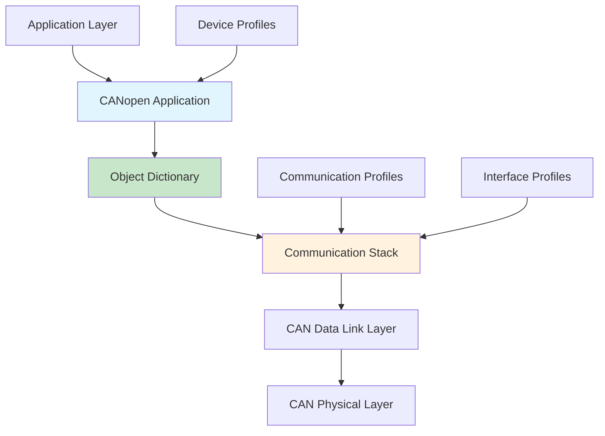
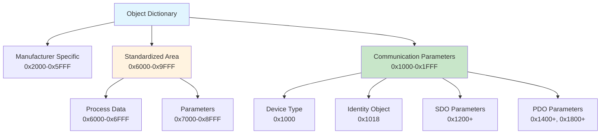
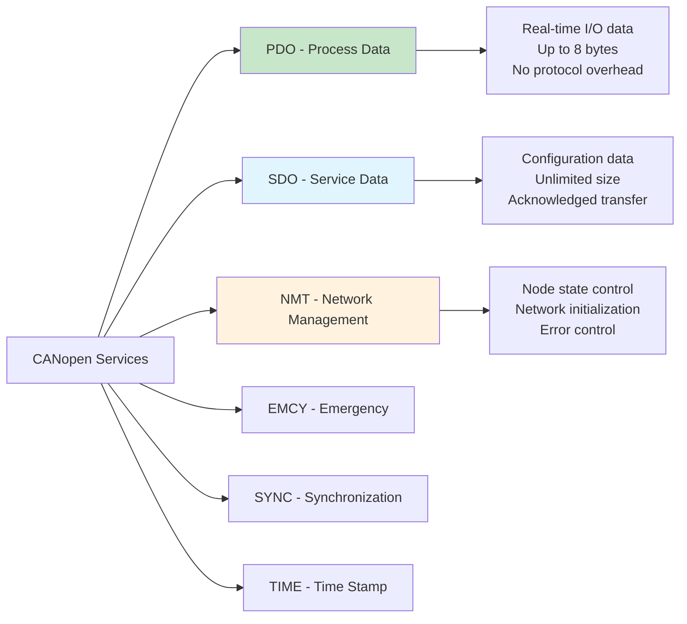
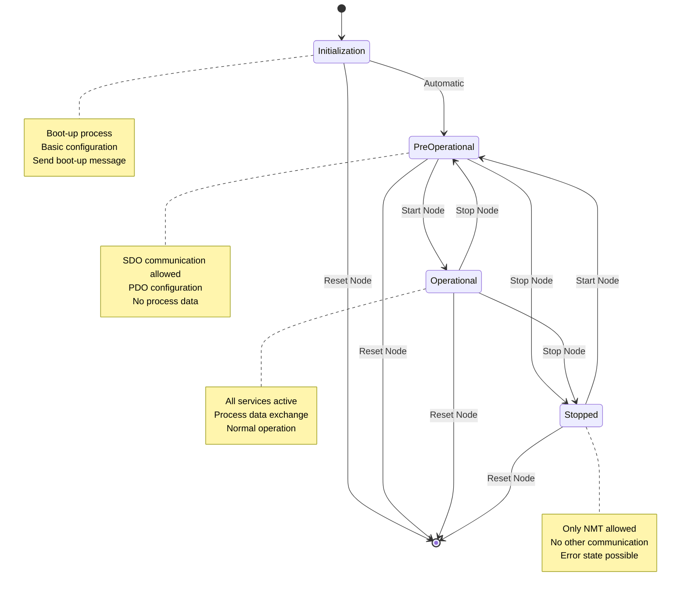
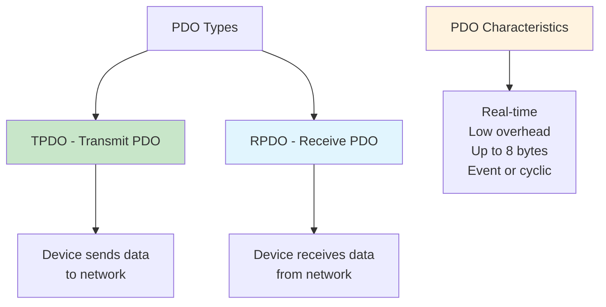
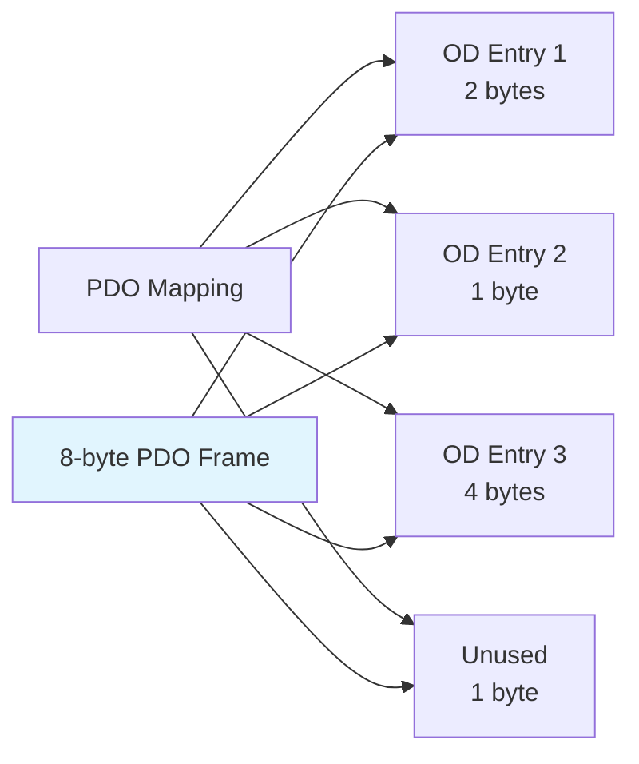
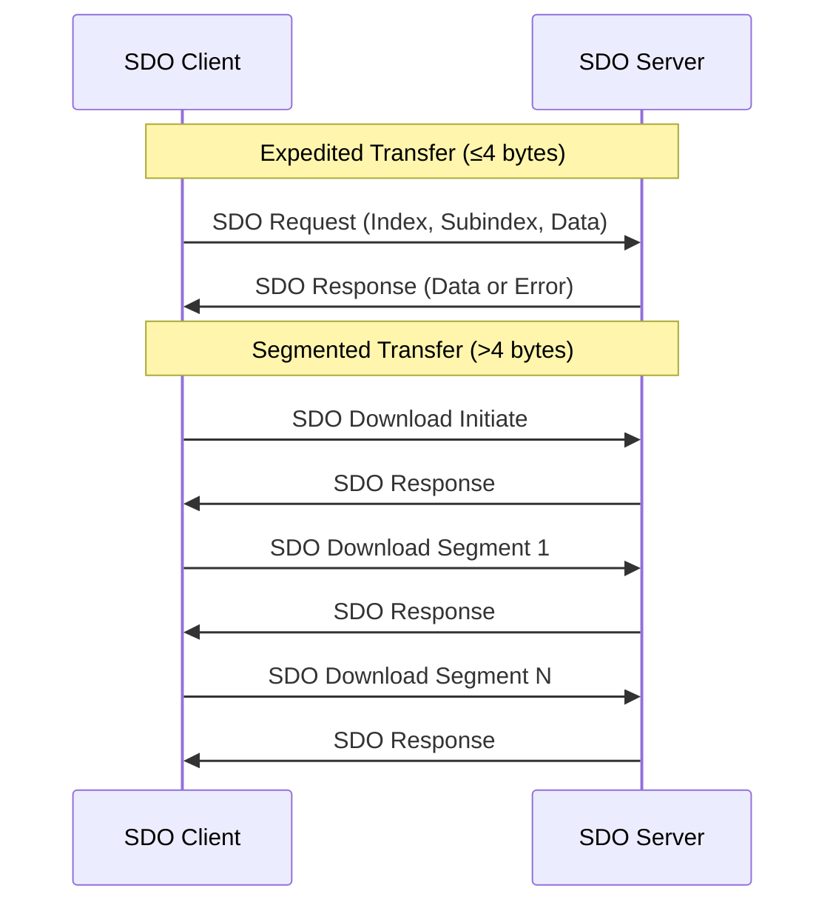
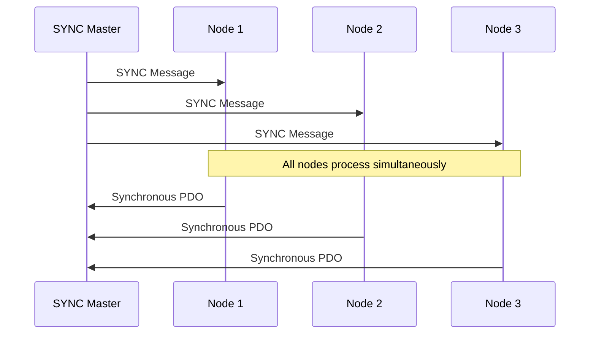
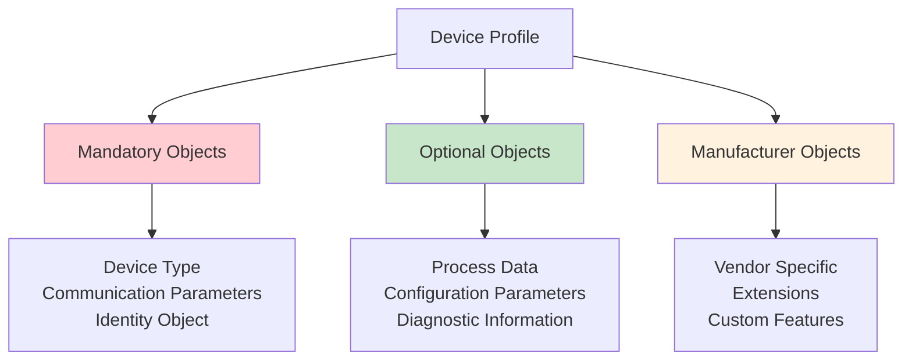

# Lesson 6: CANopen Protocol Introduction

## What is CANopen?

CANopen is a higher-layer protocol based on CAN bus that provides:
- **Standardized communication profiles** for industrial automation
- **Device interoperability** across different manufacturers
- **Object-oriented data model** for consistent device access
- **Network management services** for configuration and monitoring
- **Real-time capabilities** for industrial control applications

## CANopen Architecture

CANopen builds upon the CAN protocol stack:



## CANopen Standards Family

| Standard | Description | Focus Area |
|----------|-------------|------------|
| **CiA 301** | Application layer and communication profile | Core protocol |
| **CiA 302** | Framework for programmable CANopen devices | Device framework |
| **CiA 303** | Recommendation for CANopen cabling | Physical layer |
| **CiA 305** | Layer setting services | Configuration |
| **CiA 4xx** | Device profiles (motors, I/O, encoders) | Device types |

## Object Dictionary Concept

The Object Dictionary (OD) is the heart of CANopen - a standardized database structure:



## Communication Services

CANopen defines several communication services:

### Service Overview



## CAN Identifier Allocation

CANopen uses a **predefined connection set** with specific CAN ID allocation:

| Function | CAN ID Range | Priority | Usage |
|----------|--------------|----------|-------|
| **NMT** | 0x000 | Highest | Network management |
| **SYNC** | 0x080 | High | Synchronization |
| **EMCY** | 0x081-0x100 | High | Emergency messages |
| **PDO1 TX** | 0x181-0x200 | High | Process data out |
| **PDO1 RX** | 0x201-0x280 | High | Process data in |
| **PDO2 TX** | 0x281-0x300 | Medium | Process data out |
| **PDO2 RX** | 0x301-0x380 | Medium | Process data in |
| **PDO3 TX** | 0x381-0x400 | Medium | Process data out |
| **PDO3 RX** | 0x401-0x480 | Medium | Process data in |
| **PDO4 TX** | 0x481-0x500 | Medium | Process data out |
| **PDO4 RX** | 0x501-0x580 | Medium | Process data in |
| **SDO TX** | 0x581-0x600 | Low | Service data response |
| **SDO RX** | 0x601-0x680 | Low | Service data request |

### Node ID Integration

Each CANopen device has a Node ID (1-127):

```
CAN ID = Function Code + Node ID

Examples:
- Node 5 PDO1 TX: 0x185 (0x180 + 5)
- Node 12 SDO RX: 0x60C (0x600 + 12)
- Node 23 Emergency: 0x97 (0x80 + 23)
```

## Network Management (NMT)

NMT controls the operational state of network nodes:

### NMT State Machine



### NMT Commands

| Command | Code | Function |
|---------|------|----------|
| **Start Node** | 0x01 | Enter Operational state |
| **Stop Node** | 0x02 | Enter Stopped state |
| **Enter Pre-operational** | 0x80 | Enter Pre-operational state |
| **Reset Node** | 0x81 | Software reset |
| **Reset Communication** | 0x82 | Reset communication only |

## Process Data Objects (PDO)

PDOs provide **real-time data exchange** with minimal protocol overhead:

### PDO Types



### PDO Transmission Types

| Type | Description | Trigger |
|------|-------------|---------|
| **0** | Synchronous (acyclic) | SYNC + request |
| **1-240** | Synchronous (cyclic) | Every N SYNC pulses |
| **241-253** | Reserved | - |
| **254** | Asynchronous (device) | Device event |
| **255** | Asynchronous (profile) | Profile specific |

### PDO Mapping

PDO mapping defines which Object Dictionary entries are transmitted:



## Service Data Objects (SDO)

SDOs provide **acknowledged data transfer** for configuration and large data:

### SDO Protocol



### SDO Command Specifiers

| Command | Code | Direction | Purpose |
|---------|------|-----------|---------|
| **Download Initiate** | 0x20 | Client → Server | Start write |
| **Download Segment** | 0x00 | Client → Server | Continue write |
| **Upload Initiate** | 0x40 | Client → Server | Start read |
| **Upload Segment** | 0x60 | Client → Server | Continue read |
| **Abort** | 0x80 | Both | Transfer error |

## Emergency Objects (EMCY)

Emergency objects provide **error notification** with minimal delay:

### EMCY Message Structure

```
┌─────────────┬─────────────┬─────────────┬─────────────┬─────────────┐
│Error Code   │Error Register│Manufacturer │  Optional   │  Optional   │
│ (2 bytes)   │  (1 byte)   │Specific Info│   Data      │   Data      │
│             │             │ (5 bytes)   │ (Optional)  │ (Optional)  │
└─────────────┴─────────────┴─────────────┴─────────────┴─────────────┘
```

### Standard Error Codes

| Error Code | Category | Description |
|------------|----------|-------------|
| **0x0000** | Reset | Error reset/no error |
| **0x1000** | Generic | Generic error |
| **0x2xxx** | Current | Current related errors |
| **0x3xxx** | Voltage | Voltage related errors |
| **0x4xxx** | Temperature | Temperature errors |
| **0x5xxx** | Communication | Communication errors |
| **0x6xxx** | Profile | Device profile errors |
| **0x8xxx** | Monitoring | Monitoring errors |

## Synchronization (SYNC)

SYNC provides **network-wide synchronization** for coordinated operation:



## Device Profiles

CANopen defines standard device profiles for common industrial devices:

### Common Device Profiles

| Profile | CiA Standard | Device Type | Applications |
|---------|--------------|-------------|--------------|
| **CiA 401** | Generic I/O | Digital/Analog I/O | Sensors, actuators |
| **CiA 402** | Drive** | Motor drives | Servo motors, VFDs |
| **CiA 403** | HMI | Human-machine interface | Displays, panels |
| **CiA 404** | Measuring** | Measurement devices | Encoders, sensors |
| **CiA 405** | IEC 61131-3** | Programmable devices | PLCs, controllers |
| **CiA 406** | Encoder** | Position encoders | Rotary, linear encoders |

### Profile Structure



## Configuration Tools

CANopen networks require configuration tools for setup and maintenance:

### Tool Categories

| Tool Type | Purpose | Examples |
|-----------|---------|----------|
| **EDS Tools** | Device description | CANopen Magic, CANeds |
| **Network Config** | Network setup | CANopen for Automation, Kvaser |
| **Protocol Analyzers** | Traffic analysis | CANalyzer, Wireshark |
| **Conformance Test** | Standard compliance | CANopen Conformance Test |

### Electronic Data Sheet (EDS)

EDS files describe device capabilities:

```ini
[DeviceInfo]
VendorName=Example Company
VendorNumber=0x12345678
ProductName=Smart Motor Drive
ProductNumber=0x1001
RevisionNumber=0x10001
OrderCode=SMD-1000
BaudRate_10=0
BaudRate_20=0
BaudRate_50=1
BaudRate_125=1
BaudRate_250=1
BaudRate_500=1
BaudRate_800=0
BaudRate_1000=1
SimpleBootUpMaster=0
SimpleBootUpSlave=1
Granularity=8
DynamicChannelsSupported=0
CompactPDO=0x00
GroupMessaging=0
NrOfRxPDO=4
NrOfTxPDO=4
LSS_Supported=1
```

## Learning Objectives Achieved

- ✅ Understand CANopen architecture and standards
- ✅ Know Object Dictionary structure and addressing
- ✅ Understand communication services and their purposes
- ✅ Recognize CAN ID allocation and network management
- ✅ Know device profiles and configuration concepts

## Next Steps

In [Lesson 7: CANopen Object Dictionary and Communication](7_canopen_object_dictionary.md), we'll dive deeper into the Object Dictionary structure, PDO/SDO communication details, and practical implementation examples.

## Practical Exercises

1. Calculate CAN IDs for all services of Node ID 15
2. Design NMT state transition sequence for network startup
3. Configure PDO mapping for a 4-channel analog input device
4. Create EMCY message for motor overcurrent condition
5. Analyze EDS file and identify device capabilities