# Lesson 7: CANopen Object Dictionary and Communication

## Object Dictionary Deep Dive

The Object Dictionary (OD) is CANopen's core data structure - a standardized database that defines how devices expose their functionality, configuration, and status information.

## Object Dictionary Structure

### Memory Map Overview

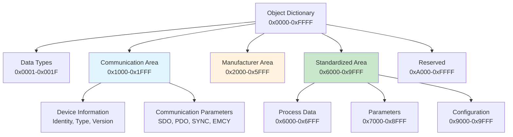

## Object Types and Data Types

### Object Entry Types

| Type | Code | Description | Structure |
|------|------|-------------|-----------|
| **NULL** | 0x00 | Empty object | No data |
| **DOMAIN** | 0x02 | Large data block | Variable length |
| **DEFTYPE** | 0x05 | Data type definition | Type information |
| **DEFSTRUCT** | 0x06 | Structure definition | Complex structure |
| **VAR** | 0x07 | Simple variable | Single value |
| **ARRAY** | 0x08 | Homogeneous array | Same type elements |
| **RECORD** | 0x09 | Heterogeneous record | Different type elements |

### Standard Data Types

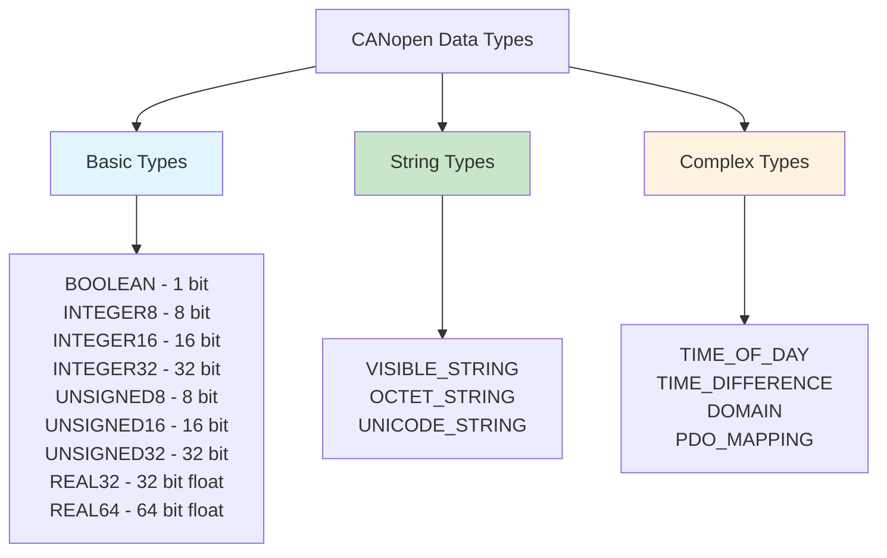

## Communication Objects

### Essential Communication Objects

| Index | Object Name | Description | Access |
|-------|-------------|-------------|--------|
| **0x1000** | Device Type | Device identification | RO |
| **0x1001** | Error Register | Current error status | RO |
| **0x1002** | Manufacturer Status | Vendor-specific status | RO |
| **0x1003** | Pre-defined Error Field | Error history | RW |
| **0x1005** | COB-ID SYNC | SYNC message identifier | RW |
| **0x1006** | Communication Cycle Period | SYNC timing | RW |
| **0x1008** | Manufacturer Device Name | Human-readable name | RO |
| **0x1009** | Manufacturer Hardware Version | Hardware revision | RO |
| **0x100A** | Manufacturer Software Version | Software revision | RO |
| **0x1018** | Identity Object | Complete device identity | RO |

### Identity Object (0x1018) Structure

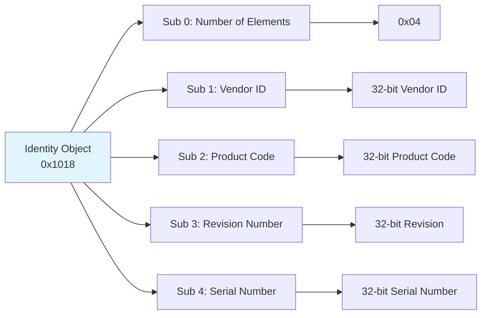

## SDO Communication Parameters

### SDO Server Parameters (0x1200)

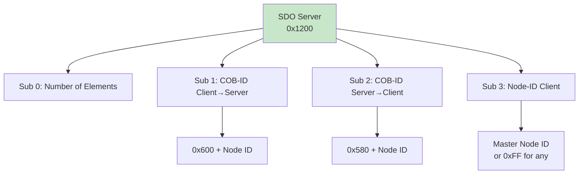

### SDO Client Parameters (0x1280+)

For devices acting as SDO clients (masters):

| Sub-Index | Parameter | Default Value | Description |
|-----------|-----------|---------------|-------------|
| **0** | Number of Elements | 0x03 | Parameter count |
| **1** | COB-ID Server→Client | - | Response CAN ID |
| **2** | COB-ID Client→Server | - | Request CAN ID |
| **3** | Node-ID Server | - | Target device Node ID |

## PDO Communication Parameters

### Receive PDO Parameters (0x1400+)

```mermaid
graph LR
    A[RPDO 1 Parameters<br/>0x1400] --> B[Sub 0: Elements]
    A --> C[Sub 1: COB-ID]
    A --> D[Sub 2: Transmission Type]
    A --> E[Sub 3: Inhibit Time]
    A --> F[Sub 5: Event Timer]
    
    C --> G[0x200 + Node ID<br/>Bit 31: Valid/Invalid]
    D --> H[0-255: Sync types<br/>254-255: Async types]
    E --> I[Minimum time between<br/>transmissions (100μs units)]
    
    style A fill:#fff3e0
```

### Transmit PDO Parameters (0x1800+)

Similar structure to RPDO but for transmitted PDOs:

| Parameter | RPDO Index | TPDO Index | Description |
|-----------|------------|------------|-------------|
| **PDO 1** | 0x1400 | 0x1800 | Highest priority PDO |
| **PDO 2** | 0x1401 | 0x1801 | Second priority PDO |
| **PDO 3** | 0x1402 | 0x1802 | Third priority PDO |
| **PDO 4** | 0x1403 | 0x1803 | Fourth priority PDO |

## PDO Mapping Objects

### PDO Mapping Structure

PDO mapping defines which Object Dictionary entries are packed into PDO messages:

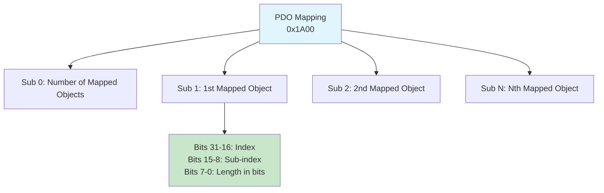

### Mapping Example

Map three variables into one 8-byte PDO:

| Sub | Index | Sub-Index | Length | Object | Size |
|-----|-------|-----------|--------|--------|------|
| **1** | 0x6040 | 0x00 | 16 bits | Control Word | 2 bytes |
| **2** | 0x6071 | 0x00 | 16 bits | Target Torque | 2 bytes |
| **3** | 0x6077 | 0x00 | 16 bits | Torque Actual | 2 bytes |
| **4** | 0x6061 | 0x00 | 8 bits | Mode of Operation | 1 byte |
| - | - | - | 8 bits | Unused | 1 byte |

## Process Data Objects

### Application Process Data (0x6000-0x6FFF)

Standard process data objects for common industrial applications:

| Index Range | Description | Examples |
|-------------|-------------|----------|
| **0x6000-0x603F** | Digital Inputs | Switch states, sensor inputs |
| **0x6040-0x607F** | Digital Outputs | Actuator control, LED status |
| **0x6080-0x60BF** | Analog Inputs | Sensor readings, measurements |
| **0x60C0-0x60FF** | Analog Outputs | Control signals, setpoints |
| **0x6100-0x613F** | Interrupt Sources | Event triggers, alarms |

### Motor Drive Profile Objects (CiA 402)

Common objects for motor control applications:

| Index | Name | Description | Access |
|-------|------|-------------|--------|
| **0x6040** | Control Word | Motor control commands | RW |
| **0x6041** | Status Word | Motor status feedback | RO |
| **0x6060** | Mode of Operation | Control mode selection | RW |
| **0x6061** | Mode Display | Active control mode | RO |
| **0x607A** | Target Position | Position setpoint | RW |
| **0x6064** | Position Actual | Current position | RO |
| **0x6071** | Target Torque | Torque setpoint | RW |
| **0x6077** | Torque Actual | Current torque | RO |

## SDO Transfer Protocols

### Expedited Transfer (≤4 bytes)

For small data that fits in one SDO message:

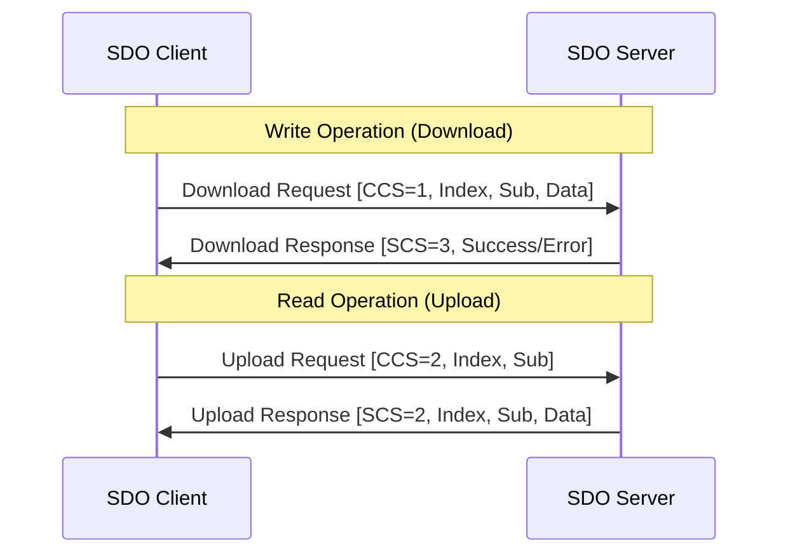

### Segmented Transfer (>4 bytes)

For large data requiring multiple segments:

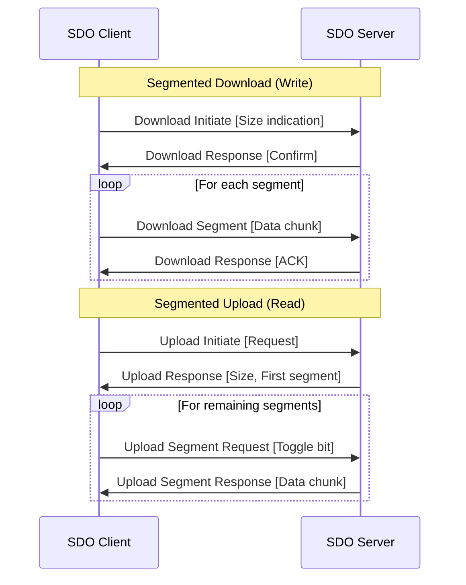

## PDO Transmission Modes

### Synchronous PDO Operation

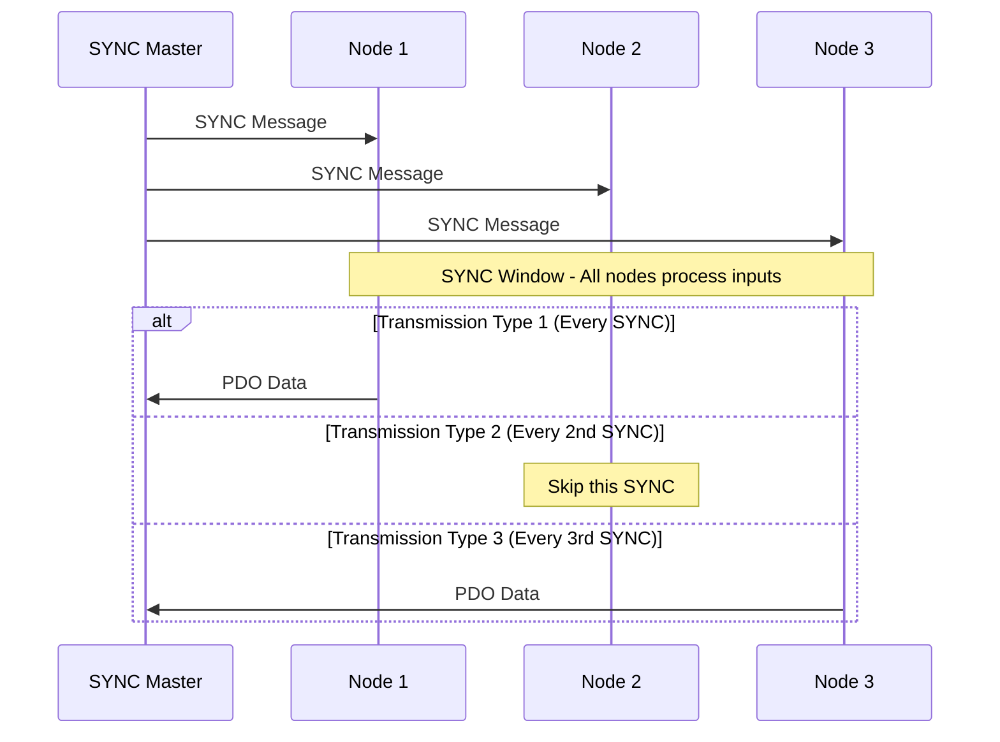

### Asynchronous PDO Operation

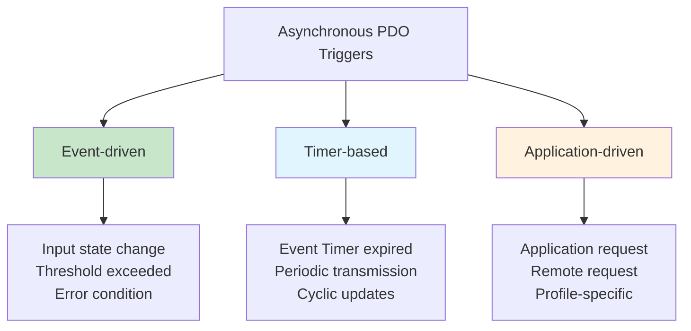

## Network Management Details

### Node States and Transitions

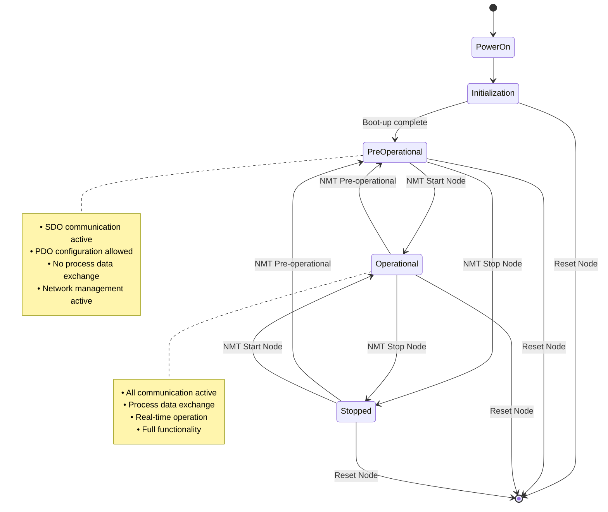

### Boot-up Process

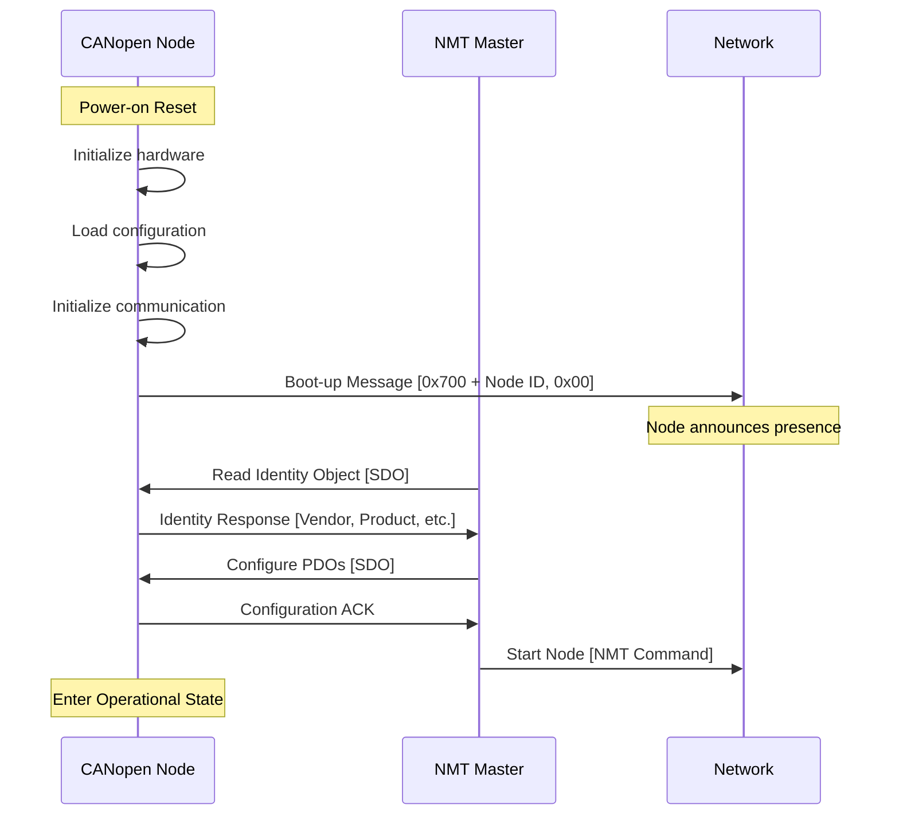

## Error Handling and Diagnostics

### Error Register (0x1001)

Single byte register indicating device error status:

| Bit | Error Type | Description |
|-----|------------|-------------|
| **0** | Generic Error | Any unspecified error |
| **1** | Current | Current related error |
| **2** | Voltage | Voltage related error |
| **3** | Temperature | Temperature related error |
| **4** | Communication | Communication error |
| **5** | Device Profile | Profile specific error |
| **6** | Reserved | Must be 0 |
| **7** | Manufacturer | Vendor specific error |

### Pre-defined Error Field (0x1003)

Error history storage:

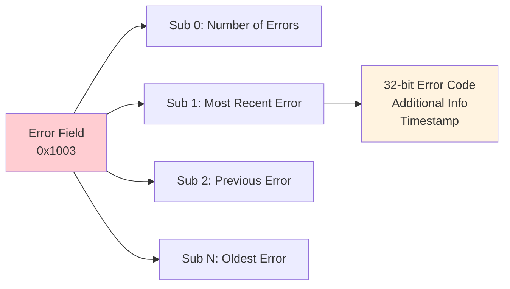

## Practical Implementation Example

### Simple I/O Device Configuration

Example: 4-channel digital input device

```c
// Object Dictionary entries
typedef struct {
    // Communication Area
    uint32_t device_type;           // 0x1000
    uint8_t  error_register;        // 0x1001
    char     device_name[32];       // 0x1008
    
    // SDO Server parameters
    uint32_t sdo_server_rx_id;      // 0x1200.1
    uint32_t sdo_server_tx_id;      // 0x1200.2
    
    // TPDO1 parameters  
    uint32_t tpdo1_id;              // 0x1800.1
    uint8_t  tpdo1_transmission;    // 0x1800.2
    uint16_t tpdo1_inhibit;         // 0x1800.3
    
    // TPDO1 mapping
    uint8_t  tpdo1_map_count;       // 0x1A00.0
    uint32_t tpdo1_map1;            // 0x1A00.1
    
    // Process Data
    uint8_t  digital_inputs;        // 0x6000
    
} canopen_od_t;

// Initialize Object Dictionary
void init_object_dictionary(uint8_t node_id) {
    od.device_type = 0x00000000;    // Generic I/O device
    strcpy(od.device_name, "4CH Digital Input");
    
    // Configure SDO
    od.sdo_server_rx_id = 0x600 + node_id;
    od.sdo_server_tx_id = 0x580 + node_id;
    
    // Configure TPDO1
    od.tpdo1_id = 0x180 + node_id;
    od.tpdo1_transmission = 254;    // Asynchronous
    od.tpdo1_inhibit = 100;         // 10ms minimum
    
    // Map digital inputs to TPDO1
    od.tpdo1_map_count = 1;
    od.tpdo1_map1 = (0x6000 << 16) | (0x00 << 8) | 8; // 8 bits
}
```

## Learning Objectives Achieved

- ✅ Understand Object Dictionary structure and organization
- ✅ Know communication object parameters and configuration
- ✅ Understand PDO mapping and transmission modes
- ✅ Know SDO transfer protocols and applications
- ✅ Understand error handling and diagnostic mechanisms

## Next Steps

In [Lesson 8: CAN in Robotics Applications](8_can_robotics_applications.md), we'll explore how CAN and CANopen are specifically applied in robotics systems, including sensor networks, actuator control, and distributed control architectures.

## Practical Exercises

1. Design Object Dictionary layout for a 6-DOF robotic arm
2. Configure PDO mapping for simultaneous multi-axis control
3. Implement SDO client to read device configuration
4. Create error handling strategy with EMCY messages
5. Optimize network performance through proper PDO configuration