# Lesson 8: CAN in Robotics Applications

## Why CAN for Robotics?

CAN bus offers unique advantages for robotics applications:

| Advantage | Robotics Benefit |
|-----------|------------------|
| **Distributed Control** | Multiple processors can control different subsystems |
| **Real-time Communication** | Deterministic response for motion control |
| **Robustness** | Immunity to electromagnetic interference from motors |
| **Scalability** | Easy to add sensors, actuators, and control nodes |
| **Reduced Wiring** | Simplified cable management in articulated arms |
| **Fault Tolerance** | System continues operation with failed nodes |

## Robotics System Architecture

### Traditional Centralized vs CAN-based Distributed

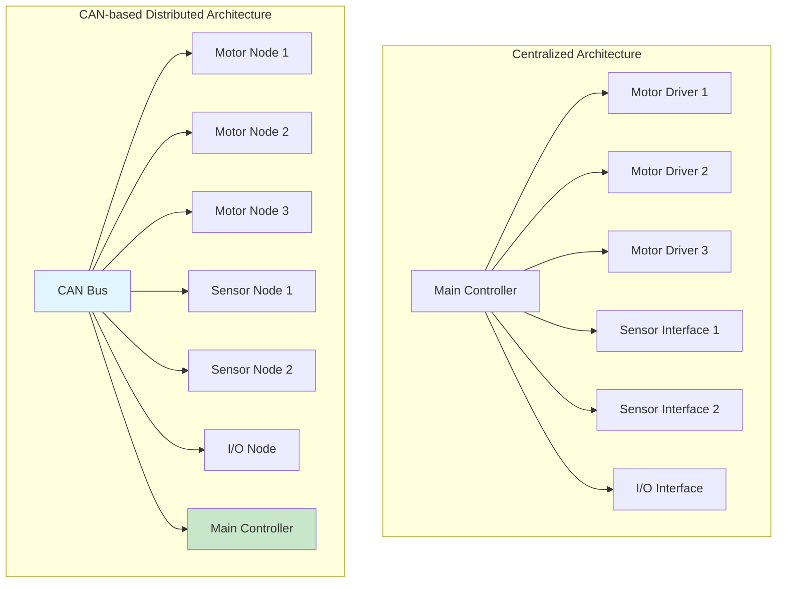

## Robotic System Components

### CAN-enabled Robotic Components

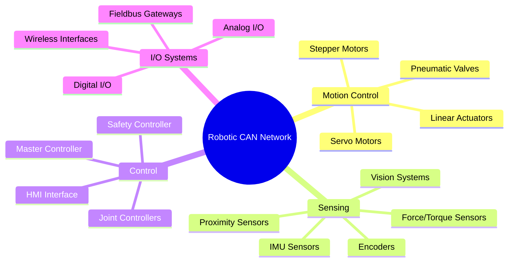

## Multi-Axis Robot Control

### 6-DOF Robotic Arm Example

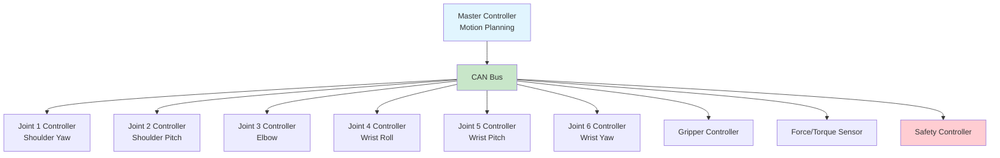

### Real-time Motion Coordination

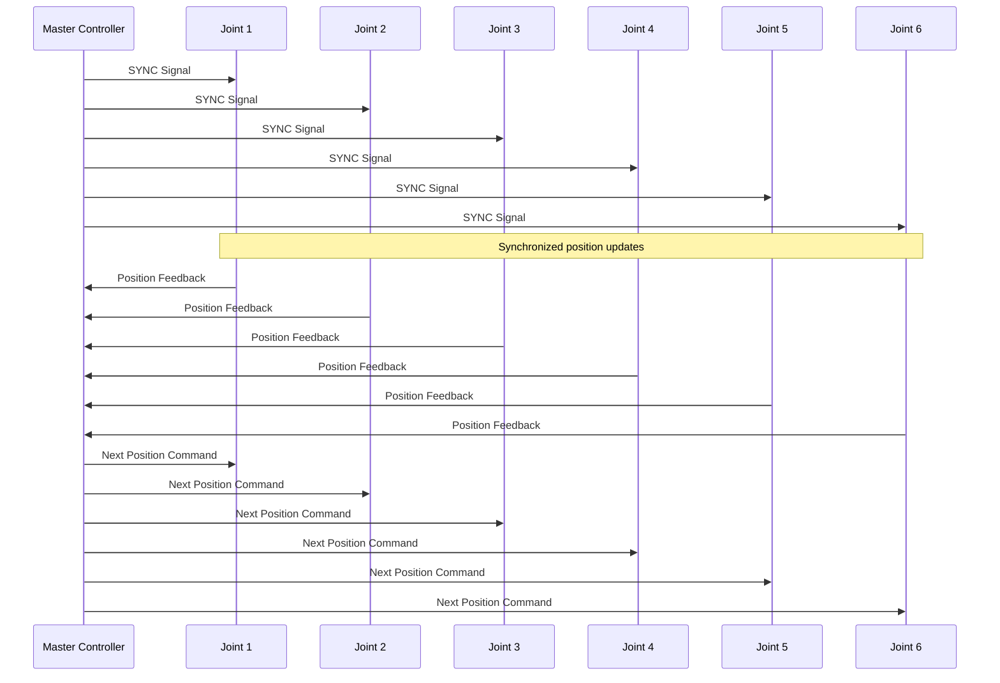

## CANopen for Motor Control

### Motor Control Profile (CiA 402)

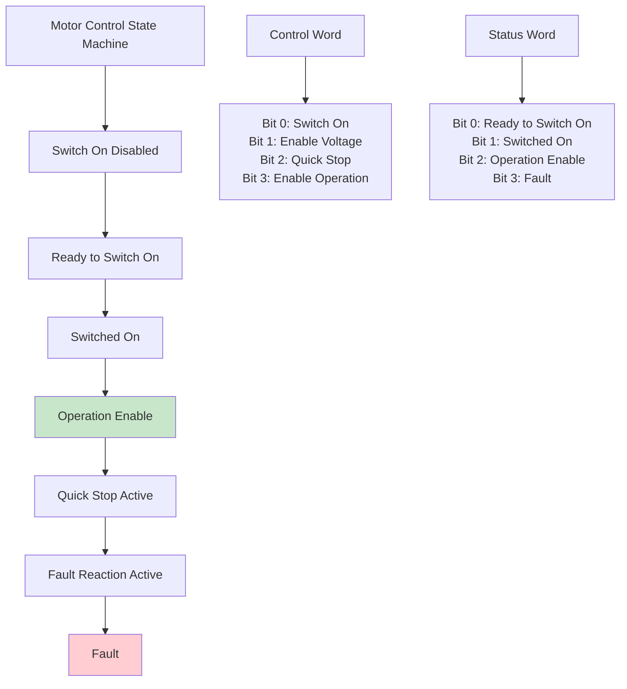

### Motion Control Modes

| Mode | Code | Description | Use Case |
|------|------|-------------|----------|
| **Profile Position** | 1 | Absolute/relative positioning | Point-to-point motion |
| **Profile Velocity** | 3 | Velocity control with ramps | Conveyor systems |
| **Profile Torque** | 4 | Torque/force control | Assembly operations |
| **Homing** | 6 | Reference position finding | Calibration |
| **Interpolated Position** | 7 | Synchronized motion | Coordinated multi-axis |
| **Cyclic Synchronous Position** | 8 | Real-time position control | Servo control |
| **Cyclic Synchronous Velocity** | 9 | Real-time velocity control | Speed control |
| **Cyclic Synchronous Torque** | 10 | Real-time torque control | Force control |

## Sensor Integration

### Distributed Sensor Network

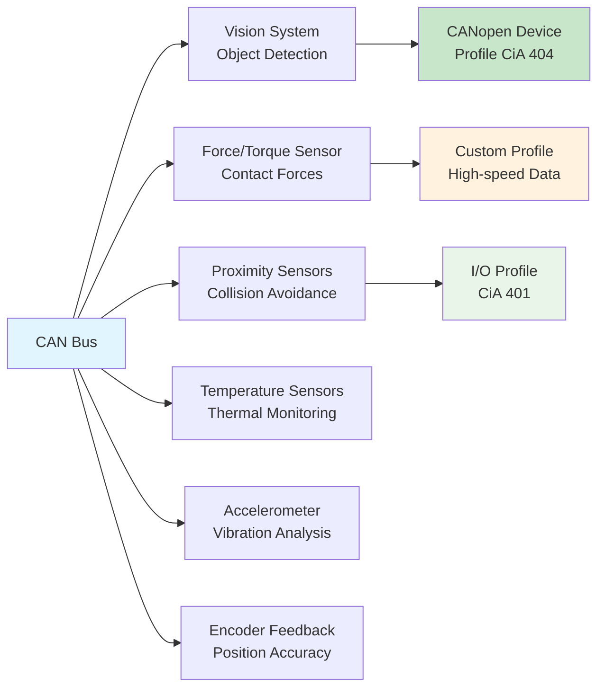

### High-Speed Sensor Data

For high-frequency sensor data, optimize PDO configuration:

```c
// Example: 1 kHz force sensor data
typedef struct {
    uint32_t pdo_id;           // 0x180 + node_id
    uint8_t  transmission_type; // 254 (asynchronous)
    uint16_t inhibit_time;     // 10 (1ms minimum)
    uint16_t event_timer;      // 10 (1ms periodic)
} force_sensor_pdo_t;

// Sensor data mapping
typedef struct {
    int16_t force_x;    // 2 bytes
    int16_t force_y;    // 2 bytes  
    int16_t force_z;    // 2 bytes
    int16_t torque_x;   // 2 bytes
    // Total: 8 bytes (full PDO)
} force_data_t;
```

## Safety Systems

### Functional Safety with CAN

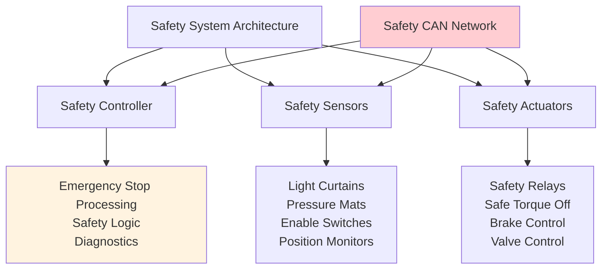

### Safety Message Priorities

| Priority | CAN ID Range | Message Type | Response Time |
|----------|--------------|--------------|---------------|
| **Emergency Stop** | 0x080-0x0FF | Immediate halt | < 1ms |
| **Safety Monitoring** | 0x100-0x17F | Status updates | < 10ms |
| **Safety Configuration** | 0x180-0x1FF | Parameter changes | < 100ms |
| **Diagnostics** | 0x700-0x77F | Error reporting | < 1s |

## Mobile Robot Applications

### Autonomous Mobile Robot (AMR)

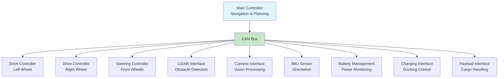

### Differential Drive Control

```c
// Example: Differential drive mobile robot
typedef struct {
    // Motion commands
    float linear_velocity;     // m/s
    float angular_velocity;    // rad/s
    
    // Wheel speeds (calculated)
    float left_wheel_speed;    // rad/s
    float right_wheel_speed;   // rad/s
    
    // Feedback
    float actual_linear_vel;   // m/s
    float actual_angular_vel;  // rad/s
    
    // Robot parameters
    float wheel_base;          // m
    float wheel_radius;        // m
} differential_drive_t;

// CANopen PDO mapping for drive control
typedef struct {
    int16_t left_speed_cmd;    // Left wheel speed command
    int16_t right_speed_cmd;   // Right wheel speed command
    uint16_t control_word;     // Drive control word
    uint16_t status_word;      // Drive status word
} drive_pdo_t;
```

## Collaborative Robotics (Cobots)

### Human-Robot Interaction

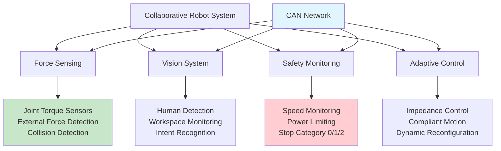

### Real-time Force Control

```c
// Example: Impedance control for collaborative robot
typedef struct {
    // Force/torque feedback
    float force_x, force_y, force_z;        // N
    float torque_x, torque_y, torque_z;     // Nm
    
    // Impedance parameters
    float stiffness[6];                     // N/m, Nm/rad
    float damping[6];                       // Ns/m, Nms/rad
    float mass[6];                          // kg, kg*m²
    
    // Control output
    float position_correction[6];           // m, rad
    float velocity_correction[6];           // m/s, rad/s
} impedance_control_t;

// High-speed CAN-FD PDO for force control
// 1 kHz update rate, 32 bytes payload
typedef struct {
    float force_xyz[3];        // 12 bytes
    float torque_xyz[3];       // 12 bytes
    uint32_t timestamp;        // 4 bytes
    uint16_t status;           // 2 bytes
    uint16_t reserved;         // 2 bytes
} force_control_pdo_t;
```

## Industrial Robot Integration

### Factory Automation Integration

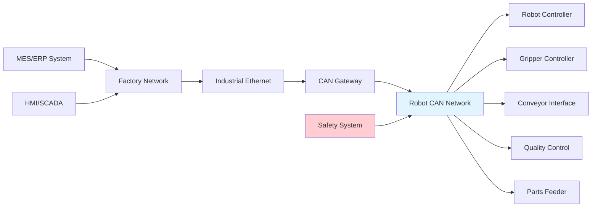

### Production Line Coordination

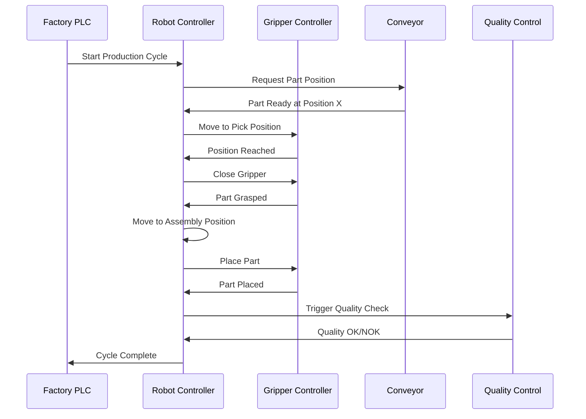

## Advantages of CAN in Robotics

### Performance Benefits

| Aspect | Traditional | CAN-based | Improvement |
|--------|-------------|-----------|-------------|
| **Wiring Complexity** | N × M connections | Single bus | 90% reduction |
| **EMI Immunity** | Susceptible | Differential signaling | High immunity |
| **Fault Tolerance** | Single point failure | Distributed | Graceful degradation |
| **Scalability** | Fixed I/O | Dynamic nodes | Easy expansion |
| **Real-time Response** | Variable | Deterministic | Predictable timing |
| **Diagnostics** | Limited | Comprehensive | Full visibility |

### Cost Analysis

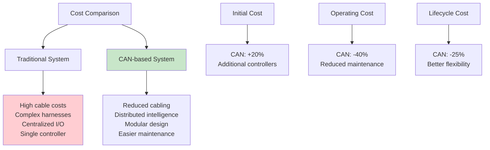

## Implementation Challenges

### Common Robotics CAN Challenges

| Challenge | Solution | Implementation |
|-----------|----------|----------------|
| **Synchronization** | SYNC master with GPS/PTP | Network-wide time base |
| **Bandwidth Limitations** | CAN-FD for high-speed data | Selective upgrade |
| **Cable Management** | Proper routing and protection | Flexible cable chains |
| **EMI from Motors** | Shielded cables and grounding | Proper installation |
| **Safety Integration** | Dedicated safety networks | Dual-channel architecture |
| **Deterministic Timing** | Priority-based message design | Careful ID allocation |

## Design Guidelines for Robotic CAN

### Network Architecture Best Practices

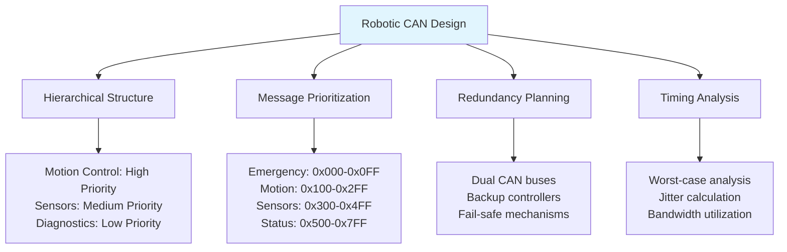

## Learning Objectives Achieved

- ✅ Understand CAN advantages for robotics applications
- ✅ Know distributed control architectures for robots
- ✅ Understand multi-axis motion control coordination
- ✅ Recognize sensor integration strategies
- ✅ Know safety system implementation with CAN
- ✅ Understand mobile robot and cobot applications

## Next Steps

In [Lesson 9: CAN Network Design and Implementation](9_can_network_design.md), we'll cover the practical aspects of designing, implementing, and optimizing CAN networks for real-world applications.

## Practical Exercises

1. Design CAN network for 6-DOF robotic arm with force feedback
2. Calculate timing requirements for 10-axis synchronized motion
3. Implement safety system with emergency stop propagation
4. Design mobile robot navigation with CAN-based sensor fusion
5. Create collaborative robot force control system using CAN-FD