# Lesson 9: CAN Network Design and Implementation

## Network Design Process

Designing a robust CAN network requires systematic analysis of requirements, topology, timing, and implementation considerations.

### Design Methodology

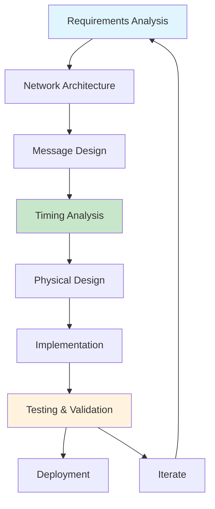

## Requirements Analysis

### System Requirements Matrix

| Category | Requirements | Considerations |
|----------|-------------|----------------|
| **Performance** | Data rates, response times, throughput | Real-time constraints |
| **Reliability** | Error rates, availability, fault tolerance | Mission-critical operations |
| **Safety** | Functional safety levels, fail-safe behavior | SIL ratings, redundancy |
| **Scalability** | Number of nodes, future expansion | Growth planning |
| **Environment** | Temperature, vibration, EMI, chemicals | Harsh conditions |
| **Cost** | Development cost, component cost, maintenance | Budget constraints |

### Application Analysis Example

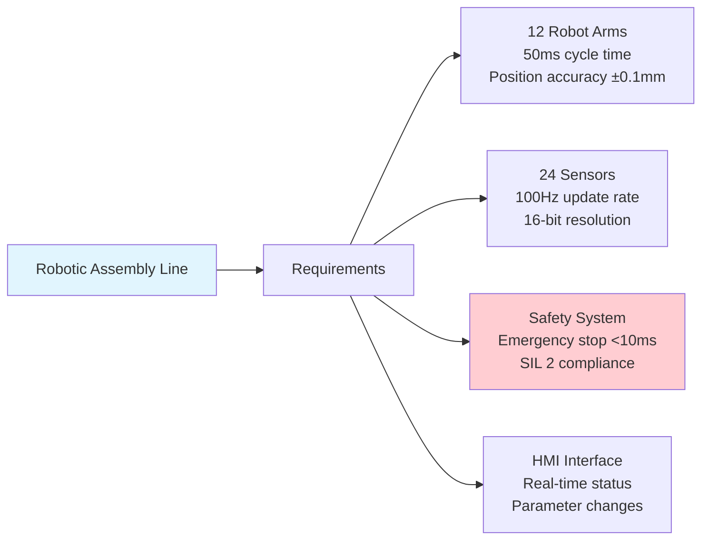

## Message Design and Prioritization

### Message Classification

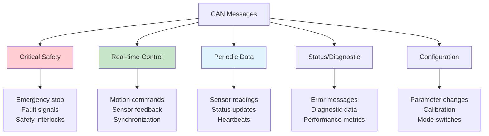

### CAN ID Allocation Strategy

| Priority Level | ID Range | Message Type | Example Applications |
|----------------|----------|--------------|---------------------|
| **Emergency** | 0x000-0x07F | Safety-critical | E-stop, fault signals |
| **High** | 0x080-0x1FF | Real-time control | Motion commands, sync |
| **Medium** | 0x200-0x3FF | Sensor data | Feedback, measurements |
| **Low** | 0x400-0x5FF | Status updates | Diagnostics, heartbeat |
| **Configuration** | 0x600-0x7FF | Setup/maintenance | Parameters, calibration |

### Message Design Example

```cpp
#include <cstdint>

// Emergency stop message (highest priority)
struct EmergencyStopMessage {
    std::uint8_t stop_reason;      // Cause of emergency stop
    std::uint8_t stop_zone;        // Geographic zone identifier
    std::uint16_t timestamp;       // Time of occurrence
    std::uint32_t reserved;        // Future expansion
    
    EmergencyStopMessage() : stop_reason(0), stop_zone(0), 
                            timestamp(0), reserved(0) {}
    
    EmergencyStopMessage(std::uint8_t reason, std::uint8_t zone, 
                        std::uint16_t time) :
        stop_reason(reason), stop_zone(zone), timestamp(time), reserved(0) {}
};

// Motion control message
struct MotionControlMessage {
    std::uint16_t position_cmd;    // Position setpoint
    std::uint16_t velocity_cmd;    // Velocity setpoint
    std::uint16_t control_word;    // Control flags
    std::uint16_t reserved;        // Future use
    
    MotionControlMessage() : position_cmd(0), velocity_cmd(0), 
                            control_word(0), reserved(0) {}
};

// Sensor feedback message
struct SensorFeedbackMessage {
    std::uint16_t position_actual; // Current position
    std::uint16_t velocity_actual; // Current velocity
    std::uint16_t torque_actual;   // Current torque
    std::uint16_t status_word;     // Status flags
    
    SensorFeedbackMessage() : position_actual(0), velocity_actual(0), 
                             torque_actual(0), status_word(0) {}
};
```

## Timing Analysis

### Response Time Calculation

The worst-case response time for a CAN message:

```
T_response = T_queuing + T_transmission + T_propagation + T_processing

Where:
- T_queuing: Time waiting for bus access
- T_transmission: Actual transmission time
- T_propagation: Physical signal propagation
- T_processing: Node processing time
```

### Bus Utilization Analysis

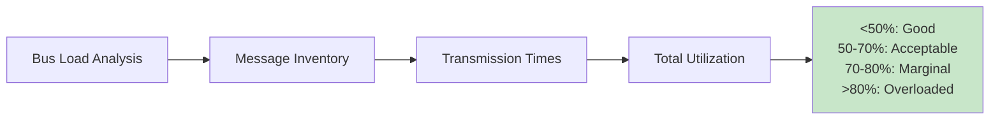

### Timing Example Calculation

```cpp
#include <cstdint>
#include <vector>

// Example: Calculate bus utilization
struct MessageSpec {
    std::uint16_t can_id;
    std::uint8_t  dlc;
    std::uint16_t period_ms;     // Transmission period
    std::uint16_t frame_bits;    // Total frame size in bits
    
    MessageSpec(std::uint16_t id, std::uint8_t data_len, 
               std::uint16_t period, std::uint16_t bits) :
        can_id(id), dlc(data_len), period_ms(period), frame_bits(bits) {}
};

class BusUtilizationCalculator {
private:
    std::vector<MessageSpec> messages;
    
public:
    void addMessage(const MessageSpec& msg) {
        messages.push_back(msg);
    }
    
    void initializeStandardMessages() {
        messages = {
            {0x080, 8, 10,  128},   // SYNC: 8 bytes, 10ms period
            {0x181, 8, 20,  128},   // Motion cmd: 8 bytes, 20ms
            {0x281, 8, 50,  128},   // Sensor data: 8 bytes, 50ms
            {0x701, 1, 1000, 64}    // Heartbeat: 1 byte, 1s
        };
    }
    
    float calculateBusUtilization(std::uint32_t bitrate) const {
        float total_bits_per_second = 0.0f;
        
        for (const auto& msg : messages) {
            float msgs_per_second = 1000.0f / msg.period_ms;
            total_bits_per_second += msgs_per_second * msg.frame_bits;
        }
        
        return (total_bits_per_second / bitrate) * 100.0f; // Percentage
    }
    
    std::size_t getMessageCount() const { return messages.size(); }
};
```

## Physical Network Design

### Topology Considerations

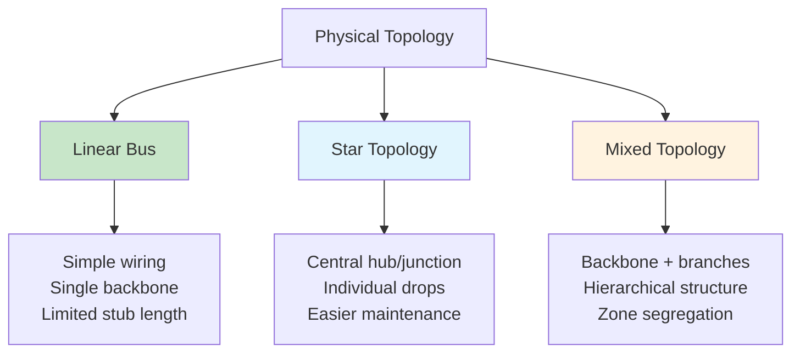

### Cable Length Calculations

| Bit Rate | Max Network Length | Max Stub Length | Typical Applications |
|----------|-------------------|-----------------|---------------------|
| **1 Mbps** | 25 m | 0.3 m | High-speed control |
| **500 kbps** | 100 m | 0.6 m | Industrial automation |
| **250 kbps** | 250 m | 1.2 m | Building automation |
| **125 kbps** | 500 m | 2.4 m | Process control |
| **50 kbps** | 1000 m | 6.0 m | Remote monitoring |

### Signal Quality Design

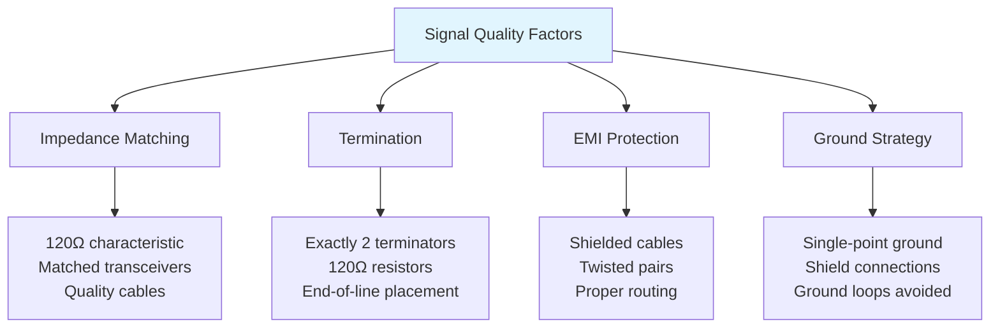

## Network Segmentation

### Hierarchical Network Design

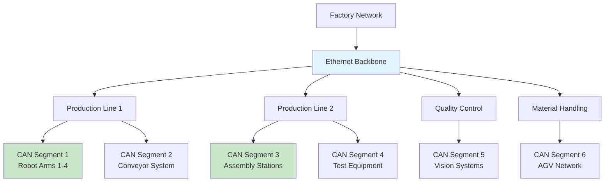

### Gateway Design

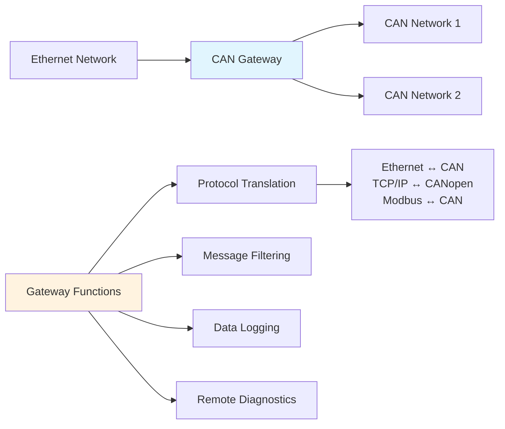

## Redundancy and Fault Tolerance

### Redundancy Strategies

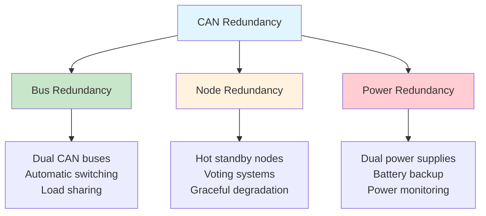

### Fault-Tolerant Architecture

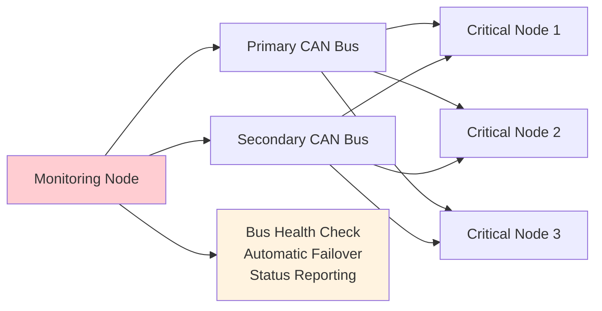

## Implementation Guidelines

### Development Process

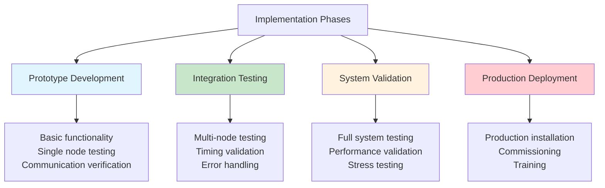

### Testing Strategy

| Test Type | Scope | Tools | Acceptance Criteria |
|-----------|-------|-------|-------------------|
| **Unit Testing** | Individual nodes | Simulation, emulation | Functional requirements |
| **Integration** | Node interactions | Protocol analyzers | Communication specs |
| **Performance** | Real-time behavior | Timing analyzers | Response time limits |
| **Stress Testing** | Maximum load | Traffic generators | No message loss |
| **EMC Testing** | Electromagnetic compatibility | EMC chambers | Regulatory compliance |
| **Environmental** | Operating conditions | Climate chambers | Temperature/vibration specs |

## Configuration Management

### Network Configuration Database

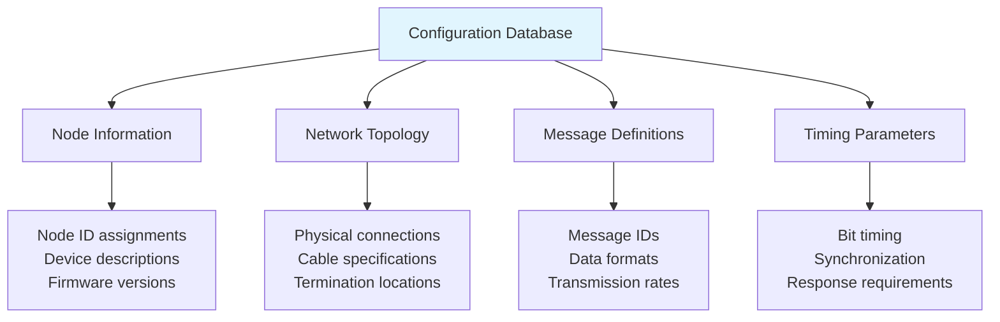

### Version Control Strategy

```cpp
#include <cstdint>
#include <string>
#include <vector>

// Example: Network configuration structure
class NetworkConfiguration {
public:
    struct NodeInfo {
        std::uint8_t  node_id;          // Node identifier
        std::uint16_t device_type;      // CANopen device type
        std::string   description;      // Human-readable name
        std::uint8_t  firmware_version; // Firmware revision
        
        NodeInfo(std::uint8_t id, std::uint16_t type, 
                const std::string& desc, std::uint8_t fw) :
            node_id(id), device_type(type), description(desc), 
            firmware_version(fw) {}
    };
    
    struct MessageInfo {
        std::uint16_t message_id;       // CAN identifier
        std::uint8_t  dlc;             // Data length
        std::uint16_t period_ms;       // Transmission period
        std::string   description;      // Message description
        
        MessageInfo(std::uint16_t id, std::uint8_t len, 
                   std::uint16_t period, const std::string& desc) :
            message_id(id), dlc(len), period_ms(period), description(desc) {}
    };

private:
    std::uint8_t  network_version;       // Configuration version
    std::uint16_t bitrate;              // Network bit rate
    std::vector<NodeInfo> nodes;
    std::vector<MessageInfo> messages;

public:
    NetworkConfiguration(std::uint8_t version, std::uint16_t rate) :
        network_version(version), bitrate(rate) {}
    
    void addNode(const NodeInfo& node) {
        nodes.push_back(node);
    }
    
    void addMessage(const MessageInfo& message) {
        messages.push_back(message);
    }
    
    std::uint8_t getNodeCount() const { 
        return static_cast<std::uint8_t>(nodes.size()); 
    }
    
    std::uint16_t getBitrate() const { return bitrate; }
    
    const std::vector<NodeInfo>& getNodes() const { return nodes; }
    const std::vector<MessageInfo>& getMessages() const { return messages; }
    
    void setBitrate(std::uint16_t rate) { bitrate = rate; }
    void setNetworkVersion(std::uint8_t version) { network_version = version; }
};
```

## Performance Optimization

### Optimization Strategies

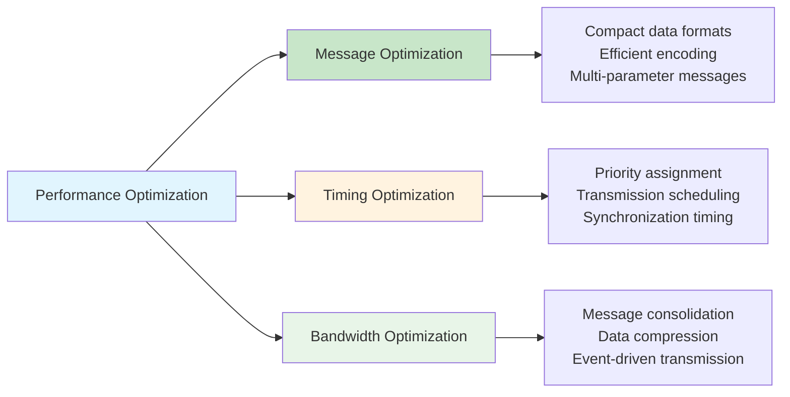

### Network Monitoring

Key performance indicators to monitor:

| Metric | Normal Range | Warning Threshold | Critical Threshold |
|--------|--------------|-------------------|-------------------|
| **Bus Utilization** | 0-50% | 50-70% | >70% |
| **Error Rate** | <0.01% | 0.01-0.1% | >0.1% |
| **Message Latency** | <5ms | 5-20ms | >20ms |
| **Node Response Time** | <10ms | 10-50ms | >50ms |
| **Bus-off Events** | 0 | 1-5/day | >5/day |

## Documentation and Standards

### Essential Documentation

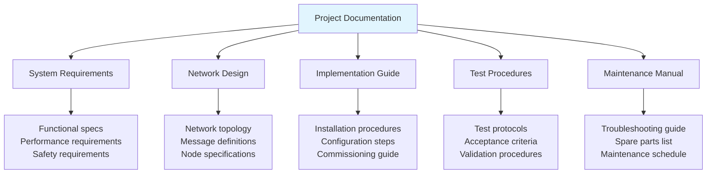

### Compliance Standards

| Standard | Description | Application |
|----------|-------------|-------------|
| **ISO 11898** | CAN protocol specification | Physical and data link layers |
| **CiA 301** | CANopen application layer | Higher-layer protocols |
| **IEC 61508** | Functional safety | Safety-critical systems |
| **ISO 26262** | Automotive safety | Automotive applications |
| **IEC 61131-3** | PLC programming | Industrial automation |
| **IEEE 802.3** | Ethernet standard | Network integration |

## Cost-Benefit Analysis

### Implementation Costs

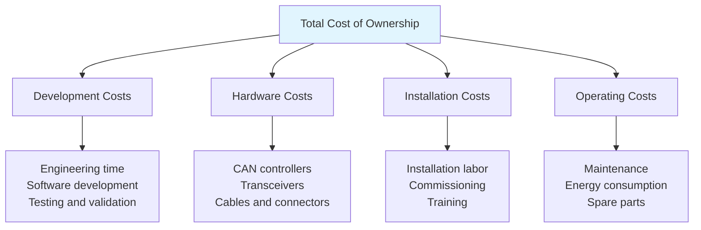

### Return on Investment

| Benefit Category | Annual Savings | Notes |
|------------------|----------------|-------|
| **Reduced Wiring** | $10,000-50,000 | Simplified cable harnesses |
| **Faster Troubleshooting** | $5,000-25,000 | Built-in diagnostics |
| **Improved Reliability** | $20,000-100,000 | Reduced downtime |
| **Enhanced Flexibility** | $15,000-75,000 | Easier reconfiguration |
| **Better Diagnostics** | $5,000-20,000 | Predictive maintenance |

## Learning Objectives Achieved

- ✅ Understand systematic CAN network design methodology
- ✅ Know how to perform requirements analysis and message design
- ✅ Understand timing analysis and bus utilization calculations
- ✅ Know physical design considerations and topology options
- ✅ Understand redundancy and fault tolerance strategies
- ✅ Know implementation, testing, and optimization approaches

## Next Steps

In [Lesson 10: Advanced CAN Topics and Troubleshooting](10_advanced_can_troubleshooting.md), we'll explore advanced CAN concepts, diagnostic techniques, and practical troubleshooting methods for maintaining robust CAN networks.

## Practical Exercises

1. Design complete CAN network for automated assembly line
2. Calculate worst-case response times for critical messages
3. Perform bus utilization analysis for mixed message types
4. Design redundant architecture for safety-critical application
5. Create network configuration management system