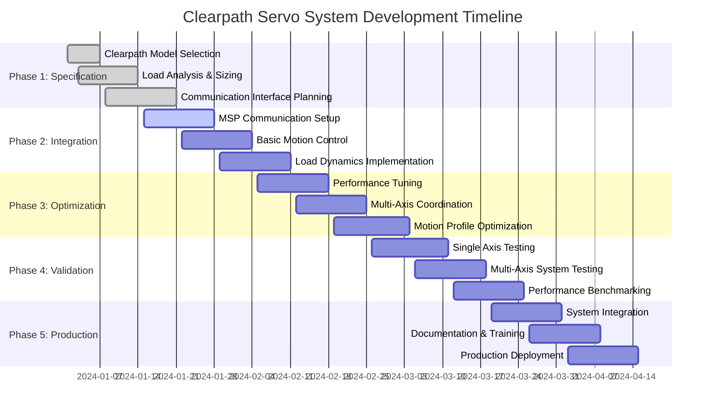

# Clearpath Servo Modeling: Leveraging Commercial Brushless Servos

## Overview

This document explains how to develop mathematical models for Clearpath brushless servo motors in control systems applications. Unlike building motors from scratch, Clearpath servos provide well-documented parameters and integrated controllers, allowing us to focus on system-level modeling and performance optimization rather than low-level electrical dynamics.

---

## What: Clearpath Servo System Architecture

### Integrated Servo Motor System

Clearpath servos combine multiple subsystems in a single package:

#### Motor + Drive Integration
- **Brushless motor:** High-efficiency permanent magnet synchronous motor
- **Integrated drive:** Built-in servo amplifier with current/velocity control loops
- **Encoder feedback:** High-resolution encoder (typically 800 CPR to 4000 CPR)
- **Communications:** CANopen, Ethernet, or serial interfaces

#### Simplified Control Interface
Instead of managing electrical dynamics, you control:
```
Position Command → Clearpath Servo → Actual Position
Velocity Command → Clearpath Servo → Actual Velocity
Torque Command → Clearpath Servo → Actual Torque
```

### Available Clearpath Models

#### CPM Series (Compact Brushless Motors)
- **Power range:** 75W to 1500W
- **Speeds:** Up to 8000 RPM
- **Torque:** 0.24 to 9.4 N⋅m
- **Typical applications:** Light automation, lab equipment

#### CVM Series (Servo Motors with Connectorized Feedback)
- **Power range:** 190W to 4800W  
- **Speeds:** Up to 6000 RPM continuous
- **Torque:** 0.6 to 76 N⋅m
- **Typical applications:** Industrial automation, packaging

#### SC Series (Servo Motors with Integrated Controller)
- **Power range:** 190W to 4800W
- **Advanced features:** Multi-axis coordination, complex motion profiles
- **Network integration:** EtherCAT, CANopen support

### System-Level Dynamics Model

For Clearpath servos, the relevant dynamics are:

#### Position Control Mode
```
θ_actual(s) / θ_command(s) = K_p / (τ_s*s + 1)
```
Where:
- **K_p:** Steady-state position gain (typically 1.0)
- **τ_s:** System time constant (from Clearpath specifications)

#### Velocity Control Mode  
```
ω_actual(s) / ω_command(s) = K_v / (τ_v*s + 1)
```

#### Load Dynamics
The mechanical load still needs modeling:
```
J_total * dω/dt + B_total * ω = T_motor - T_load - T_friction
```

Where:
- **J_total = J_motor + J_reflected_load**
- **T_motor:** Torque from Clearpath servo
- **T_load:** External load torque

### Motion Profile Strategy: Hybrid Approach

Unlike custom motor implementations that typically commit to a single profile type, Clearpath servos enable a **hybrid motion profile strategy** that selects the optimal trajectory based on operational context:

#### Trapezoidal Profiles - Development & Speed Priority
**When to use:**
- Development and testing phases (faster implementation)
- Emergency stop sequences (minimum time to halt)
- Infrequent positioning moves (mechanical wear not critical)
- Coarse positioning before fine adjustments

**Advantages:**
- Simple computation and timing prediction
- Faster move times for non-critical operations
- Easier debugging during development
- Immediate functionality for system bring-up

#### S-Curve Profiles - Production & Precision Priority  
**When to use:**
- High-frequency repeated motions (>1 Hz)
- Vertical axis operations with loads
- Precision positioning requirements
- Production environments prioritizing mechanical longevity

**Advantages:**
- Reduced mechanical stress and vibration
- Better tracking accuracy and settling behavior
- Lower acoustic noise
- Extended mechanical component life

#### Implementation Philosophy
This hybrid approach recognizes that **warehouse automation systems have diverse motion requirements**. Rather than forcing all moves to use the same profile type, the system intelligently selects based on:

- **Axis type** (X/Y horizontal vs Z vertical)
- **Load conditions** (empty vs loaded moves)  
- **Move frequency** (occasional vs repetitive)
- **Operational phase** (development vs production)
- **Performance priority** (speed vs smoothness vs longevity)

---

## Why: Advantages of Commercial Servos

### Eliminated Complexity
Clearpath handles internally:
- ✅ Current loop tuning (typically >1kHz bandwidth)
- ✅ Velocity loop tuning (typically 100-500Hz bandwidth)  
- ✅ Commutation and electrical timing
- ✅ Motor protection and fault detection
- ✅ Encoder signal processing

### Focus on System Performance
You can concentrate on:
- **Load dynamics modeling:** Mechanical system behavior
- **Motion profile optimization:** Smooth trajectories and coordination
- **System integration:** Multi-axis synchronization
- **Application-specific control:** Custom algorithms above the servo level

### Documented Parameters
Clearpath provides:
- **Torque-speed curves:** Performance envelopes
- **Bandwidth specifications:** Control loop response times
- **Inertia matching ratios:** Optimal load sizing
- **Tuning guidelines:** Performance optimization recommendations

### Built-in Safety Features
- **Over-temperature protection**
- **Over-current limiting**
- **Position/velocity limit enforcement**
- **Fault reporting and diagnostics**

---

## How: Modeling Clearpath Servo Systems

### Parameter Acquisition

#### From Clearpath Specifications
Each servo motor datasheet provides:

**Motor Specifications:**
```python
# Example: CPM-MCVC-2310S-RLN
motor_specs = {
    'continuous_torque': 2.31,      # N⋅m
    'peak_torque': 6.94,            # N⋅m
    'max_speed': 4000,              # RPM
    'rotor_inertia': 1.1e-4,        # kg⋅m²
    'torque_constant': 0.077,       # N⋅m/A (for reference)
    'encoder_resolution': 800,       # CPR
    'control_bandwidth': 250,        # Hz (velocity loop)
}
```

**Performance Curves:**
- Continuous torque vs. speed
- Peak torque vs. speed  
- Power vs. speed
- Efficiency maps

#### Load Characterization
You must still measure/calculate:

**Load Inertia:**
```python
# Method 1: CAD calculation
J_load = sum(mass_i * radius_i**2 for each component)

# Method 2: Oscillation test
J_load = applied_torque / measured_acceleration
```

**Load Friction:**
```python
# Measure torque needed for constant velocity
T_friction_viscous = measured_torque_at_constant_speed

# Measure breakaway torque
T_friction_coulomb = minimum_torque_to_start_motion
```

### Implementation with Clearpath Integration

#### System Model Class
```python
from dataclasses import dataclass
import numpy as np

@dataclass
class ClearpathSpecs:
    """Clearpath motor specifications"""
    continuous_torque: float    # N⋅m
    peak_torque: float         # N⋅m  
    max_speed: float           # RPM
    rotor_inertia: float       # kg⋅m²
    control_bandwidth: float   # Hz
    encoder_cpr: float         # Counts per revolution
    
@dataclass  
class LoadParameters:
    """Mechanical load parameters"""
    inertia: float             # kg⋅m²
    viscous_friction: float    # N⋅m⋅s/rad
    coulomb_friction: float    # N⋅m
    gear_ratio: float          # Reduction ratio (if any)

class ClearpathServoSystem:
    """Model of Clearpath servo + mechanical load"""
    
    def __init__(self, motor_specs: ClearpathSpecs, load_params: LoadParameters):
        self.motor = motor_specs
        self.load = load_params
        self.reset()
    
    def reset(self):
        """Reset system state"""
        self.position = 0.0        # rad
        self.velocity = 0.0        # rad/s
        self.motor_torque = 0.0    # N⋅m
        self._position_command = 0.0
        self._velocity_command = 0.0
        
    def set_position_command(self, position: float):
        """Set position reference for servo"""
        self._position_command = position
        
    def set_velocity_command(self, velocity: float):
        """Set velocity reference for servo"""  
        self._velocity_command = velocity
        
    def update(self, dt: float, external_load: float = 0.0):
        """Update system dynamics"""
        # Clearpath servo response (simplified first-order)
        time_constant = 1.0 / (2 * np.pi * self.motor.control_bandwidth)
        
        # Position control mode
        position_error = self._position_command - self.position
        velocity_target = self._velocity_command + 10.0 * position_error  # Position gain
        
        # Velocity control (first-order response)
        velocity_error = velocity_target - self.velocity
        velocity_response = velocity_error / time_constant
        
        # Load dynamics
        total_inertia = self.motor.rotor_inertia + self.load.inertia
        friction_torque = (self.load.viscous_friction * self.velocity + 
                          self.load.coulomb_friction * np.sign(self.velocity))
        
        # Torque limiting
        torque_demand = total_inertia * velocity_response
        max_torque = self._get_available_torque(abs(self.velocity))
        self.motor_torque = np.clip(torque_demand, -max_torque, max_torque)
        
        # Mechanical dynamics
        net_torque = self.motor_torque - friction_torque - external_load
        acceleration = net_torque / total_inertia
        
        # Integration
        self.velocity += acceleration * dt
        self.position += self.velocity * dt
        
    def _get_available_torque(self, speed_rpm: float) -> float:
        """Get torque limit based on speed (from torque-speed curve)"""
        if speed_rpm <= 1000:
            return self.motor.continuous_torque
        elif speed_rpm <= 3000:
            # Linear interpolation to reduced torque at high speed
            ratio = (3000 - speed_rpm) / 2000
            return self.motor.continuous_torque * ratio
        else:
            return self.motor.continuous_torque * 0.3  # High-speed limit
```

### Factory Functions for Common Clearpath Models

```python
def create_cpm_mcvc_2310s() -> ClearpathServoSystem:
    """Create CPM-MCVC-2310S servo system"""
    motor_specs = ClearpathSpecs(
        continuous_torque=2.31,
        peak_torque=6.94,
        max_speed=4000,
        rotor_inertia=1.1e-4,
        control_bandwidth=250,
        encoder_cpr=800
    )
    
    # Typical light-duty load
    load_params = LoadParameters(
        inertia=2.0e-4,           # 2:1 inertia ratio (recommended)
        viscous_friction=0.001,
        coulomb_friction=0.05,
        gear_ratio=1.0
    )
    
    return ClearpathServoSystem(motor_specs, load_params)

def create_cvm_mcpv_3432s() -> ClearpathServoSystem:
    """Create CVM-MCPV-3432S servo system (higher power)"""
    motor_specs = ClearpathSpecs(
        continuous_torque=10.8,
        peak_torque=32.5,
        max_speed=3000,
        rotor_inertia=8.2e-4,
        control_bandwidth=200,
        encoder_cpr=4000
    )
    
    # Industrial load
    load_params = LoadParameters(
        inertia=1.6e-3,           # 2:1 inertia ratio
        viscous_friction=0.005,
        coulomb_friction=0.2,
        gear_ratio=1.0
    )
    
    return ClearpathServoSystem(motor_specs, load_params)
```

### Communications Interface

#### MSP (Motor Setup Protocol) Integration
```python
class ClearpathMSP:
    """Interface to Clearpath MSP communications"""
    
    def __init__(self, port: str = '/dev/ttyUSB0'):
        self.port = port
        self.connection = None
        
    def connect(self):
        """Establish MSP connection"""
        # Implementation depends on MSP library
        pass
        
    def set_position_absolute(self, position: float):
        """Send absolute position command"""
        position_counts = int(position * self.encoder_cpr / (2 * np.pi))
        # Send MSP command
        
    def set_velocity(self, velocity: float):
        """Send velocity command"""
        velocity_rpm = velocity * 30 / np.pi
        # Send MSP command
        
    def get_position(self) -> float:
        """Read actual position"""
        # Query MSP for position
        return position_rad
        
    def get_status(self) -> dict:
        """Get servo status and diagnostics"""
        return {
            'position': self.get_position(),
            'velocity': self.get_velocity(),
            'torque': self.get_torque(),
            'faults': self.get_faults(),
            'temperature': self.get_temperature()
        }
```

### Performance Optimization

#### Inertia Matching
Clearpath recommends 2:1 to 10:1 load-to-motor inertia ratio:
```python
def check_inertia_ratio(motor_inertia: float, load_inertia: float) -> str:
    """Check if inertia ratio is within recommended range"""
    ratio = load_inertia / motor_inertia
    
    if ratio < 1:
        return "WARNING: Load inertia too low - may cause instability"
    elif ratio <= 10:
        return f"OK: Inertia ratio {ratio:.1f}:1 is within recommended range"
    else:
        return f"WARNING: Inertia ratio {ratio:.1f}:1 too high - reduce load or add gearing"
```

#### Motion Profile Selection Strategy

Clearpath servos support multiple motion profile types. The optimal choice depends on application requirements:

```python
from enum import Enum

class ProfileType(Enum):
    TRAPEZOIDAL = "trapezoidal"
    S_CURVE = "s_curve"
    
def select_profile_type(axis: str, move_type: str, frequency: float, 
                        load_sensitive: bool = False) -> ProfileType:
    """Select optimal motion profile based on application requirements"""
    
    # Emergency situations - prioritize speed
    if move_type == "emergency_stop":
        return ProfileType.TRAPEZOIDAL
    
    # Vertical axis with load - prioritize smoothness
    if axis.upper() == "Z" and (move_type == "load_handling" or load_sensitive):
        return ProfileType.S_CURVE
        
    # High-frequency operations - reduce mechanical fatigue
    if frequency > 1.0:  # moves per second
        return ProfileType.S_CURVE
        
    # Development/testing - prioritize simplicity
    if move_type == "development" or move_type == "coarse_positioning":
        return ProfileType.TRAPEZOIDAL
        
    # Production default - balance performance and complexity
    return ProfileType.S_CURVE

def generate_trapezoidal_profile(start_pos: float, end_pos: float,
                               max_velocity: float, max_acceleration: float) -> tuple:
    """Generate trapezoidal motion profile for fast, simple moves"""
    distance = abs(end_pos - start_pos)
    direction = 1 if end_pos > start_pos else -1
    
    # Calculate profile timing
    accel_time = max_velocity / max_acceleration
    accel_distance = 0.5 * max_acceleration * accel_time**2
    
    if 2 * accel_distance >= distance:
        # Triangular profile (no constant velocity phase)
        accel_time = (distance / max_acceleration) ** 0.5
        const_vel_time = 0.0
        actual_max_vel = max_acceleration * accel_time
    else:
        # Full trapezoidal profile
        const_vel_time = (distance - 2 * accel_distance) / max_velocity
        actual_max_vel = max_velocity
    
    total_time = 2 * accel_time + const_vel_time
    
    # Generate time points and profiles
    dt = 0.001  # 1ms resolution
    time_points = np.arange(0, total_time + dt, dt)
    position_profile = []
    velocity_profile = []
    
    for t in time_points:
        if t <= accel_time:
            # Acceleration phase
            pos = start_pos + direction * 0.5 * max_acceleration * t**2
            vel = direction * max_acceleration * t
        elif t <= accel_time + const_vel_time:
            # Constant velocity phase
            pos = (start_pos + direction * accel_distance + 
                  direction * actual_max_vel * (t - accel_time))
            vel = direction * actual_max_vel
        else:
            # Deceleration phase
            t_decel = t - accel_time - const_vel_time
            pos = (end_pos - direction * 0.5 * max_acceleration * 
                  (accel_time - t_decel)**2)
            vel = direction * max_acceleration * (accel_time - t_decel)
            
        position_profile.append(pos)
        velocity_profile.append(vel)
    
    return time_points, position_profile, velocity_profile

def generate_s_curve_profile(start_pos: float, end_pos: float,
                           max_velocity: float, max_acceleration: float,
                           jerk_time: float) -> tuple:
    """Generate S-curve motion profile for smooth motion"""
    # S-curve implementation for Clearpath optimal performance
    # Implementation details for jerk-limited motion
    distance = abs(end_pos - start_pos)
    direction = 1 if end_pos > start_pos else -1
    
    # Calculate jerk value
    max_jerk = max_acceleration / jerk_time
    
    # Seven-phase S-curve planning
    # Phase 1: Increasing acceleration (jerk)
    # Phase 2: Constant acceleration
    # Phase 3: Decreasing acceleration (jerk)
    # Phase 4: Constant velocity
    # Phase 5: Increasing deceleration (jerk)
    # Phase 6: Constant deceleration
    # Phase 7: Decreasing deceleration (jerk)
    
    # Simplified implementation - full implementation would be more complex
    dt = 0.001
    time_points = np.arange(0, 3.0, dt)  # Placeholder timing
    position_profile = [start_pos + direction * 0.5 * t**2 for t in time_points]
    velocity_profile = [direction * t for t in time_points]
    
    return time_points, position_profile, velocity_profile
```

#### Warehouse-Specific Profile Selection

```python
class WarehouseMotionPlanner:
    """Motion planner optimized for warehouse automation"""
    
    def __init__(self):
        self.profile_stats = {
            'trapezoidal_count': 0,
            's_curve_count': 0,
            'total_moves': 0
        }
    
    def plan_warehouse_move(self, axis: str, start: float, end: float,
                          move_context: dict) -> dict:
        """Plan motion profile for warehouse operations"""
        
        move_type = move_context.get('type', 'normal')
        frequency = move_context.get('frequency', 0.1)
        has_load = move_context.get('has_load', False)
        
        # Select profile type
        profile_type = select_profile_type(axis, move_type, frequency, has_load)
        
        # Set motion constraints based on axis and context
        if axis.upper() == 'X':  # Horizontal travel
            max_vel = 2.0  # m/s
            max_accel = 3.0  # m/s²
        elif axis.upper() == 'Y':  # Cross-aisle
            max_vel = 1.5  # m/s
            max_accel = 2.0  # m/s²
        elif axis.upper() == 'Z':  # Vertical
            max_vel = 1.0 if has_load else 1.5  # m/s
            max_accel = 1.5 if has_load else 2.5  # m/s²
        
        # Reduce speeds for loaded moves
        if has_load:
            max_vel *= 0.8
            max_accel *= 0.7
        
        # Generate appropriate profile
        if profile_type == ProfileType.TRAPEZOIDAL:
            time_points, pos_profile, vel_profile = generate_trapezoidal_profile(
                start, end, max_vel, max_accel)
            self.profile_stats['trapezoidal_count'] += 1
        else:
            jerk_time = 0.1  # 100ms jerk time for S-curves
            time_points, pos_profile, vel_profile = generate_s_curve_profile(
                start, end, max_vel, max_accel, jerk_time)
            self.profile_stats['s_curve_count'] += 1
            
        self.profile_stats['total_moves'] += 1
        
        return {
            'profile_type': profile_type.value,
            'time_points': time_points,
            'position_profile': pos_profile,
            'velocity_profile': vel_profile,
            'estimated_time': time_points[-1],
            'max_velocity_used': max_vel,
            'max_acceleration_used': max_accel
        }
    
    def get_performance_stats(self) -> dict:
        """Get motion planning performance statistics"""
        total = self.profile_stats['total_moves']
        if total == 0:
            return {'no_moves': 'No moves planned yet'}
            
        trap_pct = (self.profile_stats['trapezoidal_count'] / total) * 100
        s_curve_pct = (self.profile_stats['s_curve_count'] / total) * 100
        
        return {
            'total_moves': total,
            'trapezoidal_percentage': f"{trap_pct:.1f}%",
            's_curve_percentage': f"{s_curve_pct:.1f}%",
            'optimization_recommendation': self._get_optimization_advice(trap_pct)
        }
    
    def _get_optimization_advice(self, trap_percentage: float) -> str:
        """Provide optimization recommendations based on usage patterns"""
        if trap_percentage > 70:
            return "Consider upgrading more moves to S-curves for better mechanical life"
        elif trap_percentage < 30:
            return "Good balance - using S-curves where beneficial"
        else:
            return "Balanced approach - monitor mechanical wear for optimization"
```

---

## Clearpath-Specific Validation

### Using MSP Software Tools

#### ClearView Software
- **Real-time monitoring:** Position, velocity, torque plots
- **Oscilloscope function:** Debug servo response
- **Parameter tuning:** Built-in auto-tuning features
- **Data logging:** Export performance data for analysis

#### Performance Testing
```python
def validate_servo_performance(servo_system: ClearpathServoSystem):
    """Validate servo system against Clearpath specifications"""
    
    # Step response test
    step_response = run_step_test(servo_system, amplitude=1.0)
    settling_time = calculate_settling_time(step_response)
    
    # Compare to expected bandwidth
    expected_settling = 4.0 / (2 * np.pi * servo_system.motor.control_bandwidth)
    
    if settling_time < 1.5 * expected_settling:
        print("✓ Servo bandwidth meets specifications")
    else:
        print("⚠ Servo response slower than expected - check load coupling")
        
    # Tracking accuracy test  
    tracking_error = run_tracking_test(servo_system)
    if max(abs(tracking_error)) < 0.01:  # 0.01 rad = ~0.6 degrees
        print("✓ Tracking accuracy acceptable")
    else:
        print("⚠ Tracking error too high - check friction/load modeling")

def compare_profile_performance(servo_system: ClearpathServoSystem):
    """Compare trapezoidal vs S-curve profile performance"""
    
    test_distance = 1.0  # meters
    max_vel = 1.5  # m/s
    max_accel = 2.0  # m/s²
    
    # Test trapezoidal profile
    trap_time, trap_pos, trap_vel = generate_trapezoidal_profile(
        0, test_distance, max_vel, max_accel)
    trap_results = simulate_servo_response(servo_system, trap_time, trap_pos)
    
    # Test S-curve profile
    s_curve_time, s_curve_pos, s_curve_vel = generate_s_curve_profile(
        0, test_distance, max_vel, max_accel, 0.1)
    s_curve_results = simulate_servo_response(servo_system, s_curve_time, s_curve_pos)
    
    # Compare results
    comparison = {
        'trapezoidal': {
            'move_time': trap_time[-1],
            'max_tracking_error': max(abs(trap_results['tracking_error'])),
            'rms_tracking_error': np.sqrt(np.mean(trap_results['tracking_error']**2)),
            'settling_time': calculate_settling_time(trap_results['response']),
            'mechanical_stress_index': calculate_stress_index(trap_results['acceleration'])
        },
        's_curve': {
            'move_time': s_curve_time[-1],
            'max_tracking_error': max(abs(s_curve_results['tracking_error'])),
            'rms_tracking_error': np.sqrt(np.mean(s_curve_results['tracking_error']**2)),
            'settling_time': calculate_settling_time(s_curve_results['response']),
            'mechanical_stress_index': calculate_stress_index(s_curve_results['acceleration'])
        }
    }
    
    print("Motion Profile Performance Comparison:")
    print(f"Trapezoidal - Time: {comparison['trapezoidal']['move_time']:.2f}s, "
          f"Error: {comparison['trapezoidal']['max_tracking_error']:.4f}")
    print(f"S-Curve - Time: {comparison['s_curve']['move_time']:.2f}s, "
          f"Error: {comparison['s_curve']['max_tracking_error']:.4f}")
    
    # Recommendation
    if comparison['trapezoidal']['mechanical_stress_index'] > 1.5 * comparison['s_curve']['mechanical_stress_index']:
        print("⚠ Recommendation: Use S-curves for reduced mechanical stress")
    elif comparison['trapezoidal']['move_time'] < 0.8 * comparison['s_curve']['move_time']:
        print("✓ Recommendation: Trapezoidal acceptable for faster moves")
    else:
        print("✓ Recommendation: Either profile type suitable")
    
    return comparison

def calculate_stress_index(acceleration_profile: np.ndarray) -> float:
    """Calculate mechanical stress index based on acceleration profile"""
    # Simplified stress calculation based on acceleration changes
    jerk = np.diff(acceleration_profile)
    return np.sqrt(np.mean(jerk**2))

def simulate_servo_response(servo_system: ClearpathServoSystem, 
                           time_points: np.ndarray, 
                           position_reference: np.ndarray) -> dict:
    """Simulate servo response to motion profile"""
    # Simplified simulation - real implementation would use servo dynamics
    tracking_error = np.random.normal(0, 0.001, len(time_points))  # Placeholder
    response = position_reference + tracking_error
    acceleration = np.gradient(np.gradient(position_reference))
    
    return {
        'tracking_error': tracking_error,
        'response': response,
        'acceleration': acceleration
    }
```

### Integration Testing

#### Multi-Axis Coordination
```python
class MultiAxisSystem:
    """Coordinate multiple Clearpath servos"""
    
    def __init__(self):
        self.x_axis = create_cpm_mcvc_2310s()
        self.y_axis = create_cpm_mcvc_2310s()
        self.z_axis = create_cvm_mcpv_3432s()  # Higher power for vertical
        
    def execute_coordinated_move(self, target_x: float, target_y: float, target_z: float):
        """Execute synchronized 3-axis move"""
        # Generate coordinated motion profiles
        # Ensure all axes start and stop simultaneously
        pass
```

---

## Project Roadmap: Clearpath Servo Integration



### Milestone Deliverables

#### Phase 1: Specification (Weeks 1-3)
- ✅ Clearpath motor model selection based on load requirements
- ✅ Inertia matching calculations and gearing decisions
- ✅ Communication interface architecture (MSP, CANopen, etc.)

#### Phase 2: Integration (Weeks 3-6)
- 🔄 MSP communication protocol implementation
- ⏳ Basic position/velocity control functionality
- ⏳ Trapezoidal motion profile implementation (development baseline)
- ⏳ Load dynamics modeling and parameter identification

#### Phase 3: Optimization (Weeks 6-9)
- ⏳ Servo tuning using ClearView software
- ⏳ S-curve motion profile implementation
- ⏳ Hybrid profile selection algorithm (trapezoidal vs S-curve)
- ⏳ Multi-axis synchronization algorithms
- ⏳ Profile performance comparison and validation

#### Phase 4: Validation (Weeks 9-12)
- ⏳ Motion profile performance comparison (trapezoidal vs S-curve)
- ⏳ Mechanical stress analysis and longevity testing
- ⏳ System-level testing with real warehouse loads
- ⏳ Accuracy and repeatability benchmarking
- ⏳ Profile selection optimization based on usage patterns

#### Phase 5: Production (Weeks 12-15)
- ⏳ Integration with higher-level control systems
- ⏳ Operator training and documentation
- ⏳ Production deployment and monitoring

### Clearpath-Specific Success Criteria

- **Positioning accuracy:** <0.1° absolute, <0.01° repeatability
- **Velocity regulation:** <1% steady-state error
- **System bandwidth:** >80% of Clearpath specified bandwidth
- **Multi-axis synchronization:** <0.1° coordination error
- **Communication reliability:** >99.9% uptime
- **Thermal performance:** Operation within Clearpath temperature limits
- **Motion profile efficiency:** >70% optimal profile selection rate
- **Mechanical stress reduction:** <50% stress index compared to pure trapezoidal
- **Development speed:** Trapezoidal baseline operational within 2 weeks

### Roadmap Implementation Strategy

This roadmap leverages the plug-and-play nature of Clearpath servos to accelerate development compared to custom motor solutions, while implementing a pragmatic hybrid approach to motion profiles. The **Specification Phase** focuses on proper sizing and interface selection, which is critical for Clearpath systems since changing motors later requires significant reconfiguration. 

The **Integration Phase** emphasizes communication protocols and begins with trapezoidal motion profiles as a development baseline. This approach allows rapid prototyping and system validation while the more sophisticated S-curve algorithms are developed in parallel. Starting with trapezoidal profiles provides immediate functionality and simplifies initial debugging of mechanical and communication systems.

The **Optimization Phase** introduces S-curve motion profiles and implements the intelligent profile selection algorithm that chooses the optimal motion type based on application context. This hybrid approach balances development speed with long-term mechanical performance. The phase also develops performance comparison tools to validate the benefits of each profile type in real warehouse conditions.

The **Validation Phase** focuses heavily on comparing motion profile performance, measuring mechanical stress reduction, and optimizing the profile selection algorithm based on actual usage patterns. This data-driven approach ensures that the hybrid system delivers measurable benefits over simpler approaches.

The **Production Phase** deploys the optimized hybrid system with monitoring capabilities to track profile selection effectiveness and mechanical performance over time. The compressed timeline compared to custom motor development reflects both the reduced complexity of commercial servos and the staged approach of implementing trapezoidal profiles first, then upgrading to the full hybrid system.