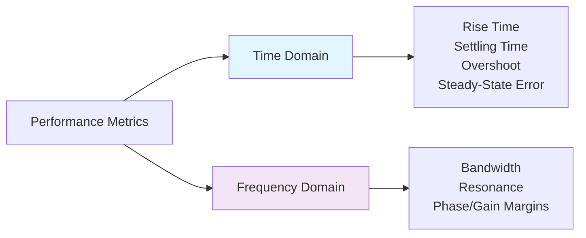
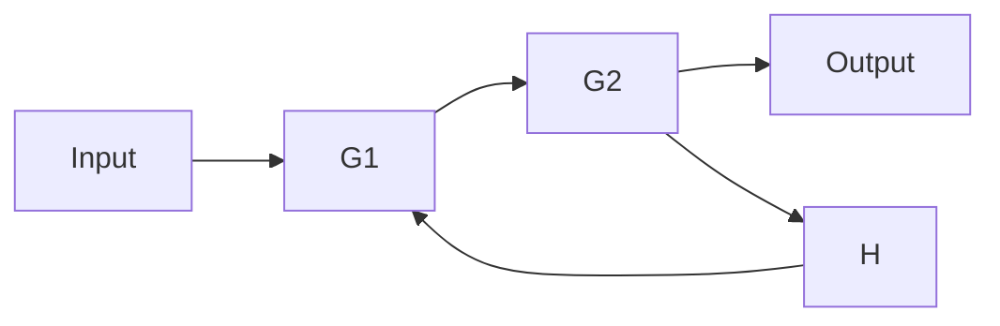
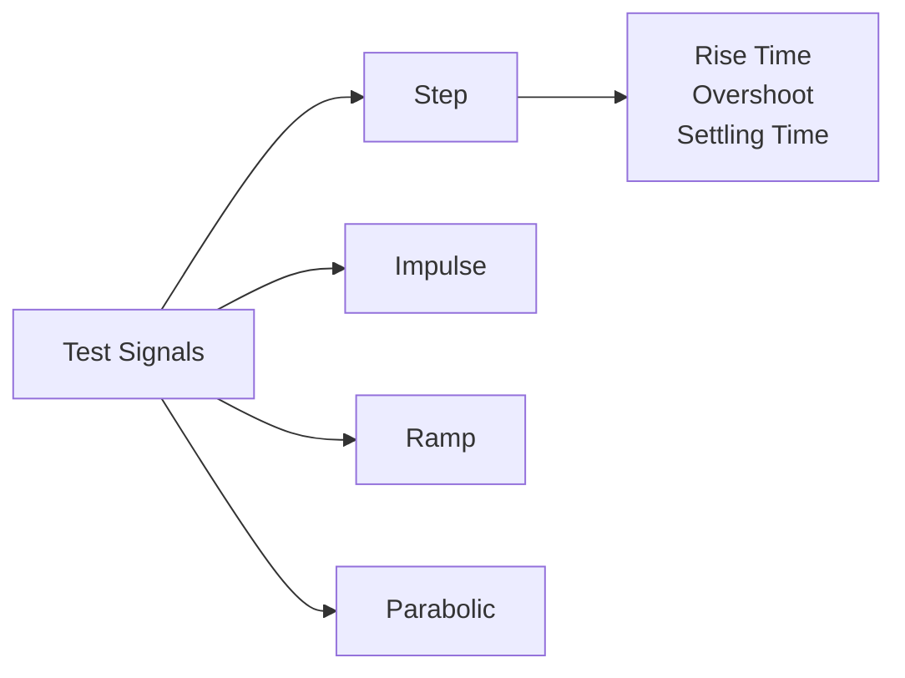
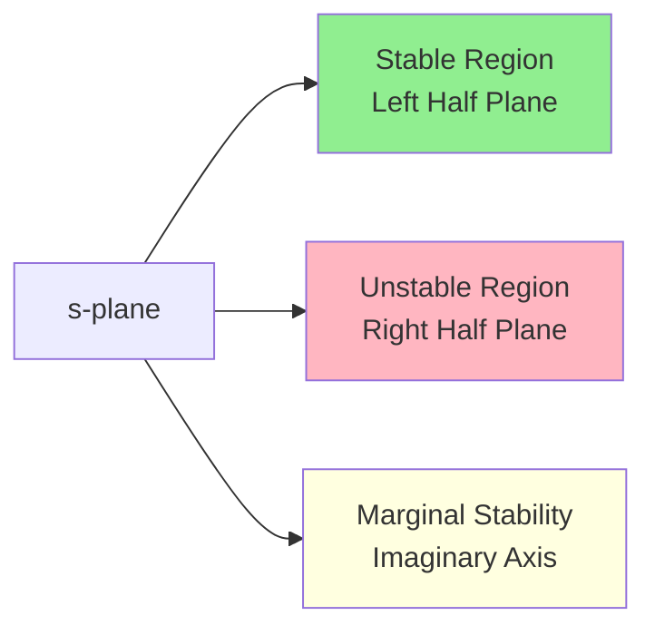
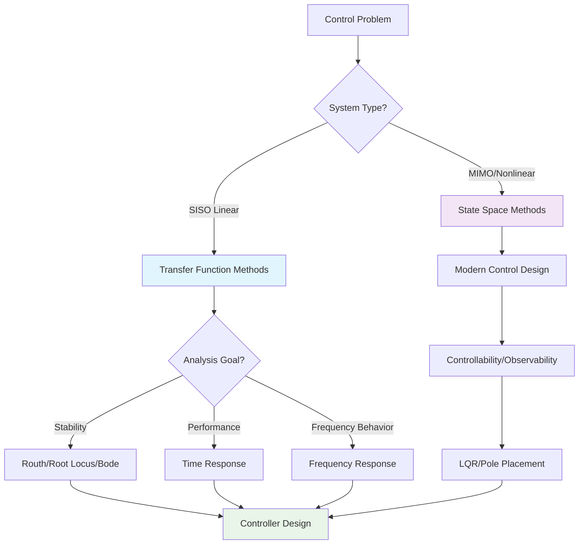
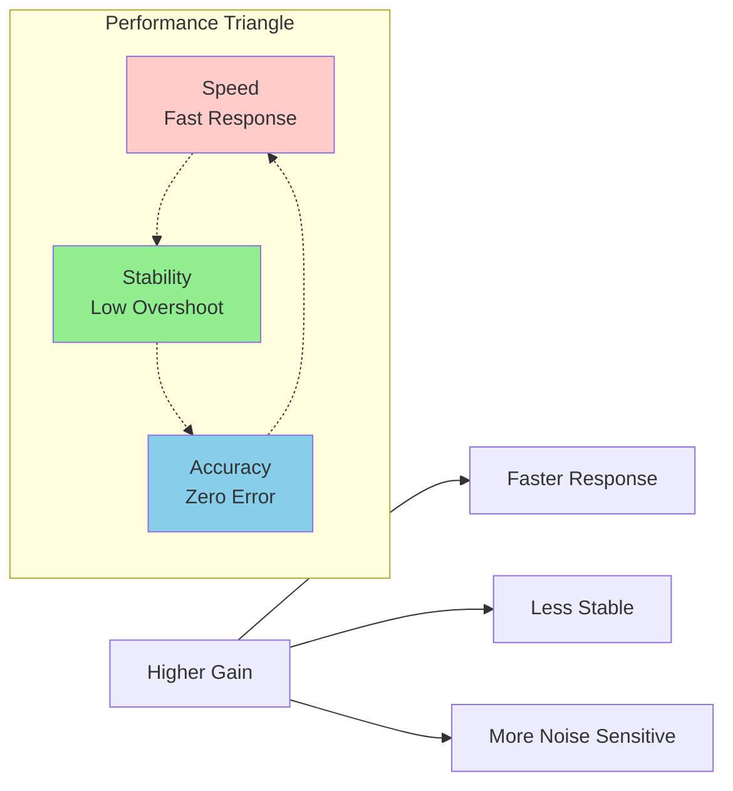
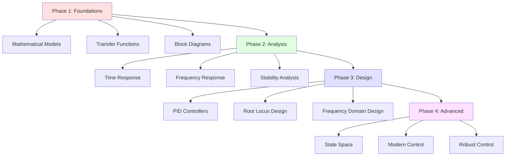

# Control Systems: Complete Learning Guide and Reference

<div align="center">

**A comprehensive guide to understanding and applying control systems concepts**

*What • When • Why • How*

</div>

---

## Course Concept Map

| Concept | Category | Primary Use Case | When to Apply | Key Benefit |
|---------|----------|------------------|---------------|-------------|
| **Introduction to Control Systems** | Foundation | Understanding open/closed loop systems | Beginning of any control problem | Fundamental system classification |
| **Transfer Functions** | Modeling | SISO system representation | Linear systems analysis | Converts differential equations to algebra |
| **Block Diagrams** | Modeling | System visualization and reduction | Any system structure analysis | Clear visual representation |
| **Signal Flow Graphs** | Modeling | Complex multi-loop systems | When block diagrams become unwieldy | Direct transfer function calculation |
| **Mathematical Models** | Modeling | First-principles system description | Physical system understanding | Most fundamental representation |
| **Time Response Analysis** | Analysis | Performance evaluation | Understanding system speed/overshoot | Direct insight into behavior |
| **Frequency Response Analysis** | Analysis | System bandwidth and filtering | Noise analysis and compensation design | Reveals frequency-dependent characteristics |
| **Routh Stability** | Analysis | Quick stability verification | Parameter bounds and stability check | No root calculation required |
| **Root Locus** | Analysis | Parameter sensitivity analysis | Gain selection and pole placement | Visual representation of pole movement |
| **PID Controllers** | Design | Industrial control applications | 95% of control problems | Best overall performance |
| **Bode Plots** | Analysis | Frequency response design | Compensator design and stability margins | Standard engineering tool |
| **Nyquist Plots** | Analysis | Advanced stability analysis | Complex systems with delays | Definitive stability information |
| **Polar Plots** | Analysis | Simple frequency visualization | Educational and basic frequency analysis | Clear magnitude/phase representation |
| **State Space Analysis** | Advanced | MIMO and modern control | Complex systems and optimal control | Complete system description |
| **Compensators** | Design | Advanced performance requirements | When PID is insufficient | Sophisticated frequency shaping |

---

## Table of Contents

1. [Essential Definitions and Primer](#essential-definitions-and-primer)
2. [System Representation Methods](#system-representation-methods)
3. [Analysis Techniques](#analysis-techniques)
4. [Design Methods](#design-methods)
5. [Practical Applications](#practical-applications)
6. [Summary and Course Strategy](#summary-and-course-strategy)

---

## Essential Definitions and Primer

### Fundamental Concepts

<details>
<summary><b>System Classifications</b></summary>

| Term | Definition | Examples | Significance |
|------|------------|----------|--------------|
| **Linear Time-Invariant (LTI)** | Systems where output is proportional to input and parameters don't change with time | RC circuits, simple temperature control | Can use all classical control tools |
| **SISO Systems** | Single-Input, Single-Output | Cruise control, thermostat | Transfer functions work well |
| **MIMO Systems** | Multiple-Input, Multiple-Output | Aircraft control, robotic arms | Require state space methods |
| **System Order** | Number of energy storage elements | 1st order: RC circuit, 2nd order: mass-spring | Determines complexity of response |
| **System Type** | Number of integrators (poles at origin) | Type 0: position control, Type 1: velocity control | Determines steady-state error behavior |

</details>

<details>
<summary><b>Mathematical Tools</b></summary>

**Transfer Function G(s)**
```
G(s) = Y(s)/U(s) = (b_n s^n + ... + b_1 s + b_0)/(a_n s^n + ... + a_1 s + a_0)
```

**Poles and Zeros**
- **Poles:** Values of s that make denominator zero → determine stability
- **Zeros:** Values of s that make numerator zero → shape response
- **Critical Rule:** All poles must be in left half-plane for stability

**State Space Representation**
```
ẋ = Ax + Bu  (state equation)
y = Cx + Du  (output equation)
```

</details>

<details>
<summary><b>Performance Metrics</b></summary>



</details>

### The Universal Control Loop

```mermaid
graph TB
    subgraph "Control System Components"
        R[Reference<br/>Input] --> E[Error<br/>Calculator]
        E --> GC[Controller<br/>Gc(s)]
        GC --> U[Control<br/>Signal]
        U --> G[Plant<br/>G(s)]
        G --> Y[Output<br/>Y(s)]
        Y --> H[Sensor<br/>H(s)]
        H --> E
    end
    
    subgraph "Feedback Loop"
        direction TB
        E2[Error = Reference - Feedback]
    end
    
    style GC fill:#90EE90
    style G fill:#FFB6C1
    style H fill:#87CEEB
```

**Key Relationships:**
- **Open-Loop Transfer Function:** OLTF = Gc(s)G(s)H(s)
- **Closed-Loop Transfer Function:** CLTF = Gc(s)G(s)/(1 + Gc(s)G(s)H(s))
- **Error Transfer Function:** E(s)/R(s) = 1/(1 + Gc(s)G(s)H(s))

---

## System Representation Methods

### Transfer Functions

<table>
<tr><th>What</th><th>When</th><th>Why</th><th>How</th></tr>
<tr>
<td>

Mathematical representation relating system output to input in the frequency domain using Laplace transforms.

**Form:** G(s) = Y(s)/U(s)

</td>
<td>

- **SISO linear systems** (90% of introductory problems)
- **Classical control design**
- **Frequency response analysis**
- **When initial conditions are zero**

</td>
<td>

- **Converts differential equations to algebra**
- **Enables powerful frequency-domain tools**
- **Well-established design techniques**
- **Industry standard for SISO systems**

</td>
<td>

1. Write system differential equation
2. Take Laplace transform (zero initial conditions)
3. Solve for G(s) = Y(s)/U(s)
4. Analyze poles (stability) and zeros (response shaping)

**Example:**
```
RC Circuit: 
d/dt(Vo) + (1/RC)Vo = (1/RC)Vin
→ G(s) = 1/(RCs + 1)
```

</td>
</tr>
</table>

### Block Diagrams

<table>
<tr><th>What</th><th>When</th><th>Why</th><th>How</th></tr>
<tr>
<td>

Graphical representation showing functional relationships between system components.



</td>
<td>

- **Visualizing system structure**
- **Teaching and communication**
- **Reducing complex systems**
- **Any system analysis phase**

</td>
<td>

- **Clear visual representation**
- **Systematic reduction methods**
- **Identifies signal paths and loops**
- **Modular design approach**

</td>
<td>

**Reduction Rules:**
- **Series:** G_total = G1 × G2
- **Parallel:** G_total = G1 + G2
- **Feedback:** G_total = G/(1 ± GH)

**Process:**
1. Identify all blocks and connections
2. Apply reduction rules systematically
3. Work from inside loops outward
4. Verify final result

</td>
</tr>
</table>

### Signal Flow Graphs

<table>
<tr><th>What</th><th>When</th><th>Why</th><th>How</th></tr>
<tr>
<td>

Directed graph representation of system equations using nodes and branches.

**Mason's Gain Formula:**
```
T = (ΣPkΔk)/Δ
```

</td>
<td>

- **Complex multi-loop systems**
- **When block diagrams become unwieldy**
- **Computer-aided analysis**
- **Systems with many feedback paths**

</td>
<td>

- **More compact than block diagrams**
- **Direct transfer function calculation**
- **Handles complex topologies efficiently**
- **Less prone to algebraic errors**

</td>
<td>

**Mason's Formula Steps:**
1. Identify all forward paths (Pk)
2. Find all individual loops
3. Determine non-touching loop combinations
4. Calculate Δ and cofactors Δk
5. Apply Mason's formula

**Key:** Practice systematic identification of paths and loops

</td>
</tr>
</table>

### Mathematical Models (Differential Equations)

<table>
<tr><th>What</th><th>When</th><th>Why</th><th>How</th></tr>
<tr>
<td>

First-principles mathematical description of system dynamics using physical laws.

**Example:**
```
Mass-Spring-Damper:
M(d²x/dt²) + B(dx/dt) + Kx = F(t)
```

</td>
<td>

- **First-principles modeling**
- **Understanding fundamental behavior**
- **Non-linear system analysis**
- **When transfer functions aren't sufficient**

</td>
<td>

- **Most fundamental representation**
- **Captures true system physics**
- **Foundation for other methods**
- **Required for non-linear systems**

</td>
<td>

**Modeling Process:**
1. **Identify system components** (masses, springs, etc.)
2. **Apply physical laws** (Newton's laws, KVL, KCL)
3. **Write governing equations**
4. **Linearize if necessary**
5. **Convert to other forms as needed**

**Key Physical Laws:**
- **Mechanical:** F = ma, F = kx, F = B(dx/dt)
- **Electrical:** KVL, KCL, V = L(di/dt), i = C(dv/dt)

</td>
</tr>
</table>

### State Space

<table>
<tr><th>What</th><th>When</th><th>Why</th><th>How</th></tr>
<tr>
<td>

Matrix-based representation describing system internal states and their evolution.

**Standard Form:**
```
ẋ = Ax + Bu
y = Cx + Du
```

</td>
<td>

- **MIMO systems**
- **Modern control design**
- **When internal states matter**
- **Non-linear/time-varying systems**
- **Computer implementation**

</td>
<td>

- **Handles any system type**
- **Complete system description**
- **Enables modern control techniques**
- **Natural for computer implementation**
- **Reveals system structure**

</td>
<td>

**Conversion Process:**
1. **Choose state variables** (energy storage elements)
2. **Write state equations** (first-order differential equations)
3. **Form matrices A, B, C, D**
4. **Verify controllability/observability**

**From Transfer Function:**
- Use controllable canonical form
- States are successive derivatives
- Controller design becomes matrix problem

</td>
</tr>
</table>

---

## Analysis Techniques

### Time Response Analysis

<table>
<tr><th>What</th><th>When</th><th>Why</th><th>How</th></tr>
<tr>
<td>

Analysis of system output behavior over time using standard test signals.



</td>
<td>

- **Evaluating system performance**
- **Comparing design alternatives**
- **Understanding transient behavior**
- **Specifications in time domain**

</td>
<td>

- **Direct insight into system behavior**
- **Standard performance metrics**
- **Easy experimental verification**
- **Relates to user experience**

</td>
<td>

**Analysis Steps:**
1. **Choose appropriate test signal**
2. **Find system response** (analytical or simulation)
3. **Measure performance parameters**
4. **Compare with specifications**

**Key Formulas (2nd Order):**
- **Rise Time:** tr ≈ (π-φ)/ωd
- **Peak Time:** tp = π/ωd  
- **Overshoot:** Mp = e^(-ζπ/√(1-ζ²))
- **Settling Time:** ts ≈ 4/(ζωn)

</td>
</tr>
</table>

### Frequency Response Analysis

<table>
<tr><th>What</th><th>When</th><th>Why</th><th>How</th></tr>
<tr>
<td>

System analysis using sinusoidal inputs at different frequencies to understand frequency-dependent behavior.

**Key Plots:**
- Bode (magnitude & phase vs frequency)
- Nyquist (polar plot)
- Nichols (gain vs phase)

</td>
<td>

- **Filter design and analysis**
- **Understanding system bandwidth**
- **Noise analysis**
- **Compensator design**
- **Experimental system identification**

</td>
<td>

- **Reveals frequency-dependent characteristics**
- **Standard industrial practice**
- **Design insight for compensation**
- **Stability margin assessment**

</td>
<td>

**Frequency Response Process:**
1. **Substitute s = jω in G(s)**
2. **Calculate |G(jω)| and ∠G(jω)**
3. **Plot magnitude and phase**
4. **Identify key frequencies** (bandwidth, resonance)
5. **Assess stability margins**

**Design Applications:**
- **Low-pass:** Noise rejection
- **High-pass:** DC rejection  
- **Band-pass:** Signal selection
- **Notch:** Specific frequency rejection

</td>
</tr>
</table>

### Stability Analysis

#### Routh-Hurwitz Criterion

<table>
<tr><th>What</th><th>When</th><th>Why</th><th>How</th></tr>
<tr>
<td>

Algebraic method to determine system stability without finding actual pole locations.

**Stability Rule:** No sign changes in first column of Routh array indicates stability.

</td>
<td>

- **Quick stability verification**
- **Finding parameter bounds**
- **Hand calculations**
- **Educational purposes**

</td>
<td>

- **No root calculation required**
- **Direct parameter bounds**
- **Quick and systematic**
- **Works for any order system**

</td>
<td>

**Routh Array Construction:**
1. **Form characteristic equation:** a₀sⁿ + a₁sⁿ⁻¹ + ... = 0
2. **Fill first two rows** with coefficients
3. **Calculate remaining rows:** 
   ```
   Element = (a₁×a₂ - a₀×a₃)/a₁
   ```
4. **Check first column for sign changes**
5. **Number of sign changes = number of RHP poles**

**Special Cases:**
- Zero in first column → replace with ε
- Entire row of zeros → use auxiliary equation

</td>
</tr>
</table>

#### Root Locus

<table>
<tr><th>What</th><th>When</th><th>Why</th><th>How</th></tr>
<tr>
<td>

Graphical method showing how closed-loop pole locations change as a parameter (usually gain K) varies.



</td>
<td>

- **Parameter sensitivity analysis**
- **Gain selection for performance**
- **Visualizing stability boundaries**
- **Understanding pole-zero effects**

</td>
<td>

- **Visual representation of system behavior**
- **Direct relationship to performance**
- **Systematic gain selection**
- **Insight into parameter effects**

</td>
<td>

**Root Locus Rules:**
1. **Number of branches** = max(poles, zeros)
2. **Asymptotes:** (2k+1)π/(P-Z), k = 0,1,2...
3. **Centroid:** (Σpoles - Σzeros)/(P-Z)
4. **Breakaway points:** solve dK/ds = 0
5. **Departure angles:** θd = 180° - [Σθp - Σθz]

**Design Process:**
1. Plot root locus
2. Find desired pole locations
3. Determine required gain K
4. Verify performance specifications

</td>
</tr>
</table>

#### Frequency Domain Stability

<table>
<tr><th>What</th><th>When</th><th>Why</th><th>How</th></tr>
<tr>
<td>

Stability analysis using frequency response plots (Bode, Nyquist) to determine stability margins.

**Nyquist Criterion:** For stability, Nyquist plot should not encircle (-1,0) point.

</td>
<td>

- **Complex systems with delays**
- **Experimental data available**
- **Robust stability analysis**
- **Compensator design**

</td>
<td>

- **Works with experimental data**
- **Handles complex systems including delays**
- **Provides stability margins**
- **Design insight for compensation**

</td>
<td>

**Bode Plot Analysis:**
1. **Plot magnitude and phase**
2. **Find gain crossover frequency** (|G|=1)
3. **Find phase crossover frequency** (∠G=-180°)
4. **Calculate margins:**
   - **Gain Margin:** GM = 1/|G| at phase crossover
   - **Phase Margin:** PM = 180° + ∠G at gain crossover

**Design Guidelines:**
- **GM > 6 dB, PM > 45°** for robust stability
- **Higher margins** = more robust but slower response

</td>
</tr>
</table>

---

## Design Methods

### PID Controllers

#### Proportional (P) Controller

<table>
<tr><th>What</th><th>When</th><th>Why</th><th>How</th></tr>
<tr>
<td>

Controller output proportional to error signal.

**Form:** Gc(s) = Kp

**Time Domain:** u(t) = Kp × e(t)

</td>
<td>

- **Simple systems needing fast response**
- **When steady-state error acceptable**
- **First controller to try**
- **Systems where integral action destabilizes**

</td>
<td>

- **Simplest implementation**
- **Fast response**
- **No integrator windup**
- **Most stable of PID family**

</td>
<td>

**Design Process:**
1. **Start with low Kp**
2. **Increase until satisfactory speed**
3. **Monitor stability and overshoot**
4. **Accept steady-state error trade-off**

**Effects of Increasing Kp:**
- ✅ Faster rise time
- ✅ Reduced steady-state error  
- ❌ Higher overshoot
- ❌ Potential instability

</td>
</tr>
</table>

#### Integral (I) Controller

<table>
<tr><th>What</th><th>When</th><th>Why</th><th>How</th></tr>
<tr>
<td>

Controller output proportional to integral of error signal.

**Form:** Gc(s) = Ki/s

**Time Domain:** u(t) = Ki∫e(t)dt

</td>
<td>

- **Zero steady-state error required**
- **Slow processes**
- **Constant disturbance rejection**
- **When noise is not critical**

</td>
<td>

- **Eliminates steady-state error completely**
- **Rejects constant disturbances**
- **Increases system type by 1**
- **Essential for many industrial processes**

</td>
<td>

**Design Considerations:**
1. **Adds pole at origin** (increases system type)
2. **Can destabilize system** (reduces phase margin)
3. **Prone to integrator windup** in saturation
4. **Start with small Ki, increase gradually**

**Implementation Tips:**
- **Anti-windup schemes** for actuator saturation
- **Integral kick prevention** on setpoint changes
- **Conditional integration** to prevent windup

</td>
</tr>
</table>

#### Derivative (D) Controller

<table>
<tr><th>What</th><th>When</th><th>Why</th><th>How</th></tr>
<tr>
<td>

Controller output proportional to derivative of error signal.

**Form:** Gc(s) = Kd×s

**Time Domain:** u(t) = Kd×de(t)/dt

</td>
<td>

- **Reducing overshoot**
- **Improving stability**
- **Faster settling required**
- **Low noise environments**

</td>
<td>

- **Anticipatory action**
- **Improves stability (adds phase lead)**
- **Reduces overshoot**
- **Faster settling time**

</td>
<td>

**Implementation Challenges:**
1. **Amplifies high-frequency noise**
2. **Never used alone** (no DC gain)
3. **Often implemented as:** Kd×s/(τs+1)
4. **Requires noise filtering**

**Design Process:**
1. **Start with small Kd**
2. **Increase until satisfactory damping**
3. **Monitor noise amplification**
4. **Add low-pass filter if needed**

</td>
</tr>
</table>

#### PID Controller

<table>
<tr><th>What</th><th>When</th><th>Why</th><th>How</th></tr>
<tr>
<td>

Combination of proportional, integral, and derivative actions.

**Form:** Gc(s) = Kp + Ki/s + Kd×s

**Benefits:** Speed + Accuracy + Stability

</td>
<td>

- **Demanding performance requirements**
- **Industrial control applications**
- **When optimal performance needed**
- **Systems requiring all three actions**

</td>
<td>

- **Best overall performance**
- **Industry standard (95% of applications)**
- **Combines all advantages of P, I, D**
- **Extensive tuning methods available**

</td>
<td>

**Tuning Methods:**

**Ziegler-Nichols (Closed-Loop):**
1. Set Ki=0, Kd=0
2. Increase Kp until oscillation (Ku, Tu)
3. Apply ZN formulas:
   - Kp = 0.6×Ku
   - Ki = 2×Kp/Tu  
   - Kd = Kp×Tu/8

**Manual Tuning Process:**
1. **Start with P-only**, tune for speed
2. **Add I** to eliminate steady-state error
3. **Add D** to improve stability/reduce overshoot
4. **Fine-tune** for optimal performance

</td>
</tr>
</table>

### Advanced Controllers

<table>
<tr><th>What</th><th>When</th><th>Why</th><th>How</th></tr>
<tr>
<td>

**Lead/Lag Compensators**
- Lead: Gc(s) = (s+z)/(s+p), p>z
- Lag: Gc(s) = (s+z)/(s+p), z>p  
- Lead-Lag: Combination of both

**State Feedback**
- u = -Kx (pole placement)
- Requires all states measurable

</td>
<td>

**Lead Compensators:**
- Improve transient response
- Increase phase margin
- When system too slow/unstable

**Lag Compensators:**
- Improve steady-state accuracy
- When low-frequency performance needed

**State Feedback:**
- MIMO systems
- Optimal performance required

</td>
<td>

**Lead:**
- Adds phase lead (improves stability)
- Increases bandwidth (faster response)

**Lag:**
- Improves low-frequency gain
- Minimal effect on transient response

**State Feedback:**
- Place poles anywhere desired
- Optimal control possible

</td>
<td>

**Lead Compensator Design:**
1. **Determine required phase lead**
2. **Select α and T parameters**
3. **Place compensator appropriately**
4. **Verify specifications met**

**Lag Compensator Design:**
1. **Determine required DC gain**
2. **Choose lag parameters**
3. **Ensure minimal transient effect**

**State Feedback Design:**
1. **Check controllability**
2. **Select desired pole locations**
3. **Calculate feedback gains**
4. **Add observer if needed**

</td>
</tr>
</table>

---

## Practical Applications

### System Selection Guide



### Industry Applications

| Industry | Common Systems | Preferred Methods | Key Requirements |
|----------|----------------|-------------------|------------------|
| **Process Control** | Temperature, Pressure, Flow | PI/PID Controllers | Zero steady-state error, robustness |
| **Automotive** | Engine, Transmission, Suspension | PID + Modern Control | Performance, fuel efficiency, safety |
| **Aerospace** | Flight Control, Navigation | State Space, Modern Control | High performance, reliability, MIMO |
| **Manufacturing** | Motor Control, Robotics | PID, State Feedback | Precision, repeatability, speed |
| **Power Systems** | Generators, Grid Control | Classical + Modern | Stability, power quality, grid codes |
| **Biomedical** | Drug Delivery, Prosthetics | Adaptive, Robust Control | Safety, patient variability, regulations |

### Problem-Solving Framework

<table>
<tr><th>Problem Type</th><th>Approach</th><th>Tools</th><th>Verification</th></tr>
<tr>
<td><b>"Is this system stable?"</b></td>
<td>

1. Find characteristic equation
2. Apply stability test
3. Check parameter sensitivity

</td>
<td>

- Routh-Hurwitz (quick check)
- Root Locus (parameter effects)  
- Bode plots (margins)

</td>
<td>

- All poles in LHP
- Adequate stability margins
- Parameter robustness

</td>
</tr>
<tr>
<td><b>"Design controller for specifications"</b></td>
<td>

1. Analyze current performance
2. Identify limitations
3. Select controller type
4. Tune parameters

</td>
<td>

- Time response analysis
- Root locus design
- Frequency domain design
- Simulation verification

</td>
<td>

- Meet all specifications
- Robust to uncertainties
- Practical implementation

</td>
</tr>
<tr>
<td><b>"Why is system oscillating?"</b></td>
<td>

1. Check damping ratio
2. Identify resonance
3. Examine stability margins
4. Look for nonlinearities

</td>
<td>

- Time response plots
- Bode magnitude plots
- Nyquist plots
- Describing functions

</td>
<td>

- Adequate damping (ζ > 0.4)
- No resonance peaks
- Sufficient phase margin
- Consider nonlinear effects

</td>
</tr>
</table>

### Common Design Trade-offs



**Key Insights:**
- **Increasing gain:** Faster response but less stable
- **Adding integral action:** Zero steady-state error but potential instability
- **Adding derivative action:** Better stability but noise amplification
- **Higher bandwidth:** Faster response but more noise sensitivity

---

## Summary and Course Strategy

### Concept Hierarchy and Learning Path



### Essential Formulas Reference

<details>
<summary><b>Time Domain</b></summary>

| Parameter | Formula | Notes |
|-----------|---------|-------|
| **2nd Order Standard Form** | G(s) = ωₙ²/(s² + 2ζωₙs + ωₙ²) | ωₙ = natural frequency, ζ = damping ratio |
| **Rise Time** | tr ≈ (π-φ)/ωd | φ = tan⁻¹(√(1-ζ²)/ζ), ωd = ωₙ√(1-ζ²) |
| **Peak Time** | tp = π/ωd | Time to first peak |
| **Overshoot** | Mp = e^(-ζπ/√(1-ζ²)) | Percentage overshoot |
| **Settling Time** | ts ≈ 4/(ζωₙ) | 2% criterion |

</details>

<details>
<summary><b>Frequency Domain</b></summary>

| Parameter | Formula | Notes |
|-----------|---------|-------|
| **Resonant Frequency** | ωr = ωₙ√(1-2ζ²) | Valid for ζ < 0.707 |
| **Resonant Peak** | Mr = 1/(2ζ√(1-ζ²)) | Peak magnitude |
| **Bandwidth** | ωb = ωₙ√[(1-2ζ²) + √(4ζ⁴-4ζ²+2)] | -3dB bandwidth |
| **Gain Margin** | GM = 1/|G(jωpc)| | At phase crossover |
| **Phase Margin** | PM = 180° + ∠G(jωgc) | At gain crossover |

</details>

<details>
<summary><b>Controller Design</b></summary>

| Controller | Transfer Function | Key Characteristics |
|------------|-------------------|-------------------|
| **P** | Kp | Fast response, steady-state error |
| **PI** | Kp + Ki/s | Zero steady-state error, slower |
| **PD** | Kp + Kd×s | Good stability, noise sensitive |
| **PID** | Kp + Ki/s + Kd×s | Optimal performance, complex tuning |
| **Lead** | K(s+z)/(s+p), p>z | Phase lead, improved stability |
| **Lag** | K(s+z)/(s+p), z>p | Improved accuracy, slower response |

</details>

### Course Success Strategy

#### Master the Fundamentals
1. **Understand physical meaning** behind every mathematical concept
2. **Practice block diagram reduction** until automatic
3. **Recognize standard second-order patterns** (most important system type)
4. **Connect time and frequency domain** concepts

#### Build Analysis Skills
1. **Time response:** Connect math to physical behavior
2. **Frequency response:** Understand filtering and bandwidth concepts  
3. **Stability analysis:** Master multiple approaches (Routh, Root Locus, Frequency)
4. **Practice systematic problem-solving**

#### Develop Design Intuition
1. **Start simple:** P controller first, add complexity as needed
2. **Understand trade-offs:** Speed vs stability vs accuracy
3. **Use simulation:** Verify designs before claiming success
4. **Think practically:** Real systems have limitations

#### Problem-Solving Approach
1. **Identify system type** and choose appropriate tools
2. **Draw block diagrams** to visualize signal flow
3. **Apply systematic methods** rather than guess-and-check
4. **Verify results** make physical sense
5. **Check units** and parameter reasonableness

### Key Success Principles

> **"Control systems engineering is about making systems behave the way you want them to, despite disturbances and uncertainties. Mathematics serves this goal—it's not an end in itself."**

**Remember:**
- **Simple solutions** are usually better than complex ones
- **Stability** must be ensured before optimizing performance  
- **Simulation** is powerful but not perfect—reality has constraints
- **Every equation** represents a physical phenomenon
- **Trade-offs** are inevitable—perfect control doesn't exist

**Final Insight:** The art of control systems engineering lies in knowing which tool to use when, understanding the trade-offs involved, and designing systems that work reliably in the real world.