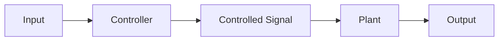
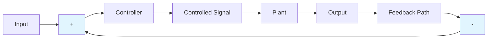
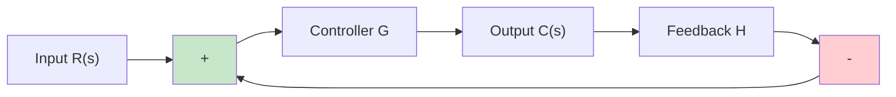
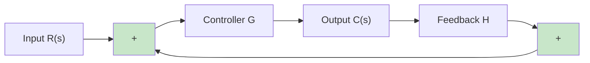

# Control Systems Overview

## Open Loop System

### Block Diagram



An open loop system operates without feedback, meaning the controller generates a controlled signal based solely on the input information. The control action is completely independent of the output, making the controlled signal (also known as the manipulated signal) operate in a "fire and forget" manner.

### Applications
- Volume control of audio systems
- Hair dryer temperature settings
- Door lock systems
- Washing machine cycles

### Advantages
- **Simplicity** - Easy to design and implement
- **Cost effective** - Lower implementation costs
- **Convenient** when output is difficult to measure
- **Mostly stable** - Inherently stable operation
- **Fast response** - No delays from feedback processing

### Disadvantages
- **Inaccurate** - No correction for errors
- **Unreliable** - Performance varies with conditions
- **No automatic error correction** - Cannot self-adjust
- **Sensitive to disturbances** - External factors affect performance
- **Not suitable for complex systems** - Limited precision requirements

---

## Closed Loop System

### Block Diagram



A closed loop system incorporates feedback from the output, allowing the control action to depend on both the input and output signals. This feedback mechanism enables the system to automatically correct errors and maintain more accurate output.

### Applications
- Air conditioning systems
- Water level controllers
- Temperature control systems
- Speed control systems

### Advantages
- **Accurate** even with non-linearities or system errors
- **Large bandwidth** - Better frequency response
- **Facilitates automation** - Self-regulating capability
- **Less sensitive to disturbances** - Rejects external interference
- **Less affected by noise** - Feedback helps filter disturbances
- **Adaptable** - Can adjust to changing conditions

### Disadvantages
- **Costly and complex** - More components and design complexity
- **May become unstable** - Feedback can cause instability
- **Reduced gain** - Feedback reduces overall system gain
- **Higher maintenance** - More components to maintain
- **Slower response** - Feedback processing adds delay
- **Potential oscillations** - Can exhibit unwanted oscillatory behavior

---

## Comparison of Open and Closed Loop Systems

| Parameter | Open Loop | Closed Loop |
|-----------|-----------|-------------|
| **Feedback** | Not Available | Available |
| **Error Detector** | Not Available | Available |
| **Accuracy** | Less | High |
| **Sensitivity** | More | Less |
| **Bandwidth** | Less | Large |
| **Stability** | Mostly Stable | May become unstable |
| **Cost** | Less | More |
| **Maintenance** | Easy and Cheap | Complex and Costly |
| **Speed** | Fast | Slow |
| **Oscillation** | Rare | Possible |

---

## Feedback Types

### Negative Feedback



**Mathematical Relations:**
- Error: `E(s) = R(s) - F(s)`
- Feedback: `F(s) = H × C(s)`
- Output: `C(s) = G × E(s)`
- Transfer Function: `T(s) = C(s)/R(s) = G/(1 + GH)`

**Applications:**
- Gain stabilization in amplifiers
- Analog-to-Digital Converters (ADC)
- Digital-to-Analog Converters (DAC)
- Voltage regulators

### Positive Feedback



**Mathematical Relations:**
- Error: `E(s) = R(s) + F(s)`
- Transfer Function: `T(s) = G/(1 - GH)`

**Applications:**
- Oscillator circuits
- Timing circuits
- Signal generators
- Memory circuits

---

## Effects of Feedback

### Effect on Gain

The transfer function for a negative feedback system is:

```
T(s) = G/(1 + GH)
```

As the feedback factor **H** increases, the overall system gain **T** decreases. This trade-off between gain and other system properties is fundamental in feedback control.

### Effect on Sensitivity

System sensitivity to parameter variations is given by:

```
S = 1/(1 + GH)
```

As **H** increases, sensitivity **S** decreases, making the system more robust to component variations and external disturbances.

### Effect on Stability

A feedback system becomes unstable when:

```
H = -1/G
```

This condition, known as the Barkhausen criterion, defines the boundary between stable and unstable operation. Proper design ensures the system operates well within stable margins.

---

*Source: Engineering Funda*