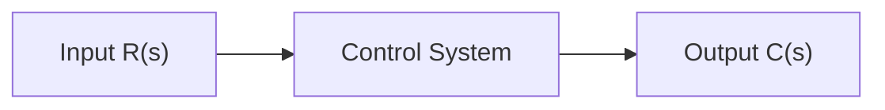
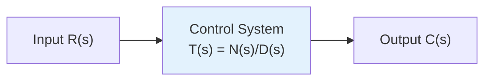
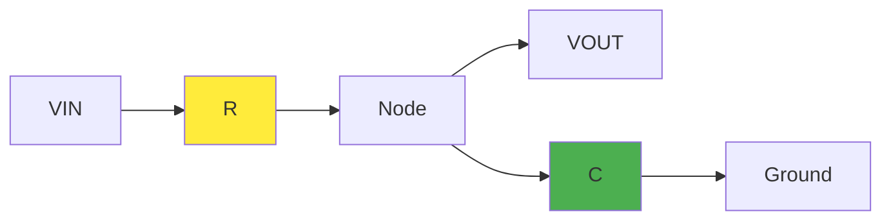
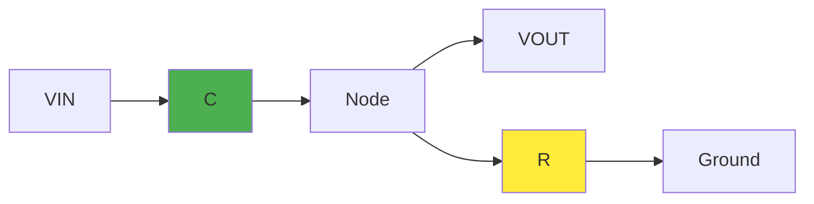
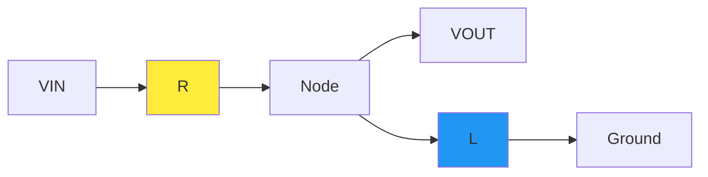
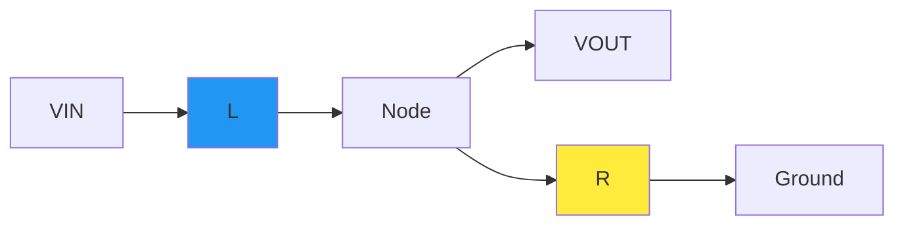
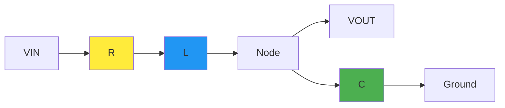
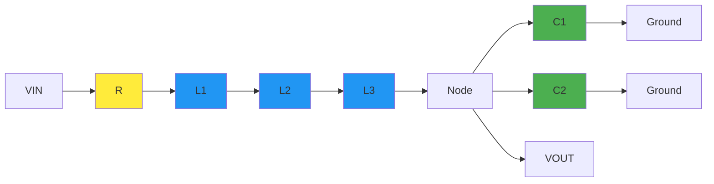
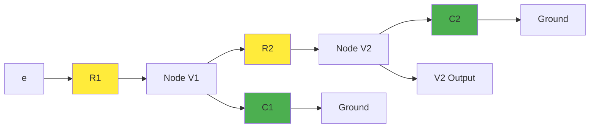

# Transfer Function Guide

## Table of Contents
- [Basics of Transfer Function](#basics-of-transfer-function)
- [Types of Transfer Function](#types-of-transfer-function)
- [Properties of Transfer Function](#properties-of-transfer-function)
- [Advantages of Transfer Function](#advantages-of-transfer-function)
- [Disadvantages of Transfer Function](#disadvantages-of-transfer-function)
- [Transfer Function from Differential Equations](#transfer-function-from-differential-equations)
- [Transfer Function of RC Circuits](#transfer-function-of-rc-circuits)
- [Transfer Function of RL Circuits](#transfer-function-of-rl-circuits)
- [Transfer Function of RLC Circuits](#transfer-function-of-rlc-circuits)
- [Transfer Function of Electrical Networks](#transfer-function-of-electrical-networks)

---

## Basics of Transfer Function

A transfer function gives the relationship between the input and output of a system in the frequency domain.



**Mathematical Definition:**
```
T(s) = C(s)/R(s) = N(s)/D(s)
```

Where:
- **T(s)** = Transfer Function
- **C(s)** = Laplace Transform of Output
- **R(s)** = Laplace Transform of Input
- **N(s)** = Numerator polynomial
- **D(s)** = Denominator polynomial

**Key Points:**
- The roots of **N(s)** give the **zeros** of the system
- The roots of **D(s)** give the **poles** of the system
- Transfer functions are represented in the frequency domain using:
  - **Laplace Transforms** (for continuous-time systems)
  - **Z Transforms** (for discrete-time systems)

---

## Types of Transfer Function

### Proper Transfer Function
- **Condition:** Number of Poles > Number of Zeros
- **Mathematical:** Order of D(s) > Order of N(s)
- Most physical systems are proper transfer functions

### Improper Transfer Function
- **Condition:** Number of Poles < Number of Zeros
- **Mathematical:** Order of D(s) < Order of N(s)
- These systems are generally not physically realizable



---

## Properties of Transfer Function

### Fundamental Properties

1. **Impulse Response Relationship**
   - The transfer function of a system is the Laplace transform of its impulse response for zero initial conditions

2. **Input-Output Determination**
   - Can be determined from input-output pairs by taking the ratio of Laplace output to Laplace input

3. **Input Independence**
   - Practically, the transfer function is independent of the inputs to the system

4. **System Limitations**
   - Can only be defined for **LTI (Linear Time Invariant)** systems
   - For non-linear systems, the response changes with respect to time

5. **System Analysis Capabilities**
   - Poles and zeros of the system can be identified
   - System characteristics and stability can be determined

---

## Advantages of Transfer Function

- **Mathematical Model**: Provides a comprehensive mathematical representation of system gain
- **Simplified Analysis**: Converts integral and differential equations to simple algebraic equations
- **Output Prediction**: Enables identification of system output for any given inputs
- **System-Dependent**: Independent of input signals, depends only on system characteristics
- **Comprehensive Analysis**: Allows identification of poles, zeros, stability, and system characteristics

## Disadvantages of Transfer Function

- **Limited Scope**: Only valid for LTI (Linear Time Invariant) systems
- **Initial Conditions**: Doesn't account for initial conditions in the analysis
- **Transient Information**: Doesn't provide insight into how the present output is progressing over time

---

## Transfer Function from Differential Equations

### Example 1: Second-Order System

**Given Differential Equation:**
```
d²y/dt² + dy/dt + y = 6x
```

Where x is input and y is output.

**Solution Steps:**

1. **Apply Laplace Transform:**
   ```
   [s²Y(s) - sy(0) - y'(0)] + [sY(s) - y(0)] + Y(s) = 6X(s)
   ```

2. **Apply Zero Initial Conditions:**
   ```
   Y(s)[s² + s + 1] = 6X(s)
   ```

3. **Transfer Function:**
   ```
   T(s) = Y(s)/X(s) = 6/(s² + s + 1)
   ```

### Example 2: System with Initial Conditions

**Given:**
- Y'' = 5, Y(0) = 1, Y'(0) = 2
- X' = e^(-t), X(0) = 0

**Solution:**

1. **For Output:** Y(s) = (5 + 2s + s²)/s²
2. **For Input:** X(s) = 1/(s(s+1))
3. **Transfer Function:** T(s) = (s+1)(s² + 2s + 5)/s²

---

## Transfer Function of RC Circuits

### Low Pass Filter (LPF) - RC Circuit



**Circuit Analysis:**
- **Zero Initial Conditions:** t = 0, Vc = 0
- **Capacitor Impedance:** XC = 1/(sC)

**Using Voltage Divider Rule:**
```
VO(s) = VIN(s) × [1/(sC)] / [R + 1/(sC)]

T(s) = VO(s)/VIN(s) = 1/(1 + RsC)
```

**Frequency Response:**
- At low frequencies (ω → 0): XC = high, VO → VIN (passes)
- At high frequencies (ω → ∞): XC = low, VO → 0 (blocks)

### High Pass Filter (HPF) - RC Circuit



**Using Voltage Divider Rule:**
```
VO(s) = VIN(s) × R / [R + 1/(sC)]

T(s) = VO(s)/VIN(s) = RsC/(1 + RsC)
```

**Frequency Response:**
- At low frequencies (ω → 0): XC = high, VO → 0 (blocks)
- At high frequencies (ω → ∞): XC = low, VO → VIN (passes)

---

## Transfer Function of RL Circuits

### High Pass Filter (HPF) - RL Circuit



**Circuit Analysis:**
- **Zero Initial Conditions:** t = 0, IL = 0
- **Inductor Impedance:** XL = sL

**Using Voltage Divider Rule:**
```
VO(s) = VIN(s) × sL / (R + sL)

T(s) = VO(s)/VIN(s) = sL/(R + sL)
```

### Low Pass Filter (LPF) - RL Circuit



**Using Voltage Divider Rule:**
```
VO(s) = VIN(s) × R / (R + sL)

T(s) = VO(s)/VIN(s) = R/(R + sL)
```

**Frequency Response:**
- At low frequencies (ω → 0): XL = low, VIN → VO (passes)
- At high frequencies (ω → ∞): XL = high, VO → 0 (blocks)

---

## Transfer Function of RLC Circuits

### RLC Circuit Analysis



**Circuit Parameters:**
- **Zero Initial Conditions:** t = 0, VC = 0, IL = 0
- **Components in s-domain:**
  - Resistor: R
  - Inductor: sL
  - Capacitor: 1/(sC)

**Using Voltage Divider Rule:**
```
VO(s) = VIN(s) × [1/(sC)] / [R + sL + 1/(sC)]

T(s) = VO(s)/VIN(s) = 1/(LCs² + RCs + 1)
```

**System Order:**
- The s² term indicates this is a **second-order system**
- The circuit can store energy in two reactive elements (L and C)

### Determining Circuit Order

For the complex circuit with multiple components:



**Effective Components:**
- **LEQ = L1 + L2 + L3** (inductors in series)
- **CEQ = C1 + C2** (capacitors in parallel)

**Transfer Function:**
```
T(s) = VO(s)/VIN(s) = 1/(LEQCEQs² + RCEQs + 1)
```

**System Order = 2** (highest power of s in denominator)

---

## Transfer Function of Electrical Networks

### Complex Network Analysis



**Network Analysis using KCL:**

**At Node V1:**
```
I1 + I2 + I3 = 0
(V1 - e)/R1 + V1/(1/sC1) + (V1 - V2)/R2 = 0
```

**At Node V2:**
```
I3 + I4 = 0
(V1 - V2)/R2 + (-V2)/(1/sC2) = 0
```

**Solving the System:**

From the equations:
```
V1 = V2[1 + sC2R2]                    ... (1)
```

Substituting and solving:
```
V1[R1 + R2 + sC1R1R2] = eR2 + V2R1   ... (2)
```

**Final Transfer Function:**
```
T(s) = V2/e = R2/[(1 + sC2R2)(R1 + R2 + sC1R1R2) - R2]
```

This represents a second-order system due to the two capacitors in the network.

---

*Source: Engineering Funda*