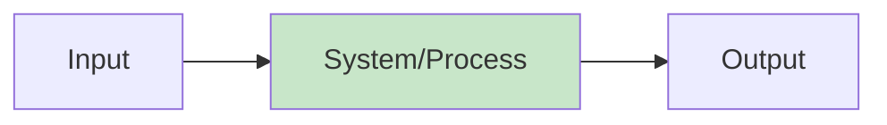
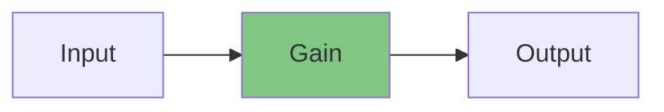
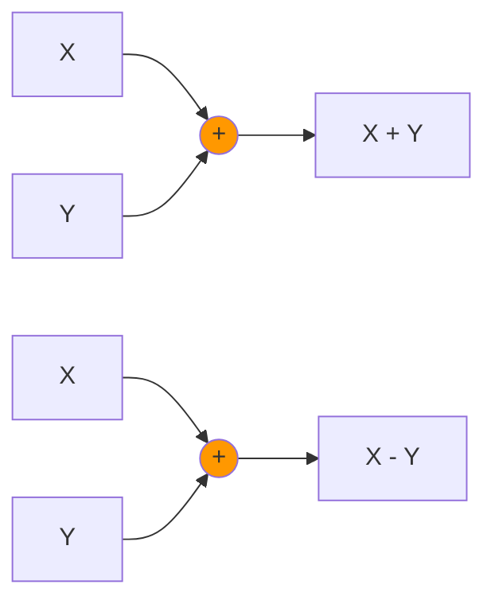
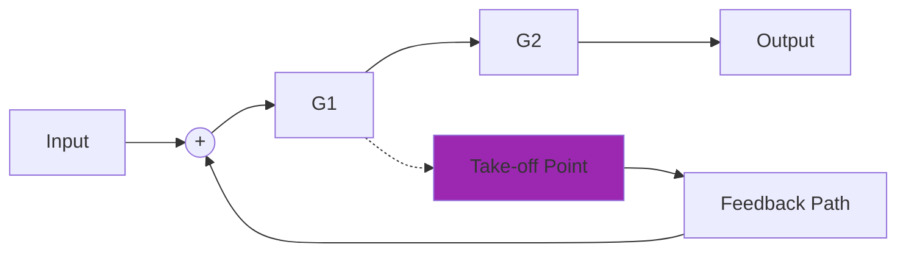
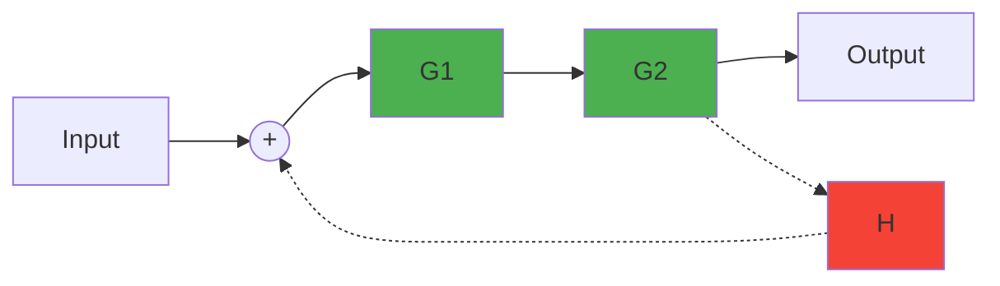
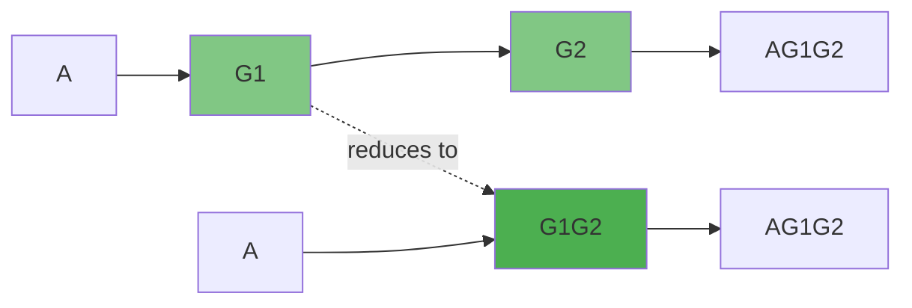
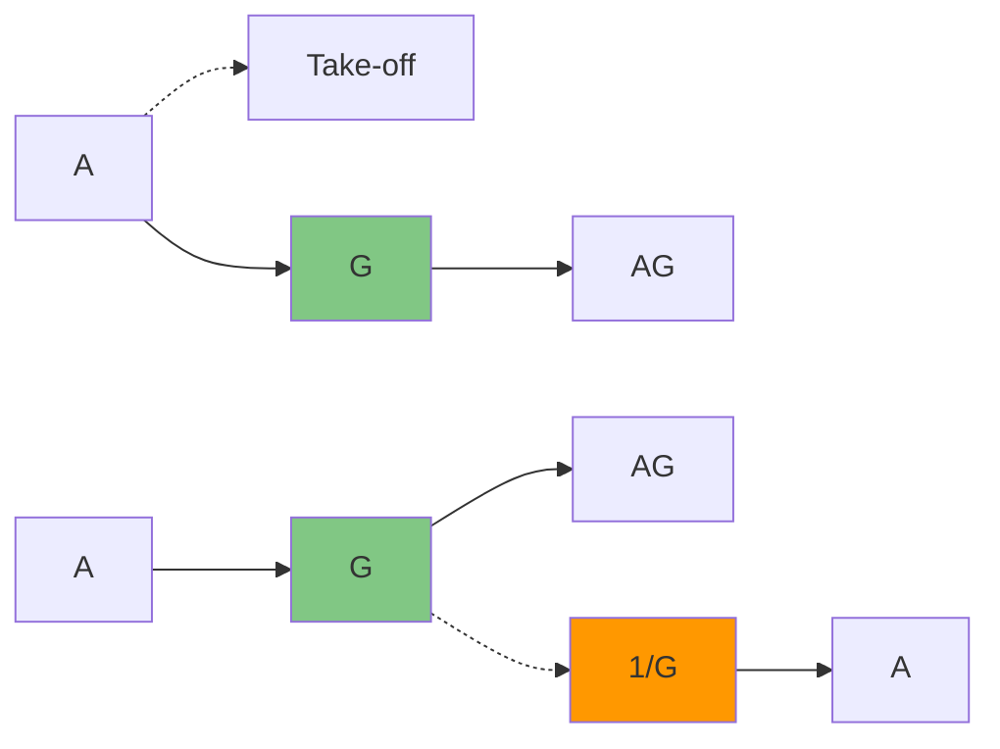
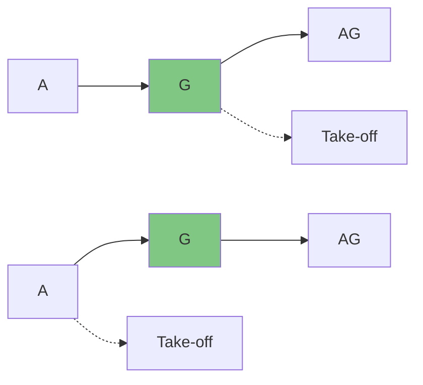
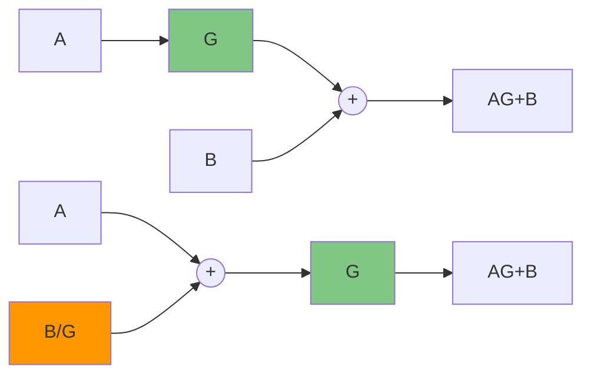

# Block Diagram Guide

## Table of Contents
- [Basics of Block Diagram](#basics-of-block-diagram)
- [Terms of Block Diagram](#terms-of-block-diagram)
- [Applications of Block Diagram](#applications-of-block-diagram)
- [Advantages and Disadvantages](#advantages-and-disadvantages)
- [Block Diagram Reduction Rules](#block-diagram-reduction-rules)
- [Block Diagram Reduction Examples](#block-diagram-reduction-examples)

---

## Basics of Block Diagram

A block diagram is a pictorial representation that shows the functional relationships between different components of a system in a simplified graphical format.



### Key Characteristics

- **Pictorial representation** of the entire system
- **Shows relationships** between input and output of the entire system
- **Simplifies complex systems** by connecting different functional blocks
- **Explains interrelationships** that exist among various components
- **Represents transfer functions** of subsystems present in control systems
- **Lines connecting blocks** are called **branches**
- **Arrows on branches** indicate the **direction of signal flow**

---

## Terms of Block Diagram

### Basic Output Relationship



**Mathematical Relationship:**
```
Output = Gain × Input
```

### Summing Point

A summing point allows multiple signals to be added or subtracted at a single junction.



- **Addition:** Signals entering with **+** are added
- **Subtraction:** Signals entering with **-** are subtracted

### Take-off Point

The point from which a signal is taken for any use without affecting the main signal flow.



### Forward Path and Feedback Path



- **Forward Path:** The signal path from input to output (shown in green)
- **Feedback Path:** The signal path from output back to input (shown in red)

---

## Applications of Block Diagram

Block diagrams are widely used across various engineering and design disciplines:

- **Hardware Design** - Circuit design and component relationships
- **Electric System Design** - Power systems and electrical networks
- **Software Design** - Program flow and module interactions
- **Process Flow Diagram** - Manufacturing and industrial processes
- **PLC SCADA Systems** - Industrial automation and control systems

---

## Advantages and Disadvantages

### Advantages

- **System Operation Understanding** - Functional operation can be observed clearly
- **Performance Information** - Provides insights into system performance characteristics
- **Analysis and Design Tool** - Used for analyzing and designing control systems
- **System Decomposition** - Breaks complicated systems into manageable subsystems

### Disadvantages

- **Non-Unique Representation** - Block diagrams for any system are not unique
- **No Energy Source Information** - Doesn't show the source of energy in the system
- **Function Loss in Reduction** - Important functions may be hidden during diagram reduction
- **No Physical Construction Details** - Doesn't provide information about physical system construction

---

## Block Diagram Reduction Rules

### Priority Order for Reduction

1. **Priority 1:** Check for series and parallel connections and place equivalents
2. **Priority 2:** Check for negative or positive feedback loops
3. **Priority 3:** Forward/Backward summing point manipulations
4. **Priority 3:** Forward/Backward branch point manipulations
5. **Priority 3:** Interchange summing points
6. **Priority 3:** Split summing points

### Basic Reduction Rules

#### 1. Blocks in Series



**Rule:** `G_total = G1 × G2`

#### 2. Blocks in Parallel

```mermaid
graph TB
    A[A] --> B[G1]
    A --> C[G2]
    B --> D((+))
    C --> D
    D --> E[A(G1+G2)]
    
    A2[A] --> F[G1 + G2]
    F --> G[A(G1+G2)]
    
    style B fill:#81c784
    style C fill:#81c784
    style F fill:#4caf50
```

**Rule:** `G_total = G1 + G2`

#### 3. Negative Feedback

```mermaid
graph LR
    A[Input] --> B((+))
    B --> C[G]
    C --> D[Output]
    C --> E[H]
    E --> F((−))
    F --> B
    
    A2[Input] --> G2[G/(1+GH)]
    G2 --> H2[Output]
    
    style C fill:#81c784
    style E fill:#f44336
    style G2 fill:#4caf50
```

**Rule:** `T(s) = G/(1 + GH)`

#### 4. Positive Feedback

```mermaid
graph LR
    A[Input] --> B((+))
    B --> C[G]
    C --> D[Output]
    C --> E[H]
    E --> F((+))
    F --> B
    
    A2[Input] --> G2[G/(1-GH)]
    G2 --> H2[Output]
    
    style C fill:#81c784
    style E fill:#4caf50
    style G2 fill:#ff9800
```

**Rule:** `T(s) = G/(1 - GH)`

### Advanced Manipulation Rules

#### Jumping Branch Point Ahead of Block



**Rule:** When moving take-off point ahead of a block, multiply by `1/G`

#### Jumping Branch Point Behind Block



**Rule:** When moving take-off point behind a block, no modification needed

#### Jumping Summing Point Ahead of Block

```mermaid
graph LR
    A[A] --> C((+))
    B[B] --> C
    C --> D[G]
    D --> E[(A+B)G]
    
    A2[A] --> F[G]
    B2[B] --> G[G]
    F --> H((+))
    G --> H
    H --> I[(A+B)G]
    
    style D fill:#81c784
    style F fill:#81c784
    style G fill:#81c784
```

**Rule:** When moving summing point ahead, replicate the block for each input

#### Jumping Summing Point Behind Block



**Rule:** When moving summing point behind, divide the added signal by `G`

---

## Block Diagram Reduction Examples

### Example 1: Multiple Feedback Loops

**Given System:**
```mermaid
graph LR
    R[R(s)] --> S1((+))
    S1 --> S2((+))
    S2 --> G1[G1]
    G1 --> S3((+))
    S3 --> G2[G2]
    G2 --> C[C(s)]
    
    G2 --> H2[H2]
    H2 --> S3
    
    G1 --> H1[H1]
    H1 --> S2
    
    style G1 fill:#81c784
    style G2 fill:#81c784
    style H1 fill:#f44336
    style H2 fill:#f44336
```

**Solution Steps:**

1. **Reduce inner feedback loop (G2, H2):**
   ```
   G2_reduced = G2/(1 + G2H2)
   ```

2. **Combine G1 with reduced G2 in series:**
   ```
   G_series = G1 × G2/(1 + G2H2)
   ```

3. **Apply outer feedback loop:**
   ```
   T(s) = G1G2/[1 + G1G2 + G1H1 + G2H2 + G1G2H1H2]
   ```

### Example 2: Parallel and Series Combination

**Given System:**
```mermaid
graph TB
    R[R(s)] --> G1[G1]
    R --> G3[G3]
    G1 --> S((+))
    G3 --> S
    S --> G2[G2]
    G2 --> C[C(s)]
    
    G2 --> H1[H1]
    H1 --> Feedback((−))
    Feedback --> R
    
    style G1 fill:#81c784
    style G2 fill:#81c784
    style G3 fill:#81c784
    style H1 fill:#f44336
```

**Solution:**
```
T(s) = (G1 + G3)G2/(1 + G1G3H1)
```

### Example 3: Complex Multi-Loop System

For complex systems with multiple interacting loops, the reduction follows the systematic priority order:

1. Identify series and parallel combinations
2. Reduce feedback loops from inside out
3. Use summing point and branch point manipulations as needed
4. Apply final feedback reduction

**Final Transfer Function Form:**
```
T(s) = Forward_Path_Gain/(1 + Loop_Gain_Terms)
```

### Practical Tips for Block Diagram Reduction

1. **Start Simple:** Always look for the most obvious reductions first
2. **Work Inside-Out:** Reduce inner loops before outer loops
3. **Maintain Signal Flow:** Ensure signal directions remain consistent
4. **Check Mathematics:** Verify each reduction step algebraically
5. **Use Substitution:** For complex expressions, use substitution variables

---

*Source: Engineering Funda*