# Signal Flow Graph Terms and Rules - Complete Guide

## Table of Contents
1. [Terms of Signal Flow Graph](#terms-of-signal-flow-graph)
2. [Rules of Signal Flow Graph](#rules-of-signal-flow-graph)
3. [Mason's Gain Formula](#masons-gain-formula)
4. [Worked Examples](#worked-examples)
5. [Signal Flow Graph from Line Equations](#signal-flow-graph-from-line-equations)
6. [Block Diagram to Signal Flow Graph Conversion](#block-diagram-to-signal-flow-graph-conversion)

## Terms of Signal Flow Graph

### Input Node X₁ (Source Node) and Output Node X₂ (Sink Node)
- **Definition**: Output X₂ = Gain (A) × Input X₁

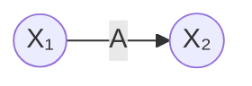

### Forward Paths
A forward path is a path from the input node to the output node along which no node is encountered more than once.

**Example:**
- Path 1 = ABC
- Path 2 = AD

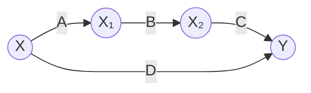

### Feedback Loop and Self Loop
- **Feedback Loop**: A closed path that starts and ends at the same node
- **Self Loop**: A loop that connects a node to itself

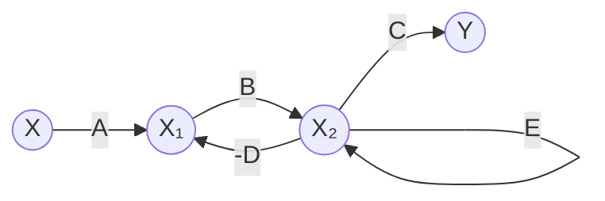

- Feedback Loop = B(-D)
- Self Loop = E

### Chain Node
Chain nodes are intermediate nodes that have only one incoming and one outgoing branch.

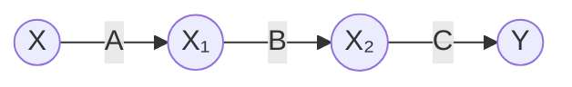

Can be simplified to:
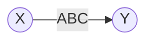

### Touching and Non-Touching Elements

#### Definitions:
- **Touching paths/loops**: Share at least one common node
- **Non-touching paths/loops**: Do not share any common nodes

#### Example Analysis:

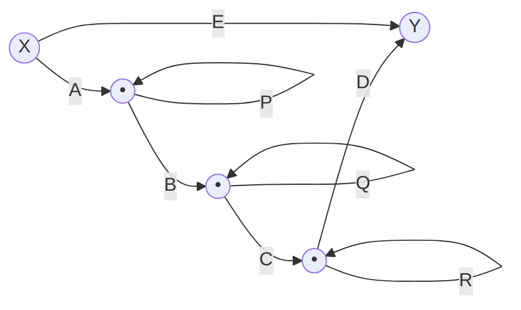

**Components:**
- Forward Path 1 = ABCD
- Forward Path 2 = AE
- Loop 1 = BP (Loop Gain = BP)
- Loop 2 = CQ
- Loop 3 = DR
- Loop 4 = ERQP

**Analysis:**
- Forward Path 1 is touching all loops
- Forward Path 2 is not touching Loop 2
- Loop 1 and Loop 3 are non-touching loops

### Dummy Node
Dummy nodes are introduced to maintain the structure of the signal flow graph without affecting the mathematical relationships.

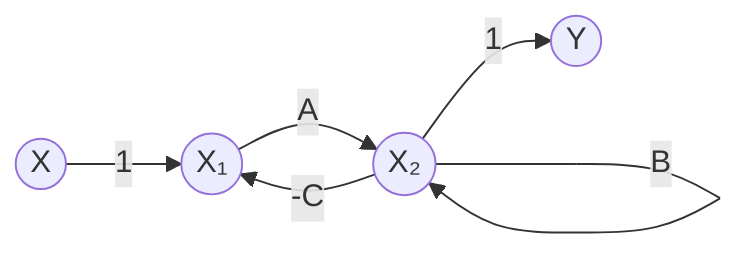

## Rules of Signal Flow Graph

### Rule 1: Simple Transmission
**X₂ = AX₁**


### Rule 2: Addition of Signals
**X₃ = AX₁ + BX₂**

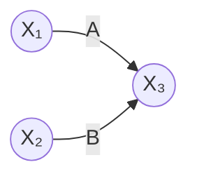

### Rule 3: Cascaded Elements
**X₃ = ABX₁**

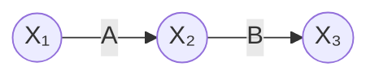

### Rule 4: Parallel Paths
**X₂ = (A + B)X₁**

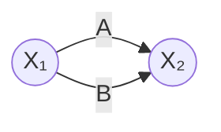

### Rule 5: Series-Parallel Combination
**X₄ = (AX₁ + BX₂)C**

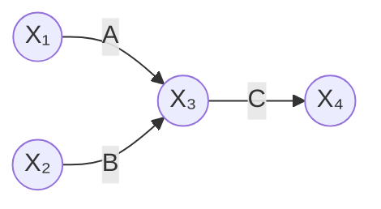

### Rule 6: Feedback Reduction
**Y = X(AB/(1-BP))**

Original form:
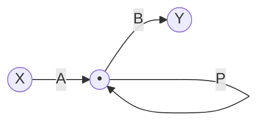

Simplified form:
```mermaid
graph LR
    X((X)) -->|AB/(1-BP)| Y((Y))
```

## Mason's Gain Formula

### Formula Statement
For a signal flow graph with n forward paths:

**T = C(s)/R(s) = (Σᵢ₌₁ⁿ FᵢΔᵢ)/Δ**

Where:
- **T** = Overall transfer function
- **Fᵢ** = Gain of the iᵗʰ forward path
- **Δ** = Determinant of the graph
- **Δᵢ** = Cofactor of the iᵗʰ forward path

### Step-by-Step Procedure

#### Step 1: Find Forward Paths
Identify all possible paths from input to output node.

#### Step 2: Find Single Loops
Identify all individual loops in the graph.

#### Step 3: Find Non-Touching Loop Combinations
- Two non-touching loops
- Three non-touching loops
- And so on...

#### Step 4: Calculate Δ (Determinant)
**Δ = 1 - Σ(Single Loops) + Σ(Two Non-touching Loops) - Σ(Three Non-touching Loops) + ...**

#### Step 5: Calculate Δᵢ (Cofactors)
For each forward path Fᵢ:
**Δᵢ = 1 - Σ(Single Loops not touching path Fᵢ) + Σ(Two Non-touching Loops not touching path Fᵢ) - ...**

#### Step 6: Apply Mason's Formula
**T = (F₁Δ₁ + F₂Δ₂ + ... + FₙΔₙ)/Δ**

## Worked Examples

### Example 1: Complex Multi-Loop System

Consider the following signal flow graph:

| Element | Description | Value |
|---------|-------------|--------|
| Forward Paths | F₁ | G₁G₂G₃ |
| | F₂ | G₄G₅ |
| Single Loops | L₁ | -G₁G₂G₃ |
| | L₂ | -G₂ |
| | L₃ | -G₃ |
| | L₄ | G₆ |
| | L₅ | -G₄G₅ |
| Two Non-touching | L'₁ | -G₁G₂G₃G₆ |
| Loops | L'₂ | -G₂G₆ |
| | L'₃ | G₂G₄G₅ |
| | L'₄ | -G₃G₆ |

**Calculations:**
- Δ₁ = 1 - G₆ (loops not touching F₁)
- Δ₂ = 1 + G₂ (loops not touching F₂)
- Δ = 1 + (G₁G₂G₃ + G₂ + G₃ - G₆ + G₄G₅) + (-G₁G₂G₃G₆ - G₂G₆ + G₂G₄G₅ - G₃G₆)

**Transfer Function:**
**C(s)/R(s) = (F₁Δ₁ + F₂Δ₂)/Δ**

### Example 2: Simple Feedback System

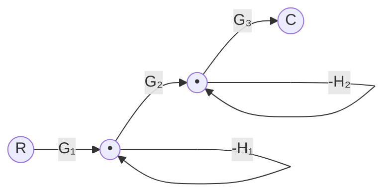

**Solution:**
- F₁ = G₁G₂G₃
- L₁ = G₁G₂H₁
- L₂ = -G₂H₁  
- L₃ = -G₂G₃H₂
- Δ₁ = 1 (all loops touch the forward path)
- Δ = 1 - (G₁G₂H₁ - G₂H₁ - G₂G₃H₂)

**Transfer Function:**
**C(s)/R(s) = G₁G₂G₃/(1 - G₁G₂H₁ + G₂H₁ + G₂G₃H₂)**

### Example 3: Multiple Forward Paths

Consider a system with three self-loops:

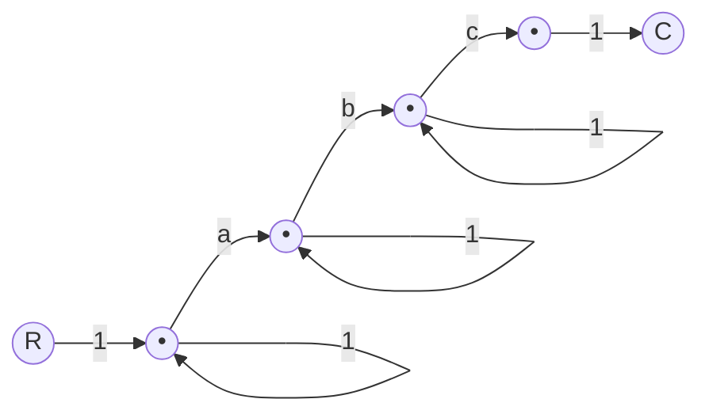

**Solution:**
- F₁ = abc
- L₁ = a, L₂ = b, L₃ = c
- Two non-touching loops: L'₁ = ac
- Δ₁ = 1 (all loops touch the forward path)
- Δ = 1 - (a + b + c) + ac

**Transfer Function:**
**C(s)/R(s) = abc/(1 - (a + b + c) + ac)**

### Example 4: Numerical Example

Given: R → [5] → C with self-loop [0.5]

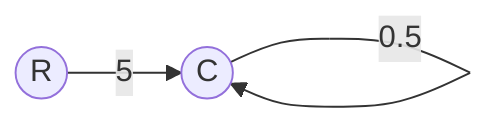

**Solution:**
- F₁ = 5
- L₁ = 0.5
- Δ₁ = 1 (no loops not touching the forward path)
- Δ = 1 - 0.5 = 0.5

**Transfer Function:**
**C(s)/R(s) = (5 × 1)/0.5 = 10**

## Signal Flow Graph from Line Equations

### Construction Procedure

Given a set of linear equations, construct the corresponding signal flow graph:

**Example Equations:**
- y₂ = ay₁ - gy₃
- y₃ = ey₂ - cy₄  
- y₄ = by₂ - dy₄

### Step-by-Step Construction:

1. **Identify Variables**: y₁, y₂, y₃, y₄
2. **Create Nodes**: One node for each variable
3. **Add Branches**: Based on equation coefficients

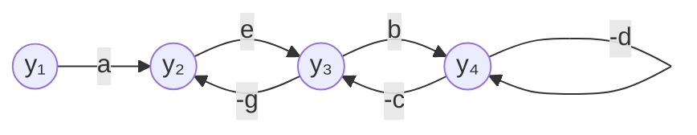

### Transfer Function Calculation:

**Given Signal Flow Graph:**
- F₁ = ab (forward path y₁ → y₂ → y₄)
- L₁ = -eg (loop y₂ → y₃ → y₂)
- L₂ = bcg (loop y₂ → y₄ → y₃ → y₂)  
- L₃ = -d (self-loop at y₄)
- L'₁ = egd (non-touching loops L₁ and L₃)

**Result:**
- Δ₁ = 1
- Δ = 1 + eg - bcg + d + egd

**Transfer Function:**
**y₄/y₁ = ab/(1 + eg - bcg + d + egd)**

## Block Diagram to Signal Flow Graph Conversion

### Conversion Steps

1. **Node Assignment**
   - Input and output nodes
   - Summing junction nodes
   - Take-off point nodes
   - Nodes between consecutive blocks

2. **Eliminate Dummy Nodes**
   - Combine unity gain branches
   - Simplify where possible

3. **Connect Nodes**
   - Add directed branches with appropriate gains
   - Include feedback paths

### Example 1: Basic Feedback System

**Original Block Diagram:**
```
R(s) → [+] → [G₁] → [G₂] → [+] → [G₃] → C(s)
       ↑             ↑      ↑
       |             |H₁    |
       |             ↓      |
       |           [−]      |
       |                    |
       |H₂                  |
       ↓                    |
     [G₄] ←←←←←←←←←←←←←←←←←←←←
```

**Converted Signal Flow Graph:**

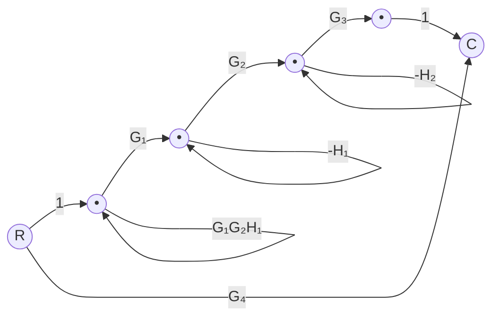

**Analysis:**
- F₁ = G₁G₂G₃ (main forward path)
- F₂ = G₄ (bypass path)
- L₁ = -G₂H₁
- L₂ = G₁G₂H₁  
- L₃ = -G₂G₃H₂

**Transfer Function:**
**C(s)/R(s) = (G₁G₂G₃ + G₄(1 + G₂H₁ - G₁G₂H₁ + G₂G₃H₂))/(1 + G₂H₁ - G₁G₂H₁ + G₂G₃H₂)**

### Example 2: Multiple Feedback Loops

**Block Diagram with Inner and Outer Loops:**

**Converted Signal Flow Graph:**

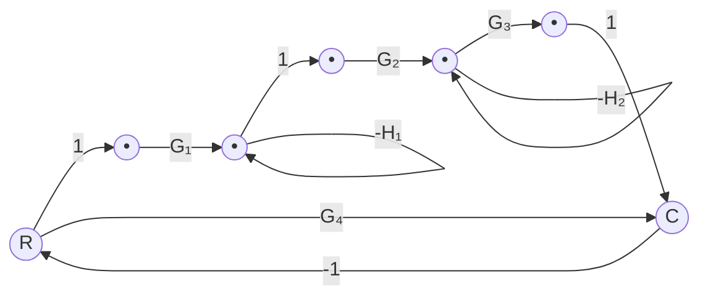

**Solution Process:**
1. Identify forward paths: F₁ = G₁G₂G₃, F₂ = G₁G₄
2. Identify loops: Various feedback combinations
3. Apply Mason's formula

## Advanced Examples

### Example: S-Domain Transfer Function

Consider a control system with integrators:

```mermaid
graph LR
    R((R)) -->|1| N1((•)) -->|1/S| N2((•)) -->|6| N3((•)) -->|1/S| C((C))
    N1 -->|1/S| N3
    N2 -->|-2| N1
    N3 -->|-3| N2
    C -->|-4| N3
    C -->|-1| R
```

**Components:**
- F₁ = 1 × 1 = 1
- L₁ = -2/S
- L₂ = -3/S  
- L₃ = -24/S
- L'₁ = 6/S²

**Solution:**
- Δ₁ = 1 + 3/S + 24/S = 1 + 27/S
- Δ = 1 + 29/S + 6/S²

**Transfer Function:**
**C(s)/R(s) = S(S + 27)/(S² + 29S + 6)**

## Summary and Key Points

### Advantages of Signal Flow Graphs
1. **Visual Representation**: Clear visualization of system relationships
2. **Systematic Analysis**: Mason's formula provides systematic approach
3. **Complex Systems**: Handles multiple loops and paths efficiently
4. **No Block Reduction**: Direct transfer function calculation

### Key Formulas

| Formula | Expression |
|---------|------------|
| Mason's Gain Formula | T = (ΣFᵢΔᵢ)/Δ |
| Determinant | Δ = 1 - ΣL + ΣL'L" - ΣL'L"L'" + ... |
| Cofactor | Δᵢ = Δ with loops touching Fᵢ removed |

### Common Mistakes to Avoid
1. **Missing Non-touching Loops**: Always check for all combinations
2. **Sign Errors**: Pay attention to negative feedback signs
3. **Path Identification**: Ensure all forward paths are found
4. **Loop Touching**: Correctly identify which loops touch each path

### Applications
- Control system analysis
- Electronic circuit analysis  
- Communication system design
- Process control systems
- Robotics and automation

---

*This guide provides a comprehensive overview of Signal Flow Graph analysis using Mason's Gain Formula. Practice with various examples to master the technique.