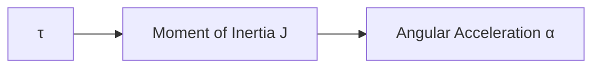
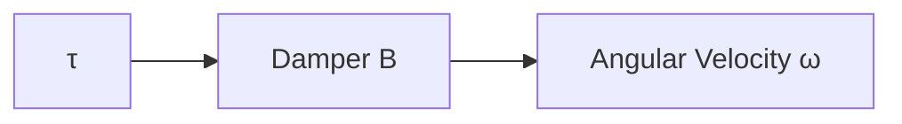
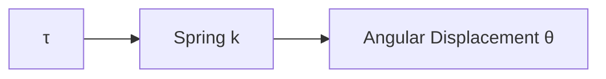
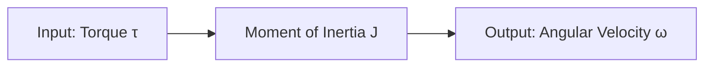
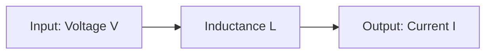
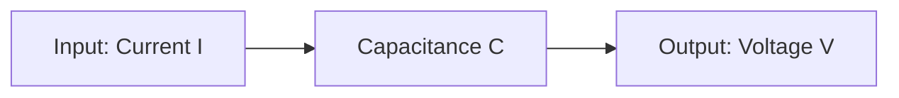
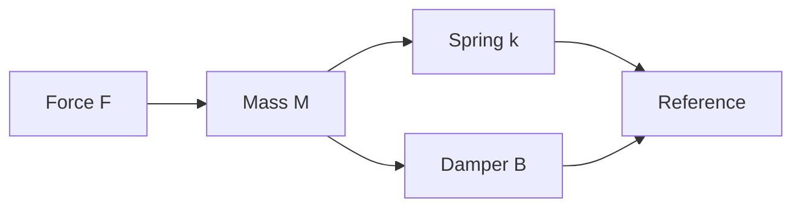
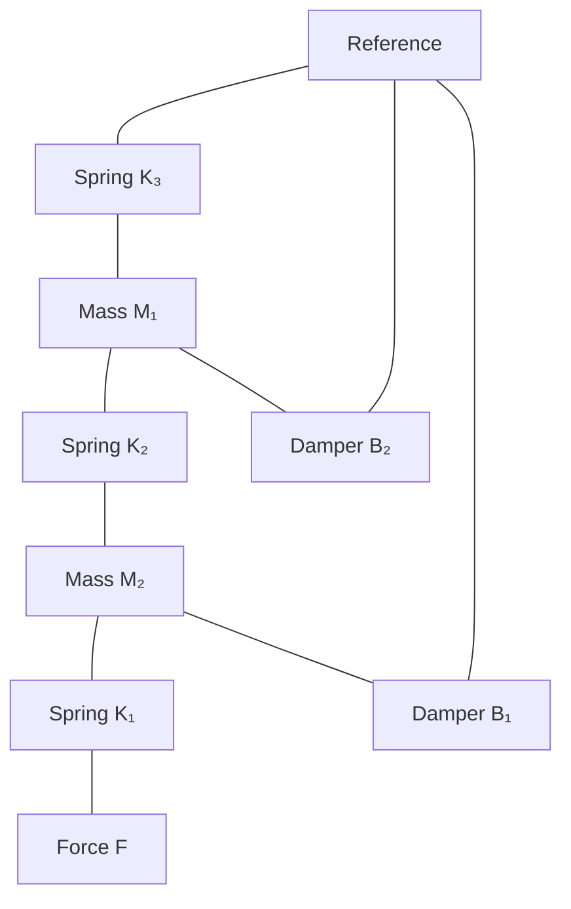
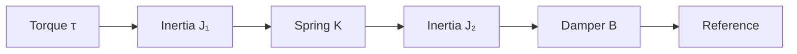
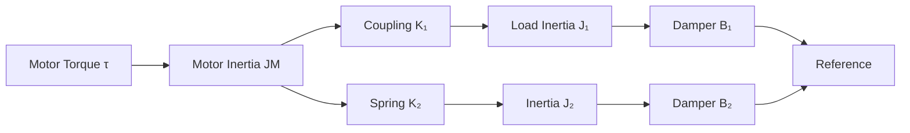

# Mathematical Models in Control Systems - Complete Guide

## Table of Contents
1. [Types of Mathematical Models](#types-of-mathematical-models)
2. [Electrical Systems - RLC Circuit Analysis](#electrical-systems---rlc-circuit-analysis)
3. [Mechanical Systems](#mechanical-systems)
4. [System Analogies](#system-analogies)
5. [Mathematical Modeling Examples](#mathematical-modeling-examples)

## Types of Mathematical Models

Mathematical models in control systems are used to represent the behavior of physical systems mathematically. There are three primary types:

### 1. Differential Equation Model
- Represents system behavior using differential equations
- Shows the relationship between input and output variables
- Used for time-domain analysis

### 2. Transfer Function Model
- Laplace transform representation of differential equations
- Shows input-output relationship in s-domain
- Used for frequency-domain analysis

### 3. State Space Model
- Matrix representation of system dynamics
- Describes internal system states
- Used for modern control theory

## Electrical Systems - RLC Circuit Analysis

### Circuit Configuration

```mermaid
graph LR
    VIN[VIN(t)] -->|R| R[Resistor]
    R -->|L| L[Inductor]
    L -->|I| C[Capacitor]
    C --> VO[VO(t)]
    C --> GND[Ground]
```

### Differential Equation Development

**Step 1: Apply Kirchhoff's Voltage Law (KVL)**

For the RLC circuit in loop:
```
VIN(t) = VR + VL + VO(t)
```

**Step 2: Express each voltage term**
- Resistor: `VR = IR = I × R`
- Inductor: `VL = L(dI/dt)`
- Capacitor: `I = C(dVO(t)/dt)`

**Step 3: Combine equations**
```
VIN(t) = IR + L(dI/dt) + VO(t)
```

Substituting `I = C(dVO(t)/dt)`:
```
VIN(t) = RC(dVO(t)/dt) + LC(d²VO(t)/dt²) + VO(t)
```

**Step 4: Final Differential Equation**
```
LC(d²VO(t)/dt²) + RC(dVO(t)/dt) + VO(t) = VIN(t)
```

### Transfer Function Derivation

**Apply Laplace Transform:**
```
LCs²VO(s) + RCsVO(s) + VO(s) = VIN(s)
```

**Transfer Function:**
```
VO(s)/VIN(s) = 1/(LCs² + RCs + 1)
```

## Mechanical Systems

### Types of Mechanical Systems

Mechanical systems are classified based on the type of motion:

#### 1. Translational Mechanical System
Motion occurs in a straight line.

#### 2. Rotational Mechanical System  
Motion occurs in a circular path.

### Translational Mechanical System Parameters

| Parameter | Symbol | Formula | Unit |
|-----------|--------|---------|------|
| Displacement | x | - | Meter |
| Velocity | v | dx/dt | Meter/Sec |
| Acceleration | a | dv/dt = d²x/dt² | Meter/Sec² |
| Mass | M | - | Kg |
| Force | F | - | N |

### Translational System Elements

#### Mass Element

**Equation:** `F = Ma`

#### Damper Element

**Equation:** `F = Bv`

#### Spring Element

**Equation:** `F = kx`

### Rotational Mechanical System Parameters

| Parameter | Symbol | Formula | Unit |
|-----------|--------|---------|------|
| Angular Displacement | θ | - | Rad |
| Angular Velocity | ω | dθ/dt | Rad/Sec |
| Angular Acceleration | α | dω/dt = d²θ/dt² | Rad/Sec² |
| Moment of Inertia | I or J | - | Kg⋅m² |
| Torque | τ | - | Nm |

### Rotational System Elements

#### Moment of Inertia

**Equation:** `τ = Jα`

#### Rotational Damper

**Equation:** `τ = Bω`

#### Rotational Spring

**Equation:** `τ = kθ`

## System Analogies

### Force-Voltage Analogy

This analogy maps mechanical system elements to electrical circuit elements.

#### Mechanical System Analysis
For a system with mass M, damper B, and spring k:
```
F = kx + Bv + Ma
F = kx + B(dx/dt) + M(d²x/dt²)
```

**Laplace Transform:**
```
F = kx + BSx + MS²x
```

#### Electrical System Analysis
For an RLC circuit:
```
V = IR + L(dI/dt) + Q/C
```

Since `I = dQ/dt`:
```
V = R(dQ/dt) + L(d²Q/dt²) + Q/C
```

**Laplace Transform:**
```
V = RSQ + LS²Q + Q/C
```

#### Force-Voltage Analogy Table

| Mechanical System | Electrical System |
|-------------------|-------------------|
| Force F | Voltage V |
| Mass M | Inductance L |
| Damping Constant B | Resistance R |
| Spring Constant k | Reciprocal of Capacitance (1/C) |
| Distance x | Charge Q |
| Velocity v = dx/dt | Current I = dQ/dt |

### Force-Current Analogy

#### Mechanical System (Same as above)
```
F = kx + Bv + Ma
```

#### Electrical System Analysis
For a parallel RLC circuit, applying KCL:
```
I = IR + IL + IC
I = V/R + (1/L)∫Vdt + C(dV/dt)
```

Since `V = dφ/dt` where φ is flux:
```
I = (1/R)(dφ/dt) + (1/L)φ + C(d²φ/dt²)
```

**Laplace Transform:**
```
I = (1/R)Sφ + (1/L)φ + CS²φ
```

#### Force-Current Analogy Table

| Mechanical System | Electrical System |
|-------------------|-------------------|
| Force F | Current I |
| Mass M | Capacitance C |
| Damping Constant B | Reciprocal of Resistance (1/R) |
| Spring Constant k | Reciprocal of Inductance (1/L) |
| Distance x | Flux φ |
| Velocity v = dx/dt | Voltage V = dφ/dt |

### Torque-Voltage Analogy

#### Mechanical System


**Equation:** `τ = Jα = J(dω/dt) = J(d²θ/dt²)`

#### Electrical System


**Equation:** `V = L(dI/dt) = L(d²Q/dt²)`

#### Torque-Voltage Analogy Table

| Mechanical System | Electrical System |
|-------------------|-------------------|
| Torque τ | Voltage V |
| Angular Velocity ω | Current I |
| Moment of Inertia J | Inductance L |
| Angular Displacement θ | Charge Q |

### Torque-Current Analogy

#### Mechanical System (Same as above)
**Equation:** `τ = Jα = J(dω/dt)`

#### Electrical System


**Equation:** `I = C(dV/dt)`

#### Torque-Current Analogy Table

| Mechanical System | Electrical System |
|-------------------|-------------------|
| Torque τ | Current I |
| Angular Velocity ω | Voltage V |
| Moment of Inertia J | Capacitance C |

## Mathematical Modeling Examples

### Example 1: Simple Mass-Spring-Damper System



#### Modeling Steps:
1. **Identify nodes:** Total displacement nodes = 1
2. **Connect elements:** Mass to reference, spring and damper in parallel
3. **Apply Newton's law:** At node x, incoming force = outgoing forces

#### Force Balance Equation:
```
F = Ma + Bv + kx
F = M(d²x/dt²) + B(dx/dt) + kx
```

#### Laplace Transform:
```
F = MS²X(s) + BSX(s) + kX(s)
```

### Example 2: Two-Mass System



#### Node Equations:

**At node X₃ (top mass):**
```
F = K₁(X₃ - X₂)
```

**At node X₂ (middle mass):**
```
0 = K₁(X₂ - X₃) + K₂(X₂ - X₁) + B₁(V₂ - V₁) + M₂a₂
```

**At node X₁ (bottom mass):**
```
0 = K₂(X₁ - X₂) + B₁(V₁ - V₂) + M₁a₁ + K₃X₁ + B₂V₁
```

#### Laplace Transform:
```
F = K₁(X₃ - X₂)
0 = K₁(X₂ - X₃) + K₂(X₂ - X₁) + B₁(SX₂ - SX₁) + M₂S²X₂
0 = K₂(X₁ - X₂) + B₁(SX₁ - SX₂) + M₁S²X₁ + K₃X₁ + B₂SX₁
```

### Example 3: Rotational System



#### Node Equations:

**At node θ₁:**
```
τ = K(θ₁ - θ₂) + J₁α₁
τ = K(θ₁ - θ₂) + J₁(d²θ₁/dt²)
```

**At node θ₂:**
```
0 = K(θ₂ - θ₁) + J₂α₂ + Bω₂
0 = K(θ₂ - θ₁) + J₂(d²θ₂/dt²) + B(dθ₂/dt)
```

#### Laplace Transform:
```
τ = K(θ₁ - θ₂) + J₁S²θ₁
0 = K(θ₂ - θ₁) + J₂S²θ₂ + BSθ₂
```

### Example 4: Motor-Load System



#### Node Equations:

**At motor node θM:**
```
τ = JMαM + K₂(θM - θ₂) + B₂(ωM - ω₂) + K₁(θM - θ₁)
```

**At load node θ₁:**
```
0 = K₁(θ₁ - θM) + J₁α₁ + B₁ω₁
```

**At secondary load θ₂:**
```
0 = J₂α₂ + K₂(θ₂ - θM) + B₂(ω₂ - ωM)
```

## Analogy Applications

### Force-Voltage Analogy Example

**Mechanical System:**
```
F = K₂(X₁ - X₂) + K₁X₁ + M₁S²X₁ + B₁SX₁
0 = K₂(X₂ - X₁) + K₃X₂ + M₂S²X₂ + B₂SX₂
```

**Equivalent Electrical System:**
```
V = (1/C₂)(Q₁ - Q₂) + (1/C₁)Q₁ + L₁S²Q₁ + R₁SQ₁
0 = (1/C₂)(Q₂ - Q₁) + (1/C₃)Q₂ + L₂S²Q₂ + R₂SQ₂
```

### Force-Current Analogy Example

**Mechanical System:**
```
F = K₂(X₁ - X₂) + B₂(V₁ - V₂) + K₁X₁ + M₁S²X₁ + B₁SX₁
0 = K₂(X₂ - X₁) + B₂(V₂ - V₁) + K₃X₂ + M₂S²X₂ + B₃SX₂
```

**Equivalent Electrical System:**
```
I = (1/L₂)(φ₁ - φ₂) + (1/R₂)(Sφ₁ - Sφ₂) + (1/L₁)φ₁ + C₁S²φ₁ + (1/R₁)Sφ₁
0 = (1/L₂)(φ₂ - φ₁) + (1/R₂)(Sφ₂ - Sφ₁) + (1/L₃)φ₂ + C₂S²φ₂ + (1/R₃)Sφ₂
```

## Summary

### Key Concepts

1. **Mathematical Models** provide different representations of physical systems:
   - **Differential equations** for time-domain analysis
   - **Transfer functions** for frequency-domain analysis
   - **State space** for modern control applications

2. **System Analogies** enable:
   - Cross-domain analysis between mechanical and electrical systems
   - Simplified design using familiar electrical circuit analysis
   - Hardware simulation using electrical circuits

3. **Modeling Process**:
   - Identify system nodes and variables
   - Apply physical laws (Newton's laws, KVL, KCL)
   - Derive differential equations
   - Apply Laplace transform for transfer functions

### Applications

- **Control System Design**: Transfer functions enable controller design
- **System Simulation**: Mathematical models allow computer simulation
- **Performance Analysis**: Models predict system behavior
- **Hardware Prototyping**: Analogies enable electrical testing of mechanical systems

### Best Practices

1. **Clear Node Identification**: Properly identify all displacement/angle nodes
2. **Consistent Sign Conventions**: Maintain consistent directions for forces/torques
3. **Systematic Approach**: Follow the 5-step modeling process consistently
4. **Verification**: Check units and physical reasonableness of equations
5. **Analogy Selection**: Choose appropriate analogy based on system configuration

This comprehensive guide provides the foundation for mathematical modeling of control systems, enabling engineers to analyze, design, and optimize dynamic systems across multiple domains.