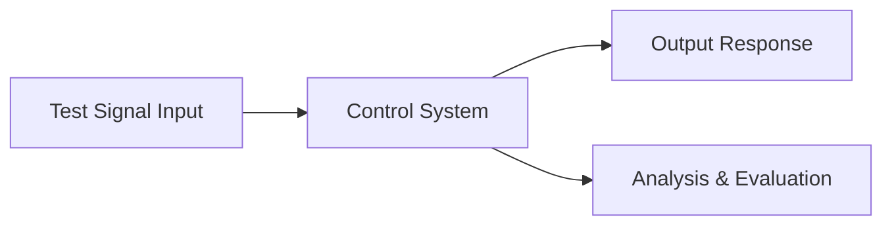
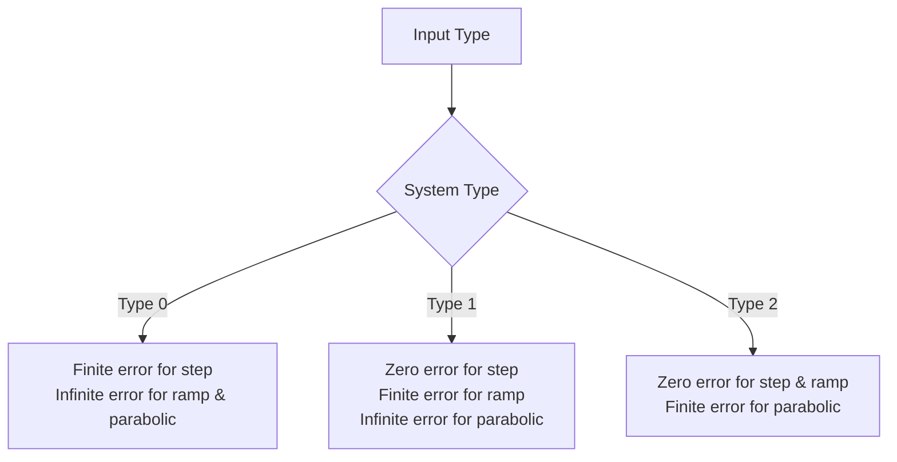
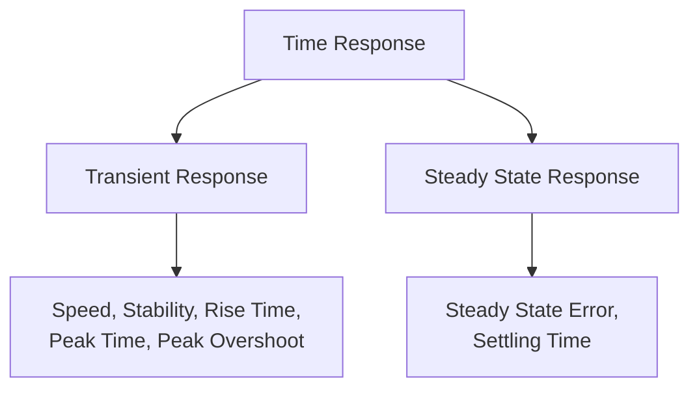
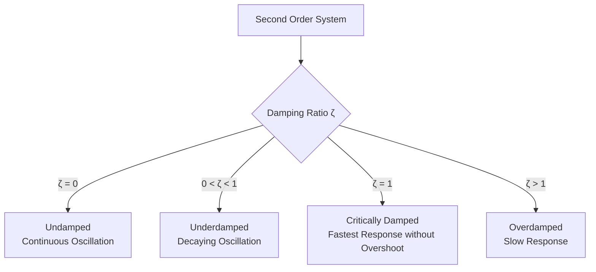
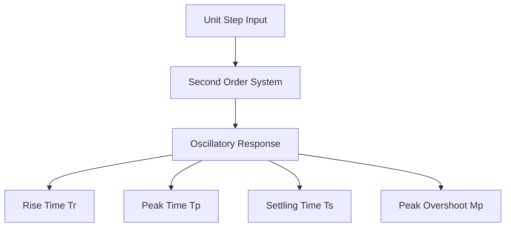
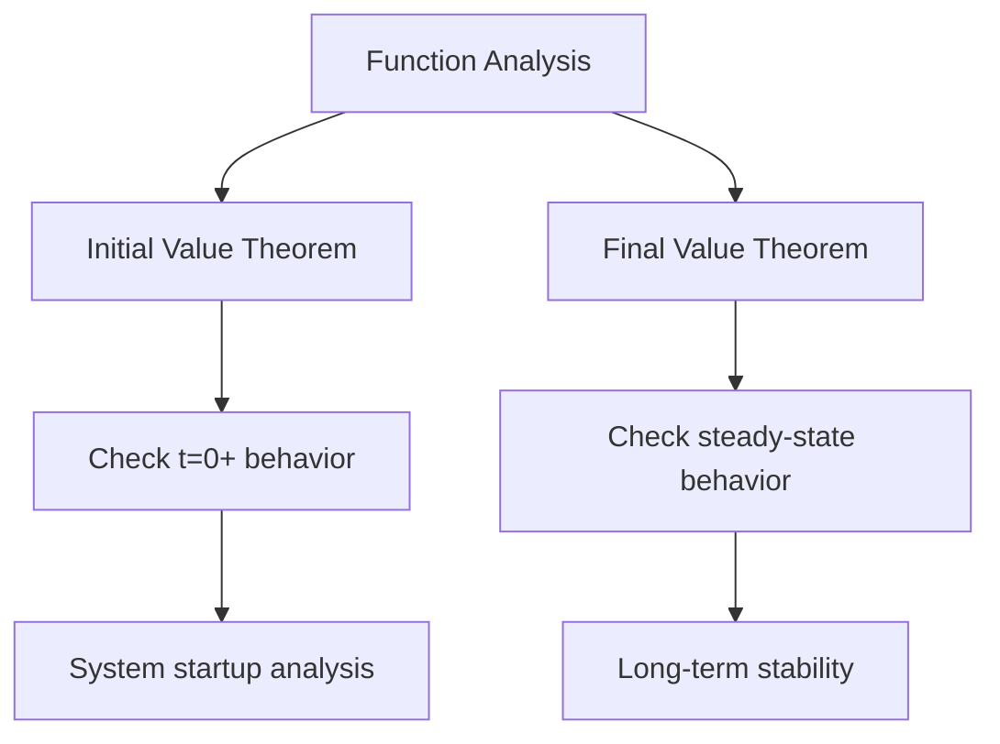
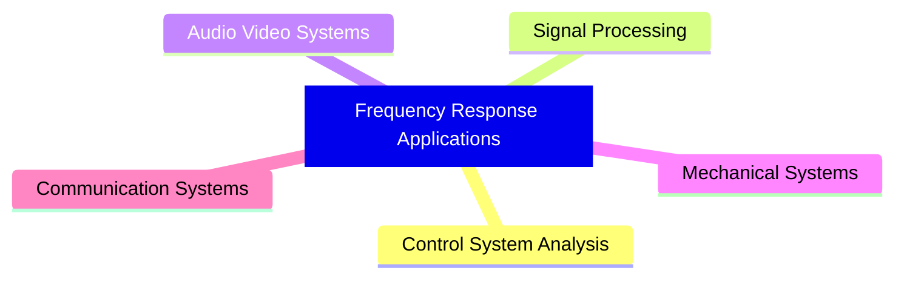
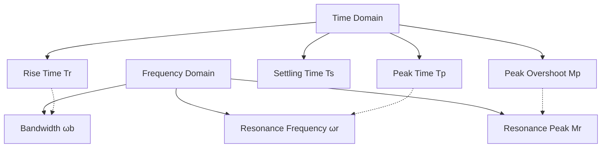
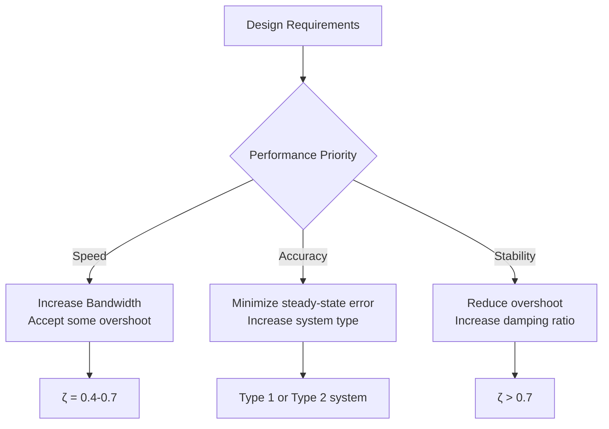
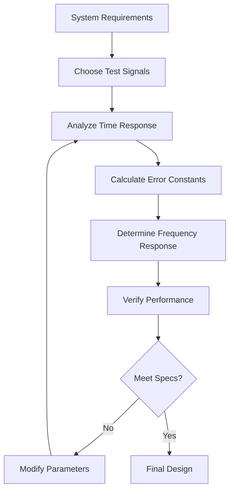

# Complete Control Systems Guide: Test Signals, Time Response, and Frequency Analysis

## Table of Contents
1. [Test Signals](#test-signals)
2. [Steady State Error](#steady-state-error)
3. [System Order and Type](#system-order-and-type)
4. [Time Response Analysis](#time-response-analysis)
5. [Time Response Parameters for Second Order Systems](#time-response-parameters-for-second-order-systems)
6. [Initial and Final Value Theorems](#initial-and-final-value-theorems)
7. [Frequency Response Analysis](#frequency-response-analysis)
8. [Example Problems](#example-problems)

---

## Test Signals

### Need for Test Signals

Test signals are essential for analyzing and evaluating control systems. They help in:

- **System Characteristics Analysis**
- **Fault Detection and System Diagnosis**
- **System Calibration and Verification**
- **System Performance Evaluation**
- **Design and Optimization of System**



### Types of Test Signals

Test signals are categorized based on their application:

| Signal Type | Primary Use | Laplace Transform |
|-------------|-------------|-------------------|
| **Impulse Signal δ(t)** | Control Systems | 1 |
| **Step Signal u(t)** | Control Systems | 1/s |
| **Ramp Signal r(t)** | Control Systems | 1/s² |
| **Parabolic Signal x(t)** | Control Systems | 1/s³ |
| **Sine/Cosine Signal** | High Frequency Applications | - |
| **Square Signal** | High Frequency Applications | - |
| **Triangular Signal** | High Frequency Applications | - |

### Mathematical Definitions

#### Impulse Signal δ(t)
```
δ(t) = 1, t = 0
δ(t) = 0, t ≠ 0
```

#### Step Signal u(t)
```
u(t) = 1, t ≥ 0
u(t) = 0, t < 0
```

#### Ramp Signal r(t)
```
r(t) = t, t ≥ 0
r(t) = 0, t < 0
```

#### Parabolic Signal x(t)
```
x(t) = t²/2, t ≥ 0
x(t) = 0, t < 0
```

### Relationship Between Test Signals

```mermaid
flowchart LR
    A[Impulse δ(t)] -->|Integration| B[Step u(t)]
    B -->|Integration| C[Ramp r(t)]
    C -->|Integration| D[Parabolic x(t)]
    
    D -->|Differentiation| C
    C -->|Differentiation| B
    B -->|Differentiation| A
```

**Mathematical Relations:**
- ∫ δ(t)dt = u(t)
- ∫ u(t)dt = r(t)
- ∫ r(t)dt = x(t)

---

## Steady State Error

### Basics of Steady State Error

**Definition:** Steady State Error is the error when time t approaches infinity.

**Purpose:** It justifies the accuracy of the system.

**Error Sources:**
- Nature of inputs
- Types of system
- Non-linearity of system components

```mermaid
flowchart TD
    A[Input R(s)] --> B[+] --> C[G(s)] --> D[Output C(s)]
    D --> E[H(s)] --> F[-] --> B
    B --> G[Error Signal E(s)]
```

### Derivation of Steady State Error

For the standard feedback system:

**Error Signal:** E(s) = R(s)/(1 + G(s)H(s))

**Steady State Error:** e_ss = lim(t→∞) E(t) = lim(s→0) sE(s)

**General Formula:** e_ss = lim(s→0) s[R(s)/(1 + G(s)H(s))]

### Static Error Constants

| Error Constant | Formula | Purpose |
|----------------|---------|---------|
| **Positional (Kp)** | lim(s→0) G(s)H(s) | Step input analysis |
| **Velocity (Kv)** | lim(s→0) sG(s)H(s) | Ramp input analysis |
| **Acceleration (Ka)** | lim(s→0) s²G(s)H(s) | Parabolic input analysis |

### Steady State Error Summary Table

| System Type | Unit Step Input | Unit Ramp Input | Unit Parabolic Input |
|-------------|----------------|-----------------|---------------------|
| **Type 0** | 1/(1+Kp) | ∞ | ∞ |
| **Type 1** | 0 | 1/Kv | ∞ |
| **Type 2** | 0 | 0 | 1/Ka |



---

## System Order and Type

### Definitions

**System Order:** Determined by the highest power of the denominator polynomial in the transfer function.

**System Type:** Determined by the number of poles at the origin (s = 0).

### Transfer Function Analysis

For a transfer function: T(s) = C(s)/R(s) = N(s)/D(s)

- **Zeros:** Roots of N(s) = 0
- **Poles:** Roots of D(s) = 0
- **Order:** Highest power of s in D(s)
- **Type:** Number of poles at s = 0

### Examples

#### Example 1: T(s) = k/(s² + s)

**Factored form:** T(s) = k/[s(s + 1)]

**Analysis:**
- Poles: s₁ = 0, s₂ = -1
- Order = 2 (two poles total)
- Type = 1 (one pole at origin)

#### Example 2: T(s) = k(s + 2)/(s² + 3s + 2)

**Factored form:** T(s) = k(s + 2)/[(s + 2)(s + 1)] = k/(s + 1)

**Analysis:**
- Pole: s₁ = -1
- Order = 1
- Type = 0 (no poles at origin)

#### Example 3: T(s) = k(s + 1)(s + 6)/(s³ + 4s² + 3s)

**Factored form:** T(s) = k(s + 1)(s + 6)/[s(s + 3)(s + 1)] = k(s + 6)/[s(s + 3)]

**Analysis:**
- Zero: s = -6
- Poles: s₁ = 0, s₂ = -3
- Order = 2
- Type = 1

---

## Time Response Analysis

### Basics

**Definition:** Time Response Analysis is the study of output behavior with respect to time.

**Analysis Parameters:**
- Stability of the system
- Accuracy of the system
- Errors in the system

### Types of Time Response



### First Order System Analysis

For a standard first-order system: T(s) = 1/(1 + sT)

#### Unit Impulse Response
**Time Response:** c(t) = (1/T)e^(-t/T)u(t)

#### Unit Step Response
**Time Response:** c(t) = [1 - e^(-t/T)]u(t)

**Key Points:**
- At t = T: c(T) = 0.63 (63% of final value)
- At t = 2T: c(2T) = 0.86 (86% of final value)
- At t = 3T: c(3T) = 0.95 (95% of final value)
- At t = 4T: c(4T) = 0.98 (98% of final value)

#### Unit Ramp Response
**Time Response:** c(t) = [-T + t + Te^(-t/T)]u(t)

**Steady State Error:** e_ss = T

### Second Order System Analysis

Standard form: T(s) = ωₙ²/(s² + 2ζωₙs + ωₙ²)

Where:
- ωₙ = Natural frequency
- ζ = Damping ratio

#### Nature of Roots

| Damping Condition | ζ Value | Root Characteristics | Response Type |
|-------------------|---------|---------------------|---------------|
| **Undamped** | ζ = 0 | s₁ = jωₙ, s₂ = -jωₙ | Oscillatory |
| **Underdamped** | 0 < ζ < 1 | Complex conjugate | Oscillatory with decay |
| **Critically Damped** | ζ = 1 | s₁ = s₂ = -ωₙ | No oscillation, fastest settling |
| **Overdamped** | ζ > 1 | Real and different | No oscillation, slow settling |



#### Pole Locations

For underdamped case (0 < ζ < 1):
- s₁ = -ζωₙ + jωₙ√(1-ζ²)
- s₂ = -ζωₙ - jωₙ√(1-ζ²)

Where ωd = ωₙ√(1-ζ²) is the damped frequency.

#### Time Responses

**Undamped Case (ζ = 0):**
c(t) = u(t) - cos(ωₙt)u(t)

**Critically Damped Case (ζ = 1):**
c(t) = [1 - e^(-ωₙt)(1 + ωₙt)]u(t)

**Underdamped Case (0 < ζ < 1):**
c(t) = [1 - (e^(-ζωₙt)/√(1-ζ²))sin(ωdt + θ)]u(t)

Where θ = tan⁻¹(√(1-ζ²)/ζ)

---

## Time Response Parameters for Second Order Systems

### System Block Diagram

```mermaid
graph LR
    A[Input R(S)] --> B[ωₙ²/(S² + 2ζωₙS + ωₙ²)] --> C[Output C(S)]
```

### Rise Time in 2nd Order System

**Definition:** Rise time is the time required to reach output from 0 to 100% in the first attempt.

For an underdamped second-order system (0 < ζ < 1):

**Unit Step Response:**
```
C(t) = [1 - (e^(-ζωₙt)/√(1-ζ²)) sin(ωdt + θ)] u(t)
```

Where:
- ωd = ωₙ√(1-ζ²) (damped frequency)
- θ = tan⁻¹(√(1-ζ²)/ζ)



**Derivation of Rise Time:**

At t = Tr, C(t) = 1:
```
1 - (e^(-ζωₙt)/√(1-ζ²)) sin(ωdt + θ) = 1
```

This leads to:
```
sin(ωdt + θ) = 0
ωdt + θ = nπ  (where n = 0, 1, 2, ...)
```

For the first crossing (n = 1):
```
Tr = (π - θ)/ωd
```

### Peak Time in 2nd Order System

**Definition:** Peak time is the time required to reach output to its maximum value in the first shoot.

**Derivation:**
For peak time, dC(t)/dt = 0

Taking the derivative and setting it to zero leads to:
```
sin(ωdt) = 0
ωdt = nπ
```

For the first peak (n = 1):
```
Tp = π/ωd = π/(ωₙ√(1-ζ²))
```

### Peak Overshoot in 2nd Order System

**Definition:** Peak overshoot is the maximum output of peak with respect to input signal.

**Derivation:**
Maximum peak overshoot Mp is given by:
```
Mp = C(t)|t=Tp - 1
```

Substituting the peak time into the step response equation:
```
Mp = e^(-ζπ/√(1-ζ²))
```

**Percentage Overshoot:**
```
Mp% = e^(-ζπ/√(1-ζ²)) × 100
```

Where sin θ = √(1-ζ²) and cos θ = ζ

### Settling Time in 2nd Order System

**Definition:** Settling time is the time required to reach the output tolerance band of 2% (in some standards, it is 5%).

**Derivation:**
For 2% tolerance:
```
1 + (e^(-ζωₙt)/√(1-ζ²)) = 1.02
```

This gives:
```
e^(-ζωₙt) = 0.02
```

For small values of ζ, √(1-ζ²) ≈ 1:
```
-ζωₙt = ln(0.02) = -3.91
ts ≈ 4/(ζωₙ)
```

### Time Response Parameters Summary

| Parameter | Formula | Description |
|-----------|---------|-------------|
| **Rise Time (Tr)** | (π - θ)/ωd | Time to reach 100% for first time |
| **Peak Time (Tp)** | π/ωd | Time to reach maximum value |
| **Peak Overshoot (Mp)** | e^(-ζπ/√(1-ζ²)) | Maximum overshoot ratio |
| **Settling Time (Ts)** | 4/(ζωₙ) for 2%<br/>3/(ζωₙ) for 5% | Time to reach tolerance band |

Where:
- ωd = ωₙ√(1-ζ²)
- θ = tan⁻¹(√(1-ζ²)/ζ)

### Overdamped System Response

For overdamped systems (ζ > 1), the step response has no oscillations:

**Time Response:**
```
C(t) = [1 - (ωₙ/(2√(ζ²-1)))(e^(-P₁t)/P₁ - e^(-P₂t)/P₂)] u(t)
```

Where:
- P₁ = ζωₙ - ωₙ√(ζ²-1)
- P₂ = ζωₙ + ωₙ√(ζ²-1)

---

## Initial and Final Value Theorems

### Initial Value Theorem

**Purpose:** Gives value of the function at time t = 0⁺

**Formula:**
```
F(0) = lim(t→0) F(t) = lim(s→∞) sF(s)
```

**Conditions:**
- F(t) = 0, t < 0
- Function must not have impulse or discontinuities at t = 0
- Function should be regular [Np > Nz]

### Final Value Theorem

**Purpose:** Gives value of the function at time t = ∞

**Formula:**
```
F(∞) = lim(t→∞) F(t) = lim(s→0) sF(s)
```

**Conditions:**
- System should be stable (not marginally stable)
- System should not have more than one pole at origin

### Example Applications



---

## Frequency Response Analysis

### Basics of Frequency Response

**Definition:** Frequency Response is the steady state output of an LTI (Linear Time Invariant) System to sinusoidal input.

```mermaid
graph LR
    A[Input<br/>R(t) = A sin ωt] --> B[LTI System<br/>G(S)] --> C[Output<br/>C(t) = A' sin(ωt + Φ)]
```

**Parameters Analyzed:**
- **Gain** = A'/A = |G(jω)|
- **Phase** = Φ = ∠G(jω)

### Frequency Response Measurement

To get frequency response, substitute S = jω in transfer function G(S):
```
G(jω) = |G(jω)| ∠G(jω)
```

**Output of LTI System:**
```
C(t) = A|G(jω)| sin(ωt + ∠G(jω))
```

### Methods of Frequency Response Analysis

| Method | Description |
|--------|-------------|
| **Bode Plot** | Magnitude and phase vs frequency |
| **Polar Plot** | Magnitude and phase in polar coordinates |
| **Nyquist Plot** | Used for stability analysis |
| **Nichols Plot** | Log magnitude vs phase |

### Applications



## Second Order System Frequency Analysis

### Standard Form
```
G(S) = ωₙ²/(S² + 2ζωₙS + ωₙ²)
```

### Frequency Response
Substituting S = jω:
```
G(jω) = 1/[(1-(ω/ωₙ)²) + j2ζ(ω/ωₙ)]
```

Let X = ω/ωₙ:
```
G(jω) = 1/[(1-X²) + j2ζX]
```

### Magnitude and Phase

| Parameter | Formula | Description |
|-----------|---------|-------------|
| **Magnitude** | M = 1/√[(1-X²)² + (2ζX)²] | Where X = ω/ωₙ |
| **Phase** | Φ = -tan⁻¹(2ζX/(1-X²)) | Phase angle |

### Resonance Frequency

**Definition:** Frequency at which output magnitude is maximum.

To find maximum of M, differentiate with respect to X and set equal to zero:
```
dM/dX = 0
```

This yields:
```
X = √(1-2ζ²)
```

Therefore:
```
ωᵣ = ωₙ√(1-2ζ²)
```

**Note:** Resonance exists only when ζ < 1/√2 ≈ 0.707

### Resonance Peak

**Definition:** Peak value of the magnitude of transfer function.

At resonance frequency:
```
Mᵣ = 1/(2ζ√(1-ζ²))
```

**Valid for:** ζ < 1/√2

### Bandwidth

**Definition:** Range of frequencies over which magnitude M is greater than or equal to 1/√2 (70.7% or -3dB from zero initial value).

**Formula:**
```
ωb = ωₙ√[(1-2ζ²) + √(4ζ⁴-4ζ²+2)]
```

### Frequency Response Summary

| Parameter | Formula | Condition |
|-----------|---------|-----------|
| **Resonance Frequency** | ωᵣ = ωₙ√(1-2ζ²) | ζ < 0.707 |
| **Resonance Peak** | Mᵣ = 1/(2ζ√(1-ζ²)) | ζ < 0.707 |
| **Bandwidth** | ωb = ωₙ√[(1-2ζ²) + √(4ζ⁴-4ζ²+2)] | All ζ values |

---

## Example Problems

### Example 1: Control System Design

**Problem:** Consider a feedback control system. Determine the value of 'a' such that the damping ratio is 0.5. Also, obtain the values of Rise time, peak time, and Maximum peak overshoot.

**Given System:**
```
G(s) = 16/[s(s + 0.8)]
H(s) = 1 + as
```

**Solution:**

1. **Find Transfer Function:**
   ```
   T(s) = G(s)/(1 + G(s)H(s))
   T(s) = 16/[s² + s(0.8 + 16a) + 16]
   ```

2. **Compare with Standard Form:**
   ```
   Standard: ωₙ²/(s² + 2ζωₙs + ωₙ²)
   ωₙ² = 16 → ωₙ = 4 rad/sec
   2ζωₙ = 0.8 + 16a
   ```

3. **Find 'a' for ζ = 0.5:**
   ```
   2 × 0.5 × 4 = 0.8 + 16a
   4 = 0.8 + 16a
   a = 0.2
   ```

4. **Calculate Time Response Parameters:**
   - θ = tan⁻¹(√(1-0.5²)/0.5) = 60° = 1.04 rad
   - ωd = 4√(1-0.5²) = 3.46 rad/sec
   - **Rise Time:** Tr = (π - 1.04)/3.46 = 0.605 sec
   - **Peak Time:** Tp = π/3.46 = 0.907 sec
   - **Peak Overshoot:** Mp = e^(-0.5π/√(1-0.5²)) = 0.163 = 16.3%

### Example 2: Frequency Response Analysis

**Problem:** A 2nd order system has maximum overshoot of 50% and period of damped oscillations of 0.2 sec. Determine resonant peak, resonant frequency, and bandwidth.

**Given:**
- Mp = 50% = 0.5
- Td = 0.2 sec

**Solution:**

1. **Find Damping Ratio:**
   ```
   Mp = e^(-ζπ/√(1-ζ²)) = 0.5
   ln(0.5) = -ζπ/√(1-ζ²)
   -0.693 = -ζπ/√(1-ζ²)
   ```
   Solving iteratively: **ζ = 0.215**

2. **Find Natural Frequency:**
   ```
   Period of damped oscillation: Td = 2π/ωd
   ωd = 2π/0.2 = 31.4 rad/sec
   ωₙ = ωd/√(1-ζ²) = 31.4/√(1-0.215²) = 32.15 rad/sec
   ```

3. **Calculate Frequency Response Parameters:**
   
   **Resonant Peak:**
   ```
   Mr = 1/(2ζ√(1-ζ²)) = 1/(2×0.215×√(1-0.215²)) = 2.38
   ```
   
   **Resonant Frequency:**
   ```
   ωr = ωₙ√(1-2ζ²) = 32.15√(1-2×0.215²) = 30.62 rad/sec
   ```
   
   **Bandwidth:**
   ```
   ωb = ωₙ√[(1-2ζ²) + √(4ζ⁴-4ζ²+2)]
   ωb = 32.15√[(1-2×0.215²) + √(4×0.215⁴-4×0.215²+2)]
   ωb = 49.31 rad/sec
   ```

### Example 3: Unity Feedback System

**Problem:** For a 2nd order system with unity feedback, the forward transfer function is:
```
G(s) = 200/(s² + 8s)
```

**Solution:**

1. **Find Closed-Loop Transfer Function:**
   ```
   T(s) = G(s)/(1 + G(s)) = 200/(s² + 8s + 200)
   ```

2. **Identify Parameters:**
   ```
   Comparing with standard form: ωₙ²/(s² + 2ζωₙs + ωₙ²)
   ωₙ² = 200 → ωₙ = 14.14 rad/sec
   2ζωₙ = 8 → ζ = 8/(2×14.14) = 0.283
   ```

3. **Calculate Frequency Response:**
   - **Resonant Peak:** Mr = 1/(2×0.283×√(1-0.283²)) = 1.84
   - **Resonant Frequency:** ωr = 14.14√(1-2×0.283²) = 12.96 rad/sec
   - **Bandwidth:** ωb = 20.71 rad/sec

## Key Relationships

### Time Domain vs Frequency Domain



### Performance Trade-offs

| Improve | Effect on Other Parameters |
|---------|---------------------------|
| **Rise Time ↓** | Bandwidth ↑, Overshoot may ↑ |
| **Overshoot ↓** | Rise Time ↑, Settling Time ↑ |
| **Settling Time ↓** | Bandwidth ↑, more complex design |
| **Bandwidth ↑** | Faster response, more noise sensitivity |

### Design Guidelines



## Summary and Conclusion

This comprehensive guide covers the fundamental aspects of control systems analysis:

### Key Concepts Covered:

1. **Test Signals** - Standard inputs for system evaluation
2. **Steady State Error** - Accuracy measurement techniques
3. **System Classification** - Order and type determination
4. **Time Response** - Transient and steady-state behavior
5. **Frequency Response** - Sinusoidal steady-state analysis

### Design Process Flow:



### Practical Applications:

- **Control System Design** - Servo systems, process control
- **Signal Processing** - Filter design, communication systems
- **Mechanical Systems** - Vibration analysis, robotics
- **Electronic Systems** - Amplifiers, feedback circuits

The relationships between time and frequency domain parameters enable engineers to design control systems that meet specific performance requirements while understanding the inherent trade-offs in system design. This knowledge forms the foundation for advanced control system design and analysis.