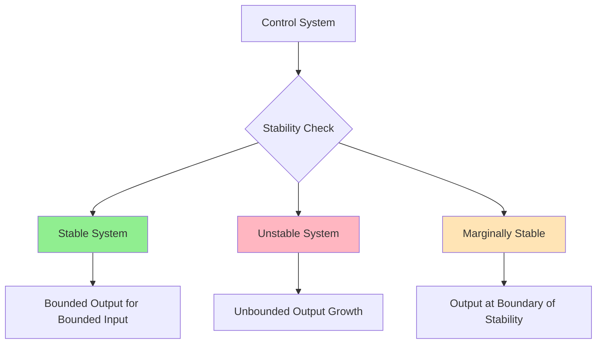
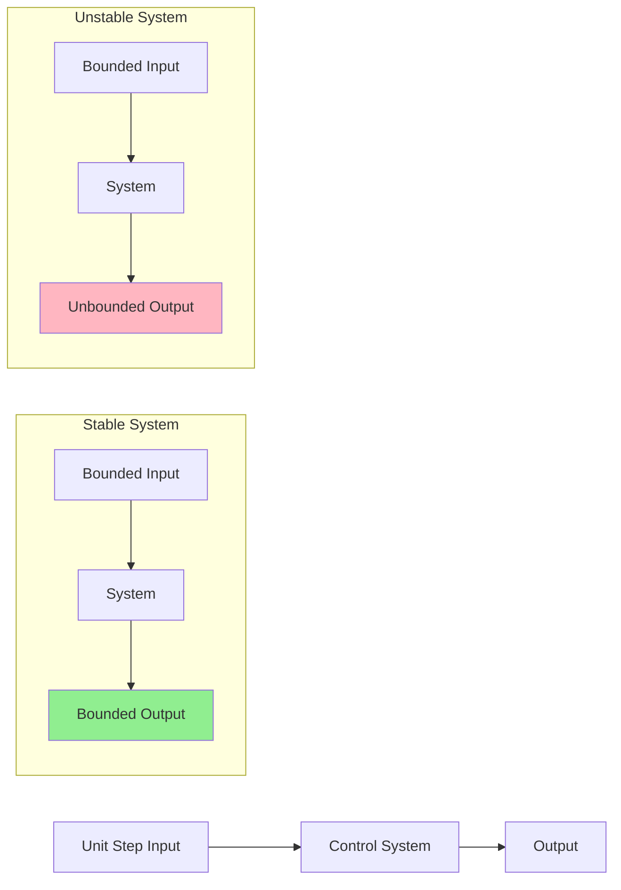
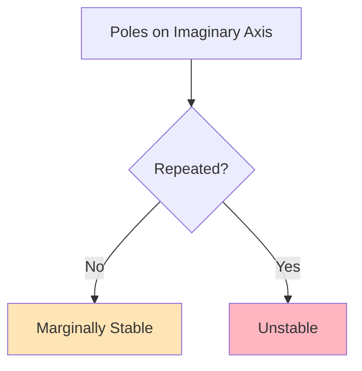
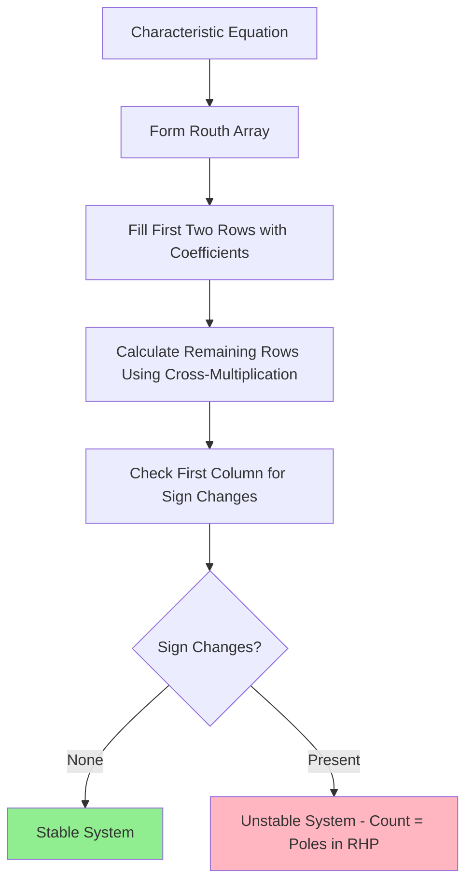
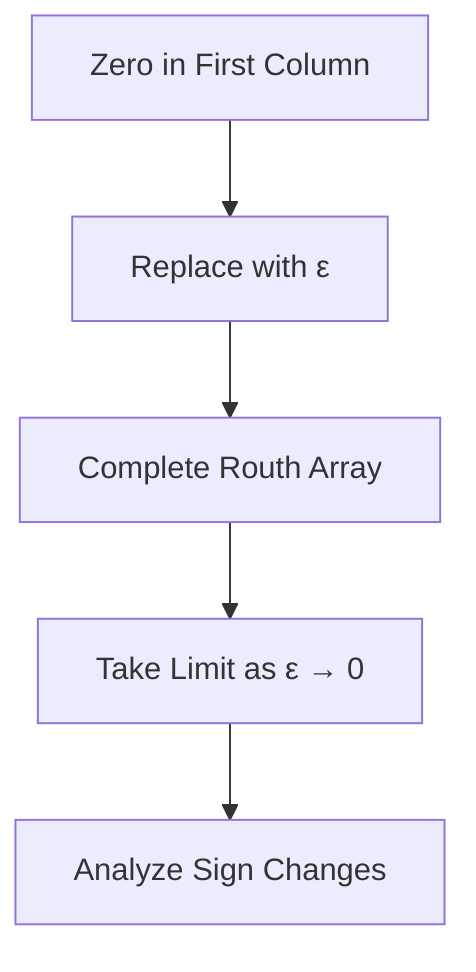
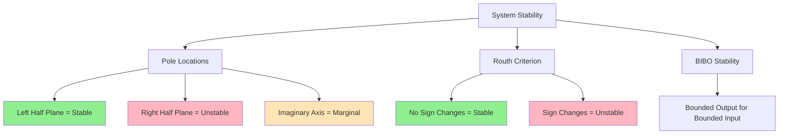

# System Stability Criteria and Routh Stability Analysis

## Table of Contents
1. [Stability Criteria Overview](#stability-criteria-overview)
2. [The Six Stability Criteria](#the-six-stability-criteria)
3. [Routh Stability Criterion](#routh-stability-criterion)
4. [Special Cases in Routh Analysis](#special-cases-in-routh-analysis)
5. [Stability Range Determination](#stability-range-determination)
6. [Practical Examples](#practical-examples)
7. [Summary](#summary)

---

## Stability Criteria Overview

System stability is a fundamental concept in control engineering that determines whether a system will produce bounded outputs for bounded inputs. A stable system returns to equilibrium after a disturbance, while an unstable system diverges from equilibrium.



---

## The Six Stability Criteria

### 1st Stability Criterion: Bounded Input-Bounded Output (BIBO)

**Definition**: A system is stable if the output is bounded with respect to bounded input.



### 2nd Stability Criterion: Asymptotic Stability

**Definition**: A system is asymptotically stable if the output tends towards zero in the absence of input, irrespective of initial conditions.

| System Type | Output Behavior | Stability |
|-------------|----------------|-----------|
| Asymptotically Stable | Decays to zero over time | ✓ Stable |
| Marginally Stable | Oscillates with constant amplitude | ⚠️ Marginal |
| Unstable | Grows without bound | ✗ Unstable |

### 3rd Stability Criterion: Pole Location

**Definition**: The stability of a system depends on poles. If all poles are located in the left half of the S-plane, the system is stable.

```mermaid
graph LR
    A[Transfer Function] --> B["T(s) = C(s)/R(s) = N(s)/D(s)"]
    B --> C[N(s) roots = Zeros]
    B --> D[D(s) roots = Poles]
    
    subgraph "S-Plane Analysis"
        E[Left Half Plane] --> F[Stable Poles]
        G[Right Half Plane] --> H[Unstable Poles]
        I[Imaginary Axis] --> J[Marginally Stable]
    end
    
    style F fill:#90EE90
    style H fill:#FFB6C1
    style J fill:#FFE4B5
```

### 4th Stability Criterion: Distance from Origin

**Definition**: As poles approach zero, stability decreases.

| Pole Location | Real Part | Stability Level |
|---------------|-----------|-----------------|
| s = -3 | -3 | Higher Stability |
| s = -1 | -1 | Lower Stability |

### 5th Stability Criterion: Imaginary Axis Poles

**Definition**: When poles are located on the imaginary axis, the system is marginally stable. These poles should not be repeated for stability.



### 6th Stability Criterion: Dominant Poles and Robust Stability

**Definition**: Poles closest to the origin are called dominant poles and most affect stability.

**Robust Stability**: The ability of a system to remain stable even when there are variations in its parameters or uncertainties.

---

## Routh Stability Criterion

The Routh stability criterion provides a method to determine system stability without actually solving for the roots of the characteristic equation.

### Routh Array Construction

For a characteristic equation: **a₀sⁿ + a₁sⁿ⁻¹ + a₂sⁿ⁻² + ... + aₙ = 0**



### Routh Array Pattern

| Row | sⁿ | sⁿ⁻¹ | sⁿ⁻² | ... |
|-----|----|----- |------|-----|
| sⁿ  | a₀ | a₂   | a₄   | ... |
| sⁿ⁻¹| a₁ | a₃   | a₅   | ... |
| sⁿ⁻²| b₁ | b₂   | b₃   | ... |
| ... | ...| ...  | ...  | ... |

Where: **b₁ = (a₁×a₂ - a₀×a₃)/a₁**

### Stability Rule

**A system is stable if and only if there are no sign changes in the first column of the Routh array.**

---

## Special Cases in Routh Analysis

### Special Case I: Zero Element in First Column

When a zero appears in the first column (but not the entire row), replace it with a small positive number ε and proceed.



### Special Case II: Entire Row of Zeros

When an entire row becomes zero, it indicates symmetric roots about the origin.

**Solution Steps:**
1. Form auxiliary equation from the row above the zero row
2. Differentiate the auxiliary equation
3. Replace the zero row with coefficients of the derivative
4. Continue with standard Routh analysis

---

## Stability Range Determination

### Finding Stability Range for Parameter K

For systems with variable parameters, the Routh criterion can determine the range of values for which the system remains stable.

**Process:**
1. Set up the characteristic equation with parameter K
2. Form the Routh array
3. Apply stability conditions (all elements in first column > 0)
4. Solve inequalities to find the range of K

### Example: Stability Range Analysis

For characteristic equation: **s³ + 8s² + 2s + 4K = 0**

| Row | s³ | s² | s¹ | s⁰ |
|-----|----|----|----|----|
| s³  | 1  | 2  |    |    |
| s²  | 8  | 4K |    |    |
| s¹  | (16-4K)/8 | 0 |    |    |
| s⁰  | 4K |    |    |    |

**Stability Conditions:**
- 4K > 0 → K > 0
- (16-4K)/8 > 0 → K < 4

**Result: 0 < K < 4**

---

## Practical Examples

### Example 1: Third-Order System

**Characteristic Equation:** s³ + 5s² + 7s + 3 = 0

**Routh Array:**
| Row | Column 1 | Column 2 |
|-----|----------|----------|
| s³  | 1        | 7        |
| s²  | 5        | 3        |
| s¹  | 32/5     | 0        |
| s⁰  | 3        |          |

**Analysis:** No sign changes in first column → **System is Stable**

### Example 2: System with Parameter

**Characteristic Equation:** s³ + 6Ks² + (K+2)s + 8 = 0

**Stability Condition:** K > 0.527

---

## Oscillatory Conditions

For a system to oscillate at a specific frequency ω, the characteristic equation should have roots at s = ±jω.

**Method:**
1. Set up the Routh array with parameters
2. For oscillation, make the s² row coefficient zero
3. Solve for the parameter values and frequency

---

## Summary

### Key Stability Indicators



### Stability Criteria Comparison

| Criterion | Method | Advantage | Limitation |
|-----------|--------|-----------|------------|
| BIBO | Input-Output Analysis | Practical meaning | Requires testing |
| Asymptotic | Time response | Clear physical interpretation | Limited to specific conditions |
| Pole Location | S-plane analysis | Direct mathematical approach | Requires finding roots |
| Routh Criterion | Algebraic method | No root calculation needed | Limited to linear systems |

### Quick Reference: Routh Stability Rules

1. **Stable System**: No sign changes in first column
2. **Unstable System**: Number of sign changes = Number of RHP poles
3. **Marginally Stable**: Zero in first column (special case analysis required)
4. **Parameter Range**: Solve inequalities from Routh conditions

---

## Applications in Control System Design

### Controller Design
- **PID Controller Tuning**: Use Routh criterion to find stable gain ranges
- **Compensator Design**: Ensure closed-loop stability
- **Robust Control**: Design for parameter uncertainties

### System Analysis
- **Stability Margins**: Determine how close system is to instability
- **Performance vs Stability**: Trade-off analysis
- **Multi-loop Systems**: Complex system stability assessment

---

*This document provides a comprehensive overview of system stability criteria with practical examples and applications in control system engineering.*