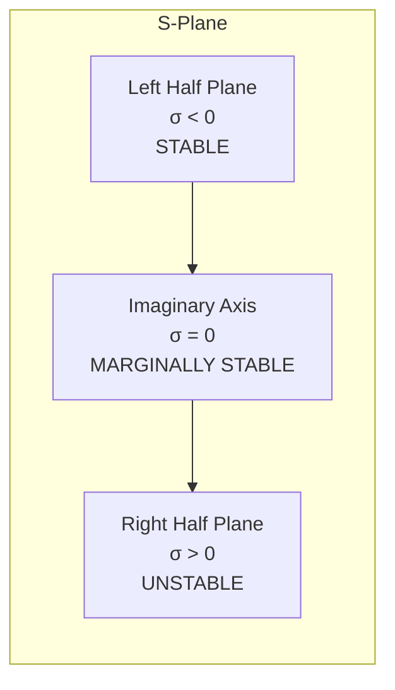
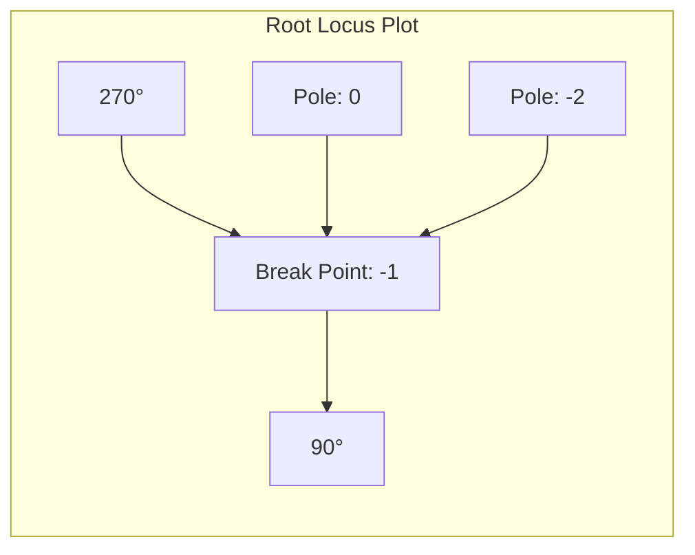

# Root Locus Analysis: Complete Guide

## Table of Contents
1. [Basics of Root Locus](#basics-of-root-locus)
2. [Rules of Root Locus](#rules-of-root-locus)
3. [Step-by-Step Procedure](#step-by-step-procedure)
4. [Worked Examples](#worked-examples)
5. [System Stability Analysis](#system-stability-analysis)
6. [Practice Problems](#practice-problems)

## Basics of Root Locus

### What is Root Locus?
Root Locus is a graphical method used in control systems to analyze how the poles (roots) of a closed-loop system move in the s-plane as a system parameter (typically gain K) varies.

### Key Properties
- **Purpose**: Plots the system's dynamic characteristics
- **Function**: Shows the location of poles and zeros on the s-plane
- **Analysis**: Explains system response and stability regions

### Stability Regions on S-Plane



| Region | Real Part (σ) | Stability |
|--------|---------------|-----------|
| Left Half Plane | σ < 0 | **Stable** |
| Imaginary Axis | σ = 0 | **Marginally Stable** |
| Right Half Plane | σ > 0 | **Unstable** |

## Rules of Root Locus

### Fundamental Rules

1. **Emergence and Termination**: Root locus emerges from poles and terminates at zeros or asymptotes
2. **Symmetry**: Root locus must be symmetric with respect to the real axis
3. **Parameter Dependency**: All steps are not compulsory, but depend on requirements

### Seven-Step Procedure

| Step | Description | Formula |
|------|-------------|---------|
| **Step 1** | Identify Roots | Total Loci = Max(P, Z) |
| **Step 2** | Number of Asymptotes | X = P - Z |
| **Step 3** | Angle of Asymptotes | θ = (2n+1)/(P-Z) × 180°, n = 0,1,2,...,(X-1) |
| **Step 4** | Centroid of Asymptotes | σc = (ΣReal Poles - ΣReal Zeros)/(P-Z) |
| **Step 5** | Break Away Points | Find dK/dS = 0 |
| **Step 6** | Angle of Departure | θd = 180° - [Σθp - Σθz] |
| **Step 7** | Intersection with Imaginary Axis | Use Routh matrix |

Where:
- P = Total number of poles
- Z = Total number of zeros
- K = System gain parameter

## Step-by-Step Procedure

### Step 1: Identify the Roots
- Find all poles and zeros of the open-loop transfer function
- Count total poles (P) and zeros (Z)
- Total number of loci = Max(P, Z)

### Step 2: Number of Asymptotes
```
X = P - Z
```

### Step 3: Angle of Asymptotes
```
θ = (2n + 1)/(P - Z) × 180°
```
where n = 0, 1, 2, ..., (X-1)

### Step 4: Centroid of Asymptotes
```
σc = (Σ Real Part of Poles - Σ Real Part of Zeros)/(P - Z)
```

### Step 5: Break Away Points
1. Find characteristic equation: 1 + G(S)H(S) = 0
2. Compute K = Polynomial
3. Compute dK/dS = 0 and solve for S

### Step 6: Angle of Departure
```
θd = 180° - [Σθp - Σθz]
```

### Step 7: Intersection to Imaginary Axis
1. Find characteristic equation: 1 + G(S)H(S) = 0
2. Construct Routh matrix
3. Find K for marginal stability
4. Place K in auxiliary equation

## Worked Examples

### Example 1: Basic Second-Order System

**Given**: G(S) = K/(S(S+2))

**Solution**:

| Step | Calculation | Result |
|------|-------------|--------|
| **Step 1** | P₁ = 0, P₂ = -2, Z = 0 | P = 2, Z = 0 |
| **Step 2** | X = P - Z = 2 - 0 | X = 2 |
| **Step 3** | θ = (2n+1)/2 × 180°, n = 0,1 | θ = 90°, 270° |
| **Step 4** | σc = (0-2-0)/(2-0) | σc = -1 |
| **Step 5** | K = -S(S+2), dK/dS = -(2S+2) = 0 | S = -1 |



### Example 2: System with Zeros

**Given**: G(S) = K(S+2)(S+3)/((S+1)(S-1))

**Solution**:

| Parameter | Value |
|-----------|-------|
| Zeros | Z₁ = -2, Z₂ = -3 |
| Poles | P₁ = -1, P₂ = 1 |
| Total Loci | Max(2,2) = 2 |
| Asymptotes | X = 2-2 = 0 |

Since P = Z, all loci terminate at finite zeros.

### Example 3: Higher-Order System

**Given**: G(S) = K(S+4/3)/(S²(S+12))

**Solution**:

| Step | Calculation | Result |
|------|-------------|--------|
| **Poles** | P₁,P₂ = 0, P₃ = -12 | P = 3 |
| **Zeros** | Z₁ = -4/3 | Z = 1 |
| **Asymptotes** | X = 3-1 = 2 | |
| **Angles** | θ = 90°, 270° | |
| **Centroid** | σc = (-12-(-4/3))/2 = -5.33 | |

## System Stability Analysis

### Routh-Hurwitz Criterion Integration

The root locus method works hand-in-hand with the Routh-Hurwitz criterion:

```mermaid
flowchart TD
    A[Characteristic Equation<br/>1 + G(S)H(S) = 0] --> B[Construct Routh Matrix]
    B --> C[Find Critical K Values]
    C --> D[Determine Stability Boundaries]
    D --> E[Plot Root Locus]
    E --> F[Analyze System Performance]
```

### Marginal Stability Conditions

For a system to be marginally stable:
1. One or more poles must lie on the imaginary axis
2. All other poles must be in the left half-plane
3. No repeated poles on the imaginary axis

## Advanced Concepts

### Break Away and Break-in Points

Break away points occur where:
```
dK/dS = 0
```

**Physical Significance**:
- Points where loci leave or enter the real axis
- Correspond to multiple roots of the characteristic equation
- Critical for determining system behavior

### Angle of Departure/Arrival

For complex poles/zeros:
```
θd = 180° ± [Σ(angles from other poles) - Σ(angles from zeros)]
```

Use **+** for departure from poles, **-** for arrival at zeros.

## Practice Problems

### Problem 1
**Given**: G(S)H(S) = K/[S(S+1)(S+3)]

Find:
1. Number of asymptotes
2. Angles of asymptotes  
3. Centroid location
4. Break away points

**Solution**:
- P = 3, Z = 0
- X = 3, θ = 60°, 180°, 300°
- σc = -4/3 = -1.33
- Break away points: Solve dK/dS = 0

### Problem 2
**Given**: Characteristic equation S³ + 5S² + (K+6)S + K = 0

Find the centroid of asymptotes.

**Solution**:
Rearrange to standard form: 1 + K(S+1)/[S(S+2)(S+3)] = 0
- Poles: 0, -2, -3
- Zero: -1
- σc = (0-2-3-(-1))/(3-1) = -2

### Problem 3
**Given**: G(S)H(S) = K(S+2)/[(S+1+j√3)(S+1-j√3)]

Determine if points S₁ = -3+j4 and S₂ = -3-j2 lie on the root locus.

**Solution**:
For a point to be on the root locus: ∠G(S)H(S) = ±n(180°)

Calculate angles at both points and verify the angle condition.

## Summary

### Key Takeaways

1. **Root Locus Provides**:
   - Visual representation of pole movement
   - Stability analysis capability
   - Design parameter selection guidance

2. **Critical Steps**:
   - Always start with pole-zero identification
   - Calculate asymptotes for systems where P > Z
   - Find break away points for real-axis behavior
   - Use Routh criterion for stability boundaries

3. **Design Applications**:
   - Controller gain selection
   - Compensation design
   - Performance specification achievement

### Common Mistakes to Avoid

| Mistake | Correction |
|---------|------------|
| Forgetting symmetry about real axis | Always draw symmetric loci |
| Incorrect asymptote angles | Use θ = (2n+1)π/(P-Z) |
| Missing break away points | Always solve dK/dS = 0 |
| Ignoring angle condition | Verify ∠G(S)H(S) = ±180° |

### Further Reading

- Control Systems Engineering by Norman Nise
- Modern Control Engineering by Katsuhiko Ogata
- Automatic Control Systems by Benjamin Kuo

---

*This document provides a comprehensive guide to Root Locus analysis for control systems engineering. For additional examples and advanced topics, refer to standard control systems textbooks and practice with MATLAB/Simulink simulations.*