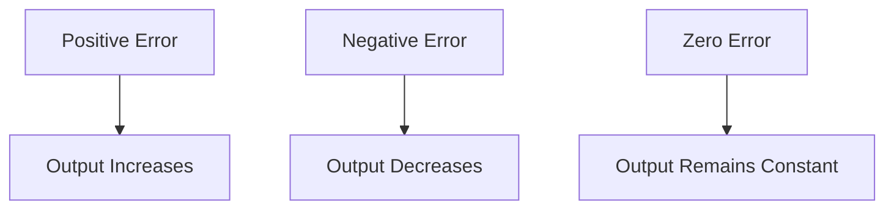
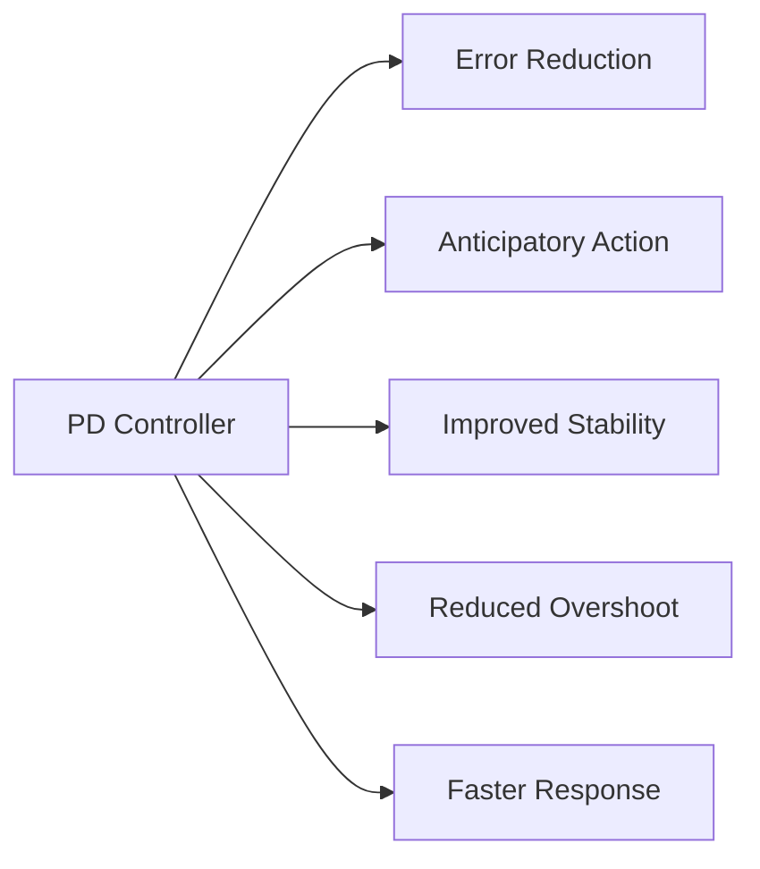
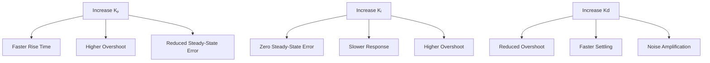
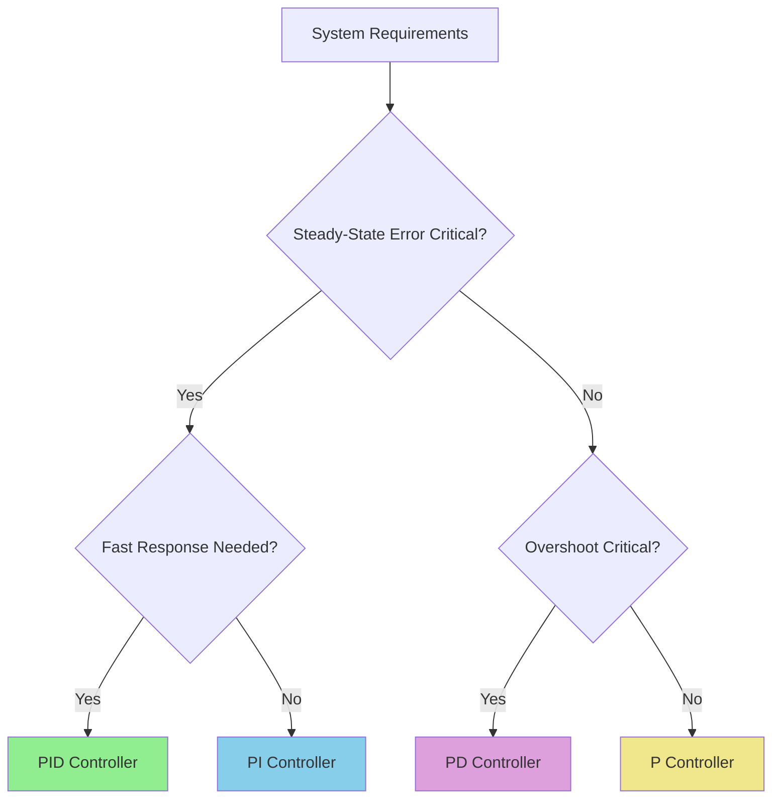
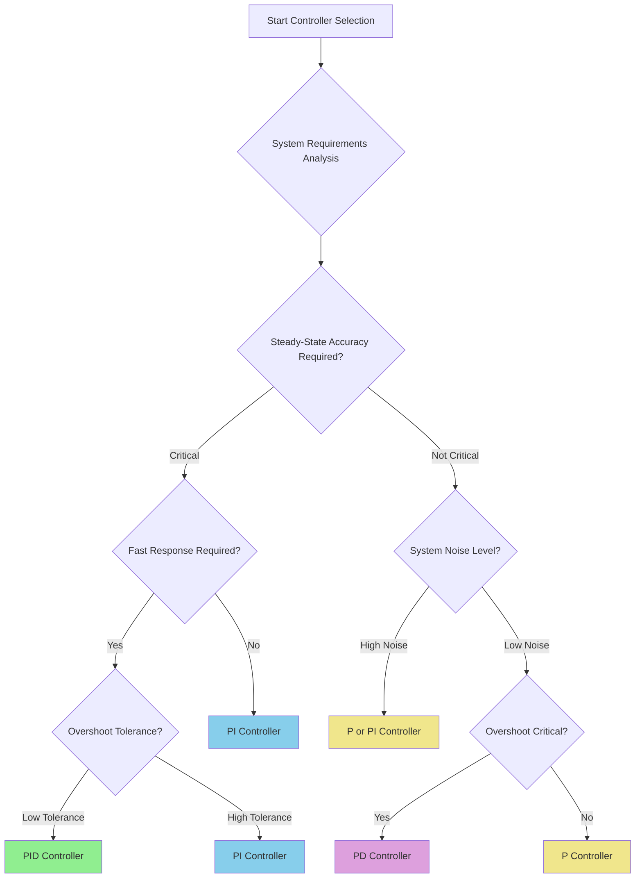

# PID Controllers: Complete Guide

## Table of Contents
1. [Introduction to Controllers](#introduction-to-controllers)
2. [Proportional (P) Controller](#proportional-p-controller)
3. [Integral (I) Controller](#integral-i-controller)
4. [Derivative (D) Controller](#derivative-d-controller)
5. [PI Controller](#pi-controller)
6. [PD Controller](#pd-controller)
7. [PID Controller](#pid-controller)
8. [Controller Comparison](#controller-comparison)
9. [Tuning Methods](#tuning-methods)
10. [Applications](#applications)

## Introduction to Controllers

### What are Controllers?
Controllers are devices or algorithms that maintain desired system outputs by manipulating system inputs based on the error between desired (reference) and actual outputs.

### Basic Control Loop Structure

```mermaid
graph LR
    A[Reference Input R(s)] --> B[Σ]
    B --> C[Controller]
    C --> D[Plant/System]
    D --> E[Output C(s)]
    E --> F[Feedback H(s)]
    F --> B
    B --> G[Error Signal E(s)]
    
    style B fill:#ff9999
    style C fill:#99ccff
    style D fill:#99ff99
```

**Key Components:**
- **Error Signal**: E(s) = R(s) - F(s)
- **Controller**: Processes error to generate control signal
- **Plant**: The system being controlled
- **Feedback**: Provides information about actual output

## Proportional (P) Controller

### Basic Principle
The proportional controller produces an output that is directly proportional to the error signal.

### Mathematical Representation

| Domain | Equation |
|--------|----------|
| **Time Domain** | M(t) = Kₚ × E(t) |
| **Frequency Domain** | M(s) = Kₚ × E(s) |
| **Transfer Function** | G(s) = Kₚ |

### Block Diagram

```mermaid
graph LR
    A[Error E(s)] --> B[Kₚ]
    B --> C[Control Signal M(s)]
    
    style B fill:#ffcc99
```

### Physical Understanding

**Effect of Kₚ Values:**
- **High Kₚ**: Faster response, but may cause overshoot
- **Low Kₚ**: Slower response, more stable

### For Standard 2nd Order System

Given: Plant = ωₙ²/[S(S + 2ξωₙ)]

**Closed-loop Transfer Function:**
```
T(s) = Kₚωₙ²/(S² + 2ξωₙS + Kₚωₙ²)
```

### Advantages ✅
- **Simplicity**: Easy to implement and understand
- **Stability**: Stable for simple systems
- **Fast Response**: Higher Kₚ gives faster response

### Disadvantages ❌
- **Steady-State Error**: Cannot eliminate offset
- **Overshoot**: High gains cause overshoot
- **Load Sensitivity**: Sensitive to disturbances

## Integral (I) Controller

### Basic Principle
The integral controller produces an output proportional to the integral (sum) of the error signal over time.

### Mathematical Representation

| Domain | Equation |
|--------|----------|
| **Time Domain** | M(t) = Kᵢ ∫ E(t)dt |
| **Frequency Domain** | M(s) = (Kᵢ/s) × E(s) |
| **Transfer Function** | G(s) = Kᵢ/s |

### Block Diagram

```mermaid
graph LR
    A[Error E(s)] --> B[Kᵢ/s]
    B --> C[Control Signal M(s)]
    
    style B fill:#99ff99
```

### Physical Understanding



**Key Insight**: Integration accumulates error over time, making it excellent for eliminating steady-state errors.

### For Standard 2nd Order System

**Closed-loop Transfer Function:**
```
T(s) = Kᵢωₙ²/(S³ + 2ξωₙS² + Kᵢωₙ²)
```

**Effect**: Adds a pole at origin, making the system Type-1, but reduces stability margin.

### Advantages ✅
- **Zero Steady-State Error**: Eliminates offset completely
- **Improved Accuracy**: Better long-term performance
- **Disturbance Rejection**: Compensates for constant disturbances

### Disadvantages ❌
- **Slower Response**: Introduces lag
- **Reduced Stability**: Additional pole reduces stability margin
- **Integrator Windup**: Can saturate in practical systems

## Derivative (D) Controller

### Basic Principle
The derivative controller produces an output proportional to the rate of change of error.

### Mathematical Representation

| Domain | Equation |
|--------|----------|
| **Time Domain** | M(t) = Kd × dE(t)/dt |
| **Frequency Domain** | M(s) = Kd × s × E(s) |
| **Transfer Function** | G(s) = Kd × s |

### Block Diagram

```mermaid
graph LR
    A[Error E(s)] --> B[Kd × s]
    B --> C[Control Signal M(s)]
    
    style B fill:#ff99cc
```

### Physical Understanding

**Derivative Action:**
- **Anticipatory**: Responds to rate of change
- **Predictive**: Acts before error becomes large
- **Damping**: Reduces overshoot and oscillations

### For Standard 2nd Order System

**Closed-loop Transfer Function:**
```
T(s) = Kdωₙ²/(S + 2ξωₙ + Kdωₙ²)
```

**Effect**: Adds a zero, improving stability and reducing overshoot.

### Advantages ✅
- **Improved Stability**: Adds phase lead
- **Reduced Overshoot**: Provides damping
- **Faster Settling**: Quicker to reach steady state
- **Anticipatory Action**: Responds to trends

### Disadvantages ❌
- **Noise Amplification**: Sensitive to high-frequency noise
- **No Steady-State Improvement**: Cannot eliminate offset
- **Implementation Challenges**: Requires noise filtering

## PI Controller

### Basic Principle
Combines proportional and integral actions to achieve both good transient response and zero steady-state error.

### Mathematical Representation

| Domain | Equation |
|--------|----------|
| **Time Domain** | M(t) = KₚE(t) + Kᵢ∫E(t)dt |
| **Frequency Domain** | M(s) = [Kₚ + Kᵢ/s]E(s) |
| **Transfer Function** | G(s) = Kₚ + Kᵢ/s = (KₚS + Kᵢ)/s |

### Block Diagram

```mermaid
graph TD
    A[Error E(s)] --> B[Kₚ]
    A --> C[Kᵢ/s]
    B --> D[Σ]
    C --> D
    D --> E[Control Signal M(s)]
    
    style B fill:#ffcc99
    style C fill:#99ff99
    style D fill:#ff9999
```

### For Standard 2nd Order System

**Closed-loop Transfer Function:**
```
T(s) = (KᵢKₚS + Kᵢ)ωₙ²/[S³ + 2ξωₙS² + KₚωₙS + Kᵢωₙ²]
```

### Key Benefits

| Advantage | Source | Description |
|-----------|--------|-------------|
| **Zero Steady-State Error** | Integral Action | Eliminates offset completely |
| **Better Stability** | Combined Action | More stable than pure I controller |
| **Improved Damping** | Proportional Action | Better than pure I controller |
| **Easy Tuning** | Well-established methods | Ziegler-Nichols, manual tuning |

### Advantages ✅
- **Zero Offset**: Eliminates steady-state error
- **Improved Damping**: Better than I-only control
- **Lower Overshoot**: Balanced response
- **Easy Implementation**: Well-understood behavior

### Disadvantages ❌
- **Increased Rise Time**: Slower than P-only
- **Not Ideal for Oscillatory Systems**: Limited performance

## PD Controller

### Basic Principle
Combines proportional and derivative actions for improved stability and reduced overshoot.

### Mathematical Representation

| Domain | Equation |
|--------|----------|
| **Time Domain** | M(t) = KₚE(t) + Kd × dE(t)/dt |
| **Frequency Domain** | M(s) = [Kₚ + Kd × s]E(s) |
| **Transfer Function** | G(s) = Kₚ + Kd × s |

### Block Diagram

```mermaid
graph TD
    A[Error E(s)] --> B[Kₚ]
    A --> C[Kd × s]
    B --> D[Σ]
    C --> D
    D --> E[Control Signal M(s)]
    
    style B fill:#ffcc99
    style C fill:#ff99cc
    style D fill:#ff9999
```

### For Standard 2nd Order System

**Closed-loop Transfer Function:**
```
T(s) = (Kₚ + sKd)ωₙ²/[S² + S(2ξωₙ + Kdωₙ²) + Kₚωₙ²]
```

### Key Benefits



### Advantages ✅
- **Improved Stability**: Derivative adds phase lead
- **Reduced Overshoot**: Better damping characteristics
- **Faster Transient Response**: Quick settling
- **Lower Settling Time**: Reaches steady state faster

### Disadvantages ❌
- **Steady-State Error**: Cannot eliminate offset
- **Noise Sensitivity**: Derivative amplifies noise
- **Careful Tuning Required**: More complex than P-only

## PID Controller

### Basic Principle
Combines all three control actions (P, I, D) to achieve optimal performance: fast response, zero steady-state error, and good stability.

### Mathematical Representation

| Domain | Equation |
|--------|----------|
| **Time Domain** | M(t) = KₚE(t) + Kᵢ∫E(t)dt + Kd × dE(t)/dt |
| **Frequency Domain** | M(s) = [Kₚ + Kᵢ/s + Kd × s]E(s) |
| **Transfer Function** | G(s) = Kₚ + Kᵢ/s + Kd × s |

### Block Diagram

```mermaid
graph TD
    A[Error E(s)] --> B[Kₚ]
    A --> C[Kᵢ/s]
    A --> D[Kd × s]
    B --> E[Σ]
    C --> E
    D --> E
    E --> F[Control Signal M(s)]
    
    style B fill:#ffcc99
    style C fill:#99ff99
    style D fill:#ff99cc
    style E fill:#ff9999
```

### For Standard 2nd Order System

**Closed-loop Transfer Function:**
```
T(s) = ωₙ²(KdS² + KₚS + Kᵢ)/[S³ + S²(2ξωₙ + Kdωₙ²) + S(Kₚωₙ²) + Kᵢωₙ²]
```

### Component Contributions

| Component | Primary Benefit | Effect on System |
|-----------|----------------|------------------|
| **Proportional (P)** | Fast Response | Reduces rise time, increases speed |
| **Integral (I)** | Zero Steady-State Error | Eliminates offset completely |
| **Derivative (D)** | Stability & Damping | Reduces overshoot, improves settling |

### PID Tuning Effects



### Advantages ✅
- **Optimal Performance**: Best of all three components
- **Zero Steady-State Error**: From integral action
- **Good Stability**: From derivative action
- **Fast Response**: From proportional action
- **Versatile**: Suitable for most applications

### Disadvantages ❌
- **Complex Tuning**: Three parameters to optimize
- **System Complexity**: More sophisticated implementation
- **Potential Interactions**: Components can interfere with each other

## Controller Comparison

### Performance Comparison Table

| Parameter | P Controller | PI Controller | PD Controller | PID Controller |
|-----------|-------------|---------------|---------------|----------------|
| **Time Domain Equation** | M(t) = KₚE(t) | M(t) = KₚE(t) + Kᵢ∫E(t)dt | M(t) = KₚE(t) + Kd(dE(t)/dt) | M(t) = KₚE(t) + Kᵢ∫E(t)dt + Kd(dE(t)/dt) |
| **Transfer Function** | Kₚ | Kₚ + Kᵢ/s | Kₚ + Kd·s | Kₚ + Kᵢ/s + Kd·s |
| **System Type** | No change | Increases by 1 | No change | Increases by 1 |
| **Steady-State Error** | ❌ Exists | ✅ Zero | ❌ Exists | ✅ Zero |
| **Rise Time** | Fast (high Kₚ) | Slower | Fast | Moderate |
| **Overshoot** | High (high Kₚ) | Moderate | Low | Low |
| **Settling Time** | Moderate | Slow | Fast | Fast |
| **Stability** | Good | Reduced | Improved | Good |
| **Noise Sensitivity** | Low | Low | High | High |
| **Implementation** | Simple | Easy | Moderate | Complex |

### Application Guidelines



## Tuning Methods

### Ziegler-Nichols Method

#### Closed-Loop Method (Ultimate Gain Method)

**Steps:**
1. Set Kᵢ = 0 and Kd = 0
2. Increase Kₚ until system oscillates (critical gain Kcr)
3. Measure oscillation period Pcr
4. Apply Ziegler-Nichols formulas:

| Controller | Kₚ | Kᵢ | Kd |
|------------|----|----|-----|
| **P** | 0.5 × Kcr | - | - |
| **PI** | 0.45 × Kcr | 1.2Kₚ/Pcr | - |
| **PID** | 0.6 × Kcr | 2Kₚ/Pcr | KₚPcr/8 |

#### Open-Loop Method (Process Reaction Curve)

**Steps:**
1. Apply step input to open-loop system
2. Measure response parameters: L (delay time), T (time constant)
3. Apply formulas:

| Controller | Kₚ | Kᵢ | Kd |
|------------|----|----|-----|
| **P** | T/(L×K) | - | - |
| **PI** | 0.9T/(L×K) | Kₚ/(3.3L) | - |
| **PID** | 1.2T/(L×K) | 2Kₚ/T | KₚL/2 |

### Modern Tuning Methods

1. **Pole Placement**: Place closed-loop poles at desired locations
2. **LQR (Linear Quadratic Regulator)**: Minimize cost function
3. **Model Predictive Control**: Use system model for optimization
4. **Auto-tuning**: Automated parameter adjustment

## Applications

### Industrial Applications

| Industry | Application | Preferred Controller | Reason |
|----------|-------------|---------------------|---------|
| **Process Control** | Temperature Control | **PID** | Requires zero offset, good stability |
| **Chemical** | pH Control | **PI** | Steady-state accuracy critical |
| **Automotive** | Cruise Control | **PID** | Speed accuracy and comfort |
| **Aerospace** | Altitude Control | **PID** | Precision and stability required |
| **Manufacturing** | Motor Speed Control | **PI/PID** | Accuracy and load disturbance rejection |
| **HVAC** | Temperature Regulation | **PI** | Energy efficiency and comfort |

### Controller Selection Criteria



### Performance Metrics

**Key Performance Indicators:**

1. **Rise Time (tr)**: Time to reach 90% of final value
2. **Settling Time (ts)**: Time to reach ±2% of final value
3. **Overshoot (Mp)**: Maximum percentage above final value
4. **Steady-State Error (ess)**: Final error between reference and output

**Typical Performance Goals:**
- Minimize rise time while maintaining stability
- Achieve zero steady-state error for step inputs
- Limit overshoot to acceptable levels (<20%)
- Minimize settling time for productivity

## Summary

### Quick Reference Guide

| Need | Recommended Controller | Key Benefits |
|------|----------------------|--------------|
| **Simple Speed Control** | P Controller | Fast, simple implementation |
| **Zero Steady-State Error** | PI Controller | Eliminates offset, good for slow systems |
| **Reduced Overshoot** | PD Controller | Good damping, faster settling |
| **Optimal Performance** | PID Controller | Best overall performance |

### Best Practices

1. **Start Simple**: Begin with P controller, add I and D as needed
2. **Understand Trade-offs**: Each parameter affects multiple performance aspects
3. **Consider System Characteristics**: Match controller to system dynamics
4. **Account for Noise**: Limit derivative gain in noisy environments
5. **Use Systematic Tuning**: Apply established methods rather than trial-and-error
6. **Monitor Performance**: Continuously evaluate and adjust parameters
7. **Safety First**: Ensure stable operation under all conditions

### Future Trends

- **Adaptive Control**: Controllers that automatically adjust parameters
- **Robust Control**: Designed to handle uncertainty and variations
- **Digital Implementation**: Software-based controllers with advanced features
- **Machine Learning**: AI-enhanced parameter optimization
- **Networked Control**: Controllers operating over communication networks

---

*This comprehensive guide provides the foundation for understanding and implementing PID controllers in control systems engineering. For specific applications, always consider system requirements, constraints, and safety factors when selecting and tuning controllers.*