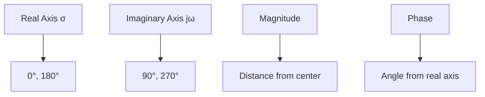

# Polar Plot Tutorial - Complete Guide

## Table of Contents
1. [Basics of Polar Plot](#basics-of-polar-plot)
2. [Procedure for Drawing Polar Plot](#procedure-for-drawing-polar-plot)
3. [Advantages of Polar Plot](#advantages-of-polar-plot)
4. [Polar Plot Parameters](#polar-plot-parameters)
5. [Stability Analysis](#stability-analysis)
6. [Worked Examples](#worked-examples)

---

## Basics of Polar Plot

A **Polar Plot** is a graphical representation used in control systems for analyzing frequency response characteristics.

### Key Features:
- Used for frequency response characteristics of the system
- Plot of magnitude and phase by varying frequency from zero to infinity
- Plotted on a real-imaginary plane with a circular pattern

### Coordinate System:



| Angle | Direction | Coordinates |
|-------|-----------|-------------|
| 0° | Positive Real | (1, 0) |
| 90° | Positive Imaginary | (0, j) |
| 180° | Negative Real | (-1, 0) |
| 270° | Negative Imaginary | (0, -j) |

---

## Procedure for Drawing Polar Plot

The polar plot is constructed using the open loop transfer function G(S).

### Step-by-Step Process:

```mermaid
flowchart TD
    A[Step 1: Determine G(S)] --> B[Step 2: Substitute S = jω]
    B --> C[Step 3: Find magnitude and phase at ω=0 and ω=∞]
    C --> D[Step 4: Separate real and imaginary parts]
    D --> E[Step 5: Find intersections with axes]
    E --> F[Step 6: Plot the curve]
```

### Mathematical Steps:

1. **Start with Open Loop Transfer Function**: G(S)
2. **Substitute S = jω**: G(jω) = |G(jω)| ∠G(jω)
3. **Calculate boundary conditions**:
   - At ω = 0: Find magnitude and phase
   - At ω = ∞: Find magnitude and phase
4. **Separate components**: G(jω) = Real[G(jω)] + j·Imag[G(jω)]
5. **Find axis intersections**:
   - Real axis: Set Imag[G(jω)] = 0
   - Imaginary axis: Set Real[G(jω)] = 0

---

## Advantages of Polar Plot

| Advantage | Description |
|-----------|-------------|
| **Comprehensive Display** | Single plot shows both magnitude and phase characteristics |
| **Stability Analysis** | Easy graphical study of stability compared to Root Locus and Bode plots |
| **Frequency Parameters** | Easy determination of gain crossover frequency (ωGC) and phase crossover frequency (ωPC) |
| **Open Loop Analysis** | Can be plotted directly from open loop transfer function |

---

## Polar Plot Parameters

### Critical Point and Stability

The **critical point (-1, 0)** is fundamental for stability analysis.

```mermaid
graph LR
    A[Polar Plot] --> B{Does plot enclose (-1,0)?}
    B -->|Yes| C[Unstable System]
    B -->|No| D[Stable System]
    B -->|Passes through| E[Critically Stable]
```

### Phase Cross-Over Frequency (ωPC)

- **Definition**: Frequency at which phase crosses -180°
- **Gain Margin**: GM = 20 log(1/X) where X is magnitude at ωPC

### Gain Cross-Over Frequency (ωGC)

- **Definition**: Frequency at which gain crosses unit magnitude
- **Phase Margin**: Angle measured from -180° in anticlockwise direction to ωGC point

### Stability Conditions

| System Type | Condition | Gain Margin |
|-------------|-----------|-------------|
| **Stable** | ωPC > ωGC | GM = +ve |
| **Unstable** | ωPC < ωGC | GM = -ve |
| **Critically Stable** | ωPC = ωGC | GM = 0 |

---

## Stability Analysis

### Requirements for Polar Plot Stability Analysis

```mermaid
graph TD
    A[Polar Plot Stability Analysis] --> B[Only applicable to minimum phase systems]
    B --> C[All poles and zeros in left half plane of S-plane]
    C --> D[Check enclosure of critical point (-1,0)]
```

### Stability Rules:

1. **Stable System**: (-1, 0) is NOT enclosed by polar plot
2. **Unstable System**: (-1, 0) IS enclosed by polar plot
3. **Critically Stable**: Polar plot passes through (-1, 0)

---

## Worked Examples

### Example 1: Type '0' System

**Transfer Function**: G(S) = K/[(1 + ST₁)(1 + ST₂)]

**Key Points**:
- At ω = 0: Magnitude = K, Phase = 0°
- At ω = ∞: Magnitude = 0, Phase = -180°
- Real axis intersection at ω = 1/√(T₁T₂)

### Example 2: Type '1' System

**Transfer Function**: G(S) = K/[S(1 + ST₁)(1 + ST₂)]

**Key Points**:
- At ω = 0: Magnitude = ∞, Phase = -90°
- At ω = ∞: Magnitude = 0, Phase = -270°
- Real axis intersection at ω = 1/√(T₁T₂)

### Example 3: Higher Order System

**Transfer Function**: G(S) = S³/[(S + 1)(S + 2)]

**Analysis Steps**:
1. Substitute S = jω
2. Calculate magnitude: |G(jω)| = ω³/[√(1+ω²)√(4+ω²)]
3. Calculate phase: ∠G(jω) = 270° - tan⁻¹(ω) - tan⁻¹(ω/2)

### Example 4: Multiple Pole System

**Transfer Function**: G(S) = 10/[(S + 2)(S + 4)]

**Key Results**:
- At ω = 0: Magnitude = 1.25, Phase = 0°
- At ω = ∞: Magnitude = 0, Phase = -180°
- Real axis intersection at ω = 2√2 rad/sec

---

## Summary of System Types

| System Type | Characteristic | Starting Point | Ending Point |
|-------------|----------------|----------------|--------------|
| **Type 0** | No poles at origin | (K, 0°) | (0, -n×90°) |
| **Type 1** | One pole at origin | (∞, -90°) | (0, -(n+1)×90°) |
| **Type 2** | Two poles at origin | (∞, -180°) | (0, -(n+2)×90°) |

Where n = number of finite poles

---

## Key Formulas

### Gain Margin
```
GM = 20 log(1/X) dB
```
where X is the magnitude at phase crossover frequency

### Phase Margin
```
φPM = 180° + ∠G(jωGC)
```
where ωGC is the gain crossover frequency

### General Form
```
G(jω) = |G(jω)| ∠G(jω)
G(jω) = Real[G(jω)] + j·Imag[G(jω)]
```

---

## Notes

- Polar plots provide a complete frequency domain representation
- Critical for understanding system stability without solving characteristic equations
- Essential tool in classical control theory
- Particularly useful for design of compensators and controllers

---

*This document provides a comprehensive overview of polar plots in control systems. For advanced applications, consider studying Nyquist stability criterion and its relationship to polar plots.*