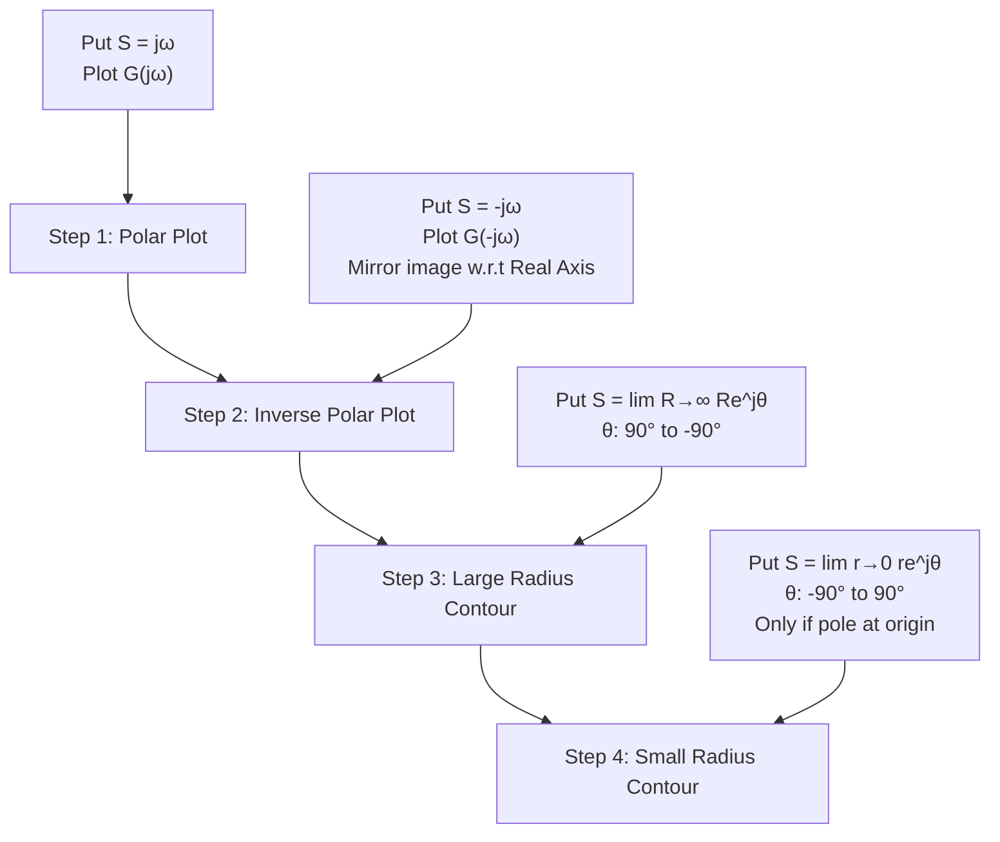
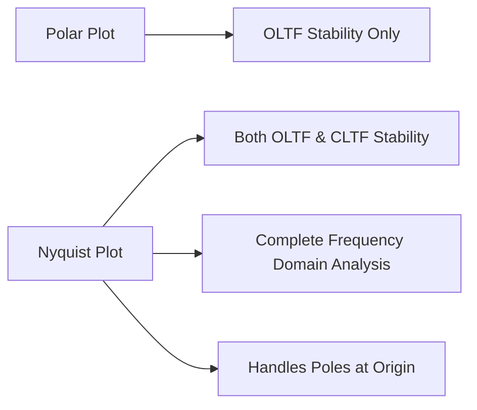
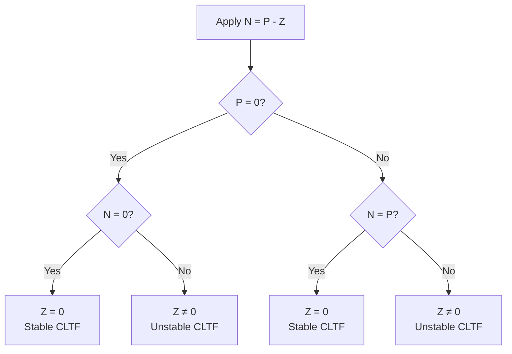
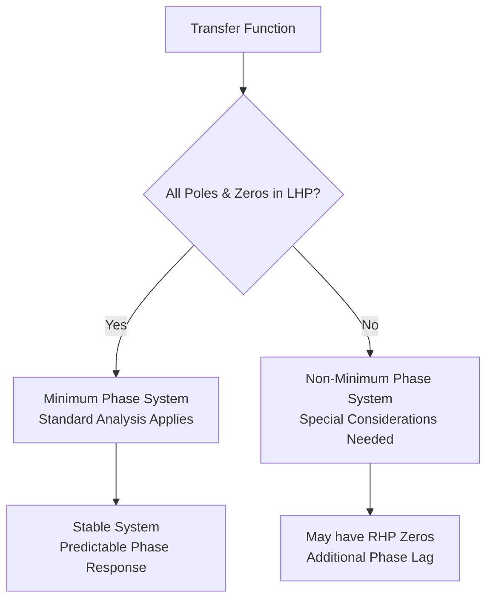
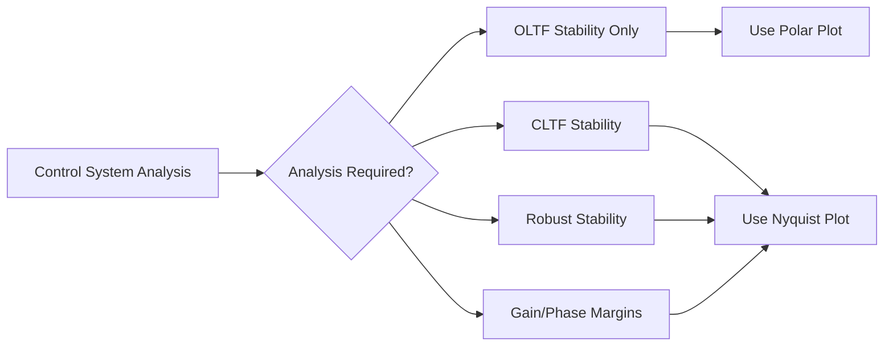

# Nyquist Plot Tutorial - Complete Guide

## Table of Contents
1. [Introduction to Nyquist Plot](#introduction-to-nyquist-plot)
2. [Steps for Constructing Nyquist Plot](#steps-for-constructing-nyquist-plot)
3. [Stability Analysis using Nyquist Plot](#stability-analysis-using-nyquist-plot)
4. [Nyquist Stability Criterion](#nyquist-stability-criterion)
5. [Worked Examples](#worked-examples)
6. [System Parameters and Frequency Response](#system-parameters-and-frequency-response)

---

## Introduction to Nyquist Plot

The **Nyquist Plot** is a powerful graphical tool used in control systems for analyzing both open-loop and closed-loop stability. Unlike polar plots which only analyze open-loop transfer functions, Nyquist plots can determine the stability of both OLTF (Open Loop Transfer Function) and CLTF (Closed Loop Transfer Function).

### Key Features:
- Combines polar plot with its inverse (mirror image)
- Includes Nyquist contour for complete frequency analysis
- Enables stability analysis of closed-loop systems from open-loop data
- Critical point analysis at (-1, 0)

---

## Steps for Constructing Nyquist Plot

The Nyquist plot construction involves four main steps:



### Detailed Steps:

| Step | Substitution | Description | When Required |
|------|-------------|-------------|---------------|
| **Step 1** | S = jω | Standard polar plot from ω = 0⁺ to ω = ∞ | Always |
| **Step 2** | S = -jω | Inverse polar plot (mirror image) from ω = ∞ to ω = 0⁻ | Always |
| **Step 3** | S = Re^jθ, R→∞ | Large semicircular arc, θ from 90° to -90° | Always |
| **Step 4** | S = re^jθ, r→0 | Small semicircular arc, θ from -90° to 90° | Only if poles at origin |

---

## Stability Analysis using Nyquist Plot

### Advantage over Polar Plot



### Critical Point Analysis

The **critical point (-1, 0)** is fundamental for stability analysis in Nyquist plots, just as in polar plots.

---

## Nyquist Stability Criterion

### The Fundamental Equation

```
N = P - Z
```

Where:
- **N** = Number of encirclements around (-1, 0)
  - Positive for anticlockwise encirclements
  - Negative for clockwise encirclements
- **P** = Number of open-loop poles in Right Half Plane (RHP)
- **Z** = Number of closed-loop poles in Right Half Plane (RHP)

### Stability Analysis Table

| P (OLTF Poles in RHP) | Z (CLTF Poles in RHP) | System Stability |
|----------------------|----------------------|------------------|
| **P = 0** | **Z = 0** | Both OLTF and CLTF are **stable** |
| **P ≠ 0** | **Z = 0** | OLTF **unstable**, CLTF **stable** |
| **P = 0** | **Z ≠ 0** | OLTF **stable**, CLTF **unstable** |
| **P ≠ 0** | **Z ≠ 0** | Both OLTF and CLTF are **unstable** |

### Stability Decision Tree



---

## Worked Examples

### Example 1: Basic Nyquist Analysis

**Transfer Function**: G(S) = (4S + 1)/[S²(S + 1)(2S + 1)]

**Analysis**:
- N = -2 (clockwise encirclements)
- P = 0 (no RHP poles in OLTF)
- Therefore: Z = P - N = 0 - (-2) = 2
- **Result**: CLTF has 2 poles in RHP → **Unstable**

### Example 2: Type 1 System Analysis

**Transfer Function**: G(S) = 1/[S²(S + 1)(2S + 1)]

**Key Steps**:
1. Polar plot: S = jω
2. Inverse polar plot: S = -jω  
3. Large radius contour: S = lim(R→∞) Re^jθ
4. Small radius contour: S = lim(r→0) re^jθ (needed due to poles at origin)

**Result**: Complete Nyquist plot determines CLTF stability

### Example 3: Stability with Different Gain Values

**Transfer Function**: G(S) = K/[(S² + 2S + 2)(S + 2)]

**Analysis for Different K values**:
- **K = 10**: No encirclement → N = 0, Z = 0 → **Stable**
- **K = 100**: Encirclement present → N ≠ 0, Z ≠ 0 → **Unstable**

---

## System Parameters and Frequency Response

### Phase and Gain Margins

#### Phase Margin Calculation
```
φ_PM = 180° + ∠G(jω_gc)
```
Where ω_gc is the gain crossover frequency

#### Gain Margin Calculation  
```
GM = 20 log(1/M_pc) dB
```
Where M_pc is the magnitude at phase crossover frequency

### Frequency Response Analysis

#### Key Parameters:

| Parameter | Symbol | Definition |
|-----------|--------|------------|
| **Gain Crossover Frequency** | ω_gc | Frequency where \|G(jω)\| = 1 |
| **Phase Crossover Frequency** | ω_pc | Frequency where ∠G(jω) = -180° |
| **Phase Margin** | φ_PM | Phase difference from -180° at ω_gc |
| **Gain Margin** | GM | Gain difference from 0 dB at ω_pc |

### System Classification

#### Minimum vs Non-Minimum Phase Systems



#### Stability Conditions

| System Type | Condition | Characteristics |
|-------------|-----------|-----------------|
| **Stable** | All poles in LHP | Bounded response to bounded input |
| **Marginally Stable** | Poles on jω-axis | Sustained oscillations |
| **Unstable** | Poles in RHP | Unbounded response |

---

## Advanced Examples

### Example: Conditional Stability

**Scenario**: System stable for certain gain ranges
- **Analysis**: Multiple intersections with critical point
- **Stable Regions**: Determined by encirclement count
- **Application**: Gain scheduling and robust control

### Example: Time Delay Systems

**Transfer Function**: G(S) = (πe^(-0.25S))/S

**Key Points**:
- Phase contribution: φ = -90° - 0.25ω
- Magnitude: M = π/ω
- **Critical Frequency**: Where phase = -180°

### Example: Higher Order Systems

**Analysis Approach**:
1. Determine pole-zero locations
2. Calculate frequency response
3. Apply Nyquist criterion
4. Verify stability margins

---

## Summary of Key Concepts

### When to Use Nyquist Plots



### Design Guidelines

| Design Parameter | Recommended Value | Impact |
|------------------|-------------------|--------|
| **Gain Margin** | > 6 dB | Robustness to gain variations |
| **Phase Margin** | 30° - 60° | Transient response quality |
| **Crossover Frequency** | Application dependent | Bandwidth and speed |

---

## Key Formulas Reference

### Nyquist Criterion
```
N = P - Z
```

### Frequency Response
```
G(jω) = |G(jω)| ∠G(jω)
G(jω) = Real[G(jω)] + j·Imag[G(jω)]
```

### Stability Margins
```
GM = 20 log(1/M_pc) dB
φ_PM = 180° + ∠G(jω_gc)
```

### Complex Plane Representation
```
S = σ + jω (general)
S = jω (polar plot)
S = -jω (inverse polar plot)
S = Re^jθ (large radius contour)
S = re^jθ (small radius contour)
```

---

## Notes for Practical Application

1. **Always verify minimum phase assumption** before applying standard Nyquist analysis
2. **Count encirclements carefully** - direction matters for stability determination
3. **Consider both gain and phase margins** for robust design
4. **Use Nyquist plots for MIMO systems** with appropriate modifications
5. **Combine with other techniques** (Root Locus, Bode) for complete analysis

---

*This document provides a comprehensive overview of Nyquist plots in control systems. The Nyquist criterion is one of the most powerful tools for stability analysis and controller design in classical control theory.*