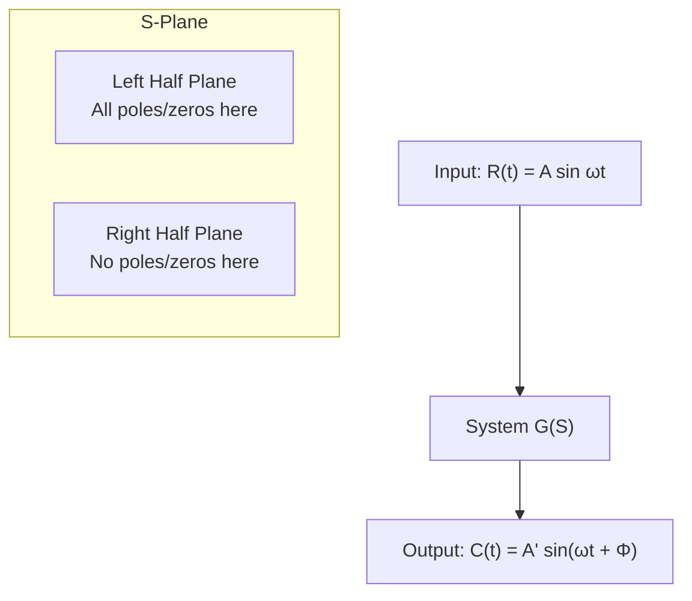
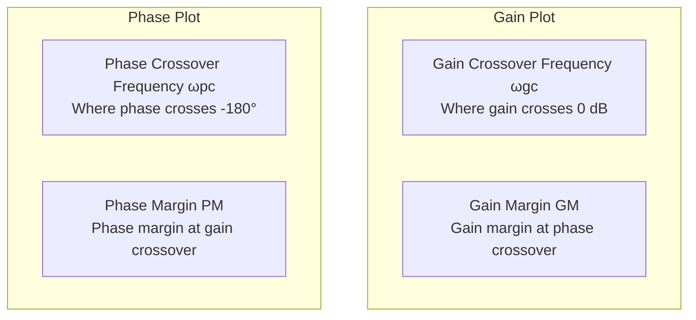
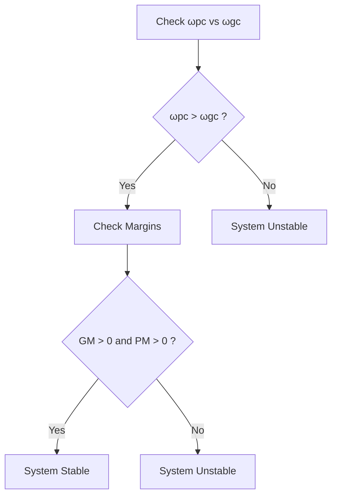

# Complete Guide to Bode Plots

## Table of Contents
1. [Basics of Bode Plot](#basics-of-bode-plot)
2. [Procedure of Bode Plot](#procedure-of-bode-plot)
3. [Parameters of Bode Plot](#parameters-of-bode-plot)
4. [Stability Analysis](#stability-analysis)
5. [Advantages of Bode Plot](#advantages-of-bode-plot)
6. [Worked Examples](#worked-examples)

## Basics of Bode Plot

### Definition and Applicability
Bode Plot is **only applicable to Minimum Phase Transfer Functions (MPTF)**.

**Minimum Phase Transfer Function (MPTF)**: All roots (poles and zeros) are located in the left half of the S-plane.



### Components of Bode Plot
A Bode Plot consists of two separate plots:
1. **Gain Plot**: |G(jω)| → ω
2. **Phase Plot**: ∠G(jω) → ω

Both plots use logarithmic frequency scale.

## Procedure of Bode Plot

### Step 1: Write Transfer Function in Standard Form

For a given transfer function:
```
G(S) = (S+a)(S+b) / [S+p)(S+q)]
```

Standard form becomes:
```
G(S) = (ab/pq) × [(1+S/a)(1+S/b)] / [(1+S/p)(1+S/q)]
```

Where k = ab/pq (constant gain)

### Step 2: Identify Slope of First Line

The initial slope depends on poles/zeros at origin:

| Condition | Initial Slope |
|-----------|---------------|
| No poles/zeros at origin | 0 dB/Dec |
| One pole at origin | -20 dB/Dec |
| Two poles at origin | -40 dB/Dec |
| One zero at origin | +20 dB/Dec |
| Two zeros at origin | +40 dB/Dec |

### Step 3: Identify Gain at ω = 1 rad/sec

**Gain|ω=1 rad/sec = 20 log k**

### Step 4: Corner Frequencies and Slope Changes

List all corner frequencies in ascending order and calculate resultant slopes:

| Corner Frequency | Pole/Zero | Slope Change | Resultant Slope |
|------------------|-----------|--------------|-----------------|
| ω₁ | Zero | +20 dB/Dec | Previous + 20 |
| ω₂ | Pole | -20 dB/Dec | Previous - 20 |
| ω₃ | Zero | +20 dB/Dec | Previous + 20 |

### Step 5: Phase Plot Calculation

For transfer function G(jω), the phase is calculated as:
```
∠G(jω) = Σ(zeros) - Σ(poles) - 90°×(poles at origin)
```

Example:
```
∠G(jω) = tan⁻¹(ω/a) + tan⁻¹(ω/b) - tan⁻¹(ω/p) - tan⁻¹(ω/q) - 90°
```

## Parameters of Bode Plot



### Key Parameters

| Parameter | Definition | Measurement Point |
|-----------|------------|-------------------|
| **Gain Crossover Frequency (ωgc)** | Frequency where gain crosses 0 dB | Gain plot at 0 dB line |
| **Phase Crossover Frequency (ωpc)** | Frequency where phase crosses -180° | Phase plot at -180° line |
| **Gain Margin (GM)** | Margin of gain w.r.t. 0 dB at ωpc | At phase crossover frequency |
| **Phase Margin (PM)** | Margin of phase w.r.t. -180° at ωgc | At gain crossover frequency |

### Sign Conventions

**Gain Margin:**
- Above 0 dB → Negative GM
- Below 0 dB → Positive GM

**Phase Margin:**
- Above -180° → Positive PM
- Below -180° → Negative PM

## Stability Analysis

### Stability Criteria using Bode Plot



**For a Stable System:**
1. ωpc > ωgc (Phase crossover occurs after gain crossover)
2. Gain Margin > 0 (Positive)
3. Phase Margin > 0 (Positive)

## Advantages of Bode Plot

| Advantage | Description |
|-----------|-------------|
| **Easy Representation** | Separates magnitude and phase for clear analysis |
| **Logarithmic Scale** | Covers broad range of frequencies effectively |
| **Stability Information** | Provides gain and phase margins directly |
| **Design Tool** | Facilitates controller design and system analysis |

## Worked Examples

### Example 1: Basic Bode Plot Construction

**Given:** G(s)H(s) = 100(s + 3) / [s(s + 1)(s + 5)]

**Step 1: Standard Form**
```
G(s)H(s) = 60(1 + s/3) / [s(1 + s)(1 + s/5)]
```
Where k = 60

**Step 2: Initial Slope**
One pole at origin → Initial slope = -20 dB/Dec

**Step 3: Gain at ω = 1**
Gain|ω=1 = 20 log 60 = 35.5 dB

**Step 4: Corner Frequencies**

| Frequency | Type | Slope Change | Resultant Slope |
|-----------|------|--------------|-----------------|
| ω = 0 | Pole | -20 dB/Dec | -20 dB/Dec |
| ω = 1 | Pole | -20 dB/Dec | -40 dB/Dec |
| ω = 3 | Zero | +20 dB/Dec | -20 dB/Dec |
| ω = 5 | Pole | -20 dB/Dec | -40 dB/Dec |

**Results:**
- ωgc = 9.9 rad/sec
- ωpc > ωgc → System is stable
- PM = 15°

### Example 2: System with Multiple Poles at Origin

**Given:** G(s) = 14400(s + 5) / [s²(s + 20)(s + 100)]

**Step 1: Standard Form**
```
G(s) = 36(1 + s/5) / [s²(1 + s/20)(1 + s/100)]
```

**Step 2: Initial Slope**
Two poles at origin → Initial slope = -40 dB/Dec

**Step 3: Gain at ω = 1**
Gain|ω=1 = 20 log 36 = 31.1 dB

**Results:**
- ωgc = 6.1 rad/sec
- ωpc = 36 rad/sec
- GM = 20 dB
- PM = 30°
- System is stable (ωpc > ωgc)

### Example 3: Transfer Function Identification


**From Bode Plot Analysis:**
- Corner frequencies: ω = 1, 10, 100
- Slopes: +20 dB/Dec, then -20 dB/Dec
- Gain at ω = 1: -20 dB → k = 0.1

**Resulting Transfer Function:**
```
G(s) = 100(s + 1) / [(s + 10)(s + 100)]
```

## Phase Calculation Examples

### For Complex Poles
When dealing with quadratic terms like s² + 2ξωₙs + ωₙ²:

**Standard Form:** s² + 3.2s + 64 = s² + 2ξωs + ω²

**Where:**
- ωₙ = 8 rad/sec (natural frequency)
- ξ = 0.2 (damping ratio)

**Phase Contribution:**
```
∠G(jω) = -90° - tan⁻¹(ω/0.5) - tan⁻¹(3.2ω/(64-ω²)) + tan⁻¹(ω/2)
```

## Summary

Bode plots provide a powerful graphical method for:
- Analyzing system frequency response
- Determining system stability
- Designing control systems
- Understanding gain and phase relationships

The key to successful Bode plot analysis lies in:
1. Proper conversion to standard form
2. Systematic identification of corner frequencies
3. Careful slope calculations
4. Accurate stability assessment using margins

**Remember:** For stability, ensure ωpc > ωgc with positive gain and phase margins.