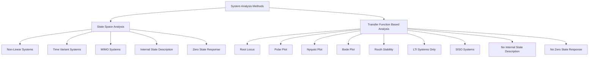
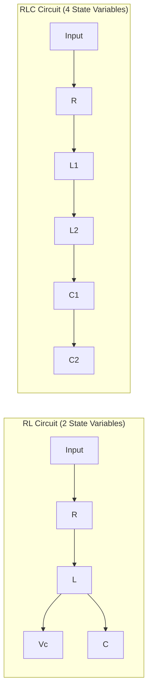
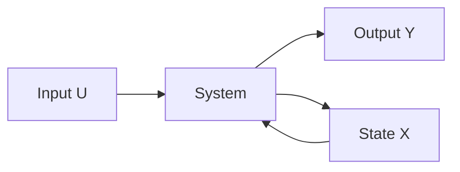
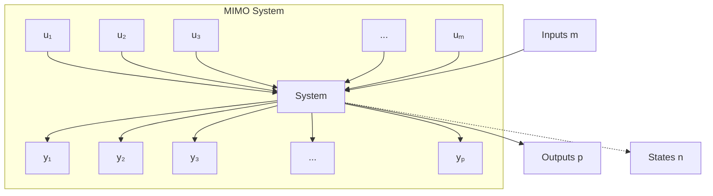
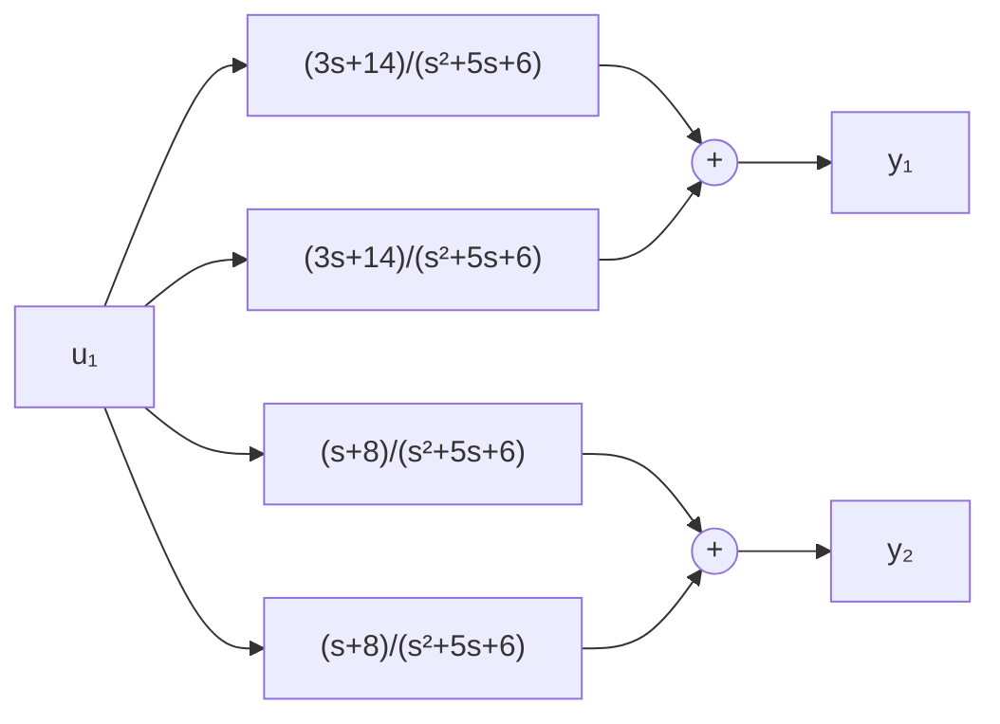
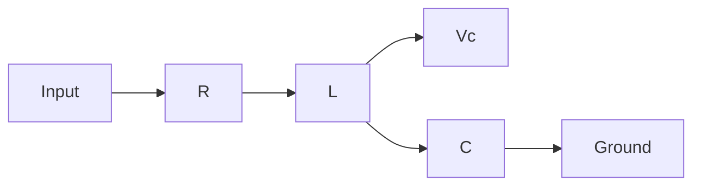
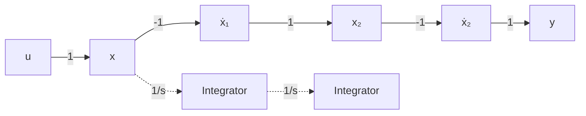
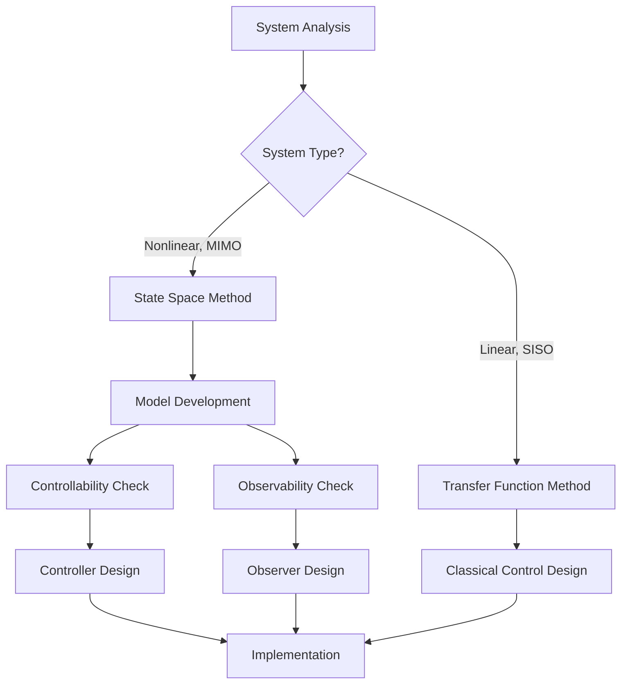

# State Space Analysis - Complete Guide

## Table of Contents
1. [Introduction and Advantages](#introduction-and-advantages)
2. [Basic Concepts and Applications](#basic-concepts-and-applications)
3. [Mathematical Representation](#mathematical-representation)
4. [MIMO Systems](#mimo-systems)
5. [Transfer Function Derivation](#transfer-function-derivation)
6. [Conversion Between Representations](#conversion-between-representations)
7. [Electrical System Modeling](#electrical-system-modeling)
8. [Signal Flow Graph Analysis](#signal-flow-graph-analysis)
9. [Controllability and Observability](#controllability-and-observability)

---

## Introduction and Advantages

### System Analysis Methods



### Advantages Comparison

| Aspect | State Space Analysis | Transfer Function Analysis |
|--------|----------------------|----------------------------|
| **System Types** | Non-linear and Time Variant | LTI Systems Only |
| **System Structure** | MIMO Capable | SISO Preferred |
| **Internal State** | Describes internal state | Does not describe internal state |
| **Zero State Response** | Provides zero state response | Does not provide zero state response |
| **Analysis Tools** | Modern control methods | Classical control tools |

---

## Basic Concepts and Applications

### Core Principles

State Space Analysis provides future behavior of the system based on:
- **Present Input** 
- **Past History** of the system

> **Note:** Future output is not based on prediction algorithms.

### State Variables

The past history of the system is described by **STATE Variables**, where past history refers to initial states or initial conditions.

### Circuit Analysis Rules

For electrical circuits, the number of state variables depends on:
- **Inductors (L)**: Current through inductors
- **Capacitors (C)**: Voltage across capacitors  
- **Independent of Resistors (R)**

**Formula:** Number of state variables = Order of the system

**Example:** For equation s³ + 3s² + 2s + 1 = 0
- Order = 3, hence **Four state variables required**

### Circuit Examples



### Applications
- **PLC (Programmable Logic Controllers)**
- **DCS (Distributed Control Systems)**

---

## Mathematical Representation

### Standard State Space Form



### State Space Equations

#### State Equation (Dynamic Equation)
```
ẋ = Ax + Bu
```

#### Output Equation  
```
y = Cx + Du
```

Where:
- **[x]ₙₓ₁** = State vector
- **[u]ₘₓ₁** = Input vector  
- **[y]ₚₓ₁** = Output vector
- **[A]ₙₓₙ** = System matrix
- **[B]ₙₓₘ** = Input matrix
- **[C]ₚₓₙ** = Output matrix
- **[D]ₚₓₘ** = Feedforward matrix

> **Note:** In most cases, D ≈ 0

---

## MIMO Systems

### System Structure



### State Space Representation

**State Equation:**
```
ẋ = Ax + Bu
```

**Output Equation:**
```  
y = Cx + Du
```

### Different Models for State Space Analysis with MIMO Systems

1. **Differential Equation Model**
2. **Transfer Function Model** 
3. **Signal Flow Graph**
4. **State Space for Electrical Systems**

---

## Transfer Function Derivation

### Example Problem
Determine the transfer function from the matrix of State Space Analysis:

**Given:**
```
A = [-3  1]    B = [1]    C = [1  1]    D = [0]
    [ 0 -1]        [1]
```

### Solution Steps

**Step 1:** Find Transfer Function
```
G(s) = C[sI - A]⁻¹B + D
```

**Step 2:** Calculate sI - A
```
sI - A = [s  0] - [-3  1] = [s+3  -1]
         [0  s]   [ 0 -1]   [ 0   s+1]
```

**Step 3:** Find Inverse [sI - A]⁻¹
```
[sI - A]⁻¹ = Adj[sI - A] / Mag[sI - A]
```

```
= [s+1   1  ] / [s² + 4s + 3]
  [ 0   s+3]
```

**Step 4:** Final Transfer Function
```
G(s) = [1  1] × [s+1   1  ] × [1] + 0
                [ 0   s+3]   [1]
                ─────────────────
                s² + 4s + 3

     = (s+2 + s+3) / (s² + 4s + 3)
     
     = (2s + 5) / (s² + 4s + 3)
```

### Block Diagram Representation



---

## Conversion Between Representations

### Transfer Function to State Space

**Given Feedback System with CLTF:**
```
T(s) = (s² + 3s + 3) / (s³ + 2s² + 3s + 1)
```

### Method: Controllable Canonical Form

**Step 1:** Express in standard form
```
X(s)/U(s) = 1 / (s³ + 2s² + 3s + 1)  [State equation]
Y(s)/X(s) = s² + 3s + 3                [Output equation]
```

**Step 2:** Taking Inverse Laplace
```
u(t) = ẍ + 2ẍ + 3ẋ + x
```

**Step 3:** Define state variables
- x₁ = x
- x₂ = ẋ = ẋ₁  
- x₃ = ẍ = ẋ₂

**Step 4:** State equations
```
ẋ₁ = x₂
ẋ₂ = x₃  
ẋ₃ = -x₁ - 3x₂ - 2x₃ + u(t)
```

**Step 5:** Matrix form
```
[ẋ₁]   [0  1  0] [x₁]   [0]
[ẋ₂] = [0  0  1] [x₂] + [0] u(t)
[ẋ₃]   [-1 -3 -2] [x₃]   [1]
```

**Step 6:** Output equation
```
y(t) = [3  3  1] [x₁] + [0]u(t)
                  [x₂]
                  [x₃]
```

---

## Electrical System Modeling

### RLC Circuit Example



**State Variables:**
- x₁ = i (current through inductor)
- x₂ = Vc (voltage across capacitor)

### Circuit Analysis

**KVL in loop:**
```
e(t) = VR + VL + VC
e(t) = iR + L(di/dt) + VC
```

**Current through Capacitor:**
```
i = C(dVc/dt)
x₁ = C·ẋ₂
ẋ₂ = (1/C)x₁
```

### State Space Model

**State Equation:**
```
[ẋ₁]   [-R/L  -1/L] [x₁]   [1/L]
[ẋ₂] = [ 1/C    0 ] [x₂] + [ 0 ] e(t)
```

**Output Equations:**
If outputs are VR and VC:
```
y₁ = VR = iR = Rx₁
y₂ = VC = x₂
```

**Matrix form:**
```
[y₁]   [R  0] [x₁]   [0]
[y₂] = [0  1] [x₂] + [0] e(t)
```

---

## Signal Flow Graph Analysis

### Basic Signal Flow Graph



### State Model Derivation

**State Equations:**
```
ẋ₁ = x₂
ẋ₂ = x₃  
ẋ₃ = a₁x₁ + a₂x₂ + a₃x₃ + u
```

**Matrix Form:**
```
[ẋ₁]   [0  1  0] [x₁]   [0]
[ẋ₂] = [0  0  1] [x₂] + [0] [u]
[ẋ₃]   [a₁ a₂ a₃] [x₃]   [1]
```

**Output Equation:**
```
y = c₁x₁ + c₂x₂ + c₃x₃
```

```
[y] = [c₁+c₃a₁  c₂+c₃a₂  c₃a₃] [x₁] + [c₃][u]
                                  [x₂]
                                  [x₃]
```

### State Transition Matrix

For the system with eigenvalues λ₁, λ₂:

**State Transition Matrix:**
```
φ = L⁻¹[(sI - A)⁻¹]
```

For a 2×2 system:
```
φ = [e⁻ᵗ    0  ]
    [te⁻ᵗ  e⁻ᵗ]
```

---

## Controllability and Observability

### Definitions

**Controllability:** A system is controllable if it's possible to drive the system from any initial state to any desired final state in a finite amount of time using suitable control inputs.

**Observability:** If the system's state can be determined from the knowledge of the system's output, then the system is observable.

### Kalman's Test

#### Controllability Matrix
```
Qc = [B  AB  A²B  ...  Aⁿ⁻¹B]
```

#### Observability Matrix  
```
Qo = [C]
     [CA]
     [CA²]
     [⋮]
     [CAⁿ⁻¹]
```

### Example Problem 1

**Given System:**
```
ẋ = [0   1] x + [1 ] u
    [-1 -2]     [-1]

y = [1  1] x
```

#### Controllability Analysis

**System matrices:**
```
A = [0   1]    B = [1 ]    C = [1  1]    D = 0
    [-1 -2]        [-1]
```

**Controllability Matrix Qc (2×2):**
```
Qc = [B  AB] = [1  -1]
              [-1   1]
```

**Determinant:** |Qc| = 0 ⟹ Rank ≠ Order

**Result:** Given system is **not controllable**

**Controllable states:** Rank of Qc = 1 ⟹ **1 state uncontrollable**

#### Observability Analysis

**Observability Matrix Qo (2×2):**
```
A = [0   1]    C = [1  1]
    [-1 -2]
```

```
Qo = [C ] = [1   1]
     [CA]   [-1  -1]
```

**Determinant:** |Qo| = 0 ⟹ Rank ≠ Order

**Result:** Given system is **not observable**

**Observable states:** Rank of Qo = 1 ⟹ **1 unobservable state**

### Example Problem 2

**Given System:**
```
A = [-1  1  0]    B = [0]    C = [1  1  1]
    [ 0 -1  0]        [4]
    [ 0  0 -2]        [0]
```

#### Controllability Analysis

**Controllability Matrix Qc (3×3):**
```
A²B = [1  -2  0] [0]   [0]
      [0   1  0] [4] = [4]
      [0   0  4] [0]   [0]
```

```
Qc = [B  AB  A²B] = [0   4  -8]
                     [4  -4   4]
                     [0   0   0]
```

**Determinant:** |Qc| = 0 ⟹ System is **not controllable**

**Rank calculation:**
```
Sub Matrix Qc = |4  -8| = 16 - 32 = -16 ≠ 0
                 |-4  4|
```

**Rank of Qc = n-1 = 3-1 = 2**

**Controllable states:** Rank of Qc = 2 ⟹ **1 state is uncontrollable**

#### Observability Analysis

**Observability Matrix Qo (3×3):**
```
A = [-1  1  0]    C = [1  1  1]
    [ 0 -1  0]
    [ 0  0 -2]

A²C = [1  -2  0] [1  1  1]
      [0   1  0]
      [0   0  4]
```

```
Qo = [1   1   1]
     [-1  0  -2]
     [1  -1   4]
```

**Determinant:** |Qo| = 1(-2) - 1(-4+2) + 1(1) = 1 ≠ 0

**Result:** System is **observable**, **3 states are observable**

---

## Summary

### Key Concepts Table

| Concept | Formula/Description |
|---------|-------------------|
| **State Equation** | ẋ = Ax + Bu |
| **Output Equation** | y = Cx + Du |
| **Transfer Function** | G(s) = C[sI - A]⁻¹B + D |
| **Controllability** | Rank[B AB A²B ... Aⁿ⁻¹B] = n |
| **Observability** | Rank[C; CA; CA²; ...; CAⁿ⁻¹] = n |
| **State Transition** | φ(t) = L⁻¹[(sI - A)⁻¹] |

### Applications Flowchart



This comprehensive guide covers all aspects of State Space Analysis from basic concepts to advanced applications including MIMO systems, controllability, and observability analysis.