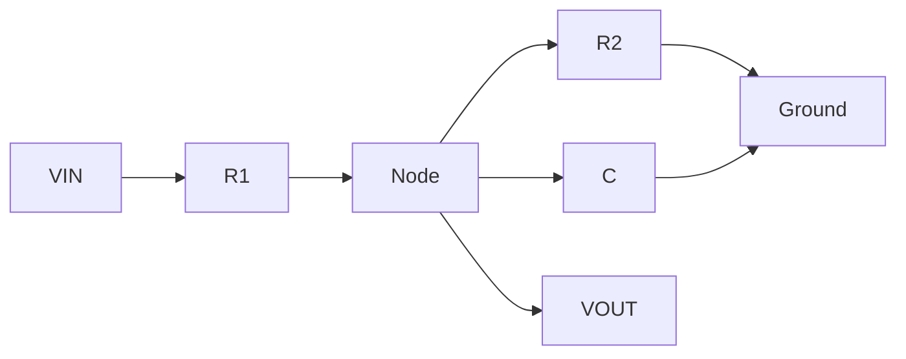
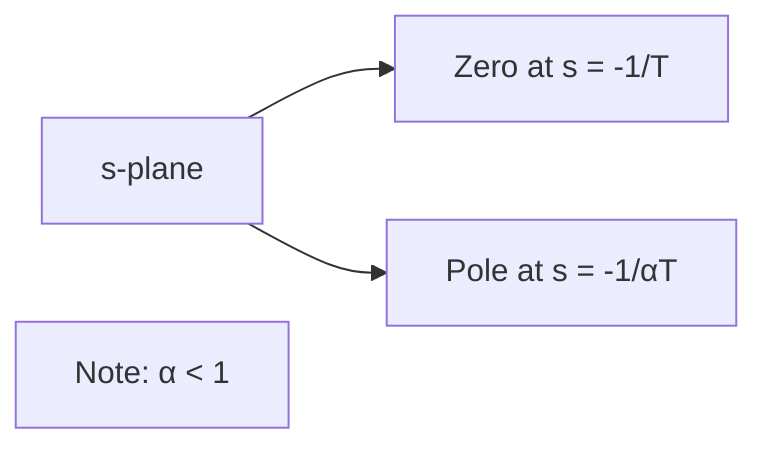
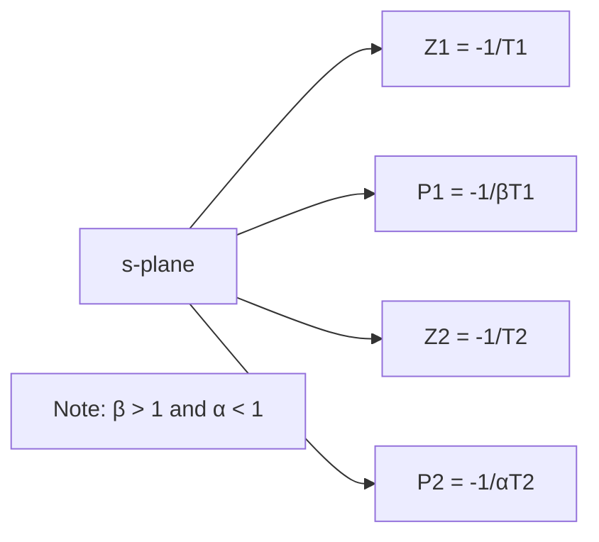

# Complete Guide to Compensators in Control Systems

## Table of Contents
1. [Basics of Compensators](#basics-of-compensators)
2. [Types of Compensators](#types-of-compensators)
3. [Classifications of Compensators](#classifications-of-compensators)
4. [Lag Compensator](#lag-compensator)
5. [Lead Compensator](#lead-compensator)
6. [Lag-Lead Compensator](#lag-lead-compensator)
7. [Effects of Compensators](#effects-of-compensators)
8. [Worked Examples](#worked-examples)

---

## Basics of Compensators

**Compensators** are used to modify the dynamics of a system to achieve specific performance requirements.

### Common Objectives

| Objective | Description |
|-----------|-------------|
| **System Stability** | Improving the overall stability of the control system |
| **Transient Response** | Reducing overshoot or settling time in transient responses |
| **Steady-State Accuracy** | Enhancing steady-state accuracy and reducing errors |
| **Bandwidth** | Increasing the bandwidth of the system for better response to changes |
| **Frequency Response** | Shaping the system's frequency response characteristics |

### Design Domain Specifications

| Domain | Specifications | Design Technique |
|--------|---------------|------------------|
| **Time Domain** | Rise Time, Maximum Peak Overshoot, Settling Time, Damping Ratio | Root Locus Technique |
| **Frequency Domain** | Phase Margin, Gain Margin, Resonant Peak, Bandwidth | Bode Plot Technique |

---

## Types of Compensators

### 1. Cascade Compensator (Series Compensator)

```mermaid
graph LR
    A[Input R(s)] --> B[+] --> C[Gc] --> D[Plant] --> E[Output C(s)]
    E --> F[Feedback] --> B
    B --> B
```

### 2. Feedback Compensator (Parallel Compensator)

```mermaid
graph LR
    A[Input R(s)] --> B[+] --> C[+] --> D[Plant] --> E[Output C(s)]
    E --> F[Feedback] --> B
    E --> G[Gc] --> C
```

### 3. Cascade with Feedback Compensator

```mermaid
graph LR
    A[Input R(s)] --> B[+] --> C[+] --> D[Gc1] --> E[Plant] --> F[Output C(s)]
    F --> G[Feedback] --> B
    F --> H[Gc2] --> C
```

---

## Classifications of Compensators

### Comparison Table

| Type | Purpose | Effect | Application |
|------|---------|--------|-------------|
| **Lead Compensator** | Improves Transient Response and Increases System Stability | Adds Lead Phase (Positive Phase) to specific frequency range | Speeds up response and increases Gain Margin |
| **Lag Compensator** | Improves Steady State Error without affecting Transient Performance | Adds Lag Phase (Negative Phase) to specific frequency range | Enhances Low-Frequency Gain and improves Steady State Error |
| **Lead-Lag Compensator** | Combines advantages of Lead and Lag Compensators | Improves both Transient Response and Steady State Response | Used in Complex Systems for multiple aspects |

---

## Lag Compensator

### Basics of Lag Compensator

A **Lag Compensator** is a compensator with lag network characteristics.

**Key Properties:**
- Acts as a **Low Pass Filter**
- **High-frequency noise signals are attenuated**
- Output **lags** behind the input in phase

### S-Plane Representation


### Transfer Function

**Lag Compensator Transfer Function:**

```
Gc(s) = (1/β) × (s + 1/T)/(s + 1/βT)
```

Where: **β > 1**

### Maximum Phase Condition

For maximum phase shift:

```
ωm = 1/(T√β)
```

**Maximum Phase:**
```
φm = tan⁻¹((1-β)/(2√β))
```

**Magnitude at Maximum Phase:**
```
m = 1/√β
```

### Electrical Network Implementation



**Circuit Parameters:**
- β = (R1 + R2)/R2
- T = R2C

### Bode Plot Characteristics

| Frequency Range | Gain | Phase |
|-----------------|------|-------|
| Low Frequency (ω << 1/T) | 0 dB/dec | 0° |
| Corner Frequency (ω = 1/T) | -20 dB/dec slope begins | -45° |
| High Frequency (ω >> 1/βT) | 0 dB/dec | Maximum lag phase |

---

## Lead Compensator

### Basics of Lead Compensator

A **Lead Compensator** is a compensator with lead network characteristics.

**Key Properties:**
- Acts as a **High Pass Filter**
- **Low-frequency noise signals are attenuated**
- **High-frequency signals are amplified**
- Output **leads** the input in phase

### S-Plane Representation



### Transfer Function

**Lead Compensator Transfer Function:**

```
Gc(s) = (1/α) × (s + 1/T)/(s + 1/αT)
```

Where: **α < 1**

### Maximum Phase Condition

For maximum phase shift:

```
ωm = 1/(T√α)
```

**Maximum Phase:**
```
φm = tan⁻¹((1-α)/(2√α))
```

**Magnitude at Maximum Phase:**
```
m = √α/α = 1/√α
```

### Electrical Network Implementation

**Circuit Parameters:**
- α = R2/(R1 + R2) < 1
- T = CR1

### Bode Plot Characteristics

| Frequency Range | Gain | Phase |
|-----------------|------|-------|
| Low Frequency (ω << 1/αT) | 0 dB/dec | 0° |
| Corner Frequency (ω = 1/T) | +20 dB/dec slope begins | +45° |
| High Frequency (ω >> 1/T) | 0 dB/dec | Maximum lead phase |

---

## Lag-Lead Compensator

### Basics of Lag-Lead Compensator

**Key Features:**
- Produces **Phase Lag** at one frequency region and **Phase Lead** at another frequency region
- Combines advantages of both Lag and Lead compensators
- Used to improve **both Transient Response and Steady State Response**
- More economical than using separate Lag and Lead compensators

### S-Plane Representation



### Transfer Function

**Lag-Lead Compensator Transfer Function:**

```
Gc(s) = [(s + 1/T1)/(s + 1/βT1)] × [(s + 1/T2)/(s + 1/αT2)]
```

Where: **β > 1** and **α < 1**

### Electrical Network Implementation

**Circuit includes both R1, R2, C1, and C2 components with:**
- T1 = R1C1
- T2 = R2C2
- αβ = 1 (for typical designs)

---

## Effects of Compensators

### Lag Compensator Effects

| Parameter | Effect | Reason |
|-----------|--------|--------|
| **Rise Time** | ↑ Increased | Slower transient response |
| **Settling Time** | ↑ Increased | Slower transient response |
| **Bandwidth** | ↓ Decreased | Low-pass filtering effect |
| **Maximum Peak Overshoot** | ↓ Decreased | Reduced high-frequency content |
| **Steady State Response** | ✓ Improved | Enhanced low-frequency gain |
| **High-Frequency Noise** | ✓ Eliminated | Low-pass filter characteristics |

### Lead Compensator Effects

| Parameter | Effect | Reason |
|-----------|--------|--------|
| **Rise Time** | ↓ Reduced | Faster transient response |
| **Settling Time** | ↓ Reduced | Improved transient response |
| **Bandwidth** | ↑ Increased | High-pass filtering effect |
| **Maximum Peak Overshoot** | ↑ Increased | Enhanced high-frequency content |
| **Gain Cross Over Frequency** | ↓ Reduced | Results in increased margins |
| **Gain and Phase Margin** | ↑ Increased | Improved stability |
| **High-Frequency Noise** | ⚠ May enter | High-pass filter characteristics |
| **Steady State Error** | → Not affected | No change in low-frequency gain |

---

## Worked Examples

### Example 1: Identifying Compensator Type

**Given:** 
```
D(S) = (0.5S + 1)/(0.05S + 1)
```

**Solution:**
Converting to standard form:
```
D(S) = (1/0.1) × (S + 1/0.5)/(S + 1/(0.5×0.1))
```

- k = 0.1 (since 0.1 < 1)
- T = 0.5
- α = 0.1

Since **α < 1**, this is a **Lead Compensator**.

**Maximum Phase:**
```
φm = tan⁻¹((1-0.1)/(2√0.1)) = tan⁻¹(1.424) = 54.9°
```

**Frequency at Maximum Phase:**
```
ωm = 1/(T√α) = 1/(0.5√0.1) = 6.32 rad/sec
```

### Example 2: Lag Compensator Identification

**Given:**
```
D(S) = (1 + 0.2S)/(1 + 2S)
```

**Solution:**
Converting to standard form:
```
D(S) = (1/10) × (S + 1/0.2)/(S + 1/(0.2×10))
```

- k = 10 (since 10 > 1)
- β = 10

Since **β > 1**, this is a **Lag Compensator**.

### Example 3: Pole-Zero Configuration

For a **Lead Compensator**: P > Z (Pole magnitude > Zero magnitude)
For a **Lag Compensator**: Z > P (Zero magnitude > Pole magnitude)

### Example 4: Phase Lead Effects

**Question:** The phase lead compensator is used to:
A. Increase rise time and decrease overshoot
B. Decrease rise time and increase overshoot ✓
C. Increase rise time and overshoot
D. Decrease rise time and overshoot

**Answer:** B - Lead compensators **decrease rise time** (faster response) but **increase overshoot** due to enhanced high-frequency content.

### Example 5: Transfer Function Analysis

**Given:**
```
D(S) = k[1 + S/a]/[1 + S/b]
```

For a **Lead Compensator**: **b > a** (pole frequency > zero frequency)

### Example 6: Maximum Phase Calculation

**Given:**
```
Gc(S) = 4(1 + 0.15S)/(1 + 0.05S)
```

- T = 0.15
- α = 1/3

**Maximum Phase:**
```
φm = tan⁻¹((1-1/3)/(2√(1/3))) = tan⁻¹(√3/3) = 30°
```

---

## Summary

### Quick Reference Table

| Compensator Type | Condition | Primary Use | Phase Effect | Filter Type |
|------------------|-----------|-------------|--------------|-------------|
| **Lead** | α < 1, P > Z | Transient Response | Positive (Lead) | High-Pass |
| **Lag** | β > 1, Z > P | Steady-State Error | Negative (Lag) | Low-Pass |
| **Lag-Lead** | Combined | Both Responses | Both Effects | Band-Pass |

### Design Guidelines

1. **Use Lead Compensator when:**
   - Need faster transient response
   - Want to improve stability margins
   - Can tolerate increased overshoot

2. **Use Lag Compensator when:**
   - Need to reduce steady-state error
   - Want to filter high-frequency noise
   - Can accept slower transient response

3. **Use Lag-Lead Compensator when:**
   - Need both improved transient and steady-state performance
   - Working with complex systems requiring multiple improvements
   - Want economical single-compensator solution

---

*This document provides a comprehensive overview of compensators in control systems, including their mathematical foundations, practical implementations, and design considerations.*