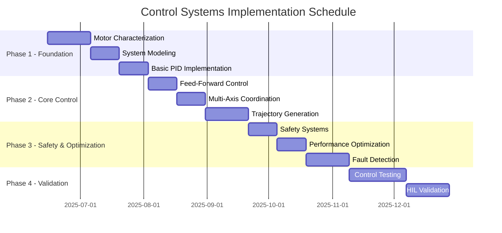

# SIMPL Automation Control Systems Work Scope

## Executive Summary

This document defines the specific control systems engineering work required for SIMPL Automation's embedded warehouse automation system. This scope focuses exclusively on control-related tasks, separate from general software infrastructure, hardware drivers, and system integration work.

**Control Systems Deliverables:**
- Multi-axis motion controller implementation
- PID controller design and tuning
- Trajectory generation algorithms
- Safety monitoring and fault detection
- Performance optimization and validation

---

## Control Systems Work Breakdown

### 1. Mathematical Modeling and System Identification

#### 1.1 Servo Motor Characterization
**Deliverable:** Mathematical models for each axis motor

**Tasks:**
- [ ] **Motor Parameter Identification**
  - Measure motor constants (K, J, B) for X, Y, Z axes
  - Characterize friction and nonlinearities
  - Determine gear ratios and mechanical coupling effects
  - Create transfer function models: G(s) = K/(s(Js + B))

- [ ] **Load Analysis**
  - Model varying payload effects on system dynamics
  - Characterize gravity effects on Y-axis (vertical motion)
  - Measure coupling between axes during coordinated motion
  - Document operating envelope (max speeds, accelerations, payloads)

**Estimated Effort:** 2-3 weeks
**Prerequisites:** Hardware assembled, basic driver functionality

#### 1.2 System Dynamics Modeling
**Deliverable:** State space models for multi-axis control

**Tasks:**
- [ ] **MIMO System Model**
  - Develop 3-axis state space representation
  - Model cross-coupling effects between axes
  - Include disturbance models (vibration, external forces)
  - Validate models against measured data

- [ ] **Linearization Analysis**
  - Identify operating points for linear control design
  - Determine regions where linear models are valid
  - Document nonlinear effects that require special handling

**Estimated Effort:** 2 weeks
**Prerequisites:** Motor characterization complete

---

### 2. Control Algorithm Development

#### 2.1 PID Controller Implementation
**Deliverable:** Tuned PID controllers for each axis

**Tasks:**
- [ ] **PID Algorithm Implementation**
  - Code discrete-time PID controllers with anti-windup
  - Implement bumpless transfer for gain changes
  - Add derivative filtering to reduce noise sensitivity
  - Support for feed-forward terms

- [ ] **Gain Tuning Process**
  - Develop systematic tuning methodology
  - Create gain scheduling for varying payloads
  - Tune each axis independently, then validate coordination
  - Document final gain values and tuning rationale

**Code Structure:**
```cpp
class PIDController {
private:
    float kp, ki, kd;
    float integral_sum, prev_error;
    float integral_limit;  // Anti-windup
    float derivative_filter_coeff;
    
public:
    float update(float setpoint, float measurement, float dt);
    void setGains(float kp, float ki, float kd);
    void reset();
    void setAntiWindup(float limit);
};
```

**Estimated Effort:** 2 weeks
**Prerequisites:** System models available

#### 2.2 Feed-Forward Control
**Deliverable:** Feed-forward compensation for known disturbances

**Tasks:**
- [ ] **Gravity Compensation (Y-Axis)**
  - Implement constant force compensation for vertical axis
  - Add payload weight compensation using load cell feedback
  - Validate compensation accuracy across payload range

- [ ] **Acceleration Feed-Forward**
  - Implement inertial compensation for rapid movements
  - Tune feed-forward gains to minimize PID effort
  - Validate during trajectory following

- [ ] **Friction Compensation**
  - Model static and dynamic friction effects
  - Implement velocity-dependent friction compensation
  - Validate smooth motion at low speeds

**Estimated Effort:** 1-2 weeks
**Prerequisites:** Basic PID control functional

#### 2.3 Multi-Axis Coordination
**Deliverable:** Coordinated 3-axis motion control

**Tasks:**
- [ ] **Synchronized Motion Control**
  - Implement coordinated setpoint generation
  - Ensure all axes reach targets simultaneously
  - Handle different axis speeds and accelerations

- [ ] **Cross-Coupling Compensation**
  - Identify and compensate for mechanical coupling
  - Implement decoupling control if needed
  - Validate independent axis control during coordination

**Estimated Effort:** 1-2 weeks
**Prerequisites:** Individual axis control working

---

### 3. Trajectory Generation

#### 3.1 Motion Profile Generation
**Deliverable:** Smooth, constrained trajectory generation

**Tasks:**
- [ ] **S-Curve Profile Generator**
  - Implement jerk-limited acceleration profiles
  - Support for velocity and acceleration constraints
  - Generate position, velocity, acceleration setpoints

- [ ] **Multi-Axis Trajectory Coordination**
  - Synchronize motion profiles across all axes
  - Implement shortest-time trajectories
  - Support for different motion types (point-to-point, continuous path)

**Algorithm Requirements:**
- Maximum velocity limits per axis
- Maximum acceleration limits per axis  
- Maximum jerk limits for smooth motion
- Configurable acceleration/deceleration times
- Real-time trajectory modification capability

**Estimated Effort:** 2-3 weeks
**Prerequisites:** Control algorithms functional

#### 3.2 Path Planning Integration
**Deliverable:** Interface for high-level path commands

**Tasks:**
- [ ] **Waypoint Processing**
  - Convert MQTT commands to internal trajectories
  - Implement trajectory blending between waypoints
  - Support for different motion types per segment

- [ ] **Collision Avoidance Integration**
  - Interface with sensor data for obstacle detection
  - Implement emergency trajectory modification
  - Maintain smooth motion during avoidance maneuvers

**Estimated Effort:** 1-2 weeks
**Prerequisites:** Basic trajectory generation working

---

### 4. Safety Systems and Monitoring

#### 4.1 Safety Control Loops
**Deliverable:** Independent safety monitoring and control

**Tasks:**
- [ ] **Hardware Safety Integration**
  - Interface with emergency stop circuits
  - Implement limit switch monitoring
  - Coordinate with safety PLC systems

- [ ] **Software Safety Monitoring**
  - Monitor control system performance metrics
  - Detect control instability or saturation
  - Implement graceful degradation strategies

**Safety Metrics to Monitor:**
- Position error magnitude and RMS
- Control effort saturation
- Velocity and acceleration limits
- Sensor signal validity
- Inter-axis coordination errors

**Estimated Effort:** 2 weeks
**Prerequisites:** Basic control system functional

#### 4.2 Fault Detection and Diagnosis
**Deliverable:** Automated fault detection system

**Tasks:**
- [ ] **Control Performance Monitoring**
  - Implement real-time performance metrics calculation
  - Set thresholds for degraded performance detection
  - Log fault conditions with timestamps and context

- [ ] **Sensor Validation**
  - Cross-check encoder readings with expected values
  - Validate ToF sensor readings for consistency
  - Detect sensor failures and trigger appropriate responses

- [ ] **Actuator Health Monitoring**
  - Monitor servo drive status and faults
  - Detect mechanical binding or excessive wear
  - Track control effort trends for predictive maintenance

**Estimated Effort:** 2-3 weeks
**Prerequisites:** Control system operational

---

### 5. Performance Optimization

#### 5.1 Control Loop Tuning
**Deliverable:** Optimized control performance

**Tasks:**
- [ ] **Frequency Response Analysis**
  - Measure open-loop and closed-loop frequency response
  - Optimize control bandwidth for performance vs. robustness
  - Identify and address resonant frequencies

- [ ] **Time Domain Optimization**
  - Minimize settling time within overshoot constraints
  - Optimize rise time for fastest warehouse cycle times
  - Validate steady-state accuracy requirements

**Performance Targets:**
- Position accuracy: ±1mm
- Settling time: <1.0 seconds
- Overshoot: <5%
- Control bandwidth: 5-10 Hz

**Estimated Effort:** 2 weeks
**Prerequisites:** System fully operational

#### 5.2 Adaptive Control Features
**Deliverable:** Self-tuning capabilities for varying conditions

**Tasks:**
- [ ] **Gain Scheduling Implementation**
  - Implement payload-dependent gain adjustment
  - Create lookup tables for different operating conditions
  - Validate smooth transitions between gain sets

- [ ] **Performance Adaptation**
  - Monitor control performance metrics in real-time
  - Implement automatic retuning triggers
  - Maintain performance database for trending

**Estimated Effort:** 2-3 weeks (optional enhancement)
**Prerequisites:** Base control system optimized

---

### 6. Testing and Validation

#### 6.1 Control System Testing
**Deliverable:** Comprehensive test suite for control functions

**Tasks:**
- [ ] **Unit Tests for Control Algorithms**
  - Test PID controller mathematical correctness
  - Validate trajectory generation algorithms
  - Test safety monitoring functions

- [ ] **Integration Testing**
  - Test multi-axis coordination
  - Validate trajectory following performance
  - Test fault detection and recovery

- [ ] **Performance Validation**
  - Measure and document actual vs. target performance
  - Validate operation across full payload range
  - Test long-term stability and drift

**Test Coverage Requirements:**
- All control algorithms: 95% code coverage
- Performance specifications: 100% validation
- Fault conditions: All identified failure modes tested

**Estimated Effort:** 3-4 weeks
**Prerequisites:** All control features implemented

#### 6.2 Hardware-in-Loop (HIL) Validation
**Deliverable:** Validated control system with real hardware

**Tasks:**
- [ ] **Real-Time Performance Testing**
  - Validate 100Hz control loop timing
  - Test under maximum computational load
  - Measure control jitter and latency

- [ ] **Robustness Testing**
  - Test with varying payloads and conditions
  - Validate parameter sensitivity
  - Test recovery from disturbances

- [ ] **Long-Term Reliability Testing**
  - Extended operation testing (24+ hours)
  - Thermal cycling validation
  - Wear simulation testing

**Estimated Effort:** 2-3 weeks
**Prerequisites:** HIL test setup available

---

## Implementation Timeline

### Phase 1: Foundation (Weeks 1-6)


### Effort Distribution

| **Work Category** | **Duration** | **% of Total** | **Dependencies** |
|-------------------|--------------|----------------|------------------|
| **Modeling & Identification** | 5 weeks | 20% | Hardware available |
| **Core Control Algorithms** | 7 weeks | 28% | Models complete |
| **Trajectory & Coordination** | 4 weeks | 16% | Basic control working |
| **Safety & Monitoring** | 5 weeks | 20% | Control system functional |
| **Testing & Validation** | 7 weeks | 28% | All features implemented |
| **TOTAL** | **25 weeks** | **100%** | |

---

## Resource Requirements

### Control Systems Engineer Skills
**Required Expertise:**
- [ ] Classical control theory (PID, root locus, frequency response)
- [ ] Multi-variable control systems (MIMO, state space)
- [ ] Real-time control implementation (C/C++)
- [ ] System identification and modeling
- [ ] Safety systems design for industrial automation

**Tools and Software:**
- [ ] MATLAB/Simulink for analysis and simulation
- [ ] Control system design tools (root locus, Bode plots)
- [ ] Real-time development environment
- [ ] Oscilloscope and data acquisition for testing
- [ ] Frequency analyzer for system identification

### Hardware Dependencies
**Required for Control Work:**
- [ ] Servo motors with encoders (all 3 axes)
- [ ] Servo drives with torque/velocity control modes
- [ ] Load cells for payload measurement
- [ ] Emergency stop hardware
- [ ] Real-time control computer
- [ ] Data acquisition capability for testing

---

## Success Criteria

### Technical Performance Metrics
- [ ] **Position Accuracy:** ±1mm at all target locations
- [ ] **Settling Time:** <1.0 seconds for typical moves
- [ ] **Cycle Time:** <30 seconds for warehouse operations
- [ ] **Control Bandwidth:** 5-10 Hz closed-loop bandwidth
- [ ] **Safety Response:** <1ms emergency stop activation

### Reliability Metrics
- [ ] **Stability:** No unstable operation under any operating condition
- [ ] **Robustness:** Maintain performance with ±20% parameter variations
- [ ] **Fault Detection:** Detect and respond to 95% of identifiable faults
- [ ] **Uptime:** Support >99% operational availability

### Code Quality Metrics
- [ ] **Test Coverage:** >95% for all control algorithms
- [ ] **Real-Time Performance:** 100Hz deterministic operation
- [ ] **Maintainability:** Well-documented, modular control code
- [ ] **Configurability:** Tunable parameters without code changes

---

## Risk Mitigation

### Technical Risks
| **Risk** | **Probability** | **Impact** | **Mitigation Strategy** |
|----------|----------------|------------|-------------------------|
| **Servo instability** | Medium | High | Extensive stability analysis, conservative tuning |
| **Multi-axis coupling** | Medium | Medium | Thorough system modeling, decoupling control |
| **Real-time performance** | Low | High | Early timing validation, computational profiling |
| **Safety certification** | Low | High | Conservative design, independent safety systems |

### Schedule Risks
| **Risk** | **Probability** | **Impact** | **Mitigation Strategy** |
|----------|----------------|------------|-------------------------|
| **Hardware delays** | Medium | High | Parallel simulation work, early prototype testing |
| **Integration complexity** | Medium | Medium | Incremental integration, extensive testing |
| **Performance requirements** | Low | Medium | Conservative specifications, iterative optimization |

This control systems work scope provides a clear roadmap for implementing robust, high-performance motion control for the SIMPL Automation warehouse system. The modular approach allows for incremental development and validation while maintaining focus on the core control engineering challenges.