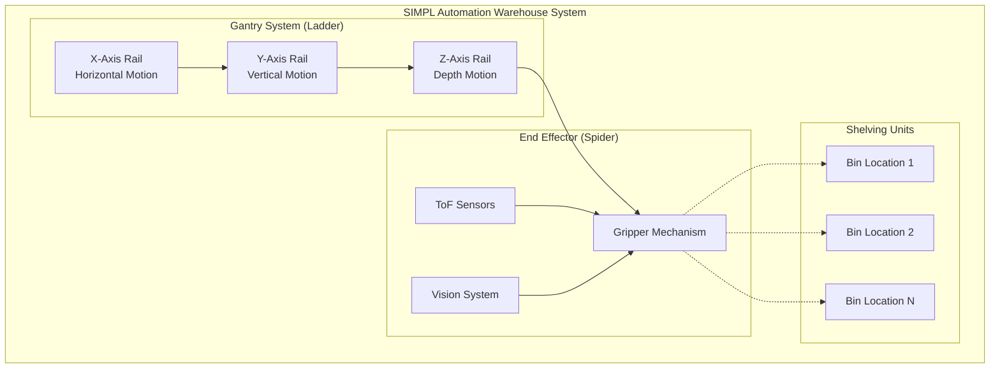
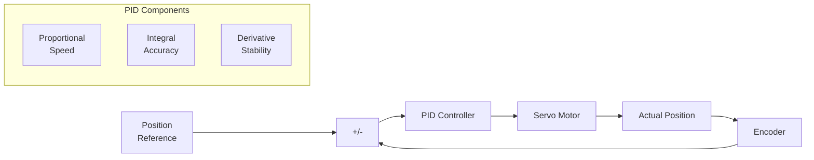
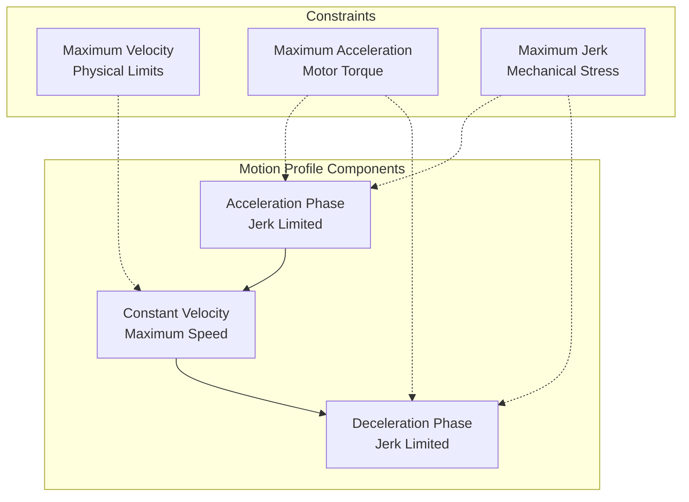
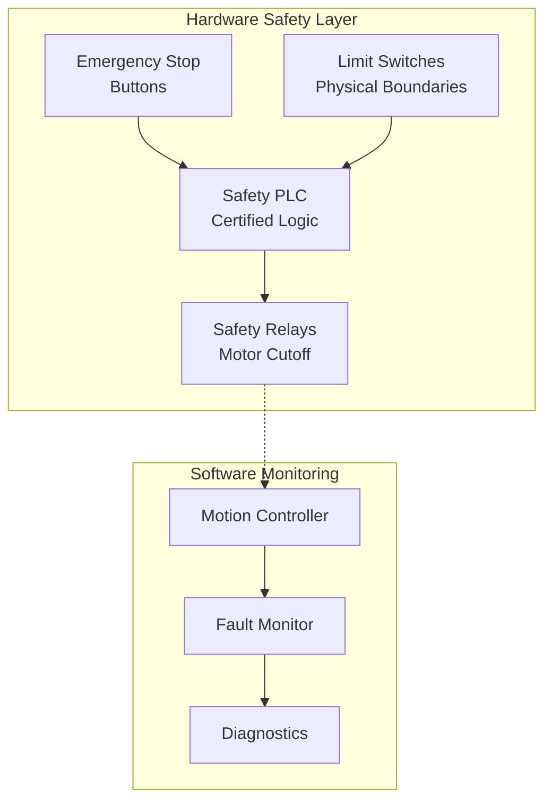
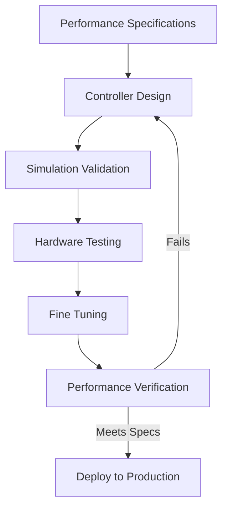
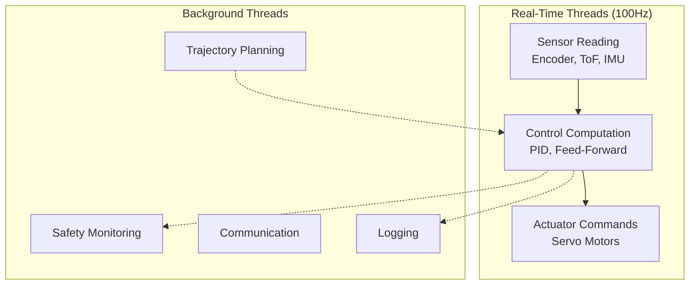
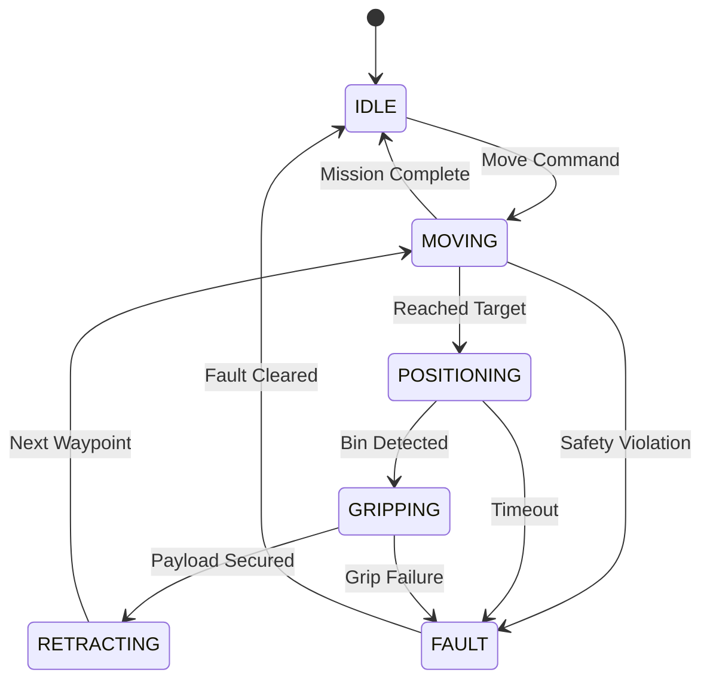
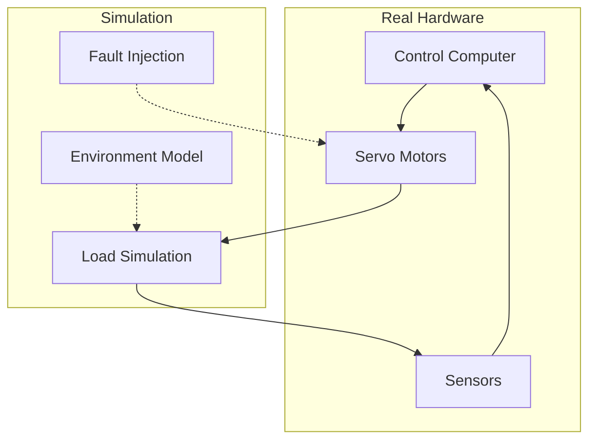

# Control Theory Applications for SIMPL Automation Embedded Architecture

## Executive Summary

This document explains how fundamental control theory concepts apply to the implementation of SIMPL Automation's next-generation embedded warehouse automation system. The system consists of a gantry-based "Ladder" for payload translation, a "Spider" end effector for inventory picking, and autonomous ground vehicles for final delivery.

**Key Application Areas:**
- **Motion Control:** 3-axis servo positioning with sub-5mm accuracy
- **Trajectory Generation:** Smooth, collision-free path planning
- **Safety Systems:** Hardware-based emergency stops and fault detection
- **System Integration:** Real-time coordination of multiple subsystems

---

## Table of Contents

1. [System Overview and Control Requirements](#system-overview-and-control-requirements)
2. [Mathematical Modeling Applications](#mathematical-modeling-applications)
3. [Control System Design](#control-system-design)
4. [Stability and Safety Analysis](#stability-and-safety-analysis)
5. [Performance Optimization](#performance-optimization)
6. [Implementation Strategy](#implementation-strategy)
7. [Testing and Validation](#testing-and-validation)

---

## System Overview and Control Requirements

### Physical System Description



### Control Theory Mapping

| **Physical Component** | **Control Theory Concept** | **Why This Concept** | **Implementation Impact** |
|------------------------|---------------------------|---------------------|--------------------------|
| **3-Axis Gantry** | MIMO System Control | Multiple coupled inputs/outputs require coordinated control | State space methods for simultaneous 3-axis motion |
| **Servo Motors** | Position/Velocity Control | Precise positioning requirements (1-5mm accuracy) | PID controllers with encoder feedback |
| **Trajectory Planning** | Time Response Analysis | Smooth motion profiles minimize mechanical stress | S-curve velocity profiles, jerk limiting |
| **Safety Systems** | Stability Analysis | Emergency stops must guarantee bounded response | Hardware-based limits, software monitoring |
| **Sensor Integration** | Signal Processing | Multiple sensors require filtering and fusion | Low-pass filters, Kalman filtering |

---

## Mathematical Modeling Applications

### **What:** System Representation Methods
**When:** During initial design and controller development
**Why:** Foundation for all control system design
**How:** Apply to SIMPL system components

#### Transfer Function Applications

**Servo Motor Modeling**
```
Motor Transfer Function: θ(s)/V(s) = K/(s(Js + B))
Where:
- θ(s) = Motor angle output
- V(s) = Voltage input  
- K = Motor gain constant
- J = Motor inertia
- B = Damping coefficient
```

**Application to SIMPL:**
- **X-Axis Motor:** Large horizontal loads → Higher inertia J
- **Y-Axis Motor:** Gravity effects → Additional bias terms
- **Z-Axis Motor:** Variable payload → Time-varying parameters

**Implementation Benefits:**
- Enables PID tuning using classical methods
- Provides basis for feed-forward compensation
- Allows stability analysis using root locus

#### State Space Modeling for 3-Axis Coordination

**Multi-Axis State Representation:**
```
State Vector: x = [x_pos, x_vel, y_pos, y_vel, z_pos, z_vel]ᵀ

System Equations:
ẋ = Ax + Bu
y = Cx + Du

Where A captures system dynamics, B maps control inputs
```

**SIMPL Application:**
- **Coordinated Motion:** All three axes move simultaneously to target
- **Coupling Effects:** X-axis motion affects Y and Z loading
- **Dynamic Compensation:** Account for changing payload mass

**Why State Space for SIMPL:**
- **MIMO Control:** Natural framework for 3-axis systems
- **Internal States:** Access to position AND velocity for each axis
- **Modern Control:** Enables optimal control techniques (LQR)
- **Observation:** Kalman filtering for sensor fusion

---

## Control System Design

### PID Controller Implementation

#### **What:** Proportional-Integral-Derivative Control
**When:** For each servo motor axis control
**Why:** Industry standard with proven performance
**How:** Separate PID loops for each axis

**Per-Axis Control Structure:**


**SIMPL-Specific PID Tuning:**

| **Axis** | **Primary Requirement** | **PID Emphasis** | **Tuning Strategy** |
|----------|------------------------|------------------|-------------------|
| **X-Axis** | High speed, heavy loads | Higher P, moderate D | Fast response, manage overshoot |
| **Y-Axis** | Fight gravity, precision | Higher I, careful D | Eliminate droop, smooth motion |
| **Z-Axis** | Variable payload | Adaptive gains | Gain scheduling based on load |

**Implementation in Embedded System:**
```cpp
// Pseudo-code for real-time PID implementation
class AxisController {
    float kp, ki, kd;
    float integral_sum, previous_error;
    
    float update(float reference, float actual, float dt) {
        float error = reference - actual;
        integral_sum += error * dt;
        float derivative = (error - previous_error) / dt;
        
        float output = kp * error + ki * integral_sum + kd * derivative;
        previous_error = error;
        return output;
    }
};
```

### Feed-Forward Control

#### **What:** Predictive control based on known disturbances
**When:** To improve tracking performance and reduce PID workload
**Why:** Warehouse operations have predictable load patterns

**Gravity Compensation (Y-Axis):**
```
Feed-forward = mg * sin(θ) + payload_weight * g
Where:
- m = system mass
- g = gravitational acceleration  
- θ = gantry tilt angle
- payload_weight = current load (from load cell)
```

**SIMPL Applications:**
- **Y-Axis Gravity:** Constant upward force to counteract gravity
- **Acceleration Feed-Forward:** Compensate for inertial forces during motion
- **Friction Compensation:** Overcome bearing and rail friction

### Trajectory Generation

#### **What:** Time-optimal path planning with constraints
**When:** For every movement command from high-level orchestrator
**Why:** Smooth motion reduces wear and improves accuracy

**S-Curve Velocity Profiles:**


**Implementation Benefits:**
- **Reduced Vibration:** Smooth acceleration prevents structural resonance
- **Increased Accuracy:** Controlled deceleration improves final positioning
- **Equipment Life:** Lower mechanical stress extends component lifetime

---

## Stability and Safety Analysis

### Routh-Hurwitz Stability Analysis

#### **What:** Algebraic stability verification
**When:** During controller design and parameter validation
**Why:** Ensure system stability before deployment

**Application to Servo Control:**
```
Closed-loop characteristic equation for PID + motor:
s³ + (B/J + Kd)s² + (K*Kp/J)s + (K*Ki/J) = 0

Routh Array verification ensures stable operation
```

**SIMPL Safety Implementation:**
- **Parameter Bounds:** Use Routh criterion to determine safe PID ranges
- **Gain Scheduling:** Verify stability at all operating points
- **Fault Detection:** Monitor for parameter drift that could cause instability

### Hardware Safety Systems

#### **What:** Independent hardware-based safety loops
**When:** Continuous operation, independent of software
**Why:** Sub-millisecond response times for emergency situations

**Safety Architecture:**


**Control Theory Application:**
- **Bounded Response:** Hardware limits guarantee system stays within safe operating region
- **Fail-Safe Design:** Open-loop stable configuration when power removed
- **Redundancy:** Multiple independent paths to safe state

### Root Locus Analysis for Gain Selection

#### **What:** Graphical method for understanding parameter effects
**When:** Selecting optimal controller gains
**Why:** Visual insight into stability margins and performance trade-offs

**SIMPL Application:**
```mermaid
graph LR
    subgraph "Root Locus Design Process"
        PLANT[Plant Model<br/>G(s) = K/(s(Js+B))]
        CONTROLLER[PID Controller<br/>Gc(s)]
        LOCUS[Root Locus Plot]
        SELECTION[Gain Selection]
    end
    
    PLANT --> LOCUS
    CONTROLLER --> LOCUS
    LOCUS --> SELECTION
```

**Benefits for SIMPL:**
- **Gain Tuning:** Systematically select PID gains for desired performance
- **Robustness:** Understand how parameter variations affect stability
- **Performance Trade-offs:** Balance speed vs. stability vs. accuracy

---

## Performance Optimization

### Frequency Response Analysis

#### **What:** Understanding system bandwidth and filtering requirements
**When:** Optimizing performance and designing sensor filters
**Why:** Warehouse automation requires specific frequency characteristics

**Bode Plot Applications:**

| **System Component** | **Frequency Analysis Goal** | **Design Impact** |
|----------------------|----------------------------|-------------------|
| **Servo Control Loop** | Determine bandwidth for tracking performance | Set controller gains for desired closed-loop bandwidth |
| **Sensor Filtering** | Remove high-frequency noise while preserving signal | Design low-pass filters for ToF and encoder signals |
| **Vibration Analysis** | Identify structural resonances to avoid | Notch filters or trajectory planning to avoid resonant frequencies |
| **Communication Systems** | MQTT update rates and network delays | Set sampling rates and buffer sizes appropriately |

**Example: Servo Bandwidth Design**
```
Closed-loop bandwidth = 10 Hz (sufficient for warehouse speeds)
Crossover frequency design: ωc = 2π × 10 rad/s
Phase margin target: 45° (good stability)
Gain margin target: 12 dB (robust to parameter variations)
```

### Time Response Optimization

#### **What:** Meeting time-domain specifications
**When:** Optimizing for warehouse cycle time requirements
**Why:** Cycle time directly impacts warehouse throughput

**Performance Specifications for SIMPL:**

| **Metric** | **Target Value** | **Control Theory Application** |
|------------|------------------|-------------------------------|
| **Rise Time** | < 0.5 seconds to 90% of target | Increase controller bandwidth |
| **Settling Time** | < 1.0 seconds within ±1mm | Optimize damping ratio (ζ ≈ 0.7) |
| **Overshoot** | < 5% to prevent mechanical stress | Adjust PID gains, add derivative action |
| **Steady-State Error** | < 1mm positioning accuracy | Integral action, feed-forward compensation |

**Implementation Strategy:**


---

## Implementation Strategy

### Real-Time Control Architecture

#### **What:** Deterministic control loop execution
**When:** 100Hz control update rate requirement
**Why:** Consistent timing essential for stable control

**Threading Model with Control Theory Principles:**



**Control Theory Considerations:**
- **Sampling Rate:** 100Hz provides adequate bandwidth for mechanical systems
- **Computational Delay:** Keep control computation under 1ms for minimal phase lag
- **Jitter Minimization:** Consistent timing prevents introducing noise into control loop

### State Machine Design for Command Processing

#### **What:** Finite state machine for high-level system coordination
**When:** Processing MQTT commands from orchestrator
**Why:** Structured approach to complex operational sequences

**Command State Machine:**


**Control Theory Integration:**
- **Reference Generation:** State machine generates position references for control loops
- **Error Handling:** Fault states trigger safe shutdown of control systems
- **Performance Monitoring:** States track control system performance metrics

### Sensor Fusion and Filtering

#### **What:** Combining multiple sensor inputs for robust state estimation
**When:** Real-time operation with noisy sensor data
**Why:** Improve accuracy and reliability beyond single sensor capability

**Multi-Sensor Integration:**

| **Sensor Type** | **Information Provided** | **Filtering Method** | **Fusion Strategy** |
|-----------------|-------------------------|---------------------|-------------------|
| **Encoders** | High-accuracy position | Low-pass filter (anti-aliasing) | Primary position feedback |
| **IMU** | Acceleration, orientation | Complementary filter | Detect external disturbances |
| **ToF Sensors** | Distance to objects | Median filter (outlier rejection) | Collision avoidance, bin detection |
| **Load Cells** | Payload weight | Moving average filter | Feed-forward compensation |

**Kalman Filter Application:**
```
State Vector: x = [position, velocity, acceleration]ᵀ
Measurement: z = [encoder_position, imu_acceleration]ᵀ

Prediction: x̂⁻ = Fx̂ + Bu
Update: x̂ = x̂⁻ + K(z - Hx̂⁻)
```

**Benefits for SIMPL:**
- **Noise Reduction:** Filtered signals improve control loop performance
- **Fault Detection:** Sensor disagreement indicates potential failures
- **Robust Operation:** System continues operating with degraded sensors

---

## Testing and Validation

### Control System Testing Strategy

#### **What:** Systematic validation of control performance
**When:** Development, integration, and production phases
**Why:** Ensure system meets specifications under all operating conditions

**Test Categories with Control Theory Focus:**

| **Test Type** | **Control Theory Validation** | **SIMPL Application** |
|---------------|-------------------------------|----------------------|
| **Unit Tests** | Individual controller components | Test PID algorithms, trajectory generators |
| **Integration Tests** | Multi-axis coordination | Verify 3-axis simultaneous motion |
| **Performance Tests** | Time and frequency response | Validate rise time, settling time, bandwidth |
| **Robustness Tests** | Parameter sensitivity | Test with varying payloads, temperatures |
| **Safety Tests** | Emergency response | Verify E-stop response times, fault detection |

#### Hardware-in-the-Loop (HIL) Testing

**What:** Real hardware with simulated environment
**When:** Before full system integration
**Why:** Validate control algorithms with actual dynamics

**HIL Setup for SIMPL:**


**Control Validation Benefits:**
- **Real Dynamics:** Test with actual motor/mechanical characteristics
- **Fault Testing:** Inject sensor failures, actuator faults
- **Parameter Tuning:** Optimize gains with real system behavior
- **Safety Validation:** Test emergency stops with actual hardware timing

### Performance Metrics and Monitoring

#### **What:** Continuous monitoring of control system performance
**When:** Production operation
**Why:** Early detection of degradation, predictive maintenance

**Key Performance Indicators (KPIs):**

| **Metric** | **Control Theory Basis** | **Monitoring Method** | **Action Threshold** |
|------------|-------------------------|----------------------|---------------------|
| **Position Error RMS** | Steady-state error analysis | Continuous tracking | > 2mm triggers recalibration |
| **Settling Time** | Time response analysis | Per-movement measurement | > 1.5s indicates tuning needed |
| **Controller Output Saturation** | Control effort analysis | Duty cycle monitoring | > 90% suggests mechanical issues |
| **Sensor Noise Level** | Signal-to-noise ratio | Statistical analysis | 2x normal indicates sensor degradation |
| **Vibration Spectrum** | Frequency analysis | FFT of acceleration data | New peaks indicate mechanical wear |

**Predictive Maintenance Integration:**
- **Trend Analysis:** Track KPI changes over time
- **Threshold Alerts:** Automatic notifications for degrading performance  
- **Root Cause Analysis:** Correlate multiple metrics to identify failure modes
- **Maintenance Scheduling:** Plan interventions before performance degrades

---

## Summary and Implementation Roadmap

### Control Theory Application Summary

| **Phase** | **Control Theory Focus** | **SIMPL Implementation** | **Expected Outcome** |
|-----------|-------------------------|-------------------------|---------------------|
| **Phase 1: Modeling** | Mathematical models, transfer functions | Servo motor characterization, load modeling | Accurate plant models for controller design |
| **Phase 2: Control Design** | PID tuning, stability analysis | Individual axis controllers, safety systems | Stable, responsive motion control |
| **Phase 3: Coordination** | MIMO control, state space methods | 3-axis trajectory following, sensor fusion | Coordinated multi-axis operation |
| **Phase 4: Optimization** | Frequency response, performance tuning | Bandwidth optimization, vibration reduction | High-performance warehouse operation |
| **Phase 5: Production** | Monitoring, adaptive control | Performance tracking, predictive maintenance | Reliable long-term operation |

### Key Success Factors

**Technical Excellence:**
- **Solid Mathematical Foundation:** Proper modeling enables effective control design
- **Systematic Design Process:** Follow established control theory principles
- **Comprehensive Testing:** Validate at every level from components to full system
- **Performance Monitoring:** Continuous verification of control system health

**Implementation Best Practices:**
- **Separation of Concerns:** Keep safety systems independent of performance control
- **Modular Architecture:** Enable independent testing and validation of subsystems
- **Real-Time Guarantees:** Maintain deterministic timing for stable control
- **Fault Tolerance:** Graceful degradation when components fail

### Expected Performance Outcomes

**Quantitative Targets:**
- **Positioning Accuracy:** ±1mm at payload pickup locations
- **Cycle Time:** <30 seconds for typical warehouse operations
- **Uptime:** >99% operational availability
- **Safety Response:** <1ms emergency stop activation

**Qualitative Benefits:**
- **Predictable Operation:** Consistent performance across all operating conditions
- **Maintainable System:** Clear performance metrics enable proactive maintenance
- **Scalable Architecture:** Foundation supports future enhancements and additional axes
- **Safe Operation:** Multiple independent safety systems ensure personnel and equipment protection

This control theory foundation provides SIMPL Automation with a robust, high-performance embedded control system that meets the demanding requirements of modern warehouse automation while maintaining the flexibility to adapt to future needs.