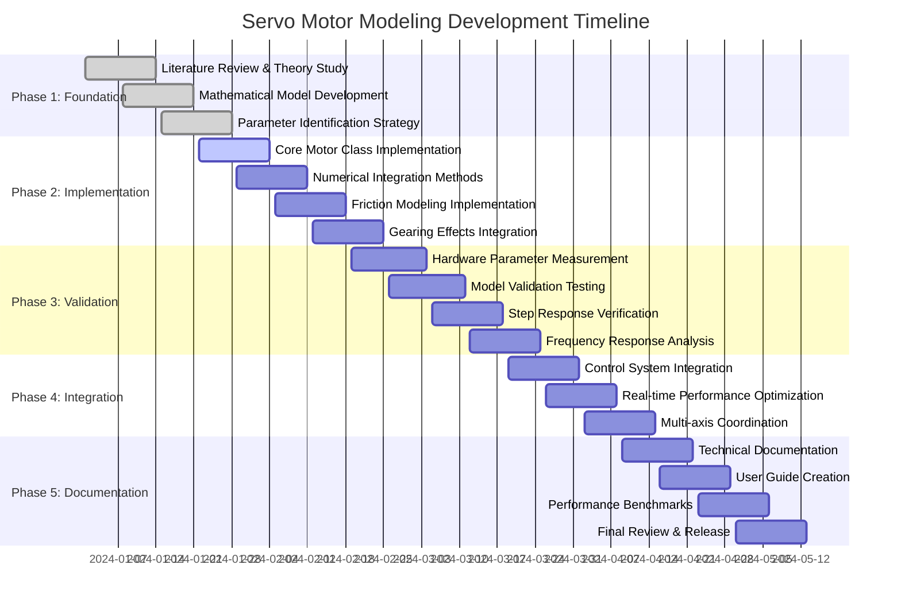

# Servo Motor Modeling: From Theory to Implementation

## Overview

This document explains the complete process of developing mathematical models for brushless servo motors in control systems applications. We cover the theoretical foundations, implementation approach, and practical considerations for creating accurate plant models that serve as the foundation for controller design.

---

## What: Mathematical Model of Brushless Servo Motor

### Core Dynamic Equations

The servo motor model captures two coupled subsystems:

#### Electrical Subsystem
```
L(di/dt) + R×i + K_e×ω = V(t)
```

**Physical meaning:**
- **L(di/dt)**: Inductive voltage drop - opposes current changes
- **R×i**: Resistive voltage drop - power dissipation
- **K_e×ω**: Back-EMF - electromagnetic coupling to mechanical system
- **V(t)**: Applied voltage - control input

#### Mechanical Subsystem
```
J(dω/dt) + B×ω = K_t×i - T_load - T_friction
```

**Physical meaning:**
- **J(dω/dt)**: Inertial torque - resistance to angular acceleration
- **B×ω**: Viscous damping - speed-dependent energy loss
- **K_t×i**: Motor torque - electromagnetic force generation
- **T_load**: External load torque - disturbance input
- **T_friction**: Friction torque - nonlinear resistive forces

#### Kinematic Relationship
```
dθ/dt = ω
```

Where θ is angular position (the typical controlled variable).

### State Space Representation

The complete system can be expressed as:

**State vector:** x = [θ, ω, i]ᵀ

**State equations:**
```
dθ/dt = ω
dω/dt = (K_t×i - B×ω - T_friction - T_load)/J
di/dt = (V - R×i - K_e×ω)/L
```

This third-order system captures the essential dynamics needed for control design.

### Electromagnetic Coupling

The coupling constants K_t (torque constant) and K_e (back-EMF constant) are related by energy conservation:

```
K_t = K_e (in SI units)
```

This relationship ensures that electrical power input equals mechanical power output:
- **Power in:** P_e = V × i
- **Power out:** P_m = K_t × i × ω

### Gearing Effects

Real servo systems include gear reduction:

**Speed transformation:**
```
ω_load = ω_motor / n
θ_load = θ_motor / n
```

**Torque transformation:**
```
T_load = T_motor × n × η_gear
```

**Reflected inertia:**
```
J_total = J_motor + J_gear + J_load/n²
```

### Friction Modeling

Multiple friction mechanisms affect servo performance:

#### Coulomb Friction
```
T_coulomb = T_c × sign(ω)
```

#### Viscous Friction
```
T_viscous = B_f × ω
```

#### Stribeck Friction (Advanced)
```
T_stribeck = [T_c + (T_s - T_c) × e^(-(ω/ω_s)^n)] × sign(ω) + B_f × ω
```

---

## Why: Foundation for Control Design

### Essential for PID Controller Tuning

The motor model provides the transfer function needed for systematic PID tuning:

```
G(s) = Θ(s)/V(s) = K_t/[s×(LJs² + (RJ + LB)s + (RB + K_t×K_e))]
```

**Key parameters for tuning:**
- **DC gain:** K = K_t/(RB + K_t×K_e)
- **Time constant:** τ = RJ/(RB + K_t×K_e)
- **Bandwidth:** ω_bw ≈ 1/τ

### Stability Analysis Requirements

Accurate models enable:
- **Root locus analysis** for gain selection
- **Bode plot design** for frequency response shaping
- **Nyquist analysis** for stability margins
- **Robust control design** for parameter uncertainties

### Performance Prediction Capabilities

The model allows prediction of:
- **Step response characteristics** (rise time, overshoot, settling time)
- **Tracking accuracy** for various reference signals
- **Disturbance rejection** performance
- **Bandwidth limitations** and achievable performance

### Feed-Forward Compensation Design

Different compensation strategies require model knowledge:

#### Velocity Feed-Forward
```
u_ff = (1/K) × ω_ref
```

#### Acceleration Feed-Forward
```
u_ff = (J/K_t) × α_ref
```

#### Friction Feed-Forward  
```
u_ff = T_friction_model(ω_ref) / K_t
```

#### Gravity Compensation (for vertical axes)
```
u_ff = T_gravity / K_t
```

---

## How: Numerical Integration with Physical Parameters

### Implementation Strategy

The servo motor model is implemented using numerical integration of the differential equations:

```python
def update(self, dt: float) -> None:
    """Update motor state using numerical integration"""
    # Calculate derivatives
    back_emf = self.params.back_emf_constant * self.velocity
    current_derivative = (self._voltage_applied - 
                         self.params.resistance * self.current - 
                         back_emf) / self.params.inductance
    
    motor_torque = self.params.torque_constant * self.current
    friction_torque = self._calculate_friction(self.velocity)
    velocity_derivative = (motor_torque - 
                          self.params.damping * self.velocity - 
                          friction_torque - 
                          self._external_load_torque) / self.params.inertia
    
    position_derivative = self.velocity
    
    # Numerical integration (Euler method)
    self.current += current_derivative * dt
    self.velocity += velocity_derivative * dt
    self.position += position_derivative * dt
```

### Parameter Identification Process

#### Motor Constants Measurement

**Resistance (R):**
```python
# DC test: Apply known voltage, measure steady-state current
R = V_applied / I_steady_state
```

**Inductance (L):**
```python  
# AC impedance test
Z = V_rms / I_rms  
L = sqrt(Z² - R²) / (2π × frequency)
```

**Torque Constant (K_t):**
```python
# Static torque test
K_t = T_measured / I_applied

# Or back-EMF test  
K_e = (V_applied - R × I_no_load) / ω_no_load
K_t = K_e  # For brushless motors
```

#### Mechanical Parameters

**Inertia (J):**
```python
# Acceleration test
J = T_net / angular_acceleration

# Or oscillation test
J = K_spring / (2π × f_natural)²
```

**Damping (B):**
```python
# Free response decay
# From exponential fit: ω(t) = ω₀ × e^(-t/τ)
# Where τ = J/B
B = J / time_constant
```

**Friction Parameters:**
```python
# Static friction: measure breakaway torque
T_static = minimum_torque_to_start_motion

# Coulomb friction: torque needed for constant low speed
T_coulomb = torque_at_constant_low_speed

# Viscous friction: slope of torque vs speed curve
B_friction = d(torque)/d(speed)
```

### Numerical Integration Methods

#### Euler Method (Simple)
```python
x_new = x_old + derivative * dt
```
- **Pros:** Simple, fast
- **Cons:** Accumulates error, can be unstable

#### Runge-Kutta 4th Order (Accurate)
```python
k1 = f(x, t)
k2 = f(x + k1*dt/2, t + dt/2)  
k3 = f(x + k2*dt/2, t + dt/2)
k4 = f(x + k3*dt, t + dt)
x_new = x + (k1 + 2*k2 + 2*k3 + k4) * dt/6
```
- **Pros:** Much more accurate
- **Cons:** More computation per step

### Time Step Selection

Critical for numerical stability:

```python
# Rule of thumb: dt should be much smaller than system time constants
dt_max = min(τ_electrical, τ_mechanical) / 10

# Typical values:
# τ_electrical = L/R ≈ 0.1-5 ms
# τ_mechanical = J/B ≈ 10-200 ms
# Therefore: dt ≤ 0.01-0.1 ms
```

### Physical Parameter Ranges

#### Typical servo motor parameters:

**Electrical:**
- Resistance: 0.5-10 Ω
- Inductance: 0.1-10 mH  
- Torque constant: 0.01-1.0 N⋅m/A

**Mechanical:**
- Inertia: 1e-6 to 1e-3 kg⋅m²
- Damping: 1e-6 to 1e-3 N⋅m⋅s/rad
- Friction: 0.001-0.1 N⋅m

**Gearing:**
- Ratios: 1:1 to 100:1
- Efficiency: 90-98%

### Validation Methods

#### Step Response Testing
Compare simulated vs actual response:
- Rise time accuracy
- Overshoot matching
- Settling time verification

#### Frequency Response Testing  
Use swept sine inputs:
- Bandwidth prediction
- Phase response validation
- Resonance identification

#### Tracking Performance
Test with various trajectories:
- Ramp tracking error
- Sinusoidal following accuracy
- Multi-frequency response

---

## Implementation Best Practices

### Code Structure

```python
@dataclass
class MotorParameters:
    """Physical parameters of the servo motor"""
    resistance: float          # Electrical resistance (Ω)
    inductance: float          # Electrical inductance (H)
    torque_constant: float     # Torque constant (N⋅m/A)
    back_emf_constant: float   # Back-EMF constant (V⋅s/rad)
    inertia: float            # Rotor inertia (kg⋅m²)
    damping: float            # Viscous damping (N⋅m⋅s/rad)
    coulomb_friction: float   # Coulomb friction torque (N⋅m)
    gear_ratio: float         # Gear reduction ratio

class ServoMotor:
    """Mathematical model of brushless servo motor"""
    
    def __init__(self, params: MotorParameters):
        self.params = params
        self.reset()
    
    def reset(self):
        """Reset motor to initial state"""
        self.position = 0.0
        self.velocity = 0.0  
        self.current = 0.0
        self._voltage_applied = 0.0
        self._external_load_torque = 0.0
    
    def apply_voltage(self, voltage: float):
        """Apply control voltage to motor"""
        self._voltage_applied = voltage
    
    def update(self, dt: float):
        """Update motor dynamics using numerical integration"""
        # Implementation as shown above
        pass
```

### Factory Functions for Different Axes

```python
def create_x_axis_motor() -> ServoMotor:
    """Create X-axis motor with appropriate parameters"""
    params = MotorParameters(
        resistance=2.0,
        inductance=0.003,
        torque_constant=0.15,
        back_emf_constant=0.15,
        inertia=0.002,
        damping=0.015,
        coulomb_friction=0.05,
        gear_ratio=20.0
    )
    return ServoMotor(params)

def create_y_axis_motor() -> ServoMotor:
    """Create Y-axis motor (vertical, higher torque)"""
    params = MotorParameters(
        resistance=1.5,
        inductance=0.004,
        torque_constant=0.2,  # Higher torque for gravity
        back_emf_constant=0.2,
        inertia=0.003,
        damping=0.02,
        coulomb_friction=0.07,
        gear_ratio=50.0  # Higher reduction for precision
    )
    return ServoMotor(params)
```

### Error Handling and Limits

```python
def apply_voltage(self, voltage: float):
    """Apply voltage with saturation limits"""
    # Voltage limiting
    max_voltage = 48.0  # System voltage limit
    self._voltage_applied = np.clip(voltage, -max_voltage, max_voltage)
    
    # Current limiting (in update method)
    max_current = 10.0  # Motor current rating
    self.current = np.clip(self.current, -max_current, max_current)
```

---

## Model Validation and Testing

### Simulation vs Reality Comparison

The servo motor model should accurately predict:

1. **Steady-state behavior:** Final position accuracy
2. **Transient response:** Rise time and overshoot  
3. **Frequency response:** Bandwidth and resonances
4. **Nonlinear effects:** Friction and saturation impacts

### Performance Metrics

Track model accuracy using:
- RMS tracking error
- Peak deviation from actual response
- Frequency response correlation
- Control effort prediction accuracy

### Continuous Improvement

- Update parameters based on real system data
- Add temperature effects for long operations
- Include structural resonances for high-speed moves
- Implement adaptive parameter identification

---

## Conclusion

Accurate servo motor modeling provides the foundation for successful control system design. The mathematical models capture the essential physics while remaining computationally efficient for real-time control applications. The systematic approach to parameter identification and validation ensures that the models provide reliable predictions for controller design and performance analysis.

This modeling process transforms physical hardware into mathematical representations that enable systematic, theory-based control design rather than empirical trial-and-error approaches.

---

## Project Roadmap: Servo Motor Modeling Implementation



### Milestone Deliverables

#### Phase 1: Foundation (Weeks 1-4)
- ✅ Complete mathematical derivation of motor dynamics
- ✅ Parameter identification methodology document
- ✅ Integration method selection and analysis

#### Phase 2: Implementation (Weeks 4-8)
- 🔄 `ServoMotor` class with full dynamics
- ⏳ Runge-Kutta 4th order numerical solver
- ⏳ Comprehensive friction modeling (Coulomb, viscous, Stribeck)
- ⏳ Gear reduction effects implementation

#### Phase 3: Validation (Weeks 8-12)
- ⏳ Physical parameter measurement procedures
- ⏳ Model accuracy validation against real hardware
- ⏳ Frequency domain validation (Bode plots)
- ⏳ Tracking performance verification

#### Phase 4: Integration (Weeks 12-16)
- ⏳ PID controller integration and tuning
- ⏳ Real-time performance optimization (<1ms update cycles)
- ⏳ Multi-axis coordinated motion support

#### Phase 5: Documentation (Weeks 16-20)
- ⏳ Complete API documentation
- ⏳ Installation and usage guides
- ⏳ Performance benchmark results
- ⏳ Production release preparation

### Risk Mitigation

| Risk | Impact | Mitigation Strategy |
|------|---------|-------------------|
| Parameter measurement accuracy | High | Use multiple measurement methods, statistical validation |
| Numerical stability issues | Medium | Implement adaptive time stepping, multiple integration methods |
| Real-time performance | High | Profile code, optimize critical paths, parallel processing |
| Hardware availability | Medium | Use simulation for initial development, staged hardware testing |

### Success Criteria

- Model prediction error < 2% for step responses
- Frequency response correlation > 95% up to motor bandwidth
- Real-time update rate: >1kHz on target hardware
- Integration time: <2 weeks for new motor types

### Roadmap Implementation Strategy

This roadmap follows a systematic engineering approach that progresses from theoretical understanding to production-ready implementation. The **Foundation Phase** establishes the mathematical groundwork and parameter identification strategies, ensuring we have a solid theoretical basis before writing any code. The **Implementation Phase** translates theory into working software, building the core motor dynamics engine with proper numerical methods and comprehensive modeling of real-world effects like friction and gearing.

The **Validation Phase** represents the critical transition from simulation to reality, where we measure actual hardware parameters and verify that our mathematical models accurately predict physical behavior. This phase includes both time-domain validation (step responses) and frequency-domain analysis (Bode plots) to ensure comprehensive model fidelity across all operating conditions.

The **Integration Phase** focuses on making the models practically useful by embedding them within control systems and optimizing for real-time performance. This includes developing multi-axis coordination capabilities essential for complex motion profiles. Finally, the **Documentation Phase** ensures knowledge transfer and long-term maintainability, creating the resources necessary for other engineers to successfully deploy and extend the modeling framework.

Each phase builds upon the previous one, with deliberate overlap to allow parallel development where dependencies permit. The timeline reflects industry-standard practices for control system development, balancing thoroughness with practical development schedules.