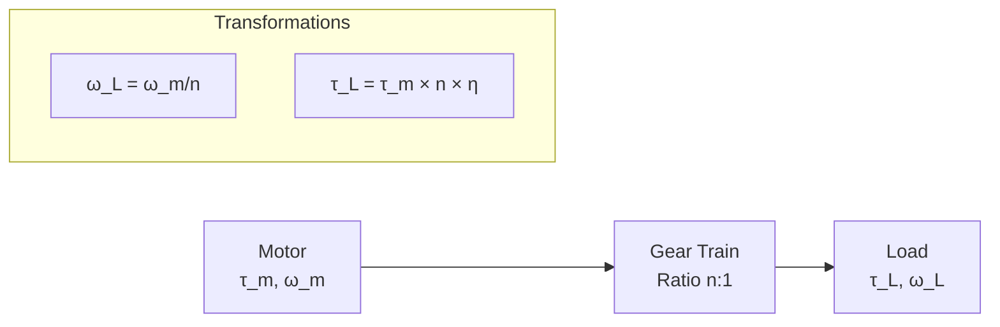
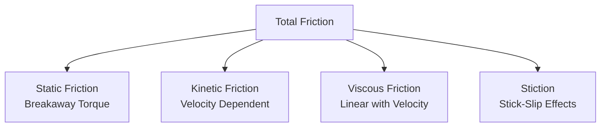

# Servo Motor Modeling for Control Systems: Mathematical Foundation and Implementation

## Executive Summary

This document provides a comprehensive explanation of servo motor modeling for control systems applications, specifically for the SIMPL warehouse automation system. We cover the mathematical foundations, physical parameter identification, numerical implementation, and control design implications of accurate motor modeling.

---

## Table of Contents

1. [Physical System Overview](#physical-system-overview)
2. [Mathematical Model Development](#mathematical-model-development)
3. [Electrical Subsystem Dynamics](#electrical-subsystem-dynamics)
4. [Mechanical Subsystem Dynamics](#mechanical-subsystem-dynamics)
5. [Coupling Between Electrical and Mechanical Systems](#coupling-between-electrical-and-mechanical-systems)
6. [Gearing and Load Effects](#gearing-and-load-effects)
7. [Friction Modeling](#friction-modeling)
8. [Complete System Model](#complete-system-model)
9. [Numerical Implementation](#numerical-implementation)
10. [Parameter Identification](#parameter-identification)
11. [Transfer Function Derivation](#transfer-function-derivation)
12. [Control Design Implications](#control-design-implications)
13. [SIMPL-Specific Considerations](#simpl-specific-considerations)

---

## Physical System Overview

### Servo Motor Components

A brushless servo motor system for warehouse automation consists of several interconnected subsystems:

```mermaid
graph TB
    subgraph "Electrical Subsystem"
        V[Applied Voltage V(t)]
        R[Resistance R]
        L[Inductance L]
        I[Current i(t)]
    end
    
    subgraph "Electromagnetic Coupling"
        KT[Torque Constant Kt]
        KE[Back-EMF Constant Ke]
    end
    
    subgraph "Mechanical Subsystem"
        J[Rotor Inertia J]
        B[Damping B]
        TM[Motor Torque]
        W[Angular Velocity ω(t)]
        THETA[Position θ(t)]
    end
    
    subgraph "Load System"
        GEAR[Gear Train]
        FRICTION[Friction]
        LOAD[External Load]
    end
    
    V --> I
    I --> TM
    TM --> W
    W --> THETA
    W --> KE
    KE --> V
    
    TM --> GEAR
    GEAR --> LOAD
    FRICTION --> TM
```

### Key Physical Principles

**Electromagnetic Relationships:**
- **Motor torque** is proportional to current: T_m = K_t × i
- **Back-EMF** opposes applied voltage: e = K_e × ω
- **Energy conservation** links electrical and mechanical power

**Mechanical Relationships:**
- **Newton's second law** governs rotational motion
- **Friction forces** oppose motion
- **Gearing** transforms torque and speed

---

## Mathematical Model Development

### Fundamental Equations

The complete servo motor model is based on two coupled differential equations:

#### Electrical Circuit Equation
```
L(di/dt) + R×i + K_e×ω = V(t)
```

Where:
- **L**: Motor inductance (Henry)
- **R**: Motor resistance (Ohm)
- **K_e**: Back-EMF constant (V⋅s/rad)
- **i**: Motor current (Ampere)
- **ω**: Angular velocity (rad/s)
- **V(t)**: Applied voltage (Volt)

#### Mechanical Equation of Motion
```
J(dω/dt) + B×ω + T_friction + T_load = K_t×i
```

Where:
- **J**: Total moment of inertia (kg⋅m²)
- **B**: Viscous damping coefficient (N⋅m⋅s/rad)
- **K_t**: Motor torque constant (N⋅m/A)
- **T_friction**: Friction torque (N⋅m)
- **T_load**: External load torque (N⋅m)

#### Kinematic Relationship
```
dθ/dt = ω
```

Where:
- **θ**: Angular position (rad)

---

## Electrical Subsystem Dynamics

### Circuit Analysis

The electrical subsystem represents the motor windings as an RL circuit with a back-EMF voltage source:

```mermaid
graph LR
    V[V(t)<br/>Applied Voltage] --> R_eq[R<br/>Resistance]
    R_eq --> L_eq[L<br/>Inductance]
    L_eq --> BEMF[e = Ke×ω<br/>Back-EMF]
    BEMF --> GND[Ground]
    
    style V fill:#e1f5fe
    style BEMF fill:#fff3e0
```

### Electrical Time Constant

The electrical time constant determines how quickly current responds to voltage changes:

```
τ_e = L/R
```

**Typical values for servo motors:**
- Small servo: τ_e ≈ 0.1-1 ms
- Large servo: τ_e ≈ 1-5 ms

### Current Dynamics

Rearranging the electrical equation for current derivative:

```
di/dt = (V(t) - R×i - K_e×ω)/L
```

This shows that current changes are driven by:
1. **Applied voltage** V(t) - increases current
2. **Resistive drop** R×i - opposes current
3. **Back-EMF** K_e×ω - opposes current (motor action)

### Physical Interpretation

- **At startup** (ω = 0): Maximum current flows (limited only by R and L)
- **At steady state**: Back-EMF balances applied voltage
- **During acceleration**: Current provides torque for acceleration
- **During deceleration**: Back-EMF can exceed applied voltage (regenerative braking)

---

## Mechanical Subsystem Dynamics

### Rotational Dynamics

The mechanical subsystem follows Newton's second law for rotational motion:

```
Σ Torques = J × α
```

Where α = dω/dt is angular acceleration.

### Torque Balance

```
J(dω/dt) = T_motor - T_damping - T_friction - T_load
```

Expanding each term:
- **T_motor = K_t × i** (electromagnetic torque)
- **T_damping = B × ω** (viscous damping)
- **T_friction = f(ω, direction)** (friction model)
- **T_load = external loads** (gravity, payload, etc.)

### Mechanical Time Constant

The mechanical time constant (without electrical effects):

```
τ_m = J/B
```

**Typical values:**
- High-performance servo: τ_m ≈ 10-50 ms
- Large industrial servo: τ_m ≈ 50-200 ms

### Inertia Components

Total inertia includes multiple components:

```
J_total = J_rotor + J_gears + J_load_reflected
```

Where:
- **J_rotor**: Motor rotor inertia
- **J_gears**: Gear train inertia
- **J_load_reflected**: Load inertia reflected through gearing

### Load Inertia Reflection

Load inertia reflects to the motor shaft through the gear ratio:

```
J_load_reflected = J_load × (1/n)²
```

Where n is the gear ratio (output/input).

---

## Coupling Between Electrical and Mechanical Systems

### Electromagnetic Coupling Constants

For brushless DC motors, the torque and back-EMF constants are related by energy conservation:

```
K_t = K_e (in SI units)
```

This relationship ensures that electrical power input equals mechanical power output (neglecting losses).

### Power Balance

**Electrical power in:** P_e = V × i
**Mechanical power out:** P_m = T × ω = K_t × i × ω

At steady state with perfect efficiency:
```
V × i = K_t × i × ω
V = K_t × ω = K_e × ω
```

### Coupling Effects on Dynamics

The coupling creates several important effects:

1. **Back-EMF limiting**: As speed increases, available torque decreases
2. **Speed-torque relationship**: Natural inverse relationship
3. **Regenerative capability**: Motor can act as generator during deceleration

### Frequency Response Implications

The electrical-mechanical coupling creates:
- **Two time constants**: electrical (fast) and mechanical (slow)
- **Complex frequency response**: with potential resonances
- **Bandwidth limitations**: mechanical bandwidth typically limits performance

---

## Gearing and Load Effects

### Gear Train Modeling

Gear trains modify the motor characteristics as seen by the load:



### Gear Ratio Effects

**Speed transformation:**
```
ω_load = ω_motor / n
θ_load = θ_motor / n
```

**Torque transformation:**
```
T_load = T_motor × n × η_gear
```

Where η_gear is gear efficiency (typically 0.9-0.98).

### Reflected Inertia

All inertias must be referenced to a common shaft (typically motor shaft):

```
J_equivalent = J_motor + J_gear + J_load/n²
```

This is crucial for:
- Control system design
- Stability analysis
- Performance prediction

### Gear Compliance and Backlash

Real gear trains introduce:

**Compliance:** Represented as a spring in the drivetrain
```
T_gear = k_gear × (θ_motor/n - θ_load)
```

**Backlash:** Dead zone in position transmission
- Affects positioning accuracy
- Can cause control instability
- Requires special compensation techniques

---

## Friction Modeling

### Types of Friction

Friction in servo systems includes several components:



### Mathematical Models

#### Simple Coulomb Friction
```
T_friction = T_c × sign(ω)
```

Where T_c is the Coulomb friction torque.

#### Coulomb + Viscous Model
```
T_friction = T_c × sign(ω) + B_f × ω
```

#### Advanced Friction Model (Stribeck Effect)
```
T_friction = [T_c + (T_s - T_c) × e^(-(ω/ω_s)^n)] × sign(ω) + B_f × ω
```

Where:
- **T_s**: Static friction torque
- **T_c**: Coulomb friction torque
- **ω_s**: Stribeck velocity
- **n**: Curve shape parameter (typically 1-2)

### Friction Effects on Control

**Low-speed effects:**
- Poor tracking accuracy
- Limit cycles around setpoints
- Need for integral action

**High-speed effects:**
- Reduced efficiency
- Temperature rise
- Wear acceleration

**Compensation strategies:**
- Feed-forward friction compensation
- Adaptive friction estimation
- Advanced control algorithms (sliding mode, etc.)

---

## Complete System Model

### State Space Representation

The complete servo motor can be represented in state space form:

**State vector:**
```
x = [θ, ω, i]ᵀ
```

**State equations:**
```
dθ/dt = ω
dω/dt = (K_t×i - B×ω - T_friction - T_load)/J
di/dt = (V - R×i - K_e×ω)/L
```

**Matrix form:**
```
ẋ = A×x + B×u + B_d×d

A = [0    1      0   ]    B = [0  ]    B_d = [0     ]
    [0   -B/J   K_t/J]        [0  ]          [-1/J ]
    [0   -K_e/L -R/L ]        [1/L]          [0    ]

y = C×x = [1  0  0] × x
```

Where:
- **u = V**: Input voltage
- **d = T_load**: Disturbance torque
- **y = θ**: Output position

### Transfer Function Development

Taking Laplace transforms of the differential equations (assuming zero initial conditions):

**From electrical equation:**
```
(Ls + R)I(s) + K_e×Ω(s) = V(s)
I(s) = [V(s) - K_e×Ω(s)]/(Ls + R)
```

**From mechanical equation:**
```
(Js + B)Ω(s) + T_load(s) = K_t×I(s)
```

**Substituting I(s):**
```
(Js + B)Ω(s) = K_t×[V(s) - K_e×Ω(s)]/(Ls + R) - T_load(s)
```

**Solving for Ω(s)/V(s):**
```
G_ω(s) = Ω(s)/V(s) = K_t/[(Ls + R)(Js + B) + K_t×K_e]
```

**For position output:**
```
G_θ(s) = Θ(s)/V(s) = K_t/[s×((Ls + R)(Js + B) + K_t×K_e)]
```

### Simplified Models

#### First-Order Approximation (Fast Electrical Dynamics)

When L << R×τ_m, the electrical dynamics are much faster than mechanical:

```
G_θ(s) ≈ K/[s(τ_m×s + 1)]
```

Where:
- **K = K_t/(R×B + K_t×K_e)**: DC gain
- **τ_m = R×J/(R×B + K_t×K_e)**: Mechanical time constant

#### Second-Order Model

Retaining both electrical and mechanical dynamics:

```
G_θ(s) = K_t/[s×(L×J×s² + (R×J + L×B)×s + (R×B + K_t×K_e))]
```

This gives a more accurate representation for high-frequency analysis.

---

## Numerical Implementation

### Euler Integration Method

The simplest numerical integration approach:

```python
def update_euler(self, dt, voltage):
    # Current derivative
    di_dt = (voltage - self.R * self.current - self.Ke * self.velocity) / self.L
    
    # Velocity derivative  
    motor_torque = self.Kt * self.current
    friction_torque = self.friction_model(self.velocity)
    dw_dt = (motor_torque - self.B * self.velocity - friction_torque - self.load_torque) / self.J
    
    # Position derivative
    dtheta_dt = self.velocity
    
    # Integration step
    self.current += di_dt * dt
    self.velocity += dw_dt * dt
    self.position += dtheta_dt * dt
```

### Runge-Kutta 4th Order Method

For improved accuracy:

```python
def update_rk4(self, dt, voltage):
    # Define derivatives function
    def derivatives(state, t, voltage):
        theta, omega, current = state
        
        di_dt = (voltage - self.R * current - self.Ke * omega) / self.L
        dw_dt = (self.Kt * current - self.B * omega - self.friction_model(omega) - self.load_torque) / self.J
        dtheta_dt = omega
        
        return [dtheta_dt, dw_dt, di_dt]
    
    # RK4 integration
    state = [self.position, self.velocity, self.current]
    k1 = derivatives(state, 0, voltage)
    k2 = derivatives([s + k * dt/2 for s, k in zip(state, k1)], dt/2, voltage)
    k3 = derivatives([s + k * dt/2 for s, k in zip(state, k2)], dt/2, voltage)
    k4 = derivatives([s + k * dt for s, k in zip(state, k3)], dt, voltage)
    
    # Update state
    for i in range(3):
        state[i] += dt/6 * (k1[i] + 2*k2[i] + 2*k3[i] + k4[i])
    
    self.position, self.velocity, self.current = state
```

### Numerical Stability Considerations

**Time step selection:**
```
dt << min(τ_e, τ_m) / 10
```

Typically dt ≤ 0.1 ms for servo motors.

**Stiff system handling:**
- Use implicit integration for fast electrical dynamics
- Separate time scales for electrical and mechanical subsystems
- Adaptive step size algorithms

---

## Parameter Identification

### Motor Constants Measurement

#### Resistance Measurement
Apply DC voltage and measure steady-state current:
```
R = V_dc / I_steady_state
```

#### Inductance Measurement
Apply AC voltage and measure impedance:
```
L = sqrt(Z² - R²) / (2π × f)
```

#### Torque Constant Measurement
Method 1 - Static torque test:
```
K_t = T_measured / I_applied
```

Method 2 - No-load speed test:
```
K_e = (V_applied - R × I_no_load) / ω_no_load
K_t = K_e (for BLDC motors)
```

### Inertia Identification

#### Acceleration Test Method
1. Apply known torque step
2. Measure angular acceleration
3. Calculate: J = T_net / α

#### Oscillation Test Method
1. Create undamped oscillation
2. Measure natural frequency: ω_n = sqrt(K/J)
3. Calculate inertia if spring constant K is known

#### Deceleration Test Method
1. Spin motor to known speed
2. Remove power and measure deceleration
3. Use: J = T_friction / α_decel

### Damping Identification

#### Free Response Method
1. Give initial velocity
2. Measure exponential decay
3. Extract time constant: τ = J/B

#### Frequency Response Method
1. Apply sinusoidal input
2. Measure magnitude and phase
3. Fit to theoretical model

### Friction Parameter Identification

#### Static Friction Test
1. Apply increasing torque
2. Measure breakaway torque
3. Static friction = breakaway torque

#### Dynamic Friction Test
1. Run at constant speeds
2. Measure required torque
3. Fit to friction model

---

## Transfer Function Derivation

### Complete Third-Order Model

Starting from the coupled differential equations and taking Laplace transforms:

```
Electrical: (Ls + R)I(s) = V(s) - K_e×s×Θ(s)
Mechanical: (Js² + Bs)Θ(s) = K_t×I(s) - T_load(s)
```

Eliminating I(s):
```
(Js² + Bs)Θ(s) = K_t×[V(s) - K_e×s×Θ(s)]/(Ls + R) - T_load(s)
```

Solving for Θ(s)/V(s):
```
G(s) = K_t/[s×(LJs² + (RJ + LB)s + (RB + K_t×K_e))]
```

### Characteristic Equation Analysis

The characteristic equation is:
```
LJs³ + (RJ + LB)s² + (RB + K_t×K_e)s = 0
```

**Poles:**
- One pole at s = 0 (integrator)
- Two poles from: LJs² + (RJ + LB)s + (RB + K_t×K_e) = 0

### Simplified Second-Order Model

For control design, often use the simplified model:
```
G(s) = K/[s(τs + 1)]
```

Where:
- **K = K_t/(RB + K_t×K_e)**: DC gain (rad/V⋅s)
- **τ = RJ/(RB + K_t×K_e)**: Time constant (s)

### Frequency Response Characteristics

**Low frequency:** Behaves as integrator (slope = -20 dB/decade)
**Mid frequency:** Single pole rolloff (-40 dB/decade total)
**High frequency:** Additional pole from electrical dynamics

**Bandwidth approximation:**
```
ω_bw ≈ 1/τ = (RB + K_t×K_e)/(RJ)
```

---

## Control Design Implications

### PID Controller Design

#### Proportional Gain Effects
- **Higher Kp**: Faster response, higher bandwidth, more overshoot
- **Lower Kp**: Slower response, more stable, steady-state error

#### Integral Gain Effects
- **Eliminates steady-state error** to step inputs
- **Can destabilize** system if too high
- **Rule of thumb**: ωi ≈ ωbw/10

#### Derivative Gain Effects
- **Improves stability** (adds phase lead)
- **Reduces overshoot**
- **Amplifies noise** at high frequencies
- **Rule of thumb**: ωd ≈ 10×ωbw

### Feed-Forward Compensation

#### Velocity Feed-Forward
For improved tracking of ramp inputs:
```
u_ff = (1/K) × ω_ref
```

#### Acceleration Feed-Forward
For improved tracking during acceleration:
```
u_ff = (J/K_t) × α_ref
```

#### Friction Feed-Forward
For improved low-speed performance:
```
u_ff = T_friction_model(ω_ref) / K_t
```

### Stability Analysis

#### Gain Margin
Typically want GM > 6 dB for robust stability.

#### Phase Margin
Typically want PM > 45° for good transient response.

#### Root Locus Design
- Poles start at plant poles
- Poles move toward plant zeros and infinity
- Use to select appropriate controller gains

### Performance Limitations

#### Bandwidth Limitations
Closed-loop bandwidth limited by:
- Motor electrical time constant
- Motor mechanical time constant
- Sensor noise and resolution
- Actuator saturation

#### Disturbance Rejection
- Low-frequency disturbances: Good rejection with integral action
- High-frequency disturbances: Limited by closed-loop bandwidth

#### Tracking Performance
- Position accuracy: Limited by sensor resolution and system stiffness
- Velocity accuracy: Limited by friction compensation and disturbances

---

## SIMPL-Specific Considerations

### X-Axis Motor (Horizontal)

**Characteristics:**
- Moderate inertia from horizontal load
- Primary friction is bearing friction
- No gravity effects

**Model parameters:**
```python
params_x = MotorParameters(
    motor_constant=0.15,    # Higher torque for speed
    inertia=0.002,          # Moderate inertia
    damping=0.015,
    gear_ratio=20.0,        # Precision gearing
    coulomb_friction=0.05
)
```

**Control implications:**
- Can use aggressive tuning
- Fast response achievable
- Good for high-speed moves

### Y-Axis Motor (Vertical)

**Characteristics:**
- Must overcome gravity constantly
- Variable payload affects dynamics
- Higher required torque

**Model parameters:**
```python
params_y = MotorParameters(
    motor_constant=0.2,     # Higher torque constant
    inertia=0.003,          # Higher inertia
    damping=0.02,
    gear_ratio=50.0,        # High reduction for holding
    coulomb_friction=0.07
)
```

**Control implications:**
- Requires feed-forward gravity compensation
- Gain scheduling for different payloads
- Lower bandwidth due to higher inertia

### Z-Axis Motor (Depth)

**Characteristics:**
- Moderate loads
- Intermediate dynamics
- Some coupling with payload

**Model parameters:**
```python
params_z = MotorParameters(
    motor_constant=0.12,
    inertia=0.0015,
    damping=0.012,
    gear_ratio=15.0,
    coulomb_friction=0.04
)
```

### Multi-Axis Coupling Effects

**Mechanical coupling:**
- Shared structure vibrations
- Cross-axis forces during acceleration
- Payload shifting effects

**Control coupling:**
- Coordinated motion requirements
- Simultaneous arrival constraints
- Safety system interactions

**Implementation considerations:**
- Independent axis controllers
- Trajectory coordination layer
- Cross-coupling compensation

---

## Validation and Testing

### Model Validation Methods

#### Step Response Testing
Compare simulated vs actual response to voltage steps:
- Rise time accuracy
- Overshoot matching  
- Settling time verification
- Steady-state accuracy

#### Frequency Response Testing
Use swept sine inputs to validate:
- Bandwidth prediction
- Phase response
- Resonance identification
- High-frequency behavior

#### Tracking Performance Testing
Test with various reference trajectories:
- Ramp tracking
- Sinusoidal tracking
- Multi-frequency signals
- Real warehouse movements

### Parameter Sensitivity Analysis

Analyze how model accuracy affects:
- Control performance
- Stability margins
- Disturbance rejection
- Tracking accuracy

### Model Limitations

**What the model captures:**
- Linear electrical and mechanical dynamics
- Basic friction effects
- Gear ratio effects
- Inertia and damping

**What the model doesn't capture:**
- Thermal effects
- Magnetic saturation
- Gear backlash and compliance
- Structural resonances
- Nonlinear friction at very low speeds

---

## Conclusion

Accurate servo motor modeling is fundamental to successful control system design for warehouse automation. The mathematical models presented here provide:

1. **Physical insight** into system behavior
2. **Foundation for control design** (PID tuning, feed-forward, etc.)
3. **Performance prediction** capabilities
4. **Stability analysis** tools
5. **Simulation and testing** platform

The SIMPL implementation demonstrates how these theoretical concepts translate into practical, working control systems that meet the demanding requirements of modern warehouse automation.

### Key Takeaways

**For Control Engineers:**
- Always start with physics-based models
- Validate models against real hardware
- Consider all significant physical effects
- Design for robustness to parameter variations

**For SIMPL Implementation:**
- Use axis-specific motor models
- Implement proper gravity compensation
- Consider payload effects on dynamics
- Design for multi-axis coordination

**For Future Development:**
- Add thermal modeling for continuous operation
- Implement adaptive parameter identification
- Include structural dynamics for high-speed operation
- Add advanced friction compensation

This modeling foundation enables the development of high-performance, reliable control systems that meet the stringent requirements of modern warehouse automation while maintaining safety and efficiency.