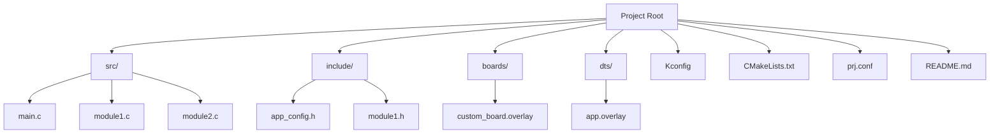
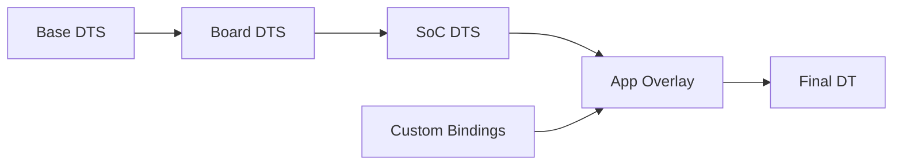

# Module 4: Project Structure and Build System

## Project Organization

A well-structured Zephyr project follows consistent patterns that make development and maintenance easier.

## Standard Project Layout



## File Structure Examples

### Basic Application Structure

```
my_zephyr_app/
├── CMakeLists.txt          # Build configuration
├── prj.conf               # Application configuration
├── README.md              # Project documentation
├── src/
│   ├── main.c             # Main application
│   ├── sensors.c          # Sensor handling
│   └── communication.c    # Communication module
├── include/
│   ├── app_config.h       # Application constants
│   ├── sensors.h          # Sensor interfaces
│   └── communication.h    # Communication interfaces
├── boards/
│   └── nucleo_f446re.overlay  # Board-specific DT overlay
├── dts/
│   └── bindings/          # Custom DT bindings
└── tests/
    ├── unit/              # Unit tests
    └── integration/       # Integration tests
```

### Complex Multi-Module Structure

```
complex_zephyr_project/
├── CMakeLists.txt
├── prj.conf
├── Kconfig                # Custom configuration options
├── VERSION                # Version information
├── src/
│   ├── main.c
│   ├── core/              # Core functionality
│   │   ├── system.c
│   │   ├── config.c
│   │   └── utils.c
│   ├── drivers/           # Custom drivers
│   │   ├── sensor_driver.c
│   │   └── display_driver.c
│   ├── services/          # Application services
│   │   ├── data_service.c
│   │   ├── comm_service.c
│   │   └── ui_service.c
│   └── protocols/         # Communication protocols
│       ├── modbus.c
│       └── mqtt.c
├── include/
│   ├── core/
│   ├── drivers/
│   ├── services/
│   └── protocols/
├── boards/
│   ├── nucleo_f446re.overlay
│   └── custom_board/
├── dts/
│   ├── bindings/
│   └── overlays/
├── configs/               # Configuration variants
│   ├── debug.conf
│   ├── release.conf
│   └── test.conf
├── scripts/               # Build and utility scripts
│   ├── build.sh
│   ├── flash.sh
│   └── test.sh
├── docs/                  # Documentation
│   ├── architecture.md
│   ├── api.md
│   └── user_guide.md
└── tests/
    ├── unit/
    ├── integration/
    └── system/
```

## Core Build Files

### CMakeLists.txt Structure

```cmake
# SPDX-License-Identifier: Apache-2.0

cmake_minimum_required(VERSION 3.20.0)

# Find Zephyr package
find_package(Zephyr REQUIRED HINTS $ENV{ZEPHYR_BASE})

# Project information
project(my_zephyr_app VERSION 1.0.0)

# Include directories
target_include_directories(app PRIVATE include)

# Source files
target_sources(app PRIVATE
    src/main.c
    src/sensors.c
    src/communication.c
)

# Conditional compilation
if(CONFIG_MY_CUSTOM_FEATURE)
    target_sources(app PRIVATE src/custom_feature.c)
endif()

# Link libraries
target_link_libraries(app PRIVATE
    # Add any external libraries here
)

# Compiler definitions
target_compile_definitions(app PRIVATE
    -DAPP_VERSION_MAJOR=${PROJECT_VERSION_MAJOR}
    -DAPP_VERSION_MINOR=${PROJECT_VERSION_MINOR}
)

# Custom build targets
add_custom_target(flash_and_monitor
    COMMAND west flash
    COMMAND west attach
    COMMENT "Flash and start monitoring"
)
```

### Configuration Management

| Configuration File | Purpose | When to Use |
|-------------------|---------|-------------|
| `prj.conf` | Main application config | Always present |
| `boards/<board>.conf` | Board-specific config | Board-specific features |
| `<config_name>.conf` | Build variant configs | Debug/Release/Test builds |
| `Kconfig` | Custom config options | Custom configuration parameters |

#### Example prj.conf

```ini
# === Core System Configuration ===
CONFIG_MAIN_STACK_SIZE=4096
CONFIG_SYSTEM_WORKQUEUE_STACK_SIZE=2048

# === Console and Logging ===
CONFIG_CONSOLE=y
CONFIG_UART_CONSOLE=y
CONFIG_SERIAL=y
CONFIG_PRINTK=y

# === Logging Framework ===
CONFIG_LOG=y
CONFIG_LOG_DEFAULT_LEVEL=3
CONFIG_LOG_BACKEND_UART=y
CONFIG_LOG_PROCESS_THREAD_STACK_SIZE=1024

# === GPIO Support ===
CONFIG_GPIO=y

# === Networking (if needed) ===
# CONFIG_NETWORKING=y
# CONFIG_NET_TCP=y
# CONFIG_NET_UDP=y

# === File System (if needed) ===
# CONFIG_FILE_SYSTEM=y
# CONFIG_FAT_FILESYSTEM_ELM=y

# === Power Management ===
CONFIG_PM=y
CONFIG_PM_DEVICE=y

# === Debug Features (disable in production) ===
CONFIG_DEBUG=y
CONFIG_DEBUG_INFO=y
CONFIG_ASSERT=y
CONFIG_STACK_CANARIES=y
```

## Device Tree Integration

### Device Tree Overlay Files



#### Application Overlay Example

Create `boards/nucleo_f446re.overlay`:

```dts
/*
 * Application-specific device tree overlay for STM32 Nucleo-F446RE
 */

/ {
    aliases {
        myled = &user_led;
        mybutton = &user_button;
        mysensor = &i2c_sensor;
    };

    /* Custom GPIO configuration */
    custom_gpios {
        compatible = "gpio-leds";
        status_led: led_status {
            gpios = <&gpiob 0 GPIO_ACTIVE_HIGH>;
            label = "Status LED";
        };
        error_led: led_error {
            gpios = <&gpiob 1 GPIO_ACTIVE_HIGH>;
            label = "Error LED";
        };
    };

    /* Custom buttons */
    custom_buttons {
        compatible = "gpio-keys";
        mode_button: button_mode {
            gpios = <&gpioc 0 (GPIO_PULL_UP | GPIO_ACTIVE_LOW)>;
            label = "Mode Button";
        };
    };

    /* Application-specific configurations */
    app_config {
        sensor_update_interval = <1000>;  /* ms */
        max_retries = <3>;
        debug_enabled;
    };
};

/* I2C sensor configuration */
&i2c1 {
    status = "okay";
    clock-frequency = <I2C_BITRATE_FAST>;

    temp_sensor: lm75@48 {
        compatible = "lm75";
        reg = <0x48>;
        label = "Temperature Sensor";
    };

    humidity_sensor: sht3x@44 {
        compatible = "sensirion,sht3xd";
        reg = <0x44>;
        label = "Humidity Sensor";
        repeatability = <2>;
    };
};

/* UART configuration for communication */
&usart1 {
    status = "okay";
    current-speed = <115200>;
    
    /* Pin configuration */
    pinctrl-0 = <&usart1_tx_pa9 &usart1_rx_pa10>;
    pinctrl-names = "default";
};

/* SPI configuration */
&spi2 {
    status = "okay";
    pinctrl-0 = <&spi2_sck_pb13 &spi2_miso_pb14 &spi2_mosi_pb15>;
    pinctrl-names = "default";
    cs-gpios = <&gpiob 12 GPIO_ACTIVE_LOW>;

    external_flash: w25q32@0 {
        compatible = "jedec,spi-nor";
        reg = <0>;
        spi-max-frequency = <8000000>;
        label = "External Flash";
        jedec-id = [ef 40 16];
        size = <0x400000>;
    };
};

/* ADC configuration */
&adc1 {
    status = "okay";
    pinctrl-0 = <&adc1_in0_pa0>;
    pinctrl-names = "default";
    
    #address-cells = <1>;
    #size-cells = <0>;

    channel@0 {
        reg = <0>;
        zephyr,gain = "ADC_GAIN_1";
        zephyr,reference = "ADC_REF_INTERNAL";
        zephyr,acquisition-time = <ADC_ACQ_TIME_DEFAULT>;
        zephyr,resolution = <12>;
    };
};
```

## Build System Deep Dive

### West Configuration

Create `west.yml` for multi-repository projects:

```yaml
manifest:
  version: "0.13"

  defaults:
    remote: origin

  remotes:
    - name: origin
      url-base: https://github.com/mycompany
    - name: zephyrproject
      url-base: https://github.com/zephyrproject-rtos

  projects:
    - name: zephyr
      remote: zephyrproject
      revision: main
      import: true
    
    - name: my-custom-modules
      remote: origin
      path: modules/custom
      revision: main

  self:
    path: application
```

### Custom Kconfig Options

Create `Kconfig`:

```kconfig
# SPDX-License-Identifier: Apache-2.0

mainmenu "My Application Configuration"

config MY_APP_SENSOR_INTERVAL
    int "Sensor reading interval (ms)"
    default 1000
    range 100 10000
    help
      Configure how often sensors are read in milliseconds.

config MY_APP_MAX_RETRIES
    int "Maximum retry attempts"
    default 3
    range 1 10
    help
      Maximum number of retry attempts for failed operations.

config MY_APP_DEBUG_MODE
    bool "Enable debug mode"
    default y if DEBUG
    help
      Enable additional debug output and features.

choice MY_APP_LOG_LEVEL
    prompt "Application log level"
    default MY_APP_LOG_LEVEL_INFO

config MY_APP_LOG_LEVEL_ERROR
    bool "Error level only"

config MY_APP_LOG_LEVEL_WARNING
    bool "Warning level and above"

config MY_APP_LOG_LEVEL_INFO
    bool "Info level and above"

config MY_APP_LOG_LEVEL_DEBUG
    bool "Debug level and above"

endchoice

config MY_APP_CUSTOM_DRIVER
    bool "Enable custom sensor driver"
    depends on GPIO && I2C
    help
      Enable the custom sensor driver module.

menu "Communication Settings"

config MY_APP_UART_ENABLED
    bool "Enable UART communication"
    depends on SERIAL
    default y

config MY_APP_I2C_ENABLED
    bool "Enable I2C communication"
    depends on I2C
    default y

config MY_APP_SPI_ENABLED
    bool "Enable SPI communication"
    depends on SPI
    default n

endmenu

rsource "src/*/Kconfig"
```

## Build Variants and Configurations

### Configuration Table

| Build Type | Config File | Use Case | Key Settings |
|------------|------------|----------|--------------|
| Debug | `debug.conf` | Development | `CONFIG_DEBUG=y`, `CONFIG_ASSERT=y` |
| Release | `release.conf` | Production | `CONFIG_SIZE_OPTIMIZATIONS=y` |
| Test | `test.conf` | Testing | `CONFIG_ZTEST=y`, `CONFIG_COVERAGE=y` |

#### Debug Configuration (`configs/debug.conf`)

```ini
# Debug build configuration
CONFIG_DEBUG=y
CONFIG_DEBUG_INFO=y
CONFIG_ASSERT=y
CONFIG_STACK_CANARIES=y

# Enhanced logging
CONFIG_LOG=y
CONFIG_LOG_DEFAULT_LEVEL=4
CONFIG_LOG_BACKEND_UART=y

# Runtime checks
CONFIG_INIT_STACKS=y
CONFIG_STACK_SENTINEL=y
CONFIG_HEAP_MEM_POOL_SIZE=16384

# Debug thread info
CONFIG_THREAD_NAME=y
CONFIG_THREAD_STACK_INFO=y
CONFIG_THREAD_MONITOR=y
```

#### Release Configuration (`configs/release.conf`)

```ini
# Release build configuration
CONFIG_DEBUG=n
CONFIG_DEBUG_INFO=n
CONFIG_ASSERT=n

# Size optimizations
CONFIG_SIZE_OPTIMIZATIONS=y
CONFIG_COMPILER_OPT="-Os"

# Minimal logging
CONFIG_LOG=y
CONFIG_LOG_DEFAULT_LEVEL=1
CONFIG_LOG_BACKEND_UART=n

# Disable runtime checks
CONFIG_INIT_STACKS=n
CONFIG_STACK_SENTINEL=n
CONFIG_THREAD_NAME=n
```

## Module Organization

### Creating Reusable Modules

```c
// include/sensors/sensor_manager.h
#ifndef SENSOR_MANAGER_H
#define SENSOR_MANAGER_H

#include <zephyr/kernel.h>
#include <zephyr/device.h>

/* Sensor types */
enum sensor_type {
    SENSOR_TYPE_TEMPERATURE,
    SENSOR_TYPE_HUMIDITY,
    SENSOR_TYPE_PRESSURE,
    SENSOR_TYPE_COUNT
};

/* Sensor data structure */
struct sensor_data {
    enum sensor_type type;
    float value;
    uint32_t timestamp;
    bool valid;
};

/* Sensor manager configuration */
struct sensor_config {
    uint32_t update_interval_ms;
    uint32_t max_retries;
    bool auto_start;
};

/* Public API */
int sensor_manager_init(const struct sensor_config *config);
int sensor_manager_start(void);
int sensor_manager_stop(void);
int sensor_manager_read(enum sensor_type type, struct sensor_data *data);
int sensor_manager_register_callback(void (*callback)(struct sensor_data *));

#endif /* SENSOR_MANAGER_H */
```

### Module Implementation Pattern

```c
// src/sensors/sensor_manager.c
#include "sensors/sensor_manager.h"
#include <zephyr/logging/log.h>
#include <zephyr/drivers/sensor.h>

LOG_MODULE_REGISTER(sensor_manager, CONFIG_MY_APP_LOG_LEVEL);

/* Module configuration */
static struct sensor_config module_config;
static bool module_initialized = false;
static struct k_timer sensor_timer;
static struct k_work sensor_work;

/* Sensor callback */
static void (*sensor_callback)(struct sensor_data *) = NULL;

/* Internal functions */
static void sensor_timer_handler(struct k_timer *timer);
static void sensor_work_handler(struct k_work *work);
static int read_temperature_sensor(struct sensor_data *data);

/* Timer callback */
static void sensor_timer_handler(struct k_timer *timer)
{
    k_work_submit(&sensor_work);
}

/* Work handler */
static void sensor_work_handler(struct k_work *work)
{
    struct sensor_data data;
    int ret;

    /* Read all sensors */
    for (int i = 0; i < SENSOR_TYPE_COUNT; i++) {
        ret = sensor_manager_read(i, &data);
        if (ret == 0 && sensor_callback) {
            sensor_callback(&data);
        }
    }
}

/* Public API implementation */
int sensor_manager_init(const struct sensor_config *config)
{
    if (!config) {
        return -EINVAL;
    }

    module_config = *config;
    
    /* Initialize timer and work */
    k_timer_init(&sensor_timer, sensor_timer_handler, NULL);
    k_work_init(&sensor_work, sensor_work_handler);

    module_initialized = true;
    LOG_INF("Sensor manager initialized");

    return 0;
}

int sensor_manager_start(void)
{
    if (!module_initialized) {
        return -ENODEV;
    }

    k_timer_start(&sensor_timer, 
                  K_MSEC(module_config.update_interval_ms),
                  K_MSEC(module_config.update_interval_ms));
    
    LOG_INF("Sensor manager started");
    return 0;
}
```

## Build Scripts and Automation

### Build Script Example (`scripts/build.sh`)

```bash
#!/bin/bash

# Build script for Zephyr application
set -e

# Configuration
PROJECT_ROOT="$(cd "$(dirname "${BASH_SOURCE[0]}")/.." && pwd)"
BUILD_DIR="${PROJECT_ROOT}/build"
BOARD="nucleo_f446re"

# Colors for output
RED='\033[0;31m'
GREEN='\033[0;32m'
YELLOW='\033[1;33m'
NC='\033[0m' # No Color

# Functions
log_info() {
    echo -e "${GREEN}[INFO]${NC} $1"
}

log_warn() {
    echo -e "${YELLOW}[WARN]${NC} $1"
}

log_error() {
    echo -e "${RED}[ERROR]${NC} $1"
}

# Parse command line arguments
BUILD_TYPE="debug"
CLEAN_BUILD=false
FLASH_AFTER_BUILD=false

while [[ $# -gt 0 ]]; do
    case $1 in
        -t|--type)
            BUILD_TYPE="$2"
            shift 2
            ;;
        -c|--clean)
            CLEAN_BUILD=true
            shift
            ;;
        -f|--flash)
            FLASH_AFTER_BUILD=true
            shift
            ;;
        -h|--help)
            echo "Usage: $0 [OPTIONS]"
            echo "Options:"
            echo "  -t, --type TYPE    Build type (debug, release, test)"
            echo "  -c, --clean        Clean build"
            echo "  -f, --flash        Flash after build"
            echo "  -h, --help         Show this help"
            exit 0
            ;;
        *)
            log_error "Unknown option: $1"
            exit 1
            ;;
    esac
done

# Validate build type
case $BUILD_TYPE in
    debug|release|test)
        ;;
    *)
        log_error "Invalid build type: $BUILD_TYPE"
        exit 1
        ;;
esac

# Build process
cd "$PROJECT_ROOT"

log_info "Building for board: $BOARD"
log_info "Build type: $BUILD_TYPE"

# Clean build if requested
if [ "$CLEAN_BUILD" = true ]; then
    log_info "Cleaning build directory"
    rm -rf "$BUILD_DIR"
fi

# Set up build arguments
BUILD_ARGS=""
if [ -f "configs/${BUILD_TYPE}.conf" ]; then
    BUILD_ARGS="-- -DOVERLAY_CONFIG=configs/${BUILD_TYPE}.conf"
fi

# Build command
if [ "$CLEAN_BUILD" = true ]; then
    west build -p auto -b "$BOARD" . $BUILD_ARGS
else
    west build -b "$BOARD" . $BUILD_ARGS
fi

# Check build result
if [ $? -eq 0 ]; then
    log_info "Build successful"
    
    # Show memory usage
    log_info "Memory usage:"
    west build -t ram_report
    west build -t rom_report
    
    # Flash if requested
    if [ "$FLASH_AFTER_BUILD" = true ]; then
        log_info "Flashing to board"
        west flash
        
        if [ $? -eq 0 ]; then
            log_info "Flash successful"
        else
            log_error "Flash failed"
            exit 1
        fi
    fi
else
    log_error "Build failed"
    exit 1
fi

log_info "Build process completed"
```

## Best Practices

### Project Organization Guidelines

1. **Consistent Structure**: Follow established patterns
2. **Modular Design**: Separate concerns into modules
3. **Configuration Management**: Use appropriate config files
4. **Documentation**: Include comprehensive README files
5. **Version Control**: Use proper .gitignore patterns

### Recommended .gitignore

```gitignore
# Build directories
build/
build-*/

# Zephyr generated files
**/generated/
**/.config
**/.config.old

# IDE files
.vscode/settings.json
.vscode/launch.json
*.code-workspace

# OS files
.DS_Store
Thumbs.db

# Temporary files
*.tmp
*.temp
*~

# Log files
*.log

# Python cache
__pycache__/
*.pyc
*.pyo

# CMake cache
CMakeCache.txt
CMakeFiles/
```

## Next Steps

With a solid understanding of project structure, proceed to [Module 5: Hello World Application](05_hello_world.md) to create your first structured Zephyr application.