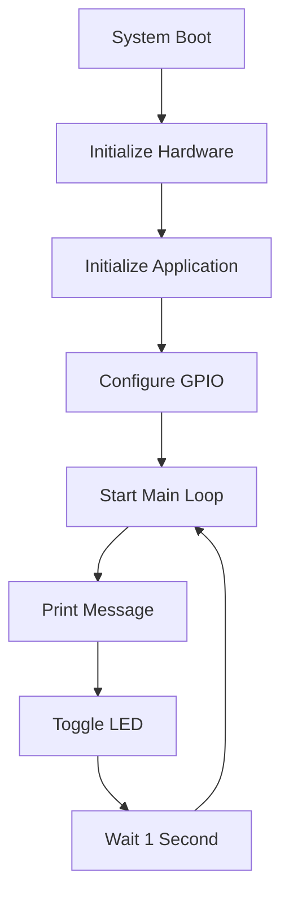
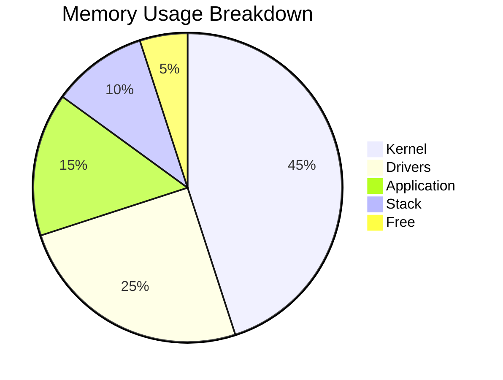
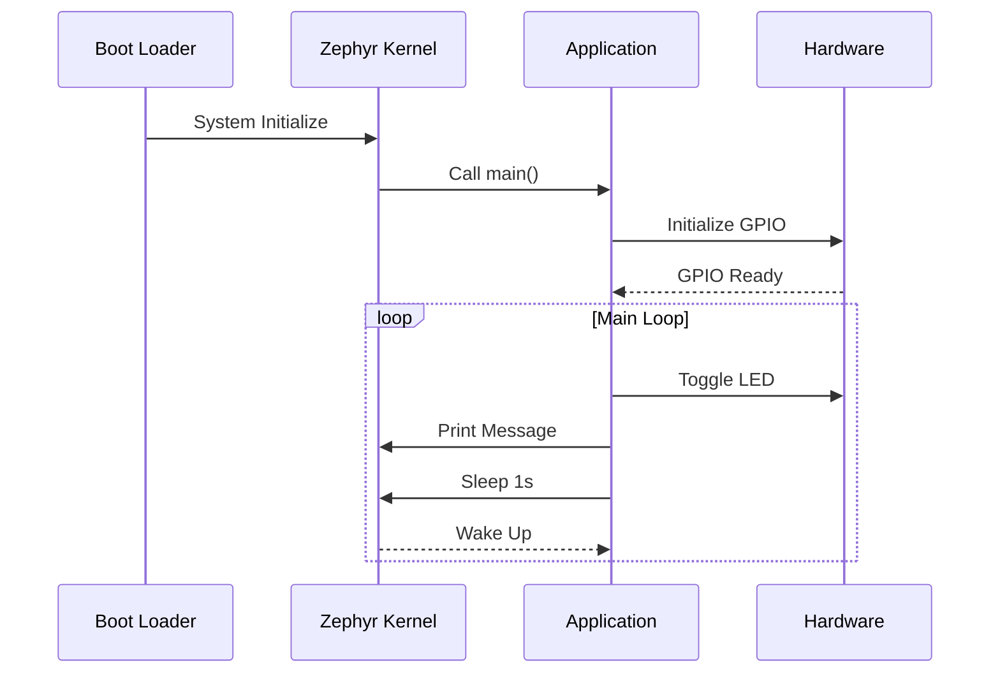

# Module 5: Hello World Application

## Overview

This module walks you through creating a comprehensive "Hello World" application that demonstrates core Zephyr concepts including console output, basic GPIO control, and system initialization.

## Application Flow



## Project Setup

### Step 1: Create Project Structure

```bash
# Create project directory
mkdir ~/zephyr-dev/hello_world_app
cd ~/zephyr-dev/hello_world_app

# Create directory structure
mkdir -p src include boards configs scripts
```

### Step 2: Project Files Overview

| File | Purpose | Required |
|------|---------|----------|
| `CMakeLists.txt` | Build configuration | ✅ |
| `prj.conf` | Application configuration | ✅ |
| `src/main.c` | Main application logic | ✅ |
| `include/app_config.h` | Application constants | ✅ |
| `boards/nucleo_f446re.overlay` | Hardware configuration | ⚠️ Optional |
| `README.md` | Documentation | ⚠️ Recommended |

## Implementation

### Step 3: CMakeLists.txt

Create `CMakeLists.txt`:

```cmake
# SPDX-License-Identifier: Apache-2.0

cmake_minimum_required(VERSION 3.20.0)

# Find Zephyr package
find_package(Zephyr REQUIRED HINTS $ENV{ZEPHYR_BASE})

# Project information
project(hello_world_app VERSION 1.0.0)

# Include directories
target_include_directories(app PRIVATE include)

# Source files
target_sources(app PRIVATE src/main.c)

# Compiler definitions
target_compile_definitions(app PRIVATE
    -DAPP_VERSION_MAJOR=${PROJECT_VERSION_MAJOR}
    -DAPP_VERSION_MINOR=${PROJECT_VERSION_MINOR}
    -DAPP_VERSION_PATCH=${PROJECT_VERSION_PATCH}
)
```

### Step 4: Application Configuration

Create `prj.conf`:

```ini
# === Console and Serial Configuration ===
CONFIG_CONSOLE=y
CONFIG_UART_CONSOLE=y
CONFIG_SERIAL=y
CONFIG_PRINTK=y

# === GPIO Configuration ===
CONFIG_GPIO=y

# === Logging Configuration ===
CONFIG_LOG=y
CONFIG_LOG_DEFAULT_LEVEL=3
CONFIG_LOG_BACKEND_UART=y

# === Kernel Configuration ===
CONFIG_MAIN_STACK_SIZE=2048
CONFIG_SYSTEM_WORKQUEUE_STACK_SIZE=1024

# === Debug Configuration (disable for production) ===
CONFIG_DEBUG=y
CONFIG_ASSERT=y
CONFIG_DEBUG_INFO=y

# === System Clock ===
CONFIG_SYS_CLOCK_HW_CYCLES_PER_SEC=180000000
```

### Step 5: Application Header

Create `include/app_config.h`:

```c
/*
 * Application Configuration Header
 * STM32 Nucleo-F446RE Hello World Application
 */

#ifndef APP_CONFIG_H
#define APP_CONFIG_H

#include <zephyr/kernel.h>
#include <zephyr/device.h>
#include <zephyr/drivers/gpio.h>
#include <zephyr/sys/printk.h>
#include <zephyr/logging/log.h>

/* Application version */
#define APP_VERSION_MAJOR 1
#define APP_VERSION_MINOR 0
#define APP_VERSION_PATCH 0

/* Application name */
#define APP_NAME "Hello World Zephyr App"

/* Timing constants */
#define BLINK_INTERVAL_MS    1000
#define STARTUP_DELAY_MS     100

/* LED configuration using device tree */
#define LED_NODE DT_ALIAS(led0)

/* Button configuration (if available) */
#if DT_NODE_HAS_STATUS(DT_ALIAS(sw0), okay)
    #define BUTTON_NODE DT_ALIAS(sw0)
    #define HAS_BUTTON 1
#else
    #define HAS_BUTTON 0
#endif

/* GPIO specifications */
extern const struct gpio_dt_spec led;
#if HAS_BUTTON
extern const struct gpio_dt_spec button;
#endif

/* Function prototypes */
int hardware_init(void);
void app_main_loop(void);
void print_system_info(void);

#endif /* APP_CONFIG_H */
```

### Step 6: Main Application

Create `src/main.c`:

```c
/*
 * Hello World Application for STM32 Nucleo-F446RE
 * Demonstrates basic Zephyr concepts:
 * - System initialization
 * - GPIO control
 * - Console output
 * - Basic timing
 */

#include "app_config.h"

/* Logging module registration */
LOG_MODULE_REGISTER(hello_world, CONFIG_LOG_DEFAULT_LEVEL);

/* GPIO device specifications */
const struct gpio_dt_spec led = GPIO_DT_SPEC_GET(LED_NODE, gpios);

#if HAS_BUTTON
const struct gpio_dt_spec button = GPIO_DT_SPEC_GET(BUTTON_NODE, gpios);
#endif

/* Application state */
static struct {
    bool led_state;
    uint32_t blink_count;
    uint32_t uptime_seconds;
} app_state = {
    .led_state = false,
    .blink_count = 0,
    .uptime_seconds = 0
};

/* Hardware initialization function */
int hardware_init(void)
{
    int ret;

    LOG_INF("Initializing hardware...");

    /* Check if LED device is ready */
    if (!gpio_is_ready_dt(&led)) {
        LOG_ERR("LED device not ready");
        return -ENODEV;
    }

    /* Configure LED as output */
    ret = gpio_pin_configure_dt(&led, GPIO_OUTPUT_INACTIVE);
    if (ret < 0) {
        LOG_ERR("Failed to configure LED pin: %d", ret);
        return ret;
    }

    LOG_INF("LED configured on pin %d", led.pin);

#if HAS_BUTTON
    /* Check if button device is ready */
    if (!gpio_is_ready_dt(&button)) {
        LOG_WRN("Button device not ready, continuing without button");
    } else {
        /* Configure button as input */
        ret = gpio_pin_configure_dt(&button, GPIO_INPUT);
        if (ret < 0) {
            LOG_WRN("Failed to configure button pin: %d", ret);
        } else {
            LOG_INF("Button configured on pin %d", button.pin);
        }
    }
#endif

    LOG_INF("Hardware initialization complete");
    return 0;
}

/* Print system and application information */
void print_system_info(void)
{
    printk("\n");
    printk("=====================================\n");
    printk("  %s v%d.%d.%d\n", APP_NAME, 
           APP_VERSION_MAJOR, APP_VERSION_MINOR, APP_VERSION_PATCH);
    printk("=====================================\n");
    printk("Board: %s\n", CONFIG_BOARD);
    printk("SoC: %s\n", CONFIG_SOC);
    printk("Kernel: %s\n", KERNEL_VERSION_STRING);
    printk("System Clock: %d Hz\n", CONFIG_SYS_CLOCK_HW_CYCLES_PER_SEC);
    printk("Main Stack Size: %d bytes\n", CONFIG_MAIN_STACK_SIZE);
    
    /* Memory information */
    size_t free_heap = k_heap_free_get(&k_malloc_heap);
    printk("Free Heap: %zu bytes\n", free_heap);
    
    printk("=====================================\n");
    printk("Starting application...\n\n");
}

/* Check button state (if available) */
#if HAS_BUTTON
bool is_button_pressed(void)
{
    int val = gpio_pin_get_dt(&button);
    /* Button is active low on Nucleo board */
    return (val == 0);
}
#endif

/* Main application loop */
void app_main_loop(void)
{
    int ret;
    uint32_t loop_count = 0;

    LOG_INF("Starting main application loop");

    while (1) {
        /* Toggle LED */
        ret = gpio_pin_toggle_dt(&led);
        if (ret < 0) {
            LOG_ERR("Failed to toggle LED: %d", ret);
        } else {
            app_state.led_state = !app_state.led_state;
            app_state.blink_count++;
        }

        /* Update uptime */
        app_state.uptime_seconds = k_uptime_get() / 1000;

        /* Print status message */
        printk("[%05d] Hello Zephyr! LED: %s, Blinks: %d, Uptime: %ds",
               loop_count++,
               app_state.led_state ? "ON " : "OFF",
               app_state.blink_count,
               app_state.uptime_seconds);

#if HAS_BUTTON
        /* Check button state */
        if (is_button_pressed()) {
            printk(" [BUTTON PRESSED]");
        }
#endif

        printk("\n");

        /* Log periodic status */
        if (loop_count % 10 == 0) {
            LOG_INF("Application running normally - %d iterations", loop_count);
        }

        /* Wait for next iteration */
        k_sleep(K_MSEC(BLINK_INTERVAL_MS));
    }
}

/* Main function */
int main(void)
{
    int ret;

    /* Initial delay to allow debugger attachment */
    k_sleep(K_MSEC(STARTUP_DELAY_MS));

    /* Print system information */
    print_system_info();

    /* Initialize hardware */
    ret = hardware_init();
    if (ret < 0) {
        LOG_ERR("Hardware initialization failed: %d", ret);
        printk("FATAL: Hardware initialization failed!\n");
        return ret;
    }

    /* Log successful initialization */
    LOG_INF("Application initialized successfully");
    printk("Hardware initialized successfully!\n");

    /* Start main application loop */
    app_main_loop();

    /* This should never be reached */
    LOG_ERR("Main loop exited unexpectedly");
    return -1;
}
```

### Step 7: Device Tree Overlay (Optional)

Create `boards/nucleo_f446re.overlay`:

```dts
/*
 * Device Tree Overlay for Hello World Application
 * STM32 Nucleo-F446RE specific configuration
 */

/ {
    aliases {
        myled = &green_led;
        mybutton = &user_button;
    };

    /* Application-specific LEDs */
    app_leds {
        compatible = "gpio-leds";
        status_led: led_status {
            gpios = <&gpioa 5 GPIO_ACTIVE_HIGH>;
            label = "Status LED";
        };
    };

    /* Application configuration */
    app_config {
        blink_interval_ms = <1000>;
        startup_delay_ms = <100>;
        debug_enabled;
    };
};

/* Configure console UART */
&usart2 {
    status = "okay";
    current-speed = <115200>;
};

/* Ensure LED GPIO is available */
&gpioa {
    status = "okay";
};

/* Ensure button GPIO is available */
&gpioc {
    status = "okay";
};
```

## Building and Running

### Step 8: Build the Application

```bash
# Navigate to project directory
cd ~/zephyr-dev/hello_world_app

# Build for Nucleo-F446RE
west build -p auto -b nucleo_f446re

# Check build results
ls build/zephyr/
```

### Build Output Analysis

| File | Description | Use Case |
|------|-------------|----------|
| `zephyr.elf` | ELF executable with debug info | Debugging |
| `zephyr.hex` | Intel HEX format | Flashing |
| `zephyr.bin` | Raw binary | Production |
| `zephyr.map` | Memory map | Analysis |

### Step 9: Flash and Monitor

```bash
# Flash to board
west flash

# Connect to serial console
west attach
```

## Expected Output

When running successfully, you should see output similar to:

```
*** Booting Zephyr OS build v3.4.0 ***

=====================================
  Hello World Zephyr App v1.0.0
=====================================
Board: nucleo_f446re
SoC: stm32f446xx
Kernel: 3.4.0
System Clock: 180000000 Hz
Main Stack Size: 2048 bytes
Free Heap: 15360 bytes
=====================================
Starting application...

Hardware initialized successfully!
[00000] Hello Zephyr! LED: ON , Blinks: 1, Uptime: 0s
[00001] Hello Zephyr! LED: OFF, Blinks: 2, Uptime: 1s
[00002] Hello Zephyr! LED: ON , Blinks: 3, Uptime: 2s
[00003] Hello Zephyr! LED: OFF, Blinks: 4, Uptime: 3s [BUTTON PRESSED]
...
```

## Troubleshooting

### Common Issues and Solutions

| Issue | Symptom | Solution |
|-------|---------|----------|
| LED not blinking | No visual feedback | Check LED wiring, verify GPIO pin |
| No console output | Silent operation | Check UART connection, baud rate |
| Build errors | Compilation fails | Verify Zephyr environment, dependencies |
| Flash errors | Cannot program board | Check USB connection, ST-Link driver |

### Debug Commands

```bash
# Check board connection
lsusb | grep STM

# Verify serial port
ls /dev/ttyACM*

# Build with verbose output
west build -v

# Clean build
west build -t clean

# Memory usage report
west build -t ram_report
west build -t rom_report
```

### Configuration Verification

```bash
# Check final configuration
cat build/zephyr/.config | grep CONFIG_GPIO
cat build/zephyr/.config | grep CONFIG_CONSOLE

# View device tree
cat build/zephyr/zephyr.dts | grep -A 10 "led0"
```

## Code Analysis

### Memory Usage



### Execution Flow



## Enhancement Exercises

### Exercise 1: Variable Blink Rate

Modify the application to change blink rate based on button presses:

```c
/* Add to main.c */
static uint32_t blink_rates[] = {1000, 500, 250, 100}; // ms
static int current_rate_index = 0;

/* In button check section */
if (is_button_pressed() && !button_was_pressed) {
    current_rate_index = (current_rate_index + 1) % 4;
    printk(" [Rate changed to %dms]", blink_rates[current_rate_index]);
}
```

### Exercise 2: System Health Monitor

Add system monitoring capabilities:

```c
/* Add system health structure */
struct system_health {
    uint32_t free_stack;
    uint32_t cpu_usage;
    uint32_t temperature; // if sensor available
};

void monitor_system_health(struct system_health *health)
{
    /* Get stack usage */
    health->free_stack = k_thread_stack_space_get(k_current_get());
    
    /* Simple CPU usage estimation */
    static uint32_t last_idle_time = 0;
    uint32_t current_idle_time = k_thread_runtime_stats_get(k_current_get());
    health->cpu_usage = 100 - ((current_idle_time - last_idle_time) / 10);
    last_idle_time = current_idle_time;
}
```

## Best Practices Demonstrated

1. **Error Handling**: Check return values and handle errors gracefully
2. **Logging**: Use structured logging for debugging and monitoring
3. **Configuration**: Use device tree and Kconfig for hardware abstraction
4. **Resource Management**: Initialize and manage hardware resources properly
5. **Code Organization**: Separate concerns into functions and modules

## Next Steps

With your Hello World application running successfully, proceed to [Module 6: GPIO and LED Control](06_gpio_leds.md) to explore more advanced GPIO operations and LED control patterns.