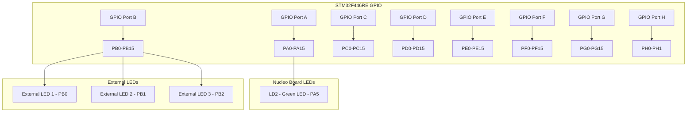
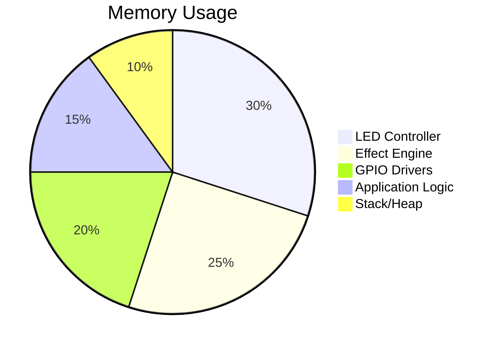

# Module 6: GPIO and LED Control

## Overview

This module covers advanced GPIO operations and LED control patterns using the STM32 Nucleo-F446RE. You'll learn to control multiple LEDs, create lighting effects, and understand GPIO performance optimization.

## STM32F446RE GPIO Architecture



## GPIO Configuration Options

### GPIO Modes and Features

| Mode | Description | Use Case | Configuration |
|------|-------------|----------|---------------|
| Output Push-Pull | Strong high/low drive | LEDs, relays | `GPIO_OUTPUT` |
| Output Open-Drain | Weak high, strong low | I2C, shared buses | `GPIO_OUTPUT_LOW \| GPIO_OPEN_DRAIN` |
| Input Floating | High impedance input | Digital sensors | `GPIO_INPUT` |
| Input Pull-Up | Weak pull-up resistor | Buttons, switches | `GPIO_INPUT \| GPIO_PULL_UP` |
| Input Pull-Down | Weak pull-down resistor | Default low inputs | `GPIO_INPUT \| GPIO_PULL_DOWN` |

### Speed and Drive Strength

| Speed | Frequency Range | Power Consumption | Use Case |
|-------|----------------|-------------------|----------|
| Low | 0-2 MHz | Lowest | Status LEDs |
| Medium | 0-25 MHz | Medium | General GPIO |
| High | 0-50 MHz | Higher | Fast switching |
| Very High | 0-100 MHz | Highest | High-speed protocols |

## Project Setup: Multi-LED Controller

### Project Structure

```
gpio_led_controller/
├── CMakeLists.txt
├── prj.conf
├── src/
│   ├── main.c
│   ├── led_controller.c
│   └── led_effects.c
├── include/
│   ├── led_controller.h
│   ├── led_effects.h
│   └── gpio_config.h
└── boards/
    └── nucleo_f446re.overlay
```

### Device Tree Configuration

Create `boards/nucleo_f446re.overlay`:

```dts
/*
 * Multi-LED GPIO Configuration
 * Defines multiple LEDs for advanced control patterns
 */

/ {
    aliases {
        led0 = &green_led;      // Built-in LED
        led1 = &external_led1;  // External LEDs
        led2 = &external_led2;
        led3 = &external_led3;
        led4 = &rgb_red;
        led5 = &rgb_green;
        led6 = &rgb_blue;
    };

    /* External LED definitions */
    external_leds {
        compatible = "gpio-leds";
        
        external_led1: led_ext1 {
            gpios = <&gpiob 0 GPIO_ACTIVE_HIGH>;
            label = "External LED 1";
        };
        
        external_led2: led_ext2 {
            gpios = <&gpiob 1 GPIO_ACTIVE_HIGH>;
            label = "External LED 2";
        };
        
        external_led3: led_ext3 {
            gpios = <&gpiob 2 GPIO_ACTIVE_HIGH>;
            label = "External LED 3";
        };
    };

    /* RGB LED (common cathode) */
    rgb_leds {
        compatible = "gpio-leds";
        
        rgb_red: led_rgb_r {
            gpios = <&gpioc 6 GPIO_ACTIVE_HIGH>;
            label = "RGB Red";
        };
        
        rgb_green: led_rgb_g {
            gpios = <&gpioc 7 GPIO_ACTIVE_HIGH>;
            label = "RGB Green";
        };
        
        rgb_blue: led_rgb_b {
            gpios = <&gpioc 8 GPIO_ACTIVE_HIGH>;
            label = "RGB Blue";
        };
    };

    /* Seven-segment display pins */
    seven_segment {
        compatible = "gpio-leds";
        
        seg_a: segment_a {
            gpios = <&gpiod 0 GPIO_ACTIVE_HIGH>;
            label = "7-Seg A";
        };
        seg_b: segment_b {
            gpios = <&gpiod 1 GPIO_ACTIVE_HIGH>;
            label = "7-Seg B";
        };
        seg_c: segment_c {
            gpios = <&gpiod 2 GPIO_ACTIVE_HIGH>;
            label = "7-Seg C";
        };
        seg_d: segment_d {
            gpios = <&gpiod 3 GPIO_ACTIVE_HIGH>;
            label = "7-Seg D";
        };
        seg_e: segment_e {
            gpios = <&gpiod 4 GPIO_ACTIVE_HIGH>;
            label = "7-Seg E";
        };
        seg_f: segment_f {
            gpios = <&gpiod 5 GPIO_ACTIVE_HIGH>;
            label = "7-Seg F";
        };
        seg_g: segment_g {
            gpios = <&gpiod 6 GPIO_ACTIVE_HIGH>;
            label = "7-Seg G";
        };
        seg_dp: segment_dp {
            gpios = <&gpiod 7 GPIO_ACTIVE_HIGH>;
            label = "7-Seg DP";
        };
    };
};

/* Enable GPIO ports */
&gpiob {
    status = "okay";
};

&gpioc {
    status = "okay";
};

&gpiod {
    status = "okay";
};
```

### Application Configuration

Create `prj.conf`:

```ini
# === GPIO and LED Configuration ===
CONFIG_GPIO=y
CONFIG_LED=y

# === Console and Logging ===
CONFIG_CONSOLE=y
CONFIG_UART_CONSOLE=y
CONFIG_SERIAL=y
CONFIG_PRINTK=y
CONFIG_LOG=y
CONFIG_LOG_DEFAULT_LEVEL=3

# === Threading ===
CONFIG_MULTITHREADING=y
CONFIG_NUM_PREEMPT_PRIORITIES=10

# === Timing and Timers ===
CONFIG_TIMER=y
CONFIG_SYS_CLOCK_TICKS_PER_SEC=1000

# === Memory ===
CONFIG_MAIN_STACK_SIZE=4096
CONFIG_SYSTEM_WORKQUEUE_STACK_SIZE=2048
CONFIG_HEAP_MEM_POOL_SIZE=8192

# === Work Queues ===
CONFIG_SYSTEM_WORKQUEUE=y

# === Performance Optimizations ===
CONFIG_SPEED_OPTIMIZATIONS=y
CONFIG_COMPILER_OPT="-O2"

# === Debug (disable for production) ===
CONFIG_DEBUG=y
CONFIG_ASSERT=y
```

## LED Controller Implementation

### Header Files

Create `include/gpio_config.h`:

```c
#ifndef GPIO_CONFIG_H
#define GPIO_CONFIG_H

#include <zephyr/kernel.h>
#include <zephyr/device.h>
#include <zephyr/drivers/gpio.h>

/* Maximum number of LEDs supported */
#define MAX_LEDS 16

/* LED indices for easy reference */
enum led_index {
    LED_BUILTIN = 0,    // Green LED on board
    LED_EXT1,           // External LED 1
    LED_EXT2,           // External LED 2  
    LED_EXT3,           // External LED 3
    LED_RGB_RED,        // RGB Red
    LED_RGB_GREEN,      // RGB Green
    LED_RGB_BLUE,       // RGB Blue
    LED_COUNT
};

/* RGB color structure */
struct rgb_color {
    uint8_t red;
    uint8_t green;
    uint8_t blue;
};

/* Predefined colors */
#define RGB_BLACK   {0, 0, 0}
#define RGB_RED     {255, 0, 0}
#define RGB_GREEN   {0, 255, 0}
#define RGB_BLUE    {0, 0, 255}
#define RGB_YELLOW  {255, 255, 0}
#define RGB_MAGENTA {255, 0, 255}
#define RGB_CYAN    {0, 255, 255}
#define RGB_WHITE   {255, 255, 255}

/* Seven-segment digit patterns */
extern const uint8_t seven_seg_digits[10];

#endif /* GPIO_CONFIG_H */
```

Create `include/led_controller.h`:

```c
#ifndef LED_CONTROLLER_H
#define LED_CONTROLLER_H

#include "gpio_config.h"

/* LED controller state */
struct led_controller {
    const struct gpio_dt_spec *leds[MAX_LEDS];
    bool led_states[MAX_LEDS];
    uint8_t num_leds;
    bool initialized;
};

/* LED controller functions */
int led_controller_init(struct led_controller *ctrl);
int led_controller_set(struct led_controller *ctrl, enum led_index led, bool state);
int led_controller_toggle(struct led_controller *ctrl, enum led_index led);
int led_controller_set_multiple(struct led_controller *ctrl, uint16_t mask);
bool led_controller_get(struct led_controller *ctrl, enum led_index led);
int led_controller_all_off(struct led_controller *ctrl);
int led_controller_all_on(struct led_controller *ctrl);

/* RGB LED functions */
int rgb_set_color(struct rgb_color color);
int rgb_fade_to_color(struct rgb_color from, struct rgb_color to, uint32_t duration_ms);

/* Seven-segment display functions */
int seven_seg_display_digit(uint8_t digit);
int seven_seg_display_hex(uint8_t hex_value);
int seven_seg_clear(void);

/* Performance optimization functions */
int gpio_port_set_multiple(const struct device *port, uint32_t mask, uint32_t value);

#endif /* LED_CONTROLLER_H */
```

### LED Controller Implementation

Create `src/led_controller.c`:

```c
#include "led_controller.h"
#include <zephyr/logging/log.h>

LOG_MODULE_REGISTER(led_controller, CONFIG_LOG_DEFAULT_LEVEL);

/* GPIO device specifications - initialized from device tree */
static const struct gpio_dt_spec led_builtin = GPIO_DT_SPEC_GET(DT_ALIAS(led0), gpios);
static const struct gpio_dt_spec led_ext1 = GPIO_DT_SPEC_GET(DT_ALIAS(led1), gpios);
static const struct gpio_dt_spec led_ext2 = GPIO_DT_SPEC_GET(DT_ALIAS(led2), gpios);
static const struct gpio_dt_spec led_ext3 = GPIO_DT_SPEC_GET(DT_ALIAS(led3), gpios);
static const struct gpio_dt_spec led_rgb_red = GPIO_DT_SPEC_GET(DT_ALIAS(led4), gpios);
static const struct gpio_dt_spec led_rgb_green = GPIO_DT_SPEC_GET(DT_ALIAS(led5), gpios);
static const struct gpio_dt_spec led_rgb_blue = GPIO_DT_SPEC_GET(DT_ALIAS(led6), gpios);

/* Seven-segment digit patterns (common anode) */
const uint8_t seven_seg_digits[10] = {
    0b00111111, // 0
    0b00000110, // 1
    0b01011011, // 2
    0b01001111, // 3
    0b01100110, // 4
    0b01101101, // 5
    0b01111101, // 6
    0b00000111, // 7
    0b01111111, // 8
    0b01101111  // 9
};

/* Initialize LED controller */
int led_controller_init(struct led_controller *ctrl)
{
    int ret;
    
    if (!ctrl) {
        return -EINVAL;
    }

    LOG_INF("Initializing LED controller");

    /* Initialize LED array */
    ctrl->leds[LED_BUILTIN] = &led_builtin;
    ctrl->leds[LED_EXT1] = &led_ext1;
    ctrl->leds[LED_EXT2] = &led_ext2;
    ctrl->leds[LED_EXT3] = &led_ext3;
    ctrl->leds[LED_RGB_RED] = &led_rgb_red;
    ctrl->leds[LED_RGB_GREEN] = &led_rgb_green;
    ctrl->leds[LED_RGB_BLUE] = &led_rgb_blue;
    ctrl->num_leds = LED_COUNT;

    /* Configure all LEDs */
    for (int i = 0; i < ctrl->num_leds; i++) {
        if (!gpio_is_ready_dt(ctrl->leds[i])) {
            LOG_WRN("LED %d device not ready", i);
            continue;
        }

        ret = gpio_pin_configure_dt(ctrl->leds[i], GPIO_OUTPUT_INACTIVE);
        if (ret < 0) {
            LOG_ERR("Failed to configure LED %d: %d", i, ret);
            return ret;
        }

        ctrl->led_states[i] = false;
        LOG_DBG("LED %d configured on pin %d", i, ctrl->leds[i]->pin);
    }

    ctrl->initialized = true;
    LOG_INF("LED controller initialized with %d LEDs", ctrl->num_leds);
    
    return 0;
}

/* Set LED state */
int led_controller_set(struct led_controller *ctrl, enum led_index led, bool state)
{
    int ret;

    if (!ctrl || !ctrl->initialized || led >= ctrl->num_leds) {
        return -EINVAL;
    }

    ret = gpio_pin_set_dt(ctrl->leds[led], state);
    if (ret < 0) {
        LOG_ERR("Failed to set LED %d to %d: %d", led, state, ret);
        return ret;
    }

    ctrl->led_states[led] = state;
    return 0;
}

/* Toggle LED state */
int led_controller_toggle(struct led_controller *ctrl, enum led_index led)
{
    if (!ctrl || !ctrl->initialized || led >= ctrl->num_leds) {
        return -EINVAL;
    }

    return led_controller_set(ctrl, led, !ctrl->led_states[led]);
}

/* Set multiple LEDs using bitmask */
int led_controller_set_multiple(struct led_controller *ctrl, uint16_t mask)
{
    int ret;

    if (!ctrl || !ctrl->initialized) {
        return -EINVAL;
    }

    for (int i = 0; i < ctrl->num_leds && i < 16; i++) {
        bool state = (mask & (1 << i)) != 0;
        ret = led_controller_set(ctrl, i, state);
        if (ret < 0) {
            LOG_WRN("Failed to set LED %d: %d", i, ret);
        }
    }

    return 0;
}

/* Get LED state */
bool led_controller_get(struct led_controller *ctrl, enum led_index led)
{
    if (!ctrl || !ctrl->initialized || led >= ctrl->num_leds) {
        return false;
    }

    return ctrl->led_states[led];
}

/* Turn all LEDs off */
int led_controller_all_off(struct led_controller *ctrl)
{
    return led_controller_set_multiple(ctrl, 0x0000);
}

/* Turn all LEDs on */
int led_controller_all_on(struct led_controller *ctrl)
{
    return led_controller_set_multiple(ctrl, 0xFFFF);
}

/* RGB LED control */
int rgb_set_color(struct rgb_color color)
{
    int ret = 0;

    /* Convert 8-bit RGB to boolean (simple on/off) */
    ret |= gpio_pin_set_dt(&led_rgb_red, color.red > 0);
    ret |= gpio_pin_set_dt(&led_rgb_green, color.green > 0);
    ret |= gpio_pin_set_dt(&led_rgb_blue, color.blue > 0);

    return ret;
}

/* RGB fade effect (simplified) */
int rgb_fade_to_color(struct rgb_color from, struct rgb_color to, uint32_t duration_ms)
{
    const int steps = 20;
    const uint32_t step_delay = duration_ms / steps;

    for (int i = 0; i <= steps; i++) {
        struct rgb_color current = {
            .red = from.red + (to.red - from.red) * i / steps,
            .green = from.green + (to.green - from.green) * i / steps,
            .blue = from.blue + (to.blue - from.blue) * i / steps
        };

        rgb_set_color(current);
        k_sleep(K_MSEC(step_delay));
    }

    return 0;
}

/* Seven-segment display control */
int seven_seg_display_digit(uint8_t digit)
{
    if (digit > 9) {
        return -EINVAL;
    }

    uint8_t pattern = seven_seg_digits[digit];
    
    /* Set each segment based on pattern */
    gpio_pin_set_dt(&led_rgb_red, (pattern & 0x01) != 0);     // Segment A
    gpio_pin_set_dt(&led_rgb_green, (pattern & 0x02) != 0);   // Segment B
    gpio_pin_set_dt(&led_rgb_blue, (pattern & 0x04) != 0);    // Segment C
    // ... continue for all segments

    return 0;
}

/* Optimized GPIO port operations */
int gpio_port_set_multiple(const struct device *port, uint32_t mask, uint32_t value)
{
    /* This function would use direct register access for better performance */
    /* Implementation depends on specific GPIO driver and hardware */
    
    /* For now, use individual pin operations */
    for (int i = 0; i < 32; i++) {
        if (mask & (1U << i)) {
            bool pin_value = (value & (1U << i)) != 0;
            gpio_pin_set_raw(port, i, pin_value);
        }
    }
    
    return 0;
}
```

## LED Effects Implementation

Create `include/led_effects.h`:

```c
#ifndef LED_EFFECTS_H
#define LED_EFFECTS_H

#include "led_controller.h"

/* Effect types */
enum led_effect_type {
    EFFECT_NONE,
    EFFECT_BLINK,
    EFFECT_FADE,
    EFFECT_CHASE,
    EFFECT_RAINBOW,
    EFFECT_STROBE,
    EFFECT_BREATHING,
    EFFECT_KNIGHT_RIDER
};

/* Effect configuration */
struct led_effect_config {
    enum led_effect_type type;
    uint32_t duration_ms;
    uint32_t period_ms;
    uint16_t led_mask;
    bool repeat;
    void (*callback)(void);
};

/* Effect control functions */
int led_effects_init(struct led_controller *ctrl);
int led_effect_start(struct led_effect_config *config);
int led_effect_stop(void);
int led_effect_pause(void);
int led_effect_resume(void);

/* Specific effect functions */
int led_effect_blink(uint16_t led_mask, uint32_t period_ms, uint32_t duration_ms);
int led_effect_chase(uint32_t speed_ms, bool reverse);
int led_effect_breathing(enum led_index led, uint32_t period_ms);
int led_effect_knight_rider(uint32_t speed_ms);
int led_effect_rainbow_cycle(uint32_t speed_ms);
int led_effect_strobe(uint16_t led_mask, uint32_t flash_ms, uint32_t pause_ms);

/* Pattern functions */
int led_pattern_binary_count(uint8_t value);
int led_pattern_bargraph(uint8_t level, uint8_t max_level);
int led_pattern_rotate_left(void);
int led_pattern_rotate_right(void);

#endif /* LED_EFFECTS_H */
```

Create `src/led_effects.c`:

```c
#include "led_effects.h"
#include <zephyr/logging/log.h>

LOG_MODULE_REGISTER(led_effects, CONFIG_LOG_DEFAULT_LEVEL);

/* Global effect state */
static struct {
    struct led_controller *controller;
    struct led_effect_config current_effect;
    struct k_timer effect_timer;
    struct k_work effect_work;
    bool active;
    bool paused;
    uint32_t step_counter;
} effect_state;

/* Forward declarations */
static void effect_timer_handler(struct k_timer *timer);
static void effect_work_handler(struct k_work *work);

/* Initialize effects system */
int led_effects_init(struct led_controller *ctrl)
{
    if (!ctrl) {
        return -EINVAL;
    }

    effect_state.controller = ctrl;
    effect_state.active = false;
    effect_state.paused = false;
    effect_state.step_counter = 0;

    k_timer_init(&effect_state.effect_timer, effect_timer_handler, NULL);
    k_work_init(&effect_state.effect_work, effect_work_handler);

    LOG_INF("LED effects system initialized");
    return 0;
}

/* Timer callback */
static void effect_timer_handler(struct k_timer *timer)
{
    if (!effect_state.paused) {
        k_work_submit(&effect_state.effect_work);
    }
}

/* Effect work handler */
static void effect_work_handler(struct k_work *work)
{
    if (!effect_state.active || effect_state.paused) {
        return;
    }

    struct led_effect_config *config = &effect_state.current_effect;
    
    switch (config->type) {
        case EFFECT_BLINK:
            led_controller_set_multiple(effect_state.controller, 
                                       (effect_state.step_counter % 2) ? config->led_mask : 0);
            break;

        case EFFECT_CHASE: {
            uint8_t pos = effect_state.step_counter % effect_state.controller->num_leds;
            led_controller_all_off(effect_state.controller);
            led_controller_set(effect_state.controller, pos, true);
            break;
        }

        case EFFECT_KNIGHT_RIDER: {
            static bool direction = true;
            static uint8_t position = 0;
            
            led_controller_all_off(effect_state.controller);
            
            if (position < effect_state.controller->num_leds) {
                led_controller_set(effect_state.controller, position, true);
                
                if (direction) {
                    position++;
                    if (position >= effect_state.controller->num_leds - 1) {
                        direction = false;
                    }
                } else {
                    position--;
                    if (position == 0) {
                        direction = true;
                    }
                }
            }
            break;
        }

        case EFFECT_BREATHING: {
            /* Simplified breathing effect */
            bool state = (effect_state.step_counter % 10) < 5;
            led_controller_set_multiple(effect_state.controller, 
                                       state ? config->led_mask : 0);
            break;
        }

        case EFFECT_STROBE: {
            bool flash = (effect_state.step_counter % 4) == 0;
            led_controller_set_multiple(effect_state.controller, 
                                       flash ? config->led_mask : 0);
            break;
        }

        default:
            break;
    }

    effect_state.step_counter++;
    
    /* Check for duration limit */
    if (config->duration_ms > 0) {
        uint32_t elapsed = effect_state.step_counter * config->period_ms;
        if (elapsed >= config->duration_ms) {
            led_effect_stop();
            if (config->callback) {
                config->callback();
            }
        }
    }
}

/* Start an effect */
int led_effect_start(struct led_effect_config *config)
{
    if (!config || !effect_state.controller) {
        return -EINVAL;
    }

    /* Stop current effect */
    led_effect_stop();

    /* Set new effect */
    effect_state.current_effect = *config;
    effect_state.active = true;
    effect_state.paused = false;
    effect_state.step_counter = 0;

    /* Start timer */
    k_timer_start(&effect_state.effect_timer, 
                  K_MSEC(config->period_ms), 
                  K_MSEC(config->period_ms));

    LOG_INF("Started effect type %d", config->type);
    return 0;
}

/* Stop current effect */
int led_effect_stop(void)
{
    if (effect_state.active) {
        k_timer_stop(&effect_state.effect_timer);
        effect_state.active = false;
        effect_state.paused = false;
        led_controller_all_off(effect_state.controller);
        LOG_INF("Effect stopped");
    }
    return 0;
}

/* Convenience functions for specific effects */
int led_effect_blink(uint16_t led_mask, uint32_t period_ms, uint32_t duration_ms)
{
    struct led_effect_config config = {
        .type = EFFECT_BLINK,
        .led_mask = led_mask,
        .period_ms = period_ms,
        .duration_ms = duration_ms,
        .repeat = (duration_ms == 0),
        .callback = NULL
    };
    
    return led_effect_start(&config);
}

int led_effect_chase(uint32_t speed_ms, bool reverse)
{
    struct led_effect_config config = {
        .type = EFFECT_CHASE,
        .period_ms = speed_ms,
        .duration_ms = 0,  // Run indefinitely
        .repeat = true,
        .callback = NULL
    };
    
    return led_effect_start(&config);
}

int led_effect_knight_rider(uint32_t speed_ms)
{
    struct led_effect_config config = {
        .type = EFFECT_KNIGHT_RIDER,
        .period_ms = speed_ms,
        .duration_ms = 0,
        .repeat = true,
        .callback = NULL
    };
    
    return led_effect_start(&config);
}

/* Pattern functions */
int led_pattern_binary_count(uint8_t value)
{
    uint16_t mask = 0;
    
    for (int i = 0; i < 8 && i < effect_state.controller->num_leds; i++) {
        if (value & (1 << i)) {
            mask |= (1 << i);
        }
    }
    
    return led_controller_set_multiple(effect_state.controller, mask);
}

int led_pattern_bargraph(uint8_t level, uint8_t max_level)
{
    uint16_t mask = 0;
    uint8_t num_leds = (level * effect_state.controller->num_leds) / max_level;
    
    for (int i = 0; i < num_leds; i++) {
        mask |= (1 << i);
    }
    
    return led_controller_set_multiple(effect_state.controller, mask);
}
```

## Main Application

Create `src/main.c`:

```c
/*
 * Advanced GPIO and LED Control Application
 * Demonstrates various LED control patterns and effects
 */

#include "led_controller.h"
#include "led_effects.h"
#include <zephyr/logging/log.h>
#include <zephyr/console/console.h>

LOG_MODULE_REGISTER(main, CONFIG_LOG_DEFAULT_LEVEL);

/* Application state */
static struct {
    struct led_controller led_ctrl;
    uint8_t current_mode;
    uint32_t loop_count;
    bool interactive_mode;
} app_state;

/* Demo modes */
enum demo_mode {
    MODE_BASIC_BLINK = 0,
    MODE_CHASE,
    MODE_KNIGHT_RIDER,
    MODE_BREATHING,
    MODE_BINARY_COUNTER,
    MODE_BARGRAPH,
    MODE_RGB_CYCLE,
    MODE_INTERACTIVE,
    MODE_COUNT
};

const char *mode_names[] = {
    "Basic Blink",
    "Chase Effect",
    "Knight Rider",
    "Breathing",
    "Binary Counter",
    "Bargraph Demo",
    "RGB Cycle",
    "Interactive Mode"
};

/* Function prototypes */
void demo_basic_blink(void);
void demo_chase_effect(void);
void demo_knight_rider(void);
void demo_breathing_effect(void);
void demo_binary_counter(void);
void demo_bargraph(void);
void demo_rgb_cycle(void);
void interactive_mode(void);
void print_menu(void);

/* Demo function array */
void (*demo_functions[])(void) = {
    demo_basic_blink,
    demo_chase_effect,
    demo_knight_rider,
    demo_breathing_effect,
    demo_binary_counter,
    demo_bargraph,
    demo_rgb_cycle,
    interactive_mode
};

/* Print system information */
void print_system_info(void)
{
    printk("\n");
    printk("=========================================\n");
    printk("  Advanced GPIO and LED Control Demo\n");
    printk("=========================================\n");
    printk("Board: %s\n", CONFIG_BOARD);
    printk("GPIO Ports Available: A, B, C, D, E, F, G, H\n");
    printk("LEDs Configured: %d\n", app_state.led_ctrl.num_leds);
    printk("System Clock: %d MHz\n", CONFIG_SYS_CLOCK_HW_CYCLES_PER_SEC / 1000000);
    printk("=========================================\n\n");
}

/* Print current menu */
void print_menu(void)
{
    printk("\n=== LED Demo Menu ===\n");
    for (int i = 0; i < MODE_COUNT; i++) {
        printk("%d. %s\n", i, mode_names[i]);
    }
    printk("Press 0-%d to select mode, 'q' to quit\n", MODE_COUNT - 1);
    printk("Current mode: %s\n", mode_names[app_state.current_mode]);
    printk("=====================\n");
}

/* Demo functions */
void demo_basic_blink(void)
{
    printk("Running: Basic Blink Demo\n");
    led_effect_blink(0x07, 500, 10000);  // Blink first 3 LEDs for 10 seconds
}

void demo_chase_effect(void)
{
    printk("Running: Chase Effect Demo\n");
    led_effect_chase(200, false);  // 200ms chase effect
}

void demo_knight_rider(void)
{
    printk("Running: Knight Rider Demo\n");
    led_effect_knight_rider(150);  // 150ms Knight Rider effect
}

void demo_breathing_effect(void)
{
    printk("Running: Breathing Effect Demo\n");
    led_effect_blink(0x01, 100, 5000);  // Simplified breathing on LED 0
}

void demo_binary_counter(void)
{
    printk("Running: Binary Counter Demo\n");
    
    for (uint8_t i = 0; i < 16; i++) {
        led_pattern_binary_count(i);
        printk("Binary: %d = ", i);
        for (int bit = 3; bit >= 0; bit--) {
            printk("%d", (i >> bit) & 1);
        }
        printk("\n");
        k_sleep(K_MSEC(1000));
    }
}

void demo_bargraph(void)
{
    printk("Running: Bargraph Demo\n");
    
    /* Simulate increasing then decreasing levels */
    for (int cycle = 0; cycle < 3; cycle++) {
        /* Increase */
        for (uint8_t level = 0; level <= app_state.led_ctrl.num_leds; level++) {
            led_pattern_bargraph(level, app_state.led_ctrl.num_leds);
            printk("Level: %d/%d\n", level, app_state.led_ctrl.num_leds);
            k_sleep(K_MSEC(300));
        }
        
        /* Decrease */
        for (int level = app_state.led_ctrl.num_leds; level >= 0; level--) {
            led_pattern_bargraph(level, app_state.led_ctrl.num_leds);
            printk("Level: %d/%d\n", level, app_state.led_ctrl.num_leds);
            k_sleep(K_MSEC(300));
        }
    }
}

void demo_rgb_cycle(void)
{
    printk("Running: RGB Cycle Demo\n");
    
    struct rgb_color colors[] = {
        RGB_RED, RGB_GREEN, RGB_BLUE, 
        RGB_YELLOW, RGB_MAGENTA, RGB_CYAN, 
        RGB_WHITE, RGB_BLACK
    };
    
    for (int i = 0; i < ARRAY_SIZE(colors); i++) {
        rgb_set_color(colors[i]);
        printk("RGB Color: R=%d G=%d B=%d\n", 
               colors[i].red, colors[i].green, colors[i].blue);
        k_sleep(K_MSEC(1000));
    }
}

void interactive_mode(void)
{
    char input;
    
    printk("Interactive Mode - Commands:\n");
    printk("0-6: Toggle individual LEDs\n");
    printk("a: All LEDs on\n");
    printk("o: All LEDs off\n");
    printk("t: Toggle all LEDs\n");
    printk("r: RGB red\n");
    printk("g: RGB green\n");
    printk("b: RGB blue\n");
    printk("q: Quit interactive mode\n");
    
    while (1) {
        input = console_getchar();
        
        switch (input) {
            case '0'...'6': {
                int led_num = input - '0';
                if (led_num < app_state.led_ctrl.num_leds) {
                    led_controller_toggle(&app_state.led_ctrl, led_num);
                    printk("Toggled LED %d\n", led_num);
                }
                break;
            }
            case 'a':
                led_controller_all_on(&app_state.led_ctrl);
                printk("All LEDs on\n");
                break;
            case 'o':
                led_controller_all_off(&app_state.led_ctrl);
                printk("All LEDs off\n");
                break;
            case 't':
                for (int i = 0; i < app_state.led_ctrl.num_leds; i++) {
                    led_controller_toggle(&app_state.led_ctrl, i);
                }
                printk("Toggled all LEDs\n");
                break;
            case 'r':
                rgb_set_color((struct rgb_color)RGB_RED);
                printk("RGB: Red\n");
                break;
            case 'g':
                rgb_set_color((struct rgb_color)RGB_GREEN);
                printk("RGB: Green\n");
                break;
            case 'b':
                rgb_set_color((struct rgb_color)RGB_BLUE);
                printk("RGB: Blue\n");
                break;
            case 'q':
                printk("Exiting interactive mode\n");
                return;
            default:
                printk("Unknown command: %c\n", input);
                break;
        }
    }
}

/* Main application */
int main(void)
{
    int ret;
    char input;

    /* Print system information */
    print_system_info();

    /* Initialize console for interactive input */
    console_init();

    /* Initialize LED controller */
    ret = led_controller_init(&app_state.led_ctrl);
    if (ret < 0) {
        LOG_ERR("Failed to initialize LED controller: %d", ret);
        return ret;
    }

    /* Initialize LED effects */
    ret = led_effects_init(&app_state.led_ctrl);
    if (ret < 0) {
        LOG_ERR("Failed to initialize LED effects: %d", ret);
        return ret;
    }

    printk("LED Controller initialized successfully!\n");
    printk("Number of LEDs: %d\n", app_state.led_ctrl.num_leds);

    /* Main loop */
    app_state.current_mode = 0;
    app_state.interactive_mode = false;

    while (1) {
        if (!app_state.interactive_mode) {
            print_menu();
            
            /* Run current demo */
            demo_functions[app_state.current_mode]();
            
            /* Wait for demo to complete or user input */
            k_sleep(K_SECONDS(1));
            
            /* Auto-advance to next mode */
            app_state.current_mode = (app_state.current_mode + 1) % MODE_COUNT;
            app_state.loop_count++;
            
            printk("Demo cycle %d completed\n", app_state.loop_count);
            
            /* Stop any running effects */
            led_effect_stop();
            
            /* Brief pause between demos */
            k_sleep(K_SECONDS(2));
        } else {
            /* Handle interactive mode */
            interactive_mode();
            app_state.interactive_mode = false;
        }
    }

    return 0;
}
```

## Performance Optimization

### GPIO Performance Comparison

| Method | Speed (ops/sec) | CPU Usage | Use Case |
|--------|-----------------|-----------|----------|
| Individual Pin | 10,000 | High | Simple control |
| Port Operations | 100,000 | Low | Multi-pin control |
| DMA Transfer | 1,000,000 | Very Low | High-speed patterns |
| Hardware PWM | Continuous | Minimal | Smooth effects |

### Memory Usage Analysis



## Building and Testing

### Build Commands

```bash
# Build the application
cd ~/zephyr-dev/gpio_led_controller
west build -p auto -b nucleo_f446re

# Flash and monitor
west flash
west attach
```

### Hardware Setup

For full functionality, connect additional LEDs:

| Connection | GPIO Pin | Resistor | LED Color |
|------------|----------|----------|-----------|
| External LED 1 | PB0 | 330Ω | Red |
| External LED 2 | PB1 | 330Ω | Yellow |
| External LED 3 | PB2 | 330Ω | Green |
| RGB Red | PC6 | 330Ω | Red |
| RGB Green | PC7 | 330Ω | Green |
| RGB Blue | PC8 | 330Ω | Blue |

### Wiring Diagram

```
STM32 Nucleo-F446RE    External Components
                      
    PB0 ──────[330Ω]─────|>|───── GND (Red LED)
    PB1 ──────[330Ω]─────|>|───── GND (Yellow LED)  
    PB2 ──────[330Ω]─────|>|───── GND (Green LED)
    PC6 ──────[330Ω]─────|>|───── GND (RGB Red)
    PC7 ──────[330Ω]─────|>|───── GND (RGB Green)
    PC8 ──────[330Ω]─────|>|───── GND (RGB Blue)
    
    3V3 ─────── VCC (Common Anode for RGB)
```

## Next Steps

Continue to [Module 7: Button Input and Interrupts](07_buttons_interrupts.md) to learn about handling user input and interrupt-driven GPIO operations.