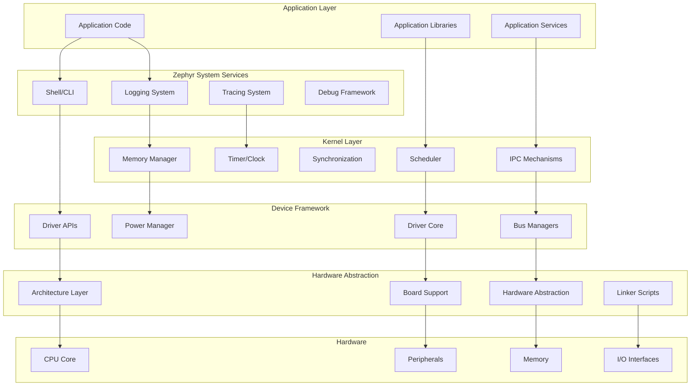
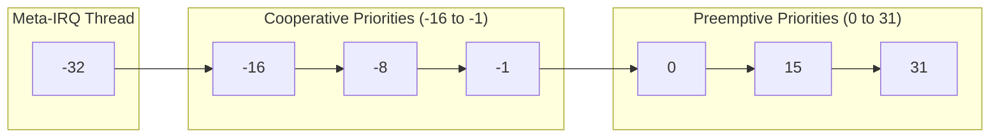
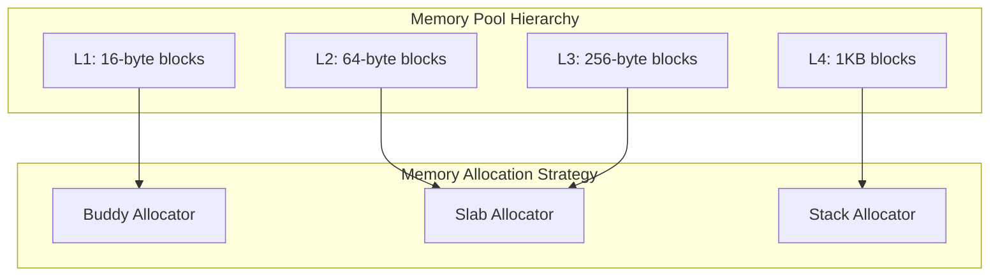
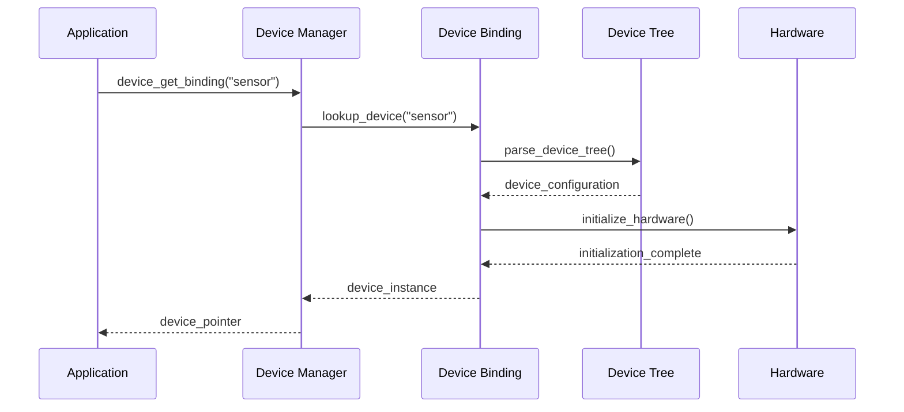
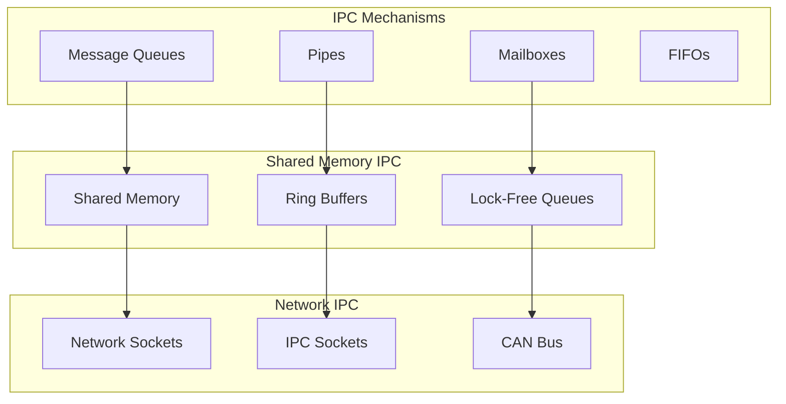
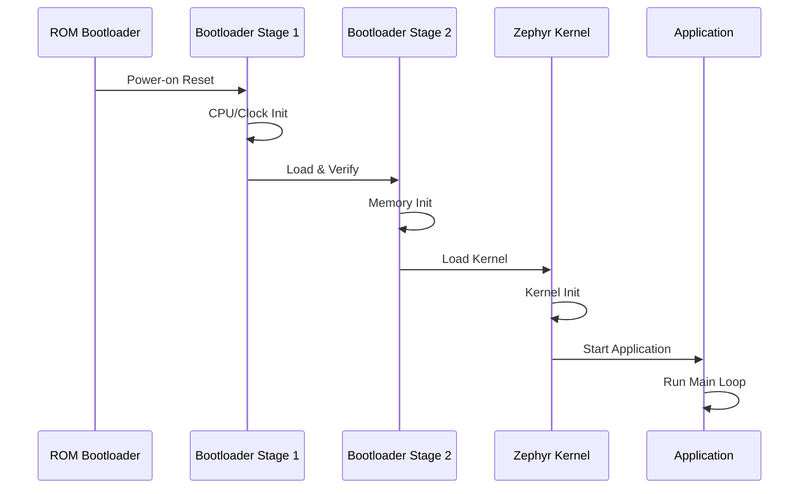
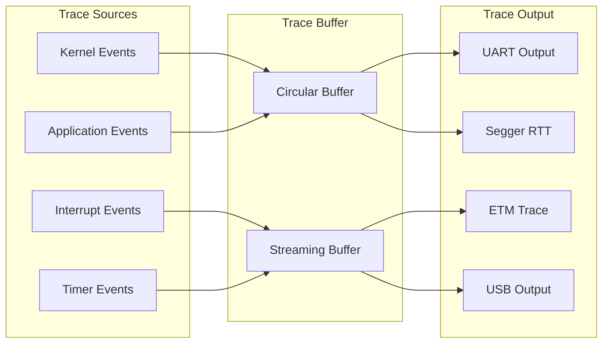

# Advanced Zephyr Architecture

## Overview

This advanced module delves deep into Zephyr's sophisticated architecture, exploring internal mechanisms, performance optimization techniques, and advanced architectural patterns that enable scalable real-time embedded systems.

## Advanced Architecture Components



## Advanced Scheduler Architecture

### Multi-Level Priority Queues

Zephyr implements a sophisticated O(1) scheduler with multiple priority levels:



### Advanced Scheduling Algorithms

| Algorithm | Use Case | Overhead | Real-time Guarantee |
|-----------|----------|----------|-------------------|
| Fixed Priority | General RT systems | O(1) | Hard RT |
| Round Robin | Time-sharing | O(1) | Soft RT |
| Deadline Scheduling | Critical timing | O(log n) | Hard RT |
| Rate Monotonic | Periodic tasks | O(1) | Hard RT |

```c
// Advanced scheduler configuration
struct k_thread_custom_data {
    uint32_t deadline;          // Absolute deadline
    uint32_t period;            // Execution period
    uint32_t wcet;              // Worst-case execution time
    uint32_t budget_remaining;  // Current time budget
};

// Custom scheduling policy implementation
int custom_scheduler_policy(struct k_thread *thread)
{
    struct k_thread_custom_data *data = thread->custom_data;
    uint32_t current_time = k_cycle_get_32();
    
    // Earliest Deadline First scheduling
    if (current_time + data->wcet > data->deadline) {
        // Thread cannot meet deadline
        return -EDEADLK;
    }
    
    // Calculate dynamic priority based on deadline
    thread->base.prio = (data->deadline - current_time) / 1000;
    return 0;
}
```

## Advanced Memory Management

### Memory Pool Architecture



### Advanced Memory Pool Configuration

```c
// Multi-tier memory pool system
struct advanced_mem_config {
    struct k_mem_pool *small_pool;   // < 64 bytes
    struct k_mem_pool *medium_pool;  // 64-512 bytes
    struct k_mem_pool *large_pool;   // > 512 bytes
    struct k_heap *heap_pool;        // Variable size
};

// Memory pool definitions with different block sizes
K_MEM_POOL_DEFINE(small_mem_pool, 32, 64, 8, 4);
K_MEM_POOL_DEFINE(medium_mem_pool, 16, 512, 4, 4);
K_MEM_POOL_DEFINE(large_mem_pool, 8, 2048, 2, 4);

// Advanced memory allocation with fallback strategy
void *advanced_malloc(size_t size)
{
    void *ptr = NULL;
    
    if (size <= 64) {
        ptr = k_mem_pool_malloc(&small_mem_pool, size);
    } else if (size <= 512) {
        ptr = k_mem_pool_malloc(&medium_mem_pool, size);
    } else if (size <= 2048) {
        ptr = k_mem_pool_malloc(&large_mem_pool, size);
    }
    
    // Fallback to heap if pool allocation fails
    if (!ptr) {
        ptr = k_heap_alloc(&heap_pool, size, K_NO_WAIT);
    }
    
    return ptr;
}
```

### Memory Protection Units (MPU)

```c
// MPU region configuration for memory protection
struct mpu_region_config {
    uint32_t base_addr;
    uint32_t size;
    uint32_t attributes;
    bool enabled;
};

static const struct mpu_region_config app_regions[] = {
    {
        .base_addr = 0x20000000,   // RAM base
        .size = ARM_MPU_REGION_SIZE_32KB,
        .attributes = ARM_MPU_ATTR_RW_RW,
        .enabled = true,
    },
    {
        .base_addr = 0x08000000,   // Flash base
        .size = ARM_MPU_REGION_SIZE_256KB,
        .attributes = ARM_MPU_ATTR_RO_RO,
        .enabled = true,
    },
};

// Configure MPU for application isolation
int configure_memory_protection(void)
{
    for (int i = 0; i < ARRAY_SIZE(app_regions); i++) {
        arm_mpu_config(&app_regions[i]);
    }
    
    arm_mpu_enable();
    return 0;
}
```

## Advanced Device Framework

### Device Binding Architecture



### Advanced Device Driver Framework

```c
// Advanced device driver structure with power management
struct advanced_device_driver {
    struct device_driver base;
    
    // Power management callbacks
    int (*suspend)(const struct device *dev);
    int (*resume)(const struct device *dev);
    int (*set_power_state)(const struct device *dev, uint32_t state);
    
    // Runtime PM
    struct pm_device pm_device;
    
    // DMA capabilities
    struct dma_config dma_cfg;
    bool dma_capable;
    
    // Interrupt handling
    struct k_work_delayable irq_work;
    uint32_t irq_line;
    
    // Device-specific data
    void *priv_data;
    size_t priv_data_size;
};

// Advanced device initialization macro
#define ADVANCED_DEVICE_DEFINE(name, init_fn, pm_device, data_ptr, cfg_ptr, \
                              level, prio, api_ptr, ...) \
    static struct advanced_device_driver _CONCAT(name, _driver) = { \
        .base = DEVICE_DRIVER_INIT(name, init_fn, pm_device, data_ptr, \
                                  cfg_ptr, level, prio, api_ptr), \
        __VA_ARGS__ \
    }
```

## Advanced Inter-Process Communication

### High-Performance Message Passing



### Lock-Free Data Structures

```c
// Lock-free ring buffer implementation
struct lockfree_ringbuf {
    volatile uint32_t head;
    volatile uint32_t tail;
    uint32_t size;
    uint32_t mask;
    uint8_t *buffer;
};

// Lock-free enqueue operation
int lockfree_ringbuf_put(struct lockfree_ringbuf *rb, 
                        const void *data, size_t len)
{
    uint32_t head = __atomic_load_n(&rb->head, __ATOMIC_ACQUIRE);
    uint32_t tail = __atomic_load_n(&rb->tail, __ATOMIC_ACQUIRE);
    
    // Check if buffer is full
    if (((head + 1) & rb->mask) == tail) {
        return -ENOMEM;  // Buffer full
    }
    
    // Copy data to buffer
    memcpy(&rb->buffer[head * len], data, len);
    
    // Update head pointer atomically
    __atomic_store_n(&rb->head, (head + 1) & rb->mask, __ATOMIC_RELEASE);
    
    return 0;
}

// Lock-free dequeue operation
int lockfree_ringbuf_get(struct lockfree_ringbuf *rb, 
                        void *data, size_t len)
{
    uint32_t head = __atomic_load_n(&rb->head, __ATOMIC_ACQUIRE);
    uint32_t tail = __atomic_load_n(&rb->tail, __ATOMIC_ACQUIRE);
    
    // Check if buffer is empty
    if (head == tail) {
        return -ENODATA;  // Buffer empty
    }
    
    // Copy data from buffer
    memcpy(data, &rb->buffer[tail * len], len);
    
    // Update tail pointer atomically
    __atomic_store_n(&rb->tail, (tail + 1) & rb->mask, __ATOMIC_RELEASE);
    
    return 0;
}
```

## Advanced Timing and Synchronization

### High-Resolution Timing

| Timer Type | Resolution | Range | Use Case |
|------------|------------|-------|----------|
| System Timer | 1ms | 49 days | General timing |
| High-Res Timer | 1μs | 71 minutes | Precise timing |
| Cycle Counter | CPU cycle | 4.3 billion cycles | Profiling |
| Hardware Timer | Variable | Hardware dependent | PWM, Capture |

```c
// High-precision timing measurement
struct timing_measurement {
    uint64_t start_cycles;
    uint64_t end_cycles;
    uint32_t min_cycles;
    uint32_t max_cycles;
    uint32_t avg_cycles;
    uint32_t sample_count;
};

// Precision timing functions
static inline uint64_t get_precise_timestamp(void)
{
    return k_cycle_get_64();
}

static inline uint32_t cycles_to_nanoseconds(uint64_t cycles)
{
    return k_cyc_to_ns_floor64(cycles);
}

// Timing measurement with statistics
void measure_function_timing(void (*func)(void), 
                           struct timing_measurement *measurement)
{
    uint64_t start, end, duration;
    
    start = get_precise_timestamp();
    func();
    end = get_precise_timestamp();
    
    duration = end - start;
    
    // Update statistics
    if (measurement->sample_count == 0) {
        measurement->min_cycles = duration;
        measurement->max_cycles = duration;
        measurement->avg_cycles = duration;
    } else {
        measurement->min_cycles = MIN(measurement->min_cycles, duration);
        measurement->max_cycles = MAX(measurement->max_cycles, duration);
        measurement->avg_cycles = 
            (measurement->avg_cycles * measurement->sample_count + duration) / 
            (measurement->sample_count + 1);
    }
    
    measurement->sample_count++;
}
```

## Advanced Boot Process

### Multi-Stage Boot Architecture



### Secure Boot Implementation

```c
// Secure boot configuration
struct secure_boot_config {
    uint32_t magic;                    // Boot magic number
    uint32_t version;                  // Bootloader version
    uint32_t image_size;               // Application image size
    uint32_t load_address;             // Load address in RAM
    uint32_t entry_point;              // Application entry point
    uint8_t signature[64];             // Digital signature
    uint8_t hash[32];                  // SHA-256 hash
};

// Secure boot verification
int verify_application_image(const struct secure_boot_config *config)
{
    uint8_t calculated_hash[32];
    
    // Calculate SHA-256 hash of application image
    sha256_calculate(config->load_address, config->image_size, 
                    calculated_hash);
    
    // Verify hash
    if (memcmp(config->hash, calculated_hash, 32) != 0) {
        return -EINVAL;  // Hash mismatch
    }
    
    // Verify digital signature (RSA/ECDSA)
    if (verify_signature(config->signature, config->hash) != 0) {
        return -EAUTH;   // Signature verification failed
    }
    
    return 0;  // Verification successful
}
```

## Performance Optimization Techniques

### CPU Cache Optimization

```c
// Cache-friendly data structure alignment
struct __aligned(64) cache_aligned_data {
    uint32_t frequently_accessed[16];  // First cache line
    uint8_t padding[64 - 64];          // Padding to next cache line
    uint32_t less_frequent_data[16];   // Second cache line
};

// Cache prefetching for performance
static inline void prefetch_data(const void *addr)
{
    __builtin_prefetch(addr, 0, 3);  // Prefetch for read, high locality
}

// Memory barrier operations
static inline void memory_barrier_full(void)
{
    __asm__ volatile ("dmb" ::: "memory");
}

static inline void memory_barrier_write(void)
{
    __asm__ volatile ("dmb st" ::: "memory");
}
```

### Interrupt Latency Optimization

| Optimization Technique | Latency Reduction | Implementation Complexity |
|----------------------|------------------|--------------------------|
| Fast Interrupt Handlers | 50-80% | Low |
| Nested Interrupts | 30-50% | Medium |
| Interrupt Coalescing | 60-90% | High |
| DMA Offloading | 70-95% | High |

```c
// Fast interrupt handler with minimal overhead
__attribute__((interrupt("IRQ"))) void fast_irq_handler(void)
{
    // Minimal processing in ISR
    uint32_t status = read_interrupt_status();
    
    // Clear interrupt immediately
    clear_interrupt_status(status);
    
    // Schedule work for thread context
    k_work_submit(&interrupt_work);
}

// Deferred interrupt processing
static void interrupt_work_handler(struct k_work *work)
{
    // Heavy processing in thread context
    process_interrupt_data();
}
```

## Advanced Debugging and Tracing

### Real-Time Tracing System



### Advanced Debugging Framework

```c
// Advanced trace event structure
struct trace_event {
    uint64_t timestamp;        // High-resolution timestamp
    uint32_t thread_id;        // Thread ID
    uint16_t event_type;       // Event type identifier
    uint16_t data_len;         // Event data length
    uint8_t data[];           // Variable-length event data
};

// Trace event types
enum trace_event_type {
    TRACE_THREAD_SWITCH = 1,
    TRACE_ISR_ENTRY,
    TRACE_ISR_EXIT,
    TRACE_SYSCALL_ENTRY,
    TRACE_SYSCALL_EXIT,
    TRACE_MEMORY_ALLOC,
    TRACE_MEMORY_FREE,
    TRACE_CUSTOM_EVENT,
};

// High-performance trace logging
#define TRACE_EVENT(type, ...) \
    do { \
        if (trace_enabled) { \
            trace_log_event(type, ##__VA_ARGS__); \
        } \
    } while (0)

// Trace system implementation
void trace_log_event(uint16_t event_type, ...)
{
    struct trace_event *event;
    va_list args;
    
    // Allocate trace event from lockless buffer
    event = trace_buffer_alloc(sizeof(struct trace_event) + 64);
    if (!event) {
        return;  // Buffer full, drop event
    }
    
    // Fill event data
    event->timestamp = k_cycle_get_64();
    event->thread_id = k_current_get()->base.prio;
    event->event_type = event_type;
    
    // Pack variable arguments
    va_start(args, event_type);
    event->data_len = pack_trace_data(event->data, args);
    va_end(args);
    
    // Commit event to trace buffer
    trace_buffer_commit(event);
}
```

## Next Steps

This advanced architecture overview provides the foundation for understanding Zephyr's sophisticated internal mechanisms. Continue with the following advanced modules:

- [Advanced Threading and Synchronization](02_advanced_threading.md)
- [Advanced Memory Management](03_advanced_memory.md)
- [Advanced Device Driver Development](04_advanced_drivers.md)
- [Advanced Networking and Connectivity](05_advanced_networking.md)
- [Advanced Power Management](06_advanced_power.md)