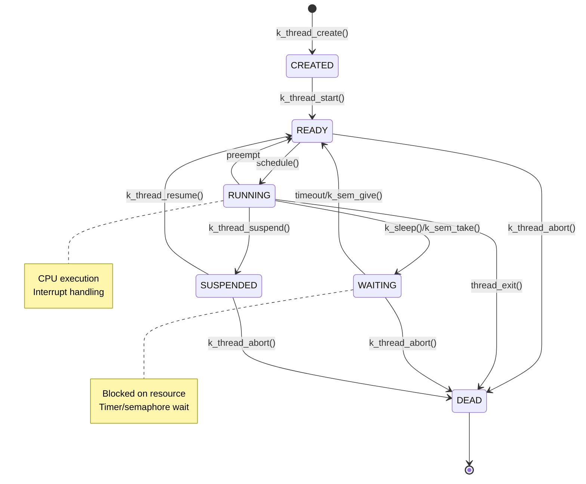
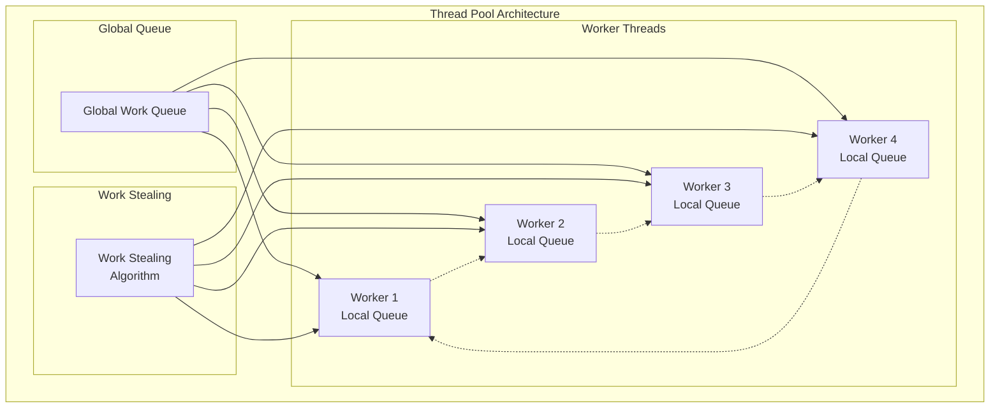

# Advanced Threading and Synchronization

## Overview

This module explores advanced threading concepts, sophisticated synchronization mechanisms, and high-performance concurrent programming patterns in Zephyr RTOS.

## Advanced Threading Architecture

### Thread State Machine



### Advanced Thread Control Blocks

```c
// Extended thread control block with advanced features
struct advanced_thread_data {
    struct k_thread base;              // Base thread structure
    
    // Performance monitoring
    uint64_t cpu_time_used;           // Total CPU time consumed
    uint64_t last_schedule_time;      // Last scheduled timestamp
    uint32_t context_switches;        // Number of context switches
    uint32_t cache_misses;            // Cache miss counter
    
    // Real-time constraints
    uint32_t deadline;                // Absolute deadline
    uint32_t period;                  // Thread period (for periodic tasks)
    uint32_t wcet;                    // Worst-case execution time
    uint32_t budget_remaining;        // Remaining time budget
    
    // Thread-local storage
    void *tls_data;                   // Thread-local storage pointer
    size_t tls_size;                  // TLS data size
    
    // Exception handling
    jmp_buf exception_context;        // Exception context
    struct k_work exception_work;     // Exception handler work
    
    // Custom scheduler data
    void *scheduler_data;             // Scheduler-specific data
    int (*custom_scheduler)(struct k_thread *thread);
};

// Thread creation with advanced features
#define K_THREAD_DEFINE_ADVANCED(name, stack_size, entry, arg1, arg2, arg3, \
                                prio, options, delay, deadline, period) \
    static K_THREAD_STACK_DEFINE(_k_thread_stack_##name, stack_size); \
    static struct advanced_thread_data _k_thread_data_##name = { \
        .deadline = deadline, \
        .period = period \
    }; \
    struct k_thread name = _k_thread_data_##name.base; \
    static int _thread_init_##name(void) { \
        k_thread_create(&name, _k_thread_stack_##name, stack_size, \
                       entry, arg1, arg2, arg3, prio, options, delay); \
        return 0; \
    } \
    SYS_INIT(_thread_init_##name, APPLICATION, CONFIG_APPLICATION_INIT_PRIORITY)
```

## Advanced Synchronization Mechanisms

### Lock-Free Programming

```c
// Lock-free atomic operations
struct lockfree_counter {
    volatile uint64_t value;
    volatile uint32_t readers;
};

// Lock-free increment
static inline uint64_t lockfree_increment(struct lockfree_counter *counter)
{
    return __atomic_add_fetch(&counter->value, 1, __ATOMIC_ACQ_REL);
}

// Lock-free compare-and-swap
static inline bool lockfree_cas(struct lockfree_counter *counter,
                               uint64_t expected, uint64_t desired)
{
    return __atomic_compare_exchange_n(&counter->value, &expected, desired,
                                     false, __ATOMIC_ACQ_REL, __ATOMIC_ACQUIRE);
}

// Lock-free stack implementation
struct lockfree_stack_node {
    struct lockfree_stack_node *next;
    void *data;
};

struct lockfree_stack {
    volatile struct lockfree_stack_node *head;
    volatile uint32_t size;
};

// Lock-free push operation
void lockfree_stack_push(struct lockfree_stack *stack, 
                        struct lockfree_stack_node *node)
{
    struct lockfree_stack_node *head;
    
    do {
        head = __atomic_load_n(&stack->head, __ATOMIC_ACQUIRE);
        node->next = head;
    } while (!__atomic_compare_exchange_n(&stack->head, &head, node,
                                        false, __ATOMIC_RELEASE, __ATOMIC_ACQUIRE));
    
    __atomic_add_fetch(&stack->size, 1, __ATOMIC_ACQ_REL);
}

// Lock-free pop operation
struct lockfree_stack_node *lockfree_stack_pop(struct lockfree_stack *stack)
{
    struct lockfree_stack_node *head, *next;
    
    do {
        head = __atomic_load_n(&stack->head, __ATOMIC_ACQUIRE);
        if (!head) {
            return NULL;  // Stack is empty
        }
        next = head->next;
    } while (!__atomic_compare_exchange_n(&stack->head, &head, next,
                                        false, __ATOMIC_RELEASE, __ATOMIC_ACQUIRE));
    
    __atomic_sub_fetch(&stack->size, 1, __ATOMIC_ACQ_REL);
    return head;
}
```

### Advanced Mutex Implementations

| Mutex Type | Features | Best Use Case | Overhead |
|------------|----------|---------------|----------|
| Basic Mutex | Simple locking | General purpose | Low |
| Recursive Mutex | Same thread re-entry | Nested calls | Medium |
| Timed Mutex | Timeout support | Real-time systems | Medium |
| Priority Mutex | Priority inheritance | RT systems | High |
| Adaptive Mutex | Spin then block | Mixed workloads | Variable |

```c
// Priority inheritance mutex
struct priority_mutex {
    struct k_mutex base;
    struct k_thread *owner;
    int original_priority;
    int inherited_priority;
    struct k_work priority_work;
};

// Initialize priority inheritance mutex
void priority_mutex_init(struct priority_mutex *pmutex)
{
    k_mutex_init(&pmutex->base);
    pmutex->owner = NULL;
    pmutex->original_priority = 0;
    pmutex->inherited_priority = 0;
    k_work_init(&pmutex->priority_work, priority_inheritance_handler);
}

// Lock with priority inheritance
int priority_mutex_lock(struct priority_mutex *pmutex, k_timeout_t timeout)
{
    struct k_thread *current = k_current_get();
    int ret;
    
    ret = k_mutex_lock(&pmutex->base, timeout);
    if (ret == 0) {
        pmutex->owner = current;
        pmutex->original_priority = current->base.prio;
        
        // Check if priority inheritance is needed
        if (has_higher_priority_waiters(&pmutex->base)) {
            k_work_submit(&pmutex->priority_work);
        }
    }
    
    return ret;
}

// Priority inheritance handler
static void priority_inheritance_handler(struct k_work *work)
{
    struct priority_mutex *pmutex = 
        CONTAINER_OF(work, struct priority_mutex, priority_work);
    struct k_thread *owner = pmutex->owner;
    int highest_waiter_priority;
    
    if (!owner) {
        return;
    }
    
    highest_waiter_priority = get_highest_waiter_priority(&pmutex->base);
    
    // Boost priority if necessary
    if (highest_waiter_priority < owner->base.prio) {
        pmutex->inherited_priority = highest_waiter_priority;
        k_thread_priority_set(owner, highest_waiter_priority);
    }
}
```

### Read-Write Locks

```c
// High-performance read-write lock
struct advanced_rwlock {
    volatile uint32_t lock_word;  // Bit-packed lock state
    struct k_sem write_sem;       // Write semaphore
    struct k_condvar read_cv;     // Reader condition variable
    struct k_mutex state_mutex;   // State protection mutex
    uint16_t reader_count;        // Active readers
    uint16_t writer_waiting;      // Waiting writers
    bool writer_active;           // Writer active flag
};

// RW lock bit layout
#define RWLOCK_READER_MASK    0x0000FFFF  // Reader count (16 bits)
#define RWLOCK_WRITER_WAITING 0x00010000  // Writer waiting bit
#define RWLOCK_WRITER_ACTIVE  0x00020000  // Writer active bit

// Fast path read lock (lock-free when possible)
int rwlock_read_lock_fast(struct advanced_rwlock *rwlock)
{
    uint32_t old_state, new_state;
    
    do {
        old_state = __atomic_load_n(&rwlock->lock_word, __ATOMIC_ACQUIRE);
        
        // Check if writer is active or waiting
        if (old_state & (RWLOCK_WRITER_ACTIVE | RWLOCK_WRITER_WAITING)) {
            return -EAGAIN;  // Fall back to slow path
        }
        
        // Check for reader overflow
        if ((old_state & RWLOCK_READER_MASK) == RWLOCK_READER_MASK) {
            return -EAGAIN;  // Too many readers
        }
        
        new_state = old_state + 1;  // Increment reader count
        
    } while (!__atomic_compare_exchange_n(&rwlock->lock_word, &old_state, 
                                        new_state, false, __ATOMIC_ACQ_REL, 
                                        __ATOMIC_ACQUIRE));
    
    return 0;
}

// Slow path read lock with blocking
int rwlock_read_lock_slow(struct advanced_rwlock *rwlock, k_timeout_t timeout)
{
    int ret;
    
    ret = k_mutex_lock(&rwlock->state_mutex, timeout);
    if (ret != 0) {
        return ret;
    }
    
    // Wait for writers to complete
    while (rwlock->writer_active) {
        ret = k_condvar_wait(&rwlock->read_cv, &rwlock->state_mutex, timeout);
        if (ret != 0) {
            k_mutex_unlock(&rwlock->state_mutex);
            return ret;
        }
    }
    
    // Increment reader count
    rwlock->reader_count++;
    
    k_mutex_unlock(&rwlock->state_mutex);
    return 0;
}
```

## Advanced Thread Pool Implementation

### Work-Stealing Thread Pool



```c
// Work-stealing thread pool
struct work_stealing_pool {
    uint32_t num_workers;
    struct worker_thread *workers;
    struct lockfree_queue global_queue;
    volatile bool shutdown;
    struct k_sem completion_sem;
};

// Individual worker thread
struct worker_thread {
    struct k_thread thread;
    K_THREAD_STACK_MEMBER(stack, 2048);
    struct work_stealing_pool *pool;
    struct lockfree_queue local_queue;
    uint32_t worker_id;
    uint64_t tasks_completed;
    uint64_t tasks_stolen;
};

// Work item structure
struct work_item {
    void (*function)(void *arg);
    void *argument;
    struct k_sem *completion_sem;
    int priority;
    uint64_t submit_time;
};

// Worker thread main loop
void worker_thread_main(void *arg1, void *arg2, void *arg3)
{
    struct worker_thread *worker = (struct worker_thread *)arg1;
    struct work_stealing_pool *pool = worker->pool;
    struct work_item *item;
    
    while (!pool->shutdown) {
        // Try to get work from local queue first
        item = lockfree_queue_pop(&worker->local_queue);
        
        if (!item) {
            // Try to get work from global queue
            item = lockfree_queue_pop(&pool->global_queue);
        }
        
        if (!item) {
            // Attempt work stealing from other workers
            item = steal_work_from_others(worker);
        }
        
        if (item) {
            // Execute work item
            item->function(item->argument);
            worker->tasks_completed++;
            
            // Signal completion if requested
            if (item->completion_sem) {
                k_sem_give(item->completion_sem);
            }
            
            k_free(item);
        } else {
            // No work available, sleep briefly
            k_sleep(K_USEC(100));
        }
    }
}

// Work stealing algorithm
struct work_item *steal_work_from_others(struct worker_thread *thief)
{
    struct work_stealing_pool *pool = thief->pool;
    struct work_item *stolen_item = NULL;
    uint32_t victim_id;
    
    // Try to steal from each other worker
    for (uint32_t i = 1; i < pool->num_workers; i++) {
        victim_id = (thief->worker_id + i) % pool->num_workers;
        
        // Skip self
        if (victim_id == thief->worker_id) {
            continue;
        }
        
        // Attempt to steal from victim's local queue
        stolen_item = lockfree_queue_steal(&pool->workers[victim_id].local_queue);
        
        if (stolen_item) {
            thief->tasks_stolen++;
            break;
        }
    }
    
    return stolen_item;
}

// Submit work to thread pool
int thread_pool_submit(struct work_stealing_pool *pool, 
                      void (*function)(void *), void *arg, int priority)
{
    struct work_item *item;
    struct worker_thread *least_loaded_worker;
    
    // Allocate work item
    item = k_malloc(sizeof(struct work_item));
    if (!item) {
        return -ENOMEM;
    }
    
    // Initialize work item
    item->function = function;
    item->argument = arg;
    item->completion_sem = NULL;
    item->priority = priority;
    item->submit_time = k_cycle_get_64();
    
    // Find least loaded worker for load balancing
    least_loaded_worker = find_least_loaded_worker(pool);
    
    // Try to submit to worker's local queue first
    if (lockfree_queue_push(&least_loaded_worker->local_queue, item) == 0) {
        return 0;
    }
    
    // Fall back to global queue
    if (lockfree_queue_push(&pool->global_queue, item) == 0) {
        return 0;
    }
    
    // Both queues full
    k_free(item);
    return -ENOBUFS;
}
```

## Real-Time Scheduling Algorithms

### Earliest Deadline First (EDF) Scheduler

```c
// EDF scheduler implementation
struct edf_scheduler {
    struct k_heap ready_queue;        // Min-heap ordered by deadline
    struct k_mutex scheduler_mutex;   // Scheduler synchronization
    uint64_t current_time;           // Current system time
    struct k_work scheduler_work;    // Scheduler work item
};

// EDF task structure
struct edf_task {
    struct k_thread *thread;
    uint64_t deadline;              // Absolute deadline
    uint64_t period;                // Task period
    uint64_t execution_time;        // Execution time requirement
    uint64_t last_release;          // Last release time
    bool is_periodic;               // Periodic task flag
    struct k_heap_node heap_node;   // Heap node for priority queue
};

// EDF scheduler policy
int edf_schedule(void)
{
    struct edf_scheduler *sched = &global_edf_scheduler;
    struct edf_task *next_task;
    struct k_thread *current_thread;
    uint64_t current_time;
    
    k_mutex_lock(&sched->scheduler_mutex, K_FOREVER);
    
    current_time = k_cycle_get_64();
    sched->current_time = current_time;
    
    // Check for deadline misses
    check_deadline_violations(sched, current_time);
    
    // Get task with earliest deadline
    next_task = (struct edf_task *)k_heap_peek(&sched->ready_queue);
    
    if (!next_task) {
        k_mutex_unlock(&sched->scheduler_mutex);
        return -ENODATA;  // No tasks ready
    }
    
    // Check if preemption is necessary
    current_thread = k_current_get();
    if (current_thread != next_task->thread) {
        // Preempt current thread
        k_thread_suspend(current_thread);
        k_thread_resume(next_task->thread);
    }
    
    k_mutex_unlock(&sched->scheduler_mutex);
    return 0;
}

// EDF admission control
bool edf_admit_task(struct edf_task *task)
{
    struct edf_scheduler *sched = &global_edf_scheduler;
    double total_utilization = 0.0;
    
    // Calculate current system utilization
    total_utilization = calculate_system_utilization(sched);
    
    // Calculate new task utilization
    double task_utilization = (double)task->execution_time / task->period;
    
    // EDF schedulability test: U <= 1
    if (total_utilization + task_utilization <= 1.0) {
        return true;   // Task is schedulable
    }
    
    return false;  // Task would cause deadline misses
}
```

### Rate Monotonic Scheduler

```c
// Rate Monotonic scheduler
struct rm_scheduler {
    struct edf_task *tasks[MAX_RM_TASKS];
    uint8_t num_tasks;
    uint8_t current_task;
    struct k_timer period_timer;
};

// RM schedulability analysis
bool rm_schedulability_test(struct rm_scheduler *sched)
{
    double utilization_bound;
    double total_utilization = 0.0;
    
    // Calculate Liu & Layland utilization bound
    utilization_bound = sched->num_tasks * (pow(2.0, 1.0/sched->num_tasks) - 1.0);
    
    // Calculate total utilization
    for (int i = 0; i < sched->num_tasks; i++) {
        struct edf_task *task = sched->tasks[i];
        total_utilization += (double)task->execution_time / task->period;
    }
    
    // Sufficient schedulability condition
    if (total_utilization <= utilization_bound) {
        return true;
    }
    
    // Necessary condition check
    if (total_utilization > 1.0) {
        return false;
    }
    
    // Exact schedulability test (response time analysis)
    return rm_response_time_analysis(sched);
}
```

## Advanced Synchronization Patterns

### Producer-Consumer with Backpressure

```c
// Advanced producer-consumer with flow control
struct flow_controlled_queue {
    struct k_msgq message_queue;
    struct k_sem producer_sem;      // Controls producer rate
    struct k_sem consumer_sem;      // Signals available items
    struct k_mutex flow_mutex;      // Flow control mutex
    uint32_t high_watermark;        // Queue size threshold
    uint32_t low_watermark;         // Resume production threshold
    bool backpressure_active;       // Backpressure state
    uint64_t messages_dropped;      // Dropped message counter
};

// Producer with backpressure handling
int flow_controlled_produce(struct flow_controlled_queue *queue, 
                           const void *data, k_timeout_t timeout)
{
    int ret;
    
    // Wait for permission to produce
    ret = k_sem_take(&queue->producer_sem, timeout);
    if (ret != 0) {
        return ret;  // Timeout or error
    }
    
    // Try to send message
    ret = k_msgq_put(&queue->message_queue, data, K_NO_WAIT);
    
    if (ret == 0) {
        // Message sent successfully
        k_sem_give(&queue->consumer_sem);
        
        // Check if backpressure should be activated
        if (k_msgq_num_used_get(&queue->message_queue) >= queue->high_watermark) {
            k_mutex_lock(&queue->flow_mutex, K_FOREVER);
            if (!queue->backpressure_active) {
                queue->backpressure_active = true;
                // Reduce producer semaphore count
                while (k_sem_take(&queue->producer_sem, K_NO_WAIT) == 0) {
                    // Drain semaphore
                }
            }
            k_mutex_unlock(&queue->flow_mutex);
        }
    } else {
        // Message queue full, restore semaphore
        k_sem_give(&queue->producer_sem);
        
        // Increment dropped message counter
        __atomic_add_fetch(&queue->messages_dropped, 1, __ATOMIC_RELAXED);
    }
    
    return ret;
}

// Consumer with backpressure relief
int flow_controlled_consume(struct flow_controlled_queue *queue, 
                           void *data, k_timeout_t timeout)
{
    int ret;
    
    // Wait for available message
    ret = k_sem_take(&queue->consumer_sem, timeout);
    if (ret != 0) {
        return ret;
    }
    
    // Get message from queue
    ret = k_msgq_get(&queue->message_queue, data, K_NO_WAIT);
    
    if (ret == 0) {
        // Check if backpressure should be relieved
        if (queue->backpressure_active && 
            k_msgq_num_used_get(&queue->message_queue) <= queue->low_watermark) {
            
            k_mutex_lock(&queue->flow_mutex, K_FOREVER);
            if (queue->backpressure_active) {
                queue->backpressure_active = false;
                // Restore full producer capacity
                uint32_t capacity = k_msgq_num_free_get(&queue->message_queue);
                for (uint32_t i = 0; i < capacity; i++) {
                    k_sem_give(&queue->producer_sem);
                }
            }
            k_mutex_unlock(&queue->flow_mutex);
        }
    }
    
    return ret;
}
```

## Performance Monitoring and Profiling

### Thread Performance Metrics

| Metric | Description | Calculation | Use Case |
|--------|-------------|-------------|----------|
| CPU Utilization | Thread CPU usage | (Execution Time / Wall Time) * 100 | Load balancing |
| Context Switches | Thread switches per second | Switches / Time Period | Efficiency analysis |
| Cache Hit Rate | L1/L2 cache effectiveness | Hits / (Hits + Misses) | Memory optimization |
| Lock Contention | Synchronization overhead | Wait Time / Total Time | Concurrency tuning |

```c
// Advanced thread performance monitoring
struct thread_perf_stats {
    uint64_t execution_time;        // Total execution time
    uint64_t wait_time;            // Time spent waiting
    uint64_t preemption_count;     // Number of preemptions
    uint64_t voluntary_switches;    // Voluntary context switches
    uint64_t involuntary_switches; // Involuntary context switches
    uint64_t page_faults;          // Memory page faults
    uint64_t cache_misses;         // Cache miss events
    uint64_t lock_acquisitions;    // Lock acquisition count
    uint64_t lock_contentions;     // Lock contention events
    double cpu_utilization;        // CPU utilization percentage
    double cache_hit_rate;         // Cache hit rate percentage
};

// Performance monitoring framework
void update_thread_performance(struct k_thread *thread)
{
    struct thread_perf_stats *stats = 
        (struct thread_perf_stats *)thread->custom_data;
    uint64_t current_time = k_cycle_get_64();
    uint64_t execution_delta;
    
    if (thread->perf.last_scheduled_time != 0) {
        execution_delta = current_time - thread->perf.last_scheduled_time;
        stats->execution_time += execution_delta;
        
        // Update CPU utilization (exponential moving average)
        double utilization = (double)execution_delta / 
                           (current_time - thread->perf.last_update_time);
        stats->cpu_utilization = 0.9 * stats->cpu_utilization + 
                                0.1 * utilization * 100.0;
    }
    
    thread->perf.last_scheduled_time = current_time;
    thread->perf.last_update_time = current_time;
}

// Performance profiling interface
void profile_thread_performance(struct k_thread *thread, 
                               k_timeout_t duration)
{
    struct thread_perf_stats before, after;
    
    // Capture initial performance state
    get_thread_performance(thread, &before);
    
    // Wait for profiling duration
    k_sleep(duration);
    
    // Capture final performance state
    get_thread_performance(thread, &after);
    
    // Calculate and report performance deltas
    report_performance_analysis(thread, &before, &after);
}
```

## Next Steps

This advanced threading module provides deep insights into Zephyr's threading and synchronization capabilities. Continue with:

- [Advanced Memory Management](03_advanced_memory.md)
- [Advanced Device Driver Development](04_advanced_drivers.md)
- [Advanced Networking and Connectivity](05_advanced_networking.md)