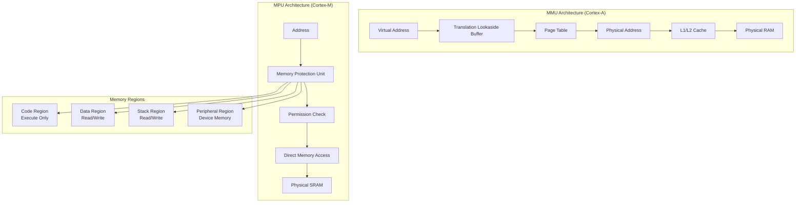
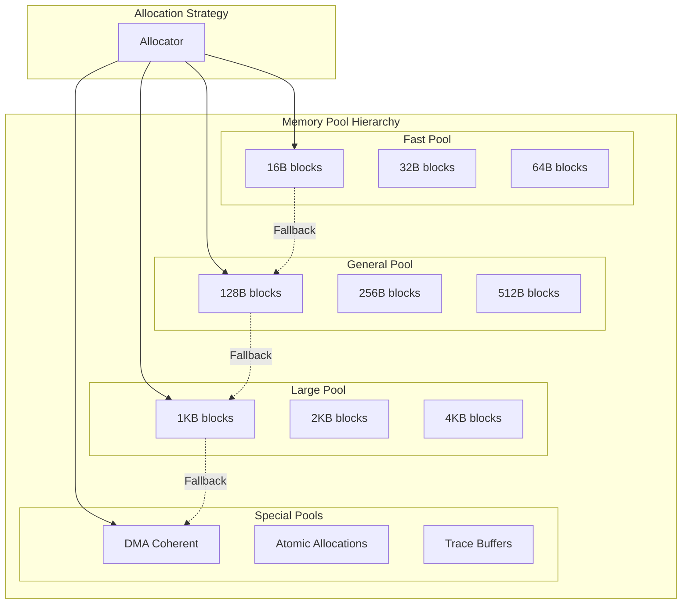

# Advanced Memory Management

## Overview

This module explores sophisticated memory management techniques, optimization strategies, and advanced memory protection mechanisms in Zephyr RTOS for high-performance embedded systems.

## Memory Architecture Deep Dive

### Memory Management Unit (MMU) vs Memory Protection Unit (MPU)



### Advanced Memory Layout

```c
// Advanced memory layout configuration
struct memory_layout_config {
    // Code regions
    struct memory_region code_region;
    struct memory_region rodata_region;
    
    // Data regions  
    struct memory_region data_region;
    struct memory_region bss_region;
    
    // Heap regions
    struct memory_region system_heap;
    struct memory_region application_heap;
    struct memory_region dma_heap;
    
    // Stack regions
    struct memory_region main_stack;
    struct memory_region irq_stack;
    struct memory_region thread_stacks;
    
    // Special regions
    struct memory_region shared_memory;
    struct memory_region protected_memory;
    struct memory_region trace_buffer;
};

// Memory region attributes
struct memory_region {
    uintptr_t base_addr;        // Base address
    size_t size;                // Region size
    uint32_t attributes;        // Access attributes
    uint32_t cache_policy;      // Cache policy
    bool is_secure;             // Security domain
    uint8_t mpu_region_id;      // MPU region number
};

// Memory attributes
#define MEM_ATTR_READ        BIT(0)
#define MEM_ATTR_WRITE       BIT(1)
#define MEM_ATTR_EXECUTE     BIT(2)
#define MEM_ATTR_CACHEABLE   BIT(3)
#define MEM_ATTR_BUFFERABLE  BIT(4)
#define MEM_ATTR_SHAREABLE   BIT(5)
#define MEM_ATTR_DEVICE      BIT(6)
#define MEM_ATTR_STRONGLY_ORDERED BIT(7)
```

## Advanced Heap Management

### Multi-Heap Architecture



### Advanced Heap Implementations

```c
// Buddy allocator for large blocks
struct buddy_allocator {
    uint8_t *memory_base;           // Base memory address
    size_t memory_size;             // Total memory size
    uint8_t max_order;              // Maximum allocation order
    struct k_mutex mutex;           // Allocator mutex
    
    // Free block lists for each order
    struct list_head free_lists[MAX_BUDDY_ORDER];
    
    // Allocation bitmap
    uint32_t *allocation_bitmap;
    size_t bitmap_size;
    
    // Statistics
    size_t total_allocations;
    size_t current_usage;
    size_t peak_usage;
    size_t fragmentation_count;
};

// Buddy block header
struct buddy_block {
    struct list_head list;          // Free list linkage
    uint8_t order;                  // Block order (size = 2^order)
    bool is_free;                   // Free status
    uint32_t magic;                 // Corruption detection
};

// Buddy allocator initialization
int buddy_allocator_init(struct buddy_allocator *buddy, 
                        void *memory, size_t size)
{
    size_t min_block_size = sizeof(struct buddy_block);
    uint8_t order;
    
    // Calculate maximum order
    buddy->max_order = 0;
    size_t temp_size = size;
    while (temp_size > min_block_size) {
        temp_size >>= 1;
        buddy->max_order++;
    }
    
    buddy->memory_base = (uint8_t *)memory;
    buddy->memory_size = size;
    k_mutex_init(&buddy->mutex);
    
    // Initialize free lists
    for (order = 0; order < buddy->max_order; order++) {
        INIT_LIST_HEAD(&buddy->free_lists[order]);
    }
    
    // Add initial free block
    struct buddy_block *initial_block = (struct buddy_block *)memory;
    initial_block->order = buddy->max_order - 1;
    initial_block->is_free = true;
    initial_block->magic = BUDDY_MAGIC;
    list_add(&initial_block->list, &buddy->free_lists[initial_block->order]);
    
    return 0;
}

// Buddy allocation
void *buddy_alloc(struct buddy_allocator *buddy, size_t size)
{
    uint8_t required_order = calculate_required_order(size);
    uint8_t search_order;
    struct buddy_block *block = NULL;
    
    if (required_order >= buddy->max_order) {
        return NULL;  // Size too large
    }
    
    k_mutex_lock(&buddy->mutex, K_FOREVER);
    
    // Find smallest available block
    for (search_order = required_order; search_order < buddy->max_order; search_order++) {
        if (!list_empty(&buddy->free_lists[search_order])) {
            block = list_first_entry(&buddy->free_lists[search_order], 
                                    struct buddy_block, list);
            list_del(&block->list);
            break;
        }
    }
    
    if (!block) {
        k_mutex_unlock(&buddy->mutex);
        return NULL;  // No memory available
    }
    
    // Split block if necessary
    while (block->order > required_order) {
        struct buddy_block *buddy_block = 
            (struct buddy_block *)((uint8_t *)block + (1 << (block->order - 1)));
        
        block->order--;
        buddy_block->order = block->order;
        buddy_block->is_free = true;
        buddy_block->magic = BUDDY_MAGIC;
        
        list_add(&buddy_block->list, &buddy->free_lists[buddy_block->order]);
    }
    
    block->is_free = false;
    buddy->total_allocations++;
    buddy->current_usage += (1 << block->order);
    
    if (buddy->current_usage > buddy->peak_usage) {
        buddy->peak_usage = buddy->current_usage;
    }
    
    k_mutex_unlock(&buddy->mutex);
    
    return (void *)((uint8_t *)block + sizeof(struct buddy_block));
}

// Buddy deallocation with coalescing
void buddy_free(struct buddy_allocator *buddy, void *ptr)
{
    struct buddy_block *block = 
        (struct buddy_block *)((uint8_t *)ptr - sizeof(struct buddy_block));
    
    if (block->magic != BUDDY_MAGIC || block->is_free) {
        // Corruption or double-free detected
        return;
    }
    
    k_mutex_lock(&buddy->mutex, K_FOREVER);
    
    block->is_free = true;
    buddy->current_usage -= (1 << block->order);
    
    // Coalesce with buddy blocks
    while (block->order < buddy->max_order - 1) {
        uintptr_t block_addr = (uintptr_t)block;
        uintptr_t buddy_addr = block_addr ^ (1 << block->order);
        struct buddy_block *buddy_block = (struct buddy_block *)buddy_addr;
        
        // Check if buddy is free and same order
        if (buddy_block->magic != BUDDY_MAGIC || 
            !buddy_block->is_free || 
            buddy_block->order != block->order) {
            break;
        }
        
        // Remove buddy from free list
        list_del(&buddy_block->list);
        
        // Merge blocks (use lower address as merged block)
        if (buddy_addr < block_addr) {
            block = buddy_block;
        }
        
        block->order++;
    }
    
    // Add coalesced block to appropriate free list
    list_add(&block->list, &buddy->free_lists[block->order]);
    
    k_mutex_unlock(&buddy->mutex);
}
```

### Slab Allocator for Fixed-Size Objects

```c
// Slab allocator for high-performance fixed-size allocation
struct slab_allocator {
    size_t object_size;             // Size of each object
    size_t alignment;               // Object alignment requirement
    size_t objects_per_slab;        // Objects per slab
    size_t slab_size;               // Total slab size
    
    struct list_head full_slabs;    // Fully allocated slabs
    struct list_head partial_slabs; // Partially allocated slabs
    struct list_head empty_slabs;   // Empty slabs
    
    struct k_mutex mutex;           // Allocator synchronization
    
    // Constructor/destructor callbacks
    void (*constructor)(void *obj);
    void (*destructor)(void *obj);
    
    // Statistics
    size_t total_slabs;
    size_t active_objects;
    size_t total_allocations;
    size_t allocation_failures;
};

// Slab structure
struct slab {
    struct list_head list;          // Slab list linkage
    void *memory;                   // Slab memory
    uint32_t *freelist_bitmap;      // Free object bitmap
    uint16_t free_objects;          // Number of free objects
    uint16_t total_objects;         // Total objects in slab
    struct slab_allocator *allocator; // Parent allocator
};

// Slab allocator initialization
struct slab_allocator *create_slab_allocator(size_t object_size, 
                                            size_t alignment,
                                            void (*constructor)(void *),
                                            void (*destructor)(void *))
{
    struct slab_allocator *allocator;
    
    allocator = k_malloc(sizeof(struct slab_allocator));
    if (!allocator) {
        return NULL;
    }
    
    // Align object size
    allocator->object_size = ALIGN_UP(object_size, alignment);
    allocator->alignment = alignment;
    
    // Calculate objects per slab (optimize for page size)
    size_t slab_overhead = sizeof(struct slab);
    size_t bitmap_size = ALIGN_UP(CONFIG_SLAB_MAX_OBJECTS / 8, 4);
    allocator->slab_size = CONFIG_SLAB_SIZE;
    allocator->objects_per_slab = 
        (allocator->slab_size - slab_overhead - bitmap_size) / 
        allocator->object_size;
    
    // Initialize lists
    INIT_LIST_HEAD(&allocator->full_slabs);
    INIT_LIST_HEAD(&allocator->partial_slabs);
    INIT_LIST_HEAD(&allocator->empty_slabs);
    
    k_mutex_init(&allocator->mutex);
    
    allocator->constructor = constructor;
    allocator->destructor = destructor;
    
    return allocator;
}

// Fast slab allocation
void *slab_alloc(struct slab_allocator *allocator)
{
    struct slab *slab;
    void *object = NULL;
    uint32_t object_index;
    
    k_mutex_lock(&allocator->mutex, K_FOREVER);
    
    // Try to allocate from partial slab first
    if (!list_empty(&allocator->partial_slabs)) {
        slab = list_first_entry(&allocator->partial_slabs, struct slab, list);
    } else if (!list_empty(&allocator->empty_slabs)) {
        // Use empty slab
        slab = list_first_entry(&allocator->empty_slabs, struct slab, list);
        list_move(&slab->list, &allocator->partial_slabs);
    } else {
        // Allocate new slab
        slab = allocate_new_slab(allocator);
        if (!slab) {
            allocator->allocation_failures++;
            k_mutex_unlock(&allocator->mutex);
            return NULL;
        }
        list_add(&slab->list, &allocator->partial_slabs);
    }
    
    // Find free object in slab
    object_index = find_first_free_object(slab);
    if (object_index < slab->total_objects) {
        // Mark object as allocated
        set_bit(slab->freelist_bitmap, object_index);
        slab->free_objects--;
        
        // Calculate object address
        object = (void *)((uint8_t *)slab->memory + 
                         object_index * allocator->object_size);
        
        // Move slab to full list if necessary
        if (slab->free_objects == 0) {
            list_move(&slab->list, &allocator->full_slabs);
        }
        
        allocator->active_objects++;
        allocator->total_allocations++;
        
        // Call constructor if provided
        if (allocator->constructor) {
            allocator->constructor(object);
        }
    }
    
    k_mutex_unlock(&allocator->mutex);
    
    return object;
}

// Slab deallocation
void slab_free(struct slab_allocator *allocator, void *object)
{
    struct slab *slab;
    uint32_t object_index;
    bool was_full;
    
    if (!object) {
        return;
    }
    
    k_mutex_lock(&allocator->mutex, K_FOREVER);
    
    // Find slab containing this object
    slab = find_slab_for_object(allocator, object);
    if (!slab) {
        k_mutex_unlock(&allocator->mutex);
        return;  // Invalid object
    }
    
    // Call destructor if provided
    if (allocator->destructor) {
        allocator->destructor(object);
    }
    
    // Calculate object index
    object_index = ((uint8_t *)object - (uint8_t *)slab->memory) / 
                   allocator->object_size;
    
    // Free the object
    was_full = (slab->free_objects == 0);
    clear_bit(slab->freelist_bitmap, object_index);
    slab->free_objects++;
    allocator->active_objects--;
    
    // Move slab between lists based on occupancy
    if (was_full) {
        list_move(&slab->list, &allocator->partial_slabs);
    } else if (slab->free_objects == slab->total_objects) {
        list_move(&slab->list, &allocator->empty_slabs);
    }
    
    k_mutex_unlock(&allocator->mutex);
}
```

## Memory Protection and Security

### Advanced MPU Configuration

```c
// Comprehensive MPU region configuration
struct advanced_mpu_config {
    struct mpu_region regions[ARM_MPU_REGION_COUNT];
    uint8_t num_regions;
    bool enabled;
    
    // Security attributes
    struct {
        bool secure_world_enabled;
        uint32_t secure_regions_mask;
        uint32_t non_secure_callable_mask;
    } trustzone;
    
    // Performance monitoring
    struct {
        uint32_t fault_count;
        uint32_t last_fault_addr;
        uint32_t last_fault_type;
    } fault_stats;
};

// MPU region types with advanced attributes
enum mpu_region_type {
    MPU_REGION_CODE_RO,             // Read-only code
    MPU_REGION_CODE_RX,             // Read-execute code
    MPU_REGION_DATA_RW,             // Read-write data
    MPU_REGION_DATA_RO,             // Read-only data
    MPU_REGION_STACK_RW,            // Stack region
    MPU_REGION_HEAP_RW,             // Heap region
    MPU_REGION_DEVICE_RW,           // Device memory
    MPU_REGION_SHARED_MEM,          // Shared memory
    MPU_REGION_DMA_COHERENT,        // DMA coherent memory
    MPU_REGION_SECURE_ONLY,         // Secure world only
};

// Configure advanced MPU regions
int configure_advanced_mpu(struct advanced_mpu_config *config)
{
    int ret = 0;
    
    // Disable MPU during configuration
    arm_mpu_disable();
    
    // Configure each region
    for (uint8_t i = 0; i < config->num_regions; i++) {
        struct mpu_region *region = &config->regions[i];
        
        ret = arm_mpu_config_region(i, region->base, region->size, 
                                   region->attr);
        if (ret != 0) {
            return ret;
        }
        
        // Configure TrustZone attributes if enabled
        if (config->trustzone.secure_world_enabled) {
            configure_trustzone_attributes(i, region, config);
        }
    }
    
    // Install MPU fault handler
    install_mpu_fault_handler(config);
    
    // Enable MPU with background region
    arm_mpu_enable(true);
    config->enabled = true;
    
    return 0;
}

// MPU fault handler
void mpu_fault_handler(uint32_t fault_addr, uint32_t fault_type)
{
    struct advanced_mpu_config *config = &global_mpu_config;
    
    // Update fault statistics
    config->fault_stats.fault_count++;
    config->fault_stats.last_fault_addr = fault_addr;
    config->fault_stats.last_fault_type = fault_type;
    
    // Log fault information
    LOG_ERR("MPU Fault: addr=0x%08x, type=%d, count=%d", 
            fault_addr, fault_type, config->fault_stats.fault_count);
    
    // Determine fault cause and take appropriate action
    switch (fault_type) {
    case MPU_FAULT_INSTRUCTION_ACCESS:
        handle_instruction_access_fault(fault_addr);
        break;
        
    case MPU_FAULT_DATA_ACCESS:
        handle_data_access_fault(fault_addr);
        break;
        
    case MPU_FAULT_BACKGROUND:
        handle_background_fault(fault_addr);
        break;
        
    default:
        // Unknown fault type - halt system
        k_panic();
        break;
    }
}
```

### Stack Protection and Overflow Detection

```c
// Advanced stack protection
struct stack_guard {
    void *stack_base;               // Stack base address
    size_t stack_size;              // Stack size
    void *guard_page;               // Guard page address
    size_t guard_size;              // Guard page size
    uint32_t canary_value;          // Stack canary value
    bool overflow_detected;         // Overflow status
    
    // Stack usage monitoring
    size_t max_usage;               // Maximum stack usage
    size_t current_usage;           // Current stack usage
    uint32_t usage_samples;         // Usage sample count
};

// Stack canary protection
#define STACK_CANARY_MAGIC    0xDEADBEEF

// Initialize stack protection
int init_stack_protection(struct stack_guard *guard, 
                         void *stack_base, size_t stack_size)
{
    guard->stack_base = stack_base;
    guard->stack_size = stack_size;
    guard->canary_value = STACK_CANARY_MAGIC;
    guard->overflow_detected = false;
    
    // Place canary at stack boundary
    uint32_t *canary_ptr = (uint32_t *)((uint8_t *)stack_base + stack_size - 4);
    *canary_ptr = guard->canary_value;
    
    // Configure guard page if MPU available
    if (arch_mpu_supported()) {
        guard->guard_size = arch_mpu_min_region_size();
        guard->guard_page = (uint8_t *)stack_base - guard->guard_size;
        
        // Configure guard page as no-access
        arm_mpu_config_guard_page(guard->guard_page, guard->guard_size);
    }
    
    return 0;
}

// Check stack integrity
bool check_stack_integrity(struct stack_guard *guard)
{
    uint32_t *canary_ptr = (uint32_t *)((uint8_t *)guard->stack_base + 
                                       guard->stack_size - 4);
    
    // Check canary value
    if (*canary_ptr != guard->canary_value) {
        guard->overflow_detected = true;
        LOG_ERR("Stack overflow detected: canary corrupted");
        return false;
    }
    
    // Calculate current stack usage
    void *stack_pointer = arch_current_stack_pointer();
    size_t usage = (uint8_t *)guard->stack_base + guard->stack_size - 
                   (uint8_t *)stack_pointer;
    
    guard->current_usage = usage;
    if (usage > guard->max_usage) {
        guard->max_usage = usage;
    }
    
    // Check for dangerous usage levels
    if (usage > (guard->stack_size * 0.9)) {
        LOG_WRN("Stack usage critical: %zu/%zu bytes", usage, guard->stack_size);
    }
    
    return true;
}
```

## Advanced Memory Debugging

### Memory Leak Detection

```c
// Memory allocation tracking
struct mem_alloc_info {
    void *address;                  // Allocated address
    size_t size;                    // Allocation size
    const char *file;               // Source file
    int line;                       // Source line
    uint64_t timestamp;             // Allocation timestamp
    uint32_t thread_id;             // Allocating thread
    struct mem_alloc_info *next;    // Next allocation
};

// Memory tracker
struct memory_tracker {
    struct mem_alloc_info *allocations; // Allocation list
    struct k_mutex mutex;               // Synchronization
    size_t total_allocations;           // Total allocations
    size_t active_allocations;          // Active allocations
    size_t peak_allocations;            // Peak allocations
    size_t total_memory_used;           // Total memory used
    size_t peak_memory_used;            // Peak memory used
    
    // Leak detection
    uint32_t leak_check_interval;       // Check interval (ms)
    struct k_timer leak_check_timer;    // Periodic check timer
    uint32_t potential_leaks;           // Potential leak count
};

// Tracked memory allocation
#define tracked_malloc(size) \
    tracked_malloc_impl(size, __FILE__, __LINE__)

void *tracked_malloc_impl(size_t size, const char *file, int line)
{
    struct memory_tracker *tracker = &global_memory_tracker;
    void *ptr;
    struct mem_alloc_info *info;
    
    ptr = k_malloc(size);
    if (!ptr) {
        return NULL;
    }
    
    // Create allocation tracking info
    info = k_malloc(sizeof(struct mem_alloc_info));
    if (!info) {
        k_free(ptr);
        return NULL;
    }
    
    info->address = ptr;
    info->size = size;
    info->file = file;
    info->line = line;
    info->timestamp = k_cycle_get_64();
    info->thread_id = k_current_get()->base.prio;
    
    k_mutex_lock(&tracker->mutex, K_FOREVER);
    
    // Add to allocation list
    info->next = tracker->allocations;
    tracker->allocations = info;
    
    // Update statistics
    tracker->total_allocations++;
    tracker->active_allocations++;
    tracker->total_memory_used += size;
    
    if (tracker->active_allocations > tracker->peak_allocations) {
        tracker->peak_allocations = tracker->active_allocations;
    }
    
    if (tracker->total_memory_used > tracker->peak_memory_used) {
        tracker->peak_memory_used = tracker->total_memory_used;
    }
    
    k_mutex_unlock(&tracker->mutex);
    
    return ptr;
}

// Tracked memory deallocation
void tracked_free(void *ptr)
{
    struct memory_tracker *tracker = &global_memory_tracker;
    struct mem_alloc_info *info, *prev = NULL;
    
    if (!ptr) {
        return;
    }
    
    k_mutex_lock(&tracker->mutex, K_FOREVER);
    
    // Find allocation info
    for (info = tracker->allocations; info; prev = info, info = info->next) {
        if (info->address == ptr) {
            // Remove from list
            if (prev) {
                prev->next = info->next;
            } else {
                tracker->allocations = info->next;
            }
            
            // Update statistics
            tracker->active_allocations--;
            tracker->total_memory_used -= info->size;
            
            k_free(info);
            break;
        }
    }
    
    k_mutex_unlock(&tracker->mutex);
    
    if (!info) {
        LOG_ERR("Double free or corruption detected: %p", ptr);
        return;
    }
    
    k_free(ptr);
}

// Memory leak detection
void detect_memory_leaks(struct k_timer *timer)
{
    struct memory_tracker *tracker = 
        CONTAINER_OF(timer, struct memory_tracker, leak_check_timer);
    struct mem_alloc_info *info;
    uint64_t current_time = k_cycle_get_64();
    uint64_t leak_threshold = k_ms_to_cyc_ceil32(30000); // 30 seconds
    
    k_mutex_lock(&tracker->mutex, K_FOREVER);
    
    tracker->potential_leaks = 0;
    
    for (info = tracker->allocations; info; info = info->next) {
        if (current_time - info->timestamp > leak_threshold) {
            tracker->potential_leaks++;
            
            LOG_WRN("Potential memory leak: %zu bytes at %s:%d", 
                   info->size, info->file, info->line);
        }
    }
    
    if (tracker->potential_leaks > 0) {
        LOG_ERR("Detected %d potential memory leaks", 
               tracker->potential_leaks);
    }
    
    k_mutex_unlock(&tracker->mutex);
}
```

## Performance Optimization Techniques

### Memory Access Optimization

| Optimization | Technique | Performance Gain | Implementation Complexity |
|--------------|-----------|------------------|---------------------------|
| Data Alignment | Align to cache line | 20-50% | Low |
| Prefetching | Software prefetch | 10-30% | Medium |
| Memory Pooling | Pre-allocated pools | 50-200% | Medium |
| NUMA Awareness | Local memory access | 30-100% | High |

```c
// Cache-optimized data structures
struct __aligned(64) cache_optimized_structure {
    // Hot data - frequently accessed together
    struct {
        volatile uint32_t counter;
        uint32_t flags;
        void *data_ptr;
        uint32_t size;
    } hot_data;
    
    // Padding to next cache line
    uint8_t padding[64 - sizeof(hot_data)];
    
    // Cold data - less frequently accessed
    struct {
        char name[32];
        uint64_t creation_time;
        uint32_t debug_info;
    } cold_data;
};

// Memory prefetching for performance
static inline void prefetch_memory_range(const void *addr, size_t size)
{
    const uint8_t *ptr = (const uint8_t *)addr;
    const uint8_t *end = ptr + size;
    
    // Prefetch cache lines
    while (ptr < end) {
        __builtin_prefetch(ptr, 0, 3);  // Read prefetch, high locality
        ptr += 64;  // Next cache line
    }
}

// Optimized memory copy with prefetching
void optimized_memcpy(void *dest, const void *src, size_t size)
{
    const uint8_t *s = (const uint8_t *)src;
    uint8_t *d = (uint8_t *)dest;
    
    // Prefetch source data
    prefetch_memory_range(src, size);
    
    // Copy in cache-line sized chunks
    while (size >= 64) {
        // Prefetch next cache line
        __builtin_prefetch(s + 64, 0, 3);
        
        // Copy current cache line
        for (int i = 0; i < 64; i += 4) {
            *(uint32_t *)(d + i) = *(uint32_t *)(s + i);
        }
        
        s += 64;
        d += 64;
        size -= 64;
    }
    
    // Copy remaining bytes
    while (size--) {
        *d++ = *s++;
    }
}
```

## Memory Statistics and Profiling

### Comprehensive Memory Profiling

```c
// Advanced memory statistics
struct memory_statistics {
    // Heap statistics
    struct {
        size_t total_size;          // Total heap size
        size_t free_size;           // Free heap size
        size_t used_size;           // Used heap size
        size_t largest_free_block;  // Largest free block
        uint32_t free_blocks;       // Number of free blocks
        uint32_t used_blocks;       // Number of used blocks
        double fragmentation_ratio; // Fragmentation ratio
    } heap;
    
    // Stack statistics
    struct {
        size_t total_stack_size;    // Total stack size
        size_t max_stack_usage;     // Maximum stack usage
        size_t current_stack_usage; // Current stack usage
        uint32_t stack_overflows;   // Stack overflow count
    } stack;
    
    // Pool statistics
    struct {
        uint32_t total_pools;       // Total memory pools
        uint32_t active_pools;      // Active pools
        size_t pool_memory_used;    // Memory used by pools
        double pool_efficiency;     // Pool allocation efficiency
    } pools;
    
    // System statistics
    struct {
        uint32_t page_faults;       // Page fault count
        uint32_t cache_misses;      // Cache miss count
        double cache_hit_rate;      // Cache hit rate
        uint32_t tlb_misses;        // TLB miss count
    } system;
};

// Memory profiling interface
void profile_memory_usage(struct memory_statistics *stats)
{
    // Collect heap statistics
    collect_heap_statistics(&stats->heap);
    
    // Collect stack statistics
    collect_stack_statistics(&stats->stack);
    
    // Collect pool statistics
    collect_pool_statistics(&stats->pools);
    
    // Collect system statistics
    collect_system_statistics(&stats->system);
    
    // Calculate derived metrics
    calculate_memory_metrics(stats);
}

// Memory usage reporting
void report_memory_usage(const struct memory_statistics *stats)
{
    LOG_INF("=== Memory Usage Report ===");
    
    LOG_INF("Heap: %zu/%zu bytes (%.1f%% used, %.1f%% fragmented)",
           stats->heap.used_size, stats->heap.total_size,
           (double)stats->heap.used_size / stats->heap.total_size * 100.0,
           stats->heap.fragmentation_ratio * 100.0);
    
    LOG_INF("Stack: %zu/%zu bytes (%.1f%% peak usage)",
           stats->stack.current_stack_usage, stats->stack.total_stack_size,
           (double)stats->stack.max_stack_usage / stats->stack.total_stack_size * 100.0);
    
    LOG_INF("Pools: %d active, %.1f%% efficiency",
           stats->pools.active_pools, stats->pools.pool_efficiency * 100.0);
    
    LOG_INF("Cache: %.1f%% hit rate, %d misses",
           stats->system.cache_hit_rate * 100.0, stats->system.cache_misses);
}
```

## Next Steps

This advanced memory management module provides comprehensive techniques for optimizing memory usage in Zephyr applications. Continue with:

- [Advanced Device Driver Development](04_advanced_drivers.md)
- [Advanced Networking and Connectivity](05_advanced_networking.md)
- [Advanced Power Management](06_advanced_power.md)