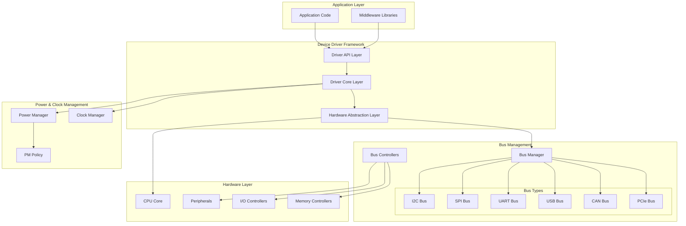
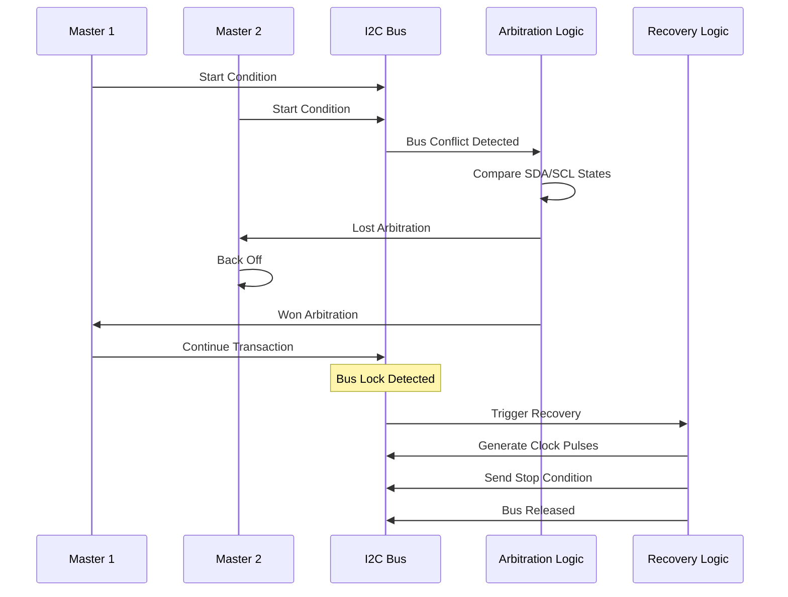

# Advanced Device Driver Development

## Overview

This module covers sophisticated device driver development techniques, advanced hardware abstraction methods, and high-performance driver architectures for complex embedded systems using Zephyr RTOS.

## Advanced Driver Architecture

### Layered Driver Model



### Advanced Driver Framework

```c
// Advanced device driver structure
struct advanced_device_driver {
    struct device_driver base;              // Base driver structure
    
    // Advanced capabilities
    struct {
        bool supports_dma;                  // DMA capability
        bool supports_async;                // Async operations
        bool supports_poll;                 // Polling mode
        bool supports_irq;                  // Interrupt mode
        bool supports_pm;                   // Power management
        bool supports_runtime_config;      // Runtime configuration
    } capabilities;
    
    // Performance characteristics
    struct {
        uint32_t max_transfer_size;         // Maximum transfer size
        uint32_t alignment_requirements;    // Data alignment needs
        uint32_t setup_time_ns;            // Setup time in nanoseconds
        uint32_t hold_time_ns;             // Hold time in nanoseconds
        uint32_t max_frequency_hz;         // Maximum operating frequency
    } performance;
    
    // Advanced operations
    const struct advanced_driver_ops *ops;
    
    // Runtime state
    struct {
        volatile uint32_t state;            // Current driver state
        struct k_mutex state_mutex;         // State synchronization
        struct k_work_q work_queue;         // Dedicated work queue
        struct k_timer watchdog_timer;      // Watchdog timer
        uint64_t error_count;              // Error counter
        uint64_t operation_count;          // Operation counter
    } runtime;
    
    // DMA configuration
    struct {
        struct dma_config tx_config;        // TX DMA configuration
        struct dma_config rx_config;        // RX DMA configuration
        void *tx_buffer;                    // TX DMA buffer
        void *rx_buffer;                    // RX DMA buffer
        size_t buffer_size;                 // Buffer size
        bool coherent_memory;               // Coherent memory flag
    } dma;
    
    // Debugging and diagnostics
    struct {
        struct k_fifo trace_fifo;          // Trace event FIFO
        uint32_t debug_flags;              // Debug configuration
        struct k_timer stats_timer;        // Statistics timer
        void (*error_handler)(const struct device *dev, uint32_t error);
    } debug;
};

// Advanced driver operations
struct advanced_driver_ops {
    // Standard operations
    int (*init)(const struct device *dev);
    int (*configure)(const struct device *dev, const void *config);
    int (*read)(const struct device *dev, void *buf, size_t len);
    int (*write)(const struct device *dev, const void *buf, size_t len);
    int (*ioctl)(const struct device *dev, uint32_t request, void *data);
    
    // Async operations
    int (*read_async)(const struct device *dev, void *buf, size_t len,
                     struct k_poll_signal *signal);
    int (*write_async)(const struct device *dev, const void *buf, size_t len,
                      struct k_poll_signal *signal);
    
    // DMA operations
    int (*setup_dma)(const struct device *dev, struct dma_config *config);
    int (*start_dma)(const struct device *dev, uint32_t channel);
    int (*stop_dma)(const struct device *dev, uint32_t channel);
    
    // Power management
    int (*suspend)(const struct device *dev);
    int (*resume)(const struct device *dev);
    int (*set_power_state)(const struct device *dev, uint32_t power_state);
    
    // Advanced features
    int (*bulk_transfer)(const struct device *dev, 
                        struct transfer_batch *batch);
    int (*stream_configure)(const struct device *dev,
                           struct stream_config *config);
    int (*get_statistics)(const struct device *dev,
                         struct driver_statistics *stats);
    int (*reset)(const struct device *dev);
    int (*self_test)(const struct device *dev);
};
```

## High-Performance SPI Driver

### Advanced SPI Architecture

```c
// Advanced SPI driver with DMA and async support
struct advanced_spi_driver {
    struct advanced_device_driver base;
    
    // SPI-specific configuration
    struct {
        uint32_t base_address;              // Register base address
        uint32_t clock_frequency;           // Input clock frequency
        uint8_t num_chip_selects;          // Number of CS lines
        bool supports_quad_mode;           // Quad SPI support
        bool supports_ddr;                 // Double data rate support
    } hw_config;
    
    // Transfer management
    struct {
        struct k_fifo transfer_queue;       // Transfer request queue
        struct spi_transfer *current_transfer; // Current active transfer
        struct k_sem transfer_complete;     // Transfer completion semaphore
        uint32_t active_transfers;          // Number of active transfers
    } transfer_mgmt;
    
    // Performance optimization
    struct {
        void *tx_dma_buffer;               // Aligned TX buffer
        void *rx_dma_buffer;               // Aligned RX buffer
        size_t dma_buffer_size;            // DMA buffer size
        struct k_mem_pool *buffer_pool;    // Buffer pool
        bool use_polling_threshold;        // Use polling for small transfers
        size_t polling_threshold;          // Polling threshold size
    } optimization;
};

// Advanced SPI transfer descriptor
struct spi_transfer_advanced {
    struct spi_transfer base;               // Base transfer structure
    
    // Advanced transfer options
    struct {
        bool use_dma;                      // Use DMA for transfer
        bool interrupt_driven;             // Interrupt-driven transfer
        bool full_duplex;                  // Full-duplex operation
        uint32_t timeout_ms;               // Transfer timeout
        uint8_t retry_count;               // Retry attempts
    } options;
    
    // Performance tracking
    struct {
        uint64_t start_time;               // Transfer start time
        uint64_t end_time;                 // Transfer end time
        uint32_t actual_speed;             // Actual transfer speed
        uint32_t overhead_cycles;          // Overhead cycles
    } perf;
    
    // Completion handling
    void (*completion_callback)(struct spi_transfer_advanced *transfer, 
                               int result);
    void *callback_data;                   // Callback user data
    struct k_poll_signal *signal;         // Completion signal
};

// High-performance SPI transfer implementation
int spi_transfer_advanced(const struct device *dev,
                         const struct spi_config *config,
                         struct spi_transfer_advanced *transfer)
{
    struct advanced_spi_driver *driver = dev->data;
    int ret;
    uint64_t start_time;
    
    // Validate transfer parameters
    ret = validate_spi_transfer(transfer);
    if (ret != 0) {
        return ret;
    }
    
    // Record start time for performance measurement
    start_time = k_cycle_get_64();
    transfer->perf.start_time = start_time;
    
    // Optimize transfer method based on size and capabilities
    if (transfer->options.use_dma && 
        transfer->base.len >= driver->optimization.polling_threshold) {
        ret = spi_transfer_dma(dev, config, transfer);
    } else if (transfer->options.interrupt_driven) {
        ret = spi_transfer_interrupt(dev, config, transfer);
    } else {
        ret = spi_transfer_polling(dev, config, transfer);
    }
    
    // Record completion time
    transfer->perf.end_time = k_cycle_get_64();
    
    // Calculate performance metrics
    calculate_transfer_performance(transfer);
    
    // Update driver statistics
    update_spi_statistics(driver, transfer, ret);
    
    return ret;
}

// DMA-based SPI transfer
static int spi_transfer_dma(const struct device *dev,
                           const struct spi_config *config,
                           struct spi_transfer_advanced *transfer)
{
    struct advanced_spi_driver *driver = dev->data;
    struct dma_config tx_config, rx_config;
    int ret;
    
    // Configure TX DMA channel
    if (transfer->base.tx_buf) {
        tx_config.channel_direction = MEMORY_TO_PERIPHERAL;
        tx_config.source_address = (uint32_t)transfer->base.tx_buf;
        tx_config.dest_address = driver->hw_config.base_address + SPI_TX_REG;
        tx_config.block_size = transfer->base.len;
        tx_config.source_data_size = 1;  // 8-bit transfers
        tx_config.dest_data_size = 1;
        
        ret = dma_config(driver->dma.tx_channel, &tx_config);
        if (ret != 0) {
            return ret;
        }
    }
    
    // Configure RX DMA channel
    if (transfer->base.rx_buf) {
        rx_config.channel_direction = PERIPHERAL_TO_MEMORY;
        rx_config.source_address = driver->hw_config.base_address + SPI_RX_REG;
        rx_config.dest_address = (uint32_t)transfer->base.rx_buf;
        rx_config.block_size = transfer->base.len;
        rx_config.source_data_size = 1;
        rx_config.dest_data_size = 1;
        
        ret = dma_config(driver->dma.rx_channel, &rx_config);
        if (ret != 0) {
            return ret;
        }
    }
    
    // Start DMA transfer
    ret = start_spi_dma_transfer(driver, transfer);
    if (ret != 0) {
        return ret;
    }
    
    // Wait for completion or timeout
    ret = k_sem_take(&driver->transfer_mgmt.transfer_complete,
                    K_MSEC(transfer->options.timeout_ms));
    
    if (ret == -EAGAIN) {
        // Timeout occurred - abort transfer
        abort_spi_dma_transfer(driver);
        return -ETIMEDOUT;
    }
    
    return ret;
}

// Interrupt-driven SPI transfer
static int spi_transfer_interrupt(const struct device *dev,
                                 const struct spi_config *config,
                                 struct spi_transfer_advanced *transfer)
{
    struct advanced_spi_driver *driver = dev->data;
    uint32_t spi_base = driver->hw_config.base_address;
    
    // Configure SPI for interrupt mode
    sys_write32(SPI_IE_TXE | SPI_IE_RXF | SPI_IE_ERR, spi_base + SPI_IE_REG);
    
    // Set up transfer state
    driver->transfer_mgmt.current_transfer = &transfer->base;
    
    // Enable SPI and start transfer
    sys_set_bit(spi_base + SPI_CR1_REG, SPI_CR1_SPE);
    
    // Wait for transfer completion
    int ret = k_sem_take(&driver->transfer_mgmt.transfer_complete,
                        K_MSEC(transfer->options.timeout_ms));
    
    // Disable interrupts
    sys_write32(0, spi_base + SPI_IE_REG);
    
    return ret;
}

// SPI interrupt handler
void spi_isr_handler(const struct device *dev)
{
    struct advanced_spi_driver *driver = dev->data;
    uint32_t spi_base = driver->hw_config.base_address;
    uint32_t status = sys_read32(spi_base + SPI_SR_REG);
    struct spi_transfer *transfer = driver->transfer_mgmt.current_transfer;
    
    // Handle transmit buffer empty
    if (status & SPI_SR_TXE) {
        if (transfer->tx_buf && transfer->len > 0) {
            sys_write32(*(uint8_t *)transfer->tx_buf, spi_base + SPI_DR_REG);
            transfer->tx_buf = (uint8_t *)transfer->tx_buf + 1;
            transfer->len--;
        }
    }
    
    // Handle receive buffer full
    if (status & SPI_SR_RXNE) {
        if (transfer->rx_buf) {
            *(uint8_t *)transfer->rx_buf = sys_read32(spi_base + SPI_DR_REG);
            transfer->rx_buf = (uint8_t *)transfer->rx_buf + 1;
        } else {
            // Dummy read to clear flag
            (void)sys_read32(spi_base + SPI_DR_REG);
        }
    }
    
    // Handle errors
    if (status & (SPI_SR_OVR | SPI_SR_MODF | SPI_SR_CRCERR)) {
        handle_spi_error(driver, status);
        k_sem_give(&driver->transfer_mgmt.transfer_complete);
        return;
    }
    
    // Check if transfer is complete
    if (transfer->len == 0 && !(status & SPI_SR_BSY)) {
        k_sem_give(&driver->transfer_mgmt.transfer_complete);
    }
}
```

## Advanced I2C Driver with Multi-Master Support

### I2C Bus Arbitration and Recovery



```c
// Advanced I2C driver with multi-master support
struct advanced_i2c_driver {
    struct advanced_device_driver base;
    
    // I2C hardware configuration
    struct {
        uint32_t base_address;              // Register base address
        uint32_t input_clock_hz;            // Input clock frequency
        bool supports_10bit_addr;          // 10-bit addressing support
        bool supports_general_call;        // General call support
        bool supports_clock_stretching;    // Clock stretching support
        uint8_t max_speed_mode;            // Maximum speed mode
    } hw_config;
    
    // Multi-master support
    struct {
        bool multi_master_enabled;         // Multi-master mode enabled
        uint32_t arbitration_lost_count;   // Arbitration lost counter
        uint32_t bus_busy_timeout_ms;      // Bus busy timeout
        struct k_timer recovery_timer;      // Bus recovery timer
        bool recovery_in_progress;         // Recovery state flag
        void (*arbitration_lost_cb)(const struct device *dev);
    } multi_master;
    
    // Bus recovery mechanism
    struct {
        bool recovery_enabled;             // Recovery feature enabled
        uint8_t scl_gpio_pin;              // SCL GPIO pin for recovery
        uint8_t sda_gpio_pin;              // SDA GPIO pin for recovery
        uint32_t recovery_clock_rate;      // Recovery clock rate
        uint8_t recovery_pulse_count;      // Number of recovery pulses
    } recovery;
    
    // Advanced transfer features
    struct {
        struct k_fifo msg_queue;           // Message queue
        struct i2c_msg *current_msg;       // Current message
        uint32_t msg_index;                // Current message index
        uint32_t byte_index;               // Current byte index
        bool restart_pending;              // Restart condition pending
        struct k_work recovery_work;       // Recovery work item
    } transfer;
};

// I2C bus recovery implementation
static int i2c_recover_bus(const struct device *dev)
{
    struct advanced_i2c_driver *driver = dev->data;
    const struct device *gpio_dev;
    int ret;
    uint8_t i;
    
    if (!driver->recovery.recovery_enabled) {
        return -ENOTSUP;
    }
    
    LOG_WRN("I2C bus recovery initiated");
    
    driver->multi_master.recovery_in_progress = true;
    
    // Get GPIO device for bit-banging recovery
    gpio_dev = device_get_binding("GPIO_0");
    if (!gpio_dev) {
        return -ENODEV;
    }
    
    // Configure SCL and SDA as GPIO outputs
    ret = gpio_pin_configure(gpio_dev, driver->recovery.scl_gpio_pin,
                            GPIO_OUTPUT_HIGH);
    if (ret != 0) {
        return ret;
    }
    
    ret = gpio_pin_configure(gpio_dev, driver->recovery.sda_gpio_pin,
                            GPIO_INPUT);
    if (ret != 0) {
        return ret;
    }
    
    // Generate recovery clock pulses
    for (i = 0; i < driver->recovery.recovery_pulse_count; i++) {
        // Generate clock pulse
        gpio_pin_set(gpio_dev, driver->recovery.scl_gpio_pin, 0);
        k_busy_wait(500000 / driver->recovery.recovery_clock_rate);
        
        gpio_pin_set(gpio_dev, driver->recovery.scl_gpio_pin, 1);
        k_busy_wait(500000 / driver->recovery.recovery_clock_rate);
        
        // Check if SDA is released
        if (gpio_pin_get(gpio_dev, driver->recovery.sda_gpio_pin)) {
            LOG_INF("I2C bus recovered after %d pulses", i + 1);
            break;
        }
    }
    
    // Generate STOP condition
    gpio_pin_configure(gpio_dev, driver->recovery.sda_gpio_pin, GPIO_OUTPUT_LOW);
    k_busy_wait(500000 / driver->recovery.recovery_clock_rate);
    
    gpio_pin_set(gpio_dev, driver->recovery.sda_gpio_pin, 1);
    k_busy_wait(500000 / driver->recovery.recovery_clock_rate);
    
    // Restore I2C function
    restore_i2c_function(dev);
    
    driver->multi_master.recovery_in_progress = false;
    
    LOG_INF("I2C bus recovery completed");
    return 0;
}

// Advanced I2C transfer with arbitration handling
int i2c_transfer_advanced(const struct device *dev,
                         struct i2c_msg *msgs, uint8_t num_msgs,
                         uint16_t addr)
{
    struct advanced_i2c_driver *driver = dev->data;
    uint32_t i2c_base = driver->hw_config.base_address;
    int ret = 0;
    
    // Check if bus is busy
    if (is_bus_busy(dev)) {
        if (driver->multi_master.multi_master_enabled) {
            // Wait for bus to become free with timeout
            ret = wait_for_bus_free(dev, 
                                   driver->multi_master.bus_busy_timeout_ms);
            if (ret != 0) {
                return ret;
            }
        } else {
            return -EBUSY;
        }
    }
    
    // Process all messages
    for (uint8_t i = 0; i < num_msgs; i++) {
        struct i2c_msg *msg = &msgs[i];
        bool restart = (i > 0) && !(msg->flags & I2C_MSG_STOP);
        
        ret = process_i2c_message(dev, msg, addr, restart);
        
        if (ret == -EAGAIN && driver->multi_master.multi_master_enabled) {
            // Arbitration lost - retry after random delay
            k_sleep(K_USEC(k_cycle_get_32() % 1000));
            driver->multi_master.arbitration_lost_count++;
            
            // Call arbitration lost callback if registered
            if (driver->multi_master.arbitration_lost_cb) {
                driver->multi_master.arbitration_lost_cb(dev);
            }
            
            // Retry the entire transfer
            i = 0;
            continue;
        } else if (ret != 0) {
            break;
        }
    }
    
    // Generate STOP condition if required
    if (ret == 0 && !(msgs[num_msgs - 1].flags & I2C_MSG_RESTART)) {
        generate_stop_condition(dev);
    }
    
    return ret;
}

// I2C interrupt handler with arbitration detection
void i2c_isr_handler(const struct device *dev)
{
    struct advanced_i2c_driver *driver = dev->data;
    uint32_t i2c_base = driver->hw_config.base_address;
    uint32_t status = sys_read32(i2c_base + I2C_SR1_REG);
    
    // Handle arbitration lost
    if (status & I2C_SR1_ARLO) {
        LOG_DBG("I2C arbitration lost");
        
        // Clear arbitration lost flag
        sys_write32(status & ~I2C_SR1_ARLO, i2c_base + I2C_SR1_REG);
        
        // Signal transfer completion with error
        driver->transfer.result = -EAGAIN;
        k_sem_give(&driver->transfer.completion_sem);
        return;
    }
    
    // Handle bus error
    if (status & I2C_SR1_BERR) {
        LOG_ERR("I2C bus error detected");
        
        // Initiate bus recovery if enabled
        if (driver->recovery.recovery_enabled) {
            k_work_submit(&driver->transfer.recovery_work);
        }
        
        driver->transfer.result = -EIO;
        k_sem_give(&driver->transfer.completion_sem);
        return;
    }
    
    // Handle normal transfer events
    handle_i2c_transfer_events(dev, status);
}
```

## Advanced UART Driver with Flow Control

### Hardware Flow Control Implementation

```c
// Advanced UART driver with comprehensive flow control
struct advanced_uart_driver {
    struct advanced_device_driver base;
    
    // UART hardware configuration
    struct {
        uint32_t base_address;              // Register base address
        uint32_t input_clock_hz;            // Input clock frequency
        bool supports_hw_flow_control;      // Hardware flow control support
        bool supports_rs485;               // RS-485 support
        bool supports_lin;                 // LIN protocol support
        uint8_t fifo_depth;                // FIFO depth
    } hw_config;
    
    // Flow control management
    struct {
        bool hw_flow_control_enabled;      // Hardware flow control enabled
        bool sw_flow_control_enabled;      // Software flow control enabled
        uint8_t xon_char;                  // XON character
        uint8_t xoff_char;                 // XOFF character
        bool tx_flow_stopped;              // TX flow stopped flag
        bool rx_flow_stopped;              // RX flow stopped flag
        uint32_t high_watermark;           // RX buffer high watermark
        uint32_t low_watermark;            // RX buffer low watermark
    } flow_control;
    
    // Buffer management
    struct {
        struct ring_buffer tx_ring_buf;    // TX ring buffer
        struct ring_buffer rx_ring_buf;    // RX ring buffer
        uint8_t *tx_buffer;                // TX buffer memory
        uint8_t *rx_buffer;                // RX buffer memory
        size_t tx_buffer_size;             // TX buffer size
        size_t rx_buffer_size;             // RX buffer size
        struct k_sem tx_sem;               // TX semaphore
        struct k_sem rx_sem;               // RX semaphore
    } buffers;
    
    // Advanced features
    struct {
        bool break_detection_enabled;      // Break detection
        bool idle_line_detection_enabled;  // Idle line detection
        uint32_t break_length_ms;          // Break signal length
        uint32_t idle_timeout_ms;          // Idle timeout
        struct k_timer idle_timer;         // Idle detection timer
        void (*break_callback)(const struct device *dev);
        void (*idle_callback)(const struct device *dev);
    } advanced;
};

// Hardware flow control configuration
static int configure_hw_flow_control(const struct device *dev, bool enable)
{
    struct advanced_uart_driver *driver = dev->data;
    uint32_t uart_base = driver->hw_config.base_address;
    uint32_t cr3_reg;
    
    if (!driver->hw_config.supports_hw_flow_control) {
        return -ENOTSUP;
    }
    
    cr3_reg = sys_read32(uart_base + UART_CR3_REG);
    
    if (enable) {
        // Enable RTS and CTS
        cr3_reg |= UART_CR3_RTSE | UART_CR3_CTSE;
        driver->flow_control.hw_flow_control_enabled = true;
        
        LOG_DBG("UART hardware flow control enabled");
    } else {
        // Disable RTS and CTS
        cr3_reg &= ~(UART_CR3_RTSE | UART_CR3_CTSE);
        driver->flow_control.hw_flow_control_enabled = false;
        
        LOG_DBG("UART hardware flow control disabled");
    }
    
    sys_write32(cr3_reg, uart_base + UART_CR3_REG);
    
    return 0;
}

// Software flow control implementation
static void handle_software_flow_control(const struct device *dev, uint8_t byte)
{
    struct advanced_uart_driver *driver = dev->data;
    
    if (!driver->flow_control.sw_flow_control_enabled) {
        return;
    }
    
    if (byte == driver->flow_control.xoff_char) {
        // Received XOFF - stop transmission
        driver->flow_control.tx_flow_stopped = true;
        LOG_DBG("UART TX flow stopped (XOFF received)");
    } else if (byte == driver->flow_control.xon_char) {
        // Received XON - resume transmission
        driver->flow_control.tx_flow_stopped = false;
        LOG_DBG("UART TX flow resumed (XON received)");
        
        // Trigger TX if data is waiting
        k_sem_give(&driver->buffers.tx_sem);
    }
}

// Advanced UART transmit with flow control
int uart_tx_advanced(const struct device *dev, const uint8_t *data, 
                    size_t len, int32_t timeout)
{
    struct advanced_uart_driver *driver = dev->data;
    size_t bytes_written = 0;
    int ret;
    
    while (bytes_written < len) {
        // Check if transmission is flow-controlled
        if (driver->flow_control.tx_flow_stopped) {
            // Wait for flow control to be released
            ret = k_sem_take(&driver->buffers.tx_sem, K_MSEC(timeout));
            if (ret != 0) {
                return ret;  // Timeout
            }
        }
        
        // Try to write to TX ring buffer
        size_t space_available = ring_buf_space_get(&driver->buffers.tx_ring_buf);
        size_t bytes_to_write = MIN(len - bytes_written, space_available);
        
        if (bytes_to_write > 0) {
            uint32_t written = ring_buf_put(&driver->buffers.tx_ring_buf,
                                          &data[bytes_written], bytes_to_write);
            bytes_written += written;
            
            // Enable TX interrupt to start transmission
            enable_uart_tx_interrupt(dev);
        } else {
            // TX buffer full - wait for space
            ret = k_sem_take(&driver->buffers.tx_sem, K_MSEC(timeout));
            if (ret != 0) {
                break;  // Timeout
            }
        }
    }
    
    return bytes_written;
}

// UART interrupt handler with flow control
void uart_isr_handler(const struct device *dev)
{
    struct advanced_uart_driver *driver = dev->data;
    uint32_t uart_base = driver->hw_config.base_address;
    uint32_t status = sys_read32(uart_base + UART_SR_REG);
    
    // Handle RX data available
    if (status & UART_SR_RXNE) {
        uint8_t byte = sys_read32(uart_base + UART_DR_REG) & 0xFF;
        
        // Check for software flow control characters
        handle_software_flow_control(dev, byte);
        
        // Add to RX ring buffer if not a flow control character
        if (byte != driver->flow_control.xon_char && 
            byte != driver->flow_control.xoff_char) {
            
            if (ring_buf_put(&driver->buffers.rx_ring_buf, &byte, 1) == 0) {
                // RX buffer overflow
                LOG_WRN("UART RX buffer overflow");
            } else {
                k_sem_give(&driver->buffers.rx_sem);
            }
            
            // Check if we need to send XOFF
            check_rx_flow_control_threshold(dev);
        }
    }
    
    // Handle TX buffer empty
    if (status & UART_SR_TXE) {
        uint8_t byte;
        
        if (!driver->flow_control.tx_flow_stopped &&
            ring_buf_get(&driver->buffers.tx_ring_buf, &byte, 1) == 1) {
            // Send next byte
            sys_write32(byte, uart_base + UART_DR_REG);
            k_sem_give(&driver->buffers.tx_sem);
        } else {
            // No more data to send - disable TX interrupt
            disable_uart_tx_interrupt(dev);
        }
    }
    
    // Handle break detection
    if (status & UART_SR_LBD) {
        // Clear break detection flag
        sys_write32(status & ~UART_SR_LBD, uart_base + UART_SR_REG);
        
        if (driver->advanced.break_callback) {
            driver->advanced.break_callback(dev);
        }
    }
    
    // Handle idle line detection
    if (status & UART_SR_IDLE) {
        // Clear idle flag by reading status and data registers
        (void)sys_read32(uart_base + UART_SR_REG);
        (void)sys_read32(uart_base + UART_DR_REG);
        
        if (driver->advanced.idle_callback) {
            driver->advanced.idle_callback(dev);
        }
    }
}

// RX flow control threshold management
static void check_rx_flow_control_threshold(const struct device *dev)
{
    struct advanced_uart_driver *driver = dev->data;
    size_t bytes_used = ring_buf_size_get(&driver->buffers.rx_ring_buf) -
                       ring_buf_space_get(&driver->buffers.rx_ring_buf);
    
    // Check if we need to assert flow control
    if (!driver->flow_control.rx_flow_stopped && 
        bytes_used >= driver->flow_control.high_watermark) {
        
        driver->flow_control.rx_flow_stopped = true;
        
        if (driver->flow_control.hw_flow_control_enabled) {
            // Assert RTS to stop sender
            assert_rts_line(dev);
        } else if (driver->flow_control.sw_flow_control_enabled) {
            // Send XOFF character
            send_flow_control_char(dev, driver->flow_control.xoff_char);
        }
        
        LOG_DBG("UART RX flow control asserted");
    }
    // Check if we can release flow control
    else if (driver->flow_control.rx_flow_stopped && 
             bytes_used <= driver->flow_control.low_watermark) {
        
        driver->flow_control.rx_flow_stopped = false;
        
        if (driver->flow_control.hw_flow_control_enabled) {
            // Deassert RTS to allow sender
            deassert_rts_line(dev);
        } else if (driver->flow_control.sw_flow_control_enabled) {
            // Send XON character
            send_flow_control_char(dev, driver->flow_control.xon_char);
        }
        
        LOG_DBG("UART RX flow control released");
    }
}
```

## Driver Performance Optimization

### Performance Metrics and Monitoring

| Metric | Description | Target Value | Monitoring Method |
|--------|-------------|---------------|------------------|
| Throughput | Data transfer rate | > 90% of theoretical max | Continuous measurement |
| Latency | Response time | < 100μs for critical ops | Per-operation timing |
| CPU Usage | Processor utilization | < 20% for background ops | Periodic sampling |
| Memory Usage | Memory consumption | < 10KB for typical driver | Static analysis |
| Error Rate | Operation failure rate | < 0.1% | Error counting |

```c
// Driver performance monitoring
struct driver_performance_stats {
    // Throughput metrics
    uint64_t bytes_transferred;         // Total bytes transferred
    uint64_t operations_completed;      // Total operations completed
    uint32_t current_throughput_bps;    // Current throughput (bytes/sec)
    uint32_t peak_throughput_bps;       // Peak throughput
    
    // Latency metrics
    uint32_t min_latency_us;           // Minimum latency (microseconds)
    uint32_t max_latency_us;           // Maximum latency
    uint32_t avg_latency_us;           // Average latency
    uint32_t latency_samples;          // Number of latency samples
    
    // Resource usage
    uint32_t cpu_usage_percent;        // CPU usage percentage
    uint32_t memory_usage_bytes;       // Memory usage in bytes
    uint32_t interrupt_count;          // Interrupt count
    uint32_t context_switches;         // Context switch count
    
    // Error statistics
    uint32_t total_errors;             // Total error count
    uint32_t timeout_errors;           // Timeout errors
    uint32_t hardware_errors;          // Hardware errors
    uint32_t protocol_errors;          // Protocol errors
    
    // Performance counters
    uint64_t cache_hits;               // Cache hit count
    uint64_t cache_misses;             // Cache miss count
    uint32_t dma_transfers;            // DMA transfer count
    uint32_t polled_transfers;         // Polled transfer count
};

// Performance monitoring interface
void monitor_driver_performance(const struct device *dev,
                               struct driver_performance_stats *stats)
{
    struct advanced_device_driver *driver = dev->data;
    uint64_t current_time = k_cycle_get_64();
    static uint64_t last_measurement_time = 0;
    uint64_t time_delta;
    
    if (last_measurement_time == 0) {
        last_measurement_time = current_time;
        return;
    }
    
    time_delta = current_time - last_measurement_time;
    
    // Calculate throughput
    uint64_t bytes_delta = driver->runtime.operation_count - 
                          stats->operations_completed;
    stats->current_throughput_bps = 
        (bytes_delta * CONFIG_SYS_CLOCK_HW_CYCLES_PER_SEC) / time_delta;
    
    if (stats->current_throughput_bps > stats->peak_throughput_bps) {
        stats->peak_throughput_bps = stats->current_throughput_bps;
    }
    
    // Update operation counts
    stats->operations_completed = driver->runtime.operation_count;
    stats->total_errors = driver->runtime.error_count;
    
    // Calculate CPU usage (simplified)
    stats->cpu_usage_percent = calculate_cpu_usage(dev);
    
    last_measurement_time = current_time;
}

// Driver optimization recommendations
void analyze_driver_performance(const struct driver_performance_stats *stats)
{
    LOG_INF("=== Driver Performance Analysis ===");
    
    // Throughput analysis
    LOG_INF("Throughput: %d bps (peak: %d bps)", 
           stats->current_throughput_bps, stats->peak_throughput_bps);
    
    if (stats->current_throughput_bps < (stats->peak_throughput_bps * 0.7)) {
        LOG_WRN("Throughput degradation detected - consider optimization");
    }
    
    // Latency analysis
    LOG_INF("Latency: min=%dus, max=%dus, avg=%dus", 
           stats->min_latency_us, stats->max_latency_us, stats->avg_latency_us);
    
    if (stats->max_latency_us > (stats->avg_latency_us * 10)) {
        LOG_WRN("High latency spikes detected - check interrupt handling");
    }
    
    // Error rate analysis
    double error_rate = (double)stats->total_errors / stats->operations_completed;
    LOG_INF("Error rate: %.4f%% (%d/%d)", 
           error_rate * 100.0, stats->total_errors, stats->operations_completed);
    
    if (error_rate > 0.001) {  // 0.1%
        LOG_WRN("High error rate detected - investigate error causes");
    }
    
    // Cache efficiency
    uint64_t total_accesses = stats->cache_hits + stats->cache_misses;
    if (total_accesses > 0) {
        double hit_rate = (double)stats->cache_hits / total_accesses;
        LOG_INF("Cache hit rate: %.2f%%", hit_rate * 100.0);
        
        if (hit_rate < 0.9) {
            LOG_WRN("Low cache hit rate - consider data structure optimization");
        }
    }
}
```

## Next Steps

This advanced driver development module provides comprehensive techniques for creating high-performance, robust device drivers. Continue with:

- [Advanced Networking and Connectivity](05_advanced_networking.md)
- [Advanced Power Management](06_advanced_power.md)