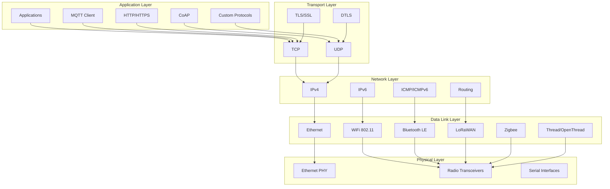
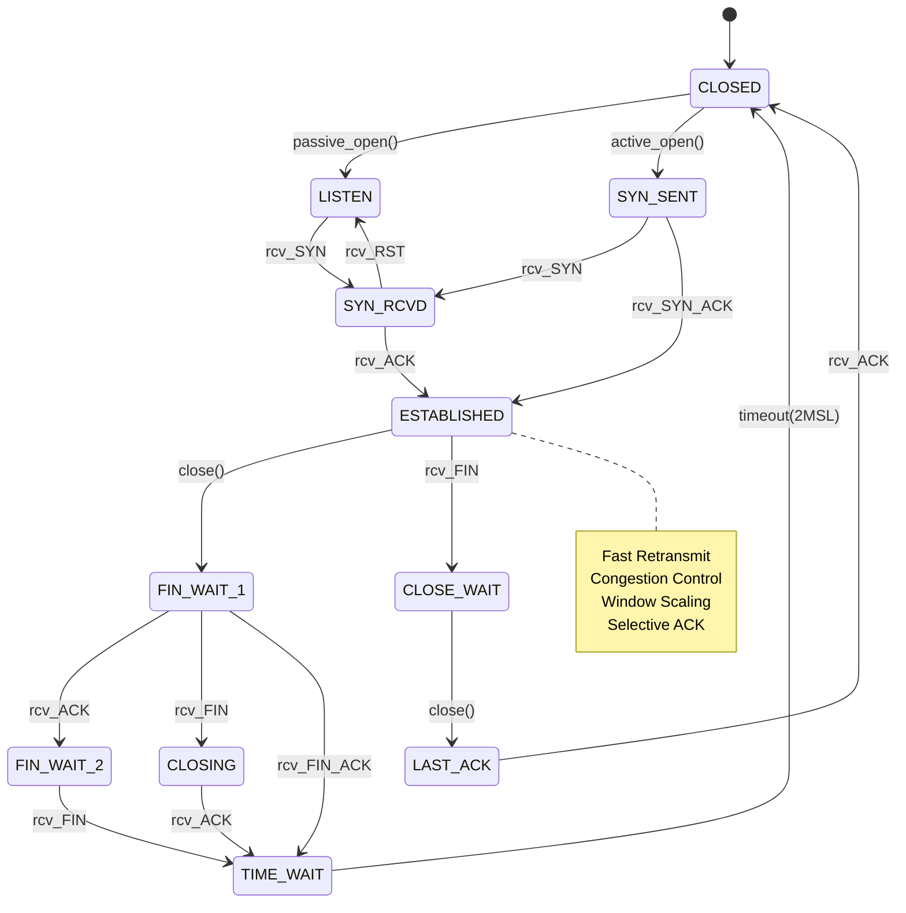
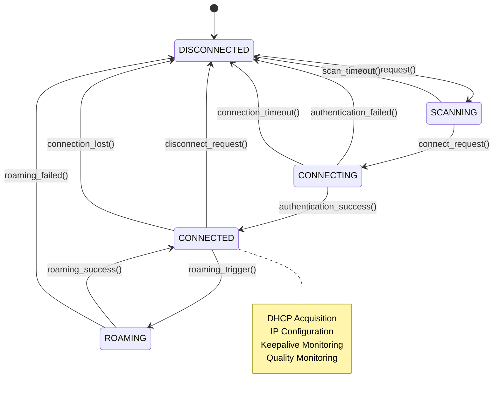

# Advanced Networking and Connectivity

## Overview

This module explores sophisticated networking protocols, advanced connectivity solutions, and high-performance network stack implementations in Zephyr RTOS for IoT and embedded systems.

## Advanced Network Stack Architecture

### Layered Network Architecture



### Advanced Network Configuration

```c
// Advanced network stack configuration
struct advanced_net_config {
    // IP configuration
    struct {
        bool ipv4_enabled;                  // IPv4 support
        bool ipv6_enabled;                  // IPv6 support  
        bool dhcp_enabled;                  // DHCP client
        bool static_ip_enabled;             // Static IP configuration
        struct in_addr ipv4_addr;           // IPv4 address
        struct in_addr ipv4_netmask;        // IPv4 netmask
        struct in_addr ipv4_gateway;        // IPv4 gateway
        struct in6_addr ipv6_addr;          // IPv6 address
        uint8_t ipv6_prefix_len;            // IPv6 prefix length
    } ip_config;
    
    // Transport layer settings
    struct {
        uint16_t tcp_mss;                   // TCP Maximum Segment Size
        uint16_t tcp_window_size;           // TCP window size
        uint32_t tcp_keepalive_time;        // TCP keepalive time
        uint16_t udp_buffer_size;           // UDP buffer size
        bool tcp_nodelay;                   // TCP_NODELAY option
        bool tcp_quickack;                  // TCP_QUICKACK option
    } transport_config;
    
    // Buffer management
    struct {
        uint16_t net_buf_pool_size;         // Network buffer pool size
        uint16_t net_buf_data_size;         // Network buffer data size
        uint16_t net_buf_user_data_size;    // User data size per buffer
        uint32_t net_buf_timeout_ms;        // Buffer allocation timeout
        bool zero_copy_enabled;             // Zero-copy networking
    } buffer_config;
    
    // Quality of Service
    struct {
        bool qos_enabled;                   // QoS support
        uint8_t default_dscp;               // Default DSCP marking
        uint8_t max_priority_levels;        // Maximum priority levels
        uint32_t bandwidth_limit_bps;       // Bandwidth limit
        bool traffic_shaping_enabled;       // Traffic shaping
    } qos_config;
    
    // Security settings
    struct {
        bool tls_enabled;                   // TLS/SSL support
        bool dtls_enabled;                  // DTLS support
        const char *ca_cert_path;           // CA certificate path
        const char *client_cert_path;       // Client certificate path
        const char *private_key_path;       // Private key path
        uint16_t tls_cipher_suites;         // Supported cipher suites
        bool certificate_verification;      // Certificate verification
    } security_config;
};

// Network interface management
struct advanced_net_interface {
    struct net_if *iface;                   // Base network interface
    
    // Interface capabilities
    struct {
        uint32_t max_speed_bps;             // Maximum speed
        bool full_duplex;                   // Full-duplex capability
        bool auto_negotiation;              // Auto-negotiation support
        bool wake_on_lan;                   // Wake-on-LAN support
        bool checksum_offload;              // Hardware checksum offload
        bool scatter_gather;                // Scatter-gather DMA
    } capabilities;
    
    // Performance monitoring
    struct {
        uint64_t rx_packets;                // Received packets
        uint64_t tx_packets;                // Transmitted packets
        uint64_t rx_bytes;                  // Received bytes
        uint64_t tx_bytes;                  // Transmitted bytes
        uint32_t rx_errors;                 // Receive errors
        uint32_t tx_errors;                 // Transmit errors
        uint32_t rx_dropped;                // Dropped RX packets
        uint32_t tx_dropped;                // Dropped TX packets
        uint32_t collisions;                // Collision count
    } stats;
    
    // Quality of Service
    struct {
        uint8_t tx_queues;                  // Number of TX queues
        uint8_t rx_queues;                  // Number of RX queues
        struct net_pkt_priority_queue tx_queue[NET_TX_QUEUE_COUNT];
        struct k_work_q net_work_queue;     // Network work queue
    } qos;
};
```

## High-Performance TCP/IP Implementation

### TCP State Machine with Advanced Features



### Advanced TCP Implementation

```c
// Advanced TCP connection structure
struct advanced_tcp_conn {
    struct net_conn base;                   // Base connection structure
    
    // Connection state
    enum tcp_state state;                   // Current TCP state
    uint32_t local_seq;                     // Local sequence number
    uint32_t remote_seq;                    // Remote sequence number
    uint32_t local_ack;                     // Local acknowledgment
    uint32_t remote_ack;                    // Remote acknowledgment
    
    // Window management
    struct {
        uint32_t send_window;               // Send window size
        uint32_t recv_window;               // Receive window size
        uint32_t max_window;                // Maximum window size
        bool window_scaling;                // Window scaling enabled
        uint8_t window_scale_factor;        // Window scale factor
        uint32_t effective_mss;             // Effective MSS
    } window;
    
    // Congestion control
    struct {
        enum tcp_congestion_alg algorithm;  // Congestion algorithm
        uint32_t cwnd;                      // Congestion window
        uint32_t ssthresh;                  // Slow start threshold
        uint32_t cwnd_clamp;                // Congestion window clamp
        uint32_t snd_cwnd_cnt;              // Congestion window counter
        bool fast_recovery;                 // Fast recovery state
        uint32_t duplicate_acks;            // Duplicate ACK count
        uint64_t bytes_acked;               // Bytes acknowledged
    } congestion;
    
    // Retransmission
    struct {
        struct k_timer rto_timer;           // Retransmission timeout timer
        uint32_t rto;                       // Retransmission timeout
        uint32_t srtt;                      // Smoothed RTT
        uint32_t rttvar;                    // RTT variation
        uint8_t retrans_count;              // Retransmission count
        struct net_pkt *retrans_queue;      // Retransmission queue
        bool fast_retransmit;               // Fast retransmit enabled
    } retrans;
    
    // Selective acknowledgment
    struct {
        bool sack_enabled;                  // SACK enabled
        struct tcp_sack_block sack_blocks[TCP_MAX_SACK_BLOCKS];
        uint8_t num_sack_blocks;            // Number of SACK blocks
    } sack;
    
    // Performance optimization
    struct {
        bool nagle_disabled;                // Nagle algorithm disabled
        bool cork_enabled;                  // TCP_CORK enabled
        bool quickack_enabled;              // Quick ACK enabled
        uint32_t user_timeout;              // User timeout
        struct k_work_delayable delayed_ack_work; // Delayed ACK work
    } optimization;
};

// Advanced TCP congestion control algorithms
enum tcp_congestion_alg {
    TCP_CONGESTION_RENO,                    // TCP Reno
    TCP_CONGESTION_CUBIC,                   // CUBIC
    TCP_CONGESTION_BBR,                     // BBR (Bottleneck Bandwidth and RTT)
    TCP_CONGESTION_VEGAS,                   // TCP Vegas
    TCP_CONGESTION_WESTWOOD,               // TCP Westwood
};

// BBR congestion control implementation
struct tcp_bbr_state {
    uint64_t delivered;                     // Total delivered bytes
    uint64_t delivered_mstamp;              // Delivered timestamp
    uint32_t round_start;                   // Round start flag
    uint32_t next_round_delivered;          // Next round delivered
    uint32_t round_count;                   // Round count
    
    // BBR algorithm state
    enum bbr_mode mode;                     // Current BBR mode
    uint32_t bw;                           // Bandwidth estimate
    uint32_t min_rtt_us;                   // Minimum RTT
    uint64_t min_rtt_stamp;                // Min RTT timestamp
    uint32_t probe_rtt_done_stamp;         // ProbeRTT done timestamp
    
    // Pacing rate
    uint64_t pacing_rate;                  // Current pacing rate
    uint32_t pacing_gain;                  // Pacing gain
    uint32_t cwnd_gain;                    // Congestion window gain
    
    // Bandwidth probing
    bool probe_bw_round_done;              // Bandwidth probe round done
    uint8_t probe_bw_cyc_idx;              // Bandwidth probe cycle index
    uint32_t probe_bw_acks;                // Bandwidth probe ACKs
    uint64_t ack_epoch_mstamp;             // ACK epoch timestamp
    uint64_t ack_epoch_acked;              // ACK epoch acknowledged
    
    // RTT probing
    bool probe_rtt_round_done;             // RTT probe round done
    uint32_t probe_rtt_min_delay;          // RTT probe minimum delay
    uint64_t probe_rtt_min_stamp;          // RTT probe minimum timestamp
};

// BBR congestion control implementation
void tcp_bbr_cong_control(struct advanced_tcp_conn *conn, 
                         const struct tcp_ack_info *ack_info)
{
    struct tcp_bbr_state *bbr = conn->congestion.bbr_state;
    
    // Update delivery rate estimator
    tcp_bbr_update_delivery_rate(conn, ack_info);
    
    // Update bandwidth and RTT estimates
    tcp_bbr_update_bw(conn, ack_info);
    tcp_bbr_update_min_rtt(conn, ack_info);
    
    // Update BBR mode
    tcp_bbr_update_mode(conn);
    
    // Set pacing rate and congestion window
    tcp_bbr_set_pacing_rate(conn);
    tcp_bbr_set_cwnd(conn);
    
    // Handle mode-specific logic
    switch (bbr->mode) {
    case BBR_STARTUP:
        tcp_bbr_handle_startup(conn, ack_info);
        break;
        
    case BBR_DRAIN:
        tcp_bbr_handle_drain(conn);
        break;
        
    case BBR_PROBE_BW:
        tcp_bbr_handle_probe_bw(conn, ack_info);
        break;
        
    case BBR_PROBE_RTT:
        tcp_bbr_handle_probe_rtt(conn);
        break;
    }
}

// High-performance packet processing
int tcp_process_packet_advanced(struct net_pkt *pkt)
{
    struct net_ipv4_hdr *ip_hdr;
    struct net_tcp_hdr *tcp_hdr;
    struct advanced_tcp_conn *conn;
    uint32_t seq, ack;
    uint16_t window;
    int ret;
    
    // Get IP and TCP headers
    ip_hdr = NET_IPV4_HDR(pkt);
    tcp_hdr = NET_TCP_HDR(pkt);
    
    // Extract TCP fields
    seq = ntohl(tcp_hdr->seq);
    ack = ntohl(tcp_hdr->ack);
    window = ntohs(tcp_hdr->wnd);
    
    // Find connection
    conn = find_tcp_connection(ip_hdr->src, tcp_hdr->src_port,
                              ip_hdr->dst, tcp_hdr->dst_port);
    if (!conn) {
        return handle_tcp_no_connection(pkt);
    }
    
    // Fast path for established connections
    if (conn->state == TCP_ESTABLISHED &&
        tcp_hdr->flags == TCP_ACK &&
        seq == conn->remote_seq &&
        ack > conn->local_ack &&
        ack <= conn->local_seq) {
        
        return tcp_fast_path_processing(conn, pkt, ack, window);
    }
    
    // Slow path processing
    return tcp_slow_path_processing(conn, pkt);
}

// Fast path TCP processing for optimal performance
static int tcp_fast_path_processing(struct advanced_tcp_conn *conn,
                                   struct net_pkt *pkt,
                                   uint32_t ack, uint16_t window)
{
    uint32_t acked_bytes = ack - conn->local_ack;
    
    // Update connection state
    conn->local_ack = ack;
    conn->window.send_window = window;
    
    // Update congestion control
    struct tcp_ack_info ack_info = {
        .bytes_acked = acked_bytes,
        .rtt_us = calculate_rtt(conn, ack),
        .is_app_limited = is_application_limited(conn),
    };
    
    tcp_bbr_cong_control(conn, &ack_info);
    
    // Remove acknowledged packets from retransmission queue
    tcp_clean_retrans_queue(conn, ack);
    
    // Process any data payload
    if (net_pkt_get_len(pkt) > NET_IPV4H_LEN + NET_TCPH_LEN) {
        return tcp_process_data(conn, pkt);
    }
    
    // Trigger sending if window opened
    if (window > 0 && conn->send_queue) {
        k_work_submit(&conn->send_work);
    }
    
    return 0;
}
```

## Advanced UDP Implementation with Multicast

### UDP Multicast and Broadcast Support

```c
// Advanced UDP socket with multicast support
struct advanced_udp_socket {
    struct net_sock base;                   // Base socket structure
    
    // Multicast configuration
    struct {
        bool multicast_enabled;             // Multicast support enabled
        struct in_addr multicast_addr;      // Multicast group address
        struct net_if *multicast_iface;     // Multicast interface
        uint8_t multicast_ttl;              // Multicast TTL
        bool multicast_loop;                // Multicast loopback
        struct multicast_group *groups;     // Joined multicast groups
        uint8_t num_groups;                 // Number of joined groups
    } multicast;
    
    // Broadcast configuration
    struct {
        bool broadcast_enabled;             // Broadcast support enabled
        struct in_addr broadcast_addr;      // Broadcast address
        bool directed_broadcast;            // Directed broadcast
    } broadcast;
    
    // Advanced features
    struct {
        bool checksum_enabled;              // UDP checksum enabled
        bool zero_checksum_enabled;         // Zero checksum allowed
        uint32_t send_timeout_ms;           // Send timeout
        uint32_t recv_timeout_ms;           // Receive timeout
        size_t max_packet_size;             // Maximum packet size
    } features;
    
    // Quality of Service
    struct {
        uint8_t dscp;                       // DSCP marking
        uint8_t traffic_class;              // Traffic class
        uint32_t flow_label;                // IPv6 flow label
        bool dont_fragment;                 // Don't fragment flag
    } qos;
};

// Multicast group management
struct multicast_group {
    struct in_addr group_addr;              // Group address
    struct net_if *interface;               // Network interface
    uint32_t join_time;                     // Join timestamp
    uint32_t last_activity;                 // Last activity timestamp
    bool source_specific;                   // Source-specific multicast
    struct in_addr source_addr;             // Source address (SSM)
};

// Advanced UDP multicast join
int udp_join_multicast_group(struct advanced_udp_socket *sock,
                            struct in_addr group_addr,
                            struct net_if *iface)
{
    struct multicast_group *group;
    int ret;
    
    // Validate multicast address
    if (!IN_MULTICAST(ntohl(group_addr.s_addr))) {
        return -EINVAL;
    }
    
    // Check if already joined
    for (int i = 0; i < sock->multicast.num_groups; i++) {
        group = &sock->multicast.groups[i];
        if (group->group_addr.s_addr == group_addr.s_addr &&
            group->interface == iface) {
            return -EADDRINUSE;  // Already joined
        }
    }
    
    // Check if we have space for another group
    if (sock->multicast.num_groups >= MAX_MULTICAST_GROUPS) {
        return -ENOMEM;
    }
    
    // Add group to socket's multicast list
    group = &sock->multicast.groups[sock->multicast.num_groups];
    group->group_addr = group_addr;
    group->interface = iface;
    group->join_time = k_uptime_get_32();
    group->last_activity = group->join_time;
    group->source_specific = false;
    
    // Join multicast group on interface
    ret = net_if_ipv4_maddr_add(iface, &group_addr);
    if (ret < 0) {
        return ret;
    }
    
    sock->multicast.num_groups++;
    
    LOG_DBG("Joined multicast group %s on interface %p",
           net_addr_ntop(AF_INET, &group_addr, addr_str, sizeof(addr_str)),
           iface);
    
    return 0;
}

// Advanced UDP packet transmission with multicast
int udp_sendto_advanced(struct advanced_udp_socket *sock,
                       const void *buf, size_t len,
                       const struct sockaddr *dest_addr)
{
    struct net_pkt *pkt;
    struct sockaddr_in *sin = (struct sockaddr_in *)dest_addr;
    bool is_multicast, is_broadcast;
    int ret;
    
    // Check destination type
    is_multicast = IN_MULTICAST(ntohl(sin->sin_addr.s_addr));
    is_broadcast = (sin->sin_addr.s_addr == INADDR_BROADCAST) ||
                   (sock->broadcast.broadcast_enabled &&
                    sin->sin_addr.s_addr == sock->broadcast.broadcast_addr.s_addr);
    
    // Validate send parameters
    if (len > sock->features.max_packet_size) {
        return -EMSGSIZE;
    }
    
    if (is_multicast && !sock->multicast.multicast_enabled) {
        return -ENETDOWN;
    }
    
    if (is_broadcast && !sock->broadcast.broadcast_enabled) {
        return -EACCES;
    }
    
    // Allocate network packet
    pkt = net_pkt_alloc_with_buffer(sock->multicast.multicast_iface,
                                   len + NET_IPV4H_LEN + NET_UDPH_LEN,
                                   AF_INET, IPPROTO_UDP,
                                   K_MSEC(sock->features.send_timeout_ms));
    if (!pkt) {
        return -ENOMEM;
    }
    
    // Set QoS parameters
    net_pkt_set_priority(pkt, sock->qos.traffic_class);
    if (sock->qos.dscp) {
        net_pkt_set_ip_dscp(pkt, sock->qos.dscp);
    }
    
    // Handle multicast-specific settings
    if (is_multicast) {
        net_pkt_set_ip_ttl(pkt, sock->multicast.multicast_ttl);
        
        // Set multicast interface
        if (sock->multicast.multicast_iface) {
            net_pkt_set_iface(pkt, sock->multicast.multicast_iface);
        }
    }
    
    // Fill packet data
    ret = net_pkt_write(pkt, buf, len);
    if (ret < 0) {
        net_pkt_unref(pkt);
        return ret;
    }
    
    // Set destination address
    ret = net_pkt_set_data(pkt, &net_sin(dest_addr)->sin_addr,
                          sizeof(struct in_addr));
    if (ret < 0) {
        net_pkt_unref(pkt);
        return ret;
    }
    
    // Send packet
    ret = net_send_data(pkt);
    if (ret < 0) {
        net_pkt_unref(pkt);
        return ret;
    }
    
    return len;
}

// UDP multicast packet reception
static void udp_multicast_receive(struct net_pkt *pkt)
{
    struct net_ipv4_hdr *ip_hdr = NET_IPV4_HDR(pkt);
    struct net_udp_hdr *udp_hdr = NET_UDP_HDR(pkt);
    struct advanced_udp_socket *sock;
    struct multicast_group *group;
    
    // Find sockets that have joined this multicast group
    SYS_SLIST_FOR_EACH_CONTAINER(&udp_sockets, sock, node) {
        for (int i = 0; i < sock->multicast.num_groups; i++) {
            group = &sock->multicast.groups[i];
            
            if (group->group_addr.s_addr == ip_hdr->dst.s_addr) {
                // Update activity timestamp
                group->last_activity = k_uptime_get_32();
                
                // Check source-specific multicast
                if (group->source_specific &&
                    group->source_addr.s_addr != ip_hdr->src.s_addr) {
                    continue;
                }
                
                // Deliver packet to socket
                deliver_udp_packet_to_socket(sock, pkt);
                break;
            }
        }
    }
}
```

## Advanced WiFi and Wireless Management

### WiFi Connection Management



### Advanced WiFi Driver

```c
// Advanced WiFi configuration and management
struct advanced_wifi_config {
    // Basic configuration
    char ssid[WIFI_SSID_MAX_LEN];           // Network SSID
    char psk[WIFI_PSK_MAX_LEN];             // Pre-shared key
    enum wifi_security_type security;       // Security type
    uint8_t channel;                        // WiFi channel
    
    // Advanced features
    struct {
        bool power_save_enabled;            // Power save mode
        enum wifi_ps_mode ps_mode;          // Power save mode type
        uint32_t ps_listen_interval;        // Listen interval
        uint32_t ps_wakeup_mode;            // Wakeup mode
    } power_mgmt;
    
    // Quality of Service
    struct {
        bool wmm_enabled;                   // WMM (WiFi Multimedia)
        uint8_t wmm_ac_vo;                  // Voice AC parameters
        uint8_t wmm_ac_vi;                  // Video AC parameters  
        uint8_t wmm_ac_be;                  // Best effort AC parameters
        uint8_t wmm_ac_bk;                  // Background AC parameters
    } qos;
    
    // Roaming configuration
    struct {
        bool roaming_enabled;               // Roaming support
        int8_t rssi_threshold;              // RSSI roaming threshold
        uint32_t roaming_timeout_ms;        // Roaming timeout
        uint8_t max_roaming_attempts;       // Maximum roaming attempts
        bool fast_roaming_enabled;          // Fast roaming (802.11r)
    } roaming;
    
    // Security enhancements
    struct {
        bool wps_enabled;                   // WPS support
        bool enterprise_enabled;            // Enterprise authentication
        char enterprise_identity[64];       // Enterprise identity
        char enterprise_password[64];       // Enterprise password
        const char *ca_cert;                // CA certificate
        bool pmf_enabled;                   // Protected Management Frames
    } security;
};

// WiFi connection state management
struct wifi_connection_state {
    enum wifi_conn_state state;             // Current connection state
    struct k_mutex state_mutex;             // State synchronization
    
    // Connection parameters
    struct {
        char connected_ssid[WIFI_SSID_MAX_LEN]; // Connected SSID
        uint8_t bssid[6];                   // Connected BSSID
        uint8_t channel;                    // Current channel
        int8_t rssi;                        // Current RSSI
        uint8_t tx_power;                   // Current TX power
        uint32_t link_speed_mbps;           // Link speed
    } connection_info;
    
    // Quality monitoring
    struct {
        uint32_t tx_packets;                // Transmitted packets
        uint32_t rx_packets;                // Received packets
        uint32_t tx_bytes;                  // Transmitted bytes
        uint32_t rx_bytes;                  // Received bytes
        uint32_t tx_retries;                // TX retries
        uint32_t tx_failures;               // TX failures
        uint32_t beacon_loss_count;         // Beacon loss events
        int8_t noise_floor;                 // Noise floor
        uint8_t signal_quality;             // Signal quality percentage
    } quality;
    
    // Roaming state
    struct {
        bool roaming_in_progress;           // Roaming active
        char target_ssid[WIFI_SSID_MAX_LEN]; // Target SSID
        uint8_t target_bssid[6];            // Target BSSID
        uint32_t roaming_start_time;        // Roaming start time
        uint8_t roaming_attempts;           // Roaming attempt count
    } roaming;
};

// Advanced WiFi scanning with intelligent selection
int wifi_scan_and_connect_advanced(const struct device *wifi_dev,
                                  struct advanced_wifi_config *config)
{
    struct wifi_scan_result scan_results[MAX_SCAN_RESULTS];
    struct wifi_scan_result *best_ap = NULL;
    int num_results;
    int best_score = -1000;
    int ret;
    
    // Perform active scan
    struct wifi_scan_params scan_params = {
        .ssid = config->ssid,
        .ssid_length = strlen(config->ssid),
        .scan_type = WIFI_SCAN_TYPE_ACTIVE,
        .channel_set = NULL,  // Scan all channels
        .channel_set_length = 0,
    };
    
    ret = wifi_scan(wifi_dev, &scan_params, scan_results, 
                   ARRAY_SIZE(scan_results));
    if (ret < 0) {
        LOG_ERR("WiFi scan failed: %d", ret);
        return ret;
    }
    
    num_results = ret;
    LOG_INF("Found %d WiFi networks", num_results);
    
    // Intelligent AP selection based on multiple criteria
    for (int i = 0; i < num_results; i++) {
        struct wifi_scan_result *ap = &scan_results[i];
        int score = 0;
        
        // Skip if SSID doesn't match
        if (strncmp(ap->ssid, config->ssid, ap->ssid_length) != 0) {
            continue;
        }
        
        // Score based on signal strength (primary factor)
        score += ap->rssi;  // Higher RSSI = better score
        
        // Bonus for preferred security types
        if (ap->security == config->security) {
            score += 10;
        }
        
        // Bonus for less congested channels
        if (is_channel_less_congested(ap->channel)) {
            score += 5;
        }
        
        // Bonus for supported features
        if (ap->wmm_capable && config->qos.wmm_enabled) {
            score += 3;
        }
        
        // Penalty for busy networks (high beacon interval variance)
        if (ap->beacon_interval > 120) {
            score -= 2;
        }
        
        LOG_DBG("AP %s: RSSI=%d, Channel=%d, Score=%d", 
               ap->ssid, ap->rssi, ap->channel, score);
        
        if (score > best_score) {
            best_score = score;
            best_ap = ap;
        }
    }
    
    if (!best_ap) {
        LOG_ERR("No suitable AP found for SSID: %s", config->ssid);
        return -ENOENT;
    }
    
    LOG_INF("Selected AP: %s (RSSI: %d, Channel: %d, Score: %d)",
           best_ap->ssid, best_ap->rssi, best_ap->channel, best_score);
    
    // Connect to selected AP
    struct wifi_connect_req_params connect_params = {
        .ssid = best_ap->ssid,
        .ssid_length = best_ap->ssid_length,
        .psk = config->psk,
        .psk_length = strlen(config->psk),
        .channel = best_ap->channel,
        .security = best_ap->security,
    };
    
    memcpy(connect_params.bssid, best_ap->bssid, 6);
    
    ret = wifi_connect(wifi_dev, &connect_params);
    if (ret != 0) {
        LOG_ERR("WiFi connection failed: %d", ret);
        return ret;
    }
    
    // Wait for connection establishment
    ret = wait_for_wifi_connection(wifi_dev, WIFI_CONNECT_TIMEOUT_MS);
    if (ret != 0) {
        LOG_ERR("WiFi connection timeout");
        return ret;
    }
    
    LOG_INF("Successfully connected to %s", best_ap->ssid);
    return 0;
}

// WiFi quality monitoring and roaming decision
static void wifi_quality_monitor(struct k_work *work)
{
    struct wifi_connection_state *state = 
        CONTAINER_OF(work, struct wifi_connection_state, quality_work.work);
    const struct device *wifi_dev = device_get_binding("WiFi");
    struct wifi_iface_status status;
    int ret;
    
    // Get current WiFi status
    ret = wifi_status(wifi_dev, &status);
    if (ret != 0) {
        LOG_ERR("Failed to get WiFi status: %d", ret);
        return;
    }
    
    k_mutex_lock(&state->state_mutex, K_FOREVER);
    
    // Update connection info
    state->connection_info.rssi = status.rssi;
    state->connection_info.link_speed_mbps = status.link_mode;
    state->quality.signal_quality = calculate_signal_quality(status.rssi);
    
    // Check if roaming is needed
    bool should_roam = false;
    
    if (state->connection_info.rssi < state->roaming.rssi_threshold) {
        LOG_WRN("RSSI below threshold: %d < %d", 
               state->connection_info.rssi, state->roaming.rssi_threshold);
        should_roam = true;
    }
    
    if (state->quality.beacon_loss_count > MAX_BEACON_LOSS_COUNT) {
        LOG_WRN("Excessive beacon loss: %d", state->quality.beacon_loss_count);
        should_roam = true;
    }
    
    if (should_roam && config->roaming.roaming_enabled && 
        !state->roaming.roaming_in_progress) {
        LOG_INF("Initiating roaming due to poor connection quality");
        k_work_submit(&state->roaming_work);
    }
    
    k_mutex_unlock(&state->state_mutex);
    
    // Schedule next quality check
    k_work_reschedule(&state->quality_work, K_SECONDS(WIFI_QUALITY_CHECK_INTERVAL));
}
```

## IoT Protocol Implementation

### Advanced MQTT Client

```c
// Advanced MQTT client with comprehensive features
struct advanced_mqtt_client {
    struct mqtt_client base;                // Base MQTT client
    
    // Connection management
    struct {
        char broker_hostname[64];           // Broker hostname
        uint16_t broker_port;               // Broker port
        bool tls_enabled;                   // TLS encryption
        uint32_t keepalive_interval;        // Keepalive interval
        uint32_t connect_timeout_ms;        // Connection timeout
        uint8_t max_reconnect_attempts;     // Max reconnection attempts
        uint32_t reconnect_delay_ms;        // Reconnect delay
        bool auto_reconnect;                // Auto-reconnection enabled
    } connection;
    
    // Quality of Service
    struct {
        enum mqtt_qos default_qos;          // Default QoS level
        bool retain_messages;               // Retain published messages
        uint16_t max_inflight_messages;     // Max in-flight messages
        uint32_t message_timeout_ms;        // Message timeout
        bool duplicate_detection;           // Duplicate message detection
    } qos;
    
    // Topic management
    struct {
        char *subscribed_topics[MAX_MQTT_TOPICS]; // Subscribed topics
        uint8_t topic_count;                // Number of subscribed topics
        struct k_hash_table topic_callbacks; // Topic callback hash table
        bool wildcard_supported;            // Wildcard subscription support
    } topics;
    
    // Security
    struct {
        char client_id[MQTT_CLIENT_ID_MAX_LEN]; // Client ID
        char username[64];                  // Username
        char password[64];                  // Password
        const char *ca_cert;                // CA certificate
        const char *client_cert;            // Client certificate
        const char *private_key;            // Private key
        bool verify_peer;                   // Verify peer certificate
    } security;
    
    // Statistics and monitoring
    struct {
        uint64_t messages_published;        // Published message count
        uint64_t messages_received;         // Received message count
        uint64_t bytes_transmitted;         // Bytes transmitted
        uint64_t bytes_received;            // Bytes received
        uint32_t connection_count;          // Connection attempt count
        uint32_t disconnection_count;       // Disconnection count
        uint64_t last_activity_time;        // Last activity timestamp
    } stats;
};

// MQTT message with advanced features
struct advanced_mqtt_message {
    struct mqtt_publish_message base;       // Base MQTT message
    
    // Message metadata
    struct {
        uint64_t timestamp;                 // Message timestamp
        uint32_t sequence_number;           // Sequence number
        char correlation_id[16];            // Correlation ID
        uint32_t expiry_interval;           // Message expiry interval
        bool response_requested;            // Response requested flag
    } metadata;
    
    // Delivery tracking
    struct {
        enum mqtt_message_state state;      // Message state
        uint8_t retry_count;                // Retry count
        uint64_t first_attempt_time;        // First delivery attempt time
        uint64_t last_attempt_time;         // Last delivery attempt time
        struct k_work_delayable retry_work; // Retry work item
    } delivery;
    
    // Payload compression
    struct {
        bool compressed;                    // Payload compressed
        enum compression_type compression_type; // Compression algorithm
        size_t original_size;               // Original payload size
        size_t compressed_size;             // Compressed payload size
    } compression;
};

// Advanced MQTT publishing with reliability
int mqtt_publish_advanced(struct advanced_mqtt_client *client,
                         const char *topic,
                         const void *payload, size_t payload_len,
                         enum mqtt_qos qos, bool retain,
                         struct advanced_mqtt_message **msg_out)
{
    struct advanced_mqtt_message *msg;
    struct mqtt_publish_param param;
    int ret;
    
    // Allocate message structure
    msg = k_malloc(sizeof(struct advanced_mqtt_message));
    if (!msg) {
        return -ENOMEM;
    }
    
    // Initialize message
    memset(msg, 0, sizeof(*msg));
    msg->metadata.timestamp = k_uptime_get();
    msg->metadata.sequence_number = generate_sequence_number();
    generate_correlation_id(msg->metadata.correlation_id);
    
    // Compress payload if beneficial
    void *final_payload = (void *)payload;
    size_t final_payload_len = payload_len;
    
    if (payload_len > MQTT_COMPRESSION_THRESHOLD) {
        ret = compress_mqtt_payload(payload, payload_len,
                                   &final_payload, &final_payload_len);
        if (ret == 0) {
            msg->compression.compressed = true;
            msg->compression.compression_type = COMPRESSION_LZ4;
            msg->compression.original_size = payload_len;
            msg->compression.compressed_size = final_payload_len;
            
            LOG_DBG("Compressed MQTT payload: %zu -> %zu bytes",
                   payload_len, final_payload_len);
        }
    }
    
    // Set up publish parameters
    param.message.topic.qos = qos;
    param.message.topic.topic.utf8 = (uint8_t *)topic;
    param.message.topic.topic.size = strlen(topic);
    param.message.payload.data = final_payload;
    param.message.payload.len = final_payload_len;
    param.retain_flag = retain;
    param.dup_flag = 0;
    param.message_id = generate_message_id();
    
    // Publish message
    ret = mqtt_publish(&client->base, &param);
    
    if (ret == 0) {
        // Update statistics
        client->stats.messages_published++;
        client->stats.bytes_transmitted += final_payload_len;
        client->stats.last_activity_time = k_uptime_get();
        
        // Set up delivery tracking for QoS > 0
        if (qos > MQTT_QOS_0_AT_MOST_ONCE) {
            msg->delivery.state = MQTT_MSG_STATE_PUBLISHED;
            msg->delivery.first_attempt_time = k_uptime_get();
            
            // Schedule retry timer
            k_work_init_delayable(&msg->delivery.retry_work, mqtt_retry_handler);
            k_work_reschedule(&msg->delivery.retry_work, 
                             K_MSEC(client->qos.message_timeout_ms));
        }
        
        if (msg_out) {
            *msg_out = msg;
        }
    } else {
        LOG_ERR("MQTT publish failed: %d", ret);
        
        // Clean up compressed payload if allocated
        if (msg->compression.compressed && final_payload != payload) {
            k_free(final_payload);
        }
        k_free(msg);
    }
    
    return ret;
}

// MQTT connection monitoring and auto-reconnection
static void mqtt_connection_monitor(struct k_work *work)
{
    struct advanced_mqtt_client *client = 
        CONTAINER_OF(work, struct advanced_mqtt_client, connection_work.work);
    int ret;
    
    // Check connection status
    if (!mqtt_connected(&client->base)) {
        if (client->connection.auto_reconnect) {
            LOG_INF("MQTT disconnected, attempting reconnection...");
            
            ret = mqtt_connect_advanced(client);
            if (ret != 0) {
                LOG_ERR("MQTT reconnection failed: %d", ret);
                
                // Schedule next reconnection attempt
                k_work_reschedule(&client->connection_work,
                                 K_MSEC(client->connection.reconnect_delay_ms));
            } else {
                LOG_INF("MQTT reconnected successfully");
                
                // Resubscribe to topics
                mqtt_resubscribe_all_topics(client);
            }
        }
    } else {
        // Connection is healthy, send keepalive if needed
        uint64_t current_time = k_uptime_get();
        uint64_t time_since_activity = current_time - client->stats.last_activity_time;
        
        if (time_since_activity > (client->connection.keepalive_interval * 1000 * 0.8)) {
            ret = mqtt_ping(&client->base);
            if (ret != 0) {
                LOG_WRN("MQTT ping failed: %d", ret);
            } else {
                client->stats.last_activity_time = current_time;
            }
        }
    }
    
    // Schedule next monitoring cycle
    k_work_reschedule(&client->connection_work,
                     K_SECONDS(MQTT_MONITOR_INTERVAL));
}
```

## Network Performance Optimization

### Zero-Copy Networking

| Optimization Technique | Performance Gain | Memory Savings | Implementation Complexity |
|----------------------|------------------|----------------|---------------------------|
| Zero-Copy TX | 30-50% | 20-40% | Medium |
| Zero-Copy RX | 40-60% | 30-50% | High |
| Buffer Chaining | 20-30% | 15-25% | Medium |
| DMA Coherent Buffers | 50-80% | N/A | High |

```c
// Zero-copy network buffer management
struct zero_copy_net_buf {
    struct net_buf base;                    // Base network buffer
    
    // Zero-copy specific fields
    struct {
        void *dma_coherent_addr;            // DMA coherent address  
        dma_addr_t dma_handle;              // DMA handle
        bool is_dma_coherent;               // DMA coherent flag
        bool is_zero_copy;                  // Zero-copy enabled
        uint32_t reference_count;           // Reference count
    } zero_copy;
    
    // Performance tracking
    struct {
        uint64_t alloc_time;                // Allocation timestamp
        uint64_t free_time;                 // Free timestamp
        uint32_t copy_avoided_bytes;        // Bytes of copying avoided
    } perf;
};

// Zero-copy buffer allocation
struct zero_copy_net_buf *alloc_zero_copy_buf(size_t size, uint32_t timeout)
{
    struct zero_copy_net_buf *buf;
    void *dma_addr;
    
    // Allocate buffer structure
    buf = k_malloc(sizeof(struct zero_copy_net_buf));
    if (!buf) {
        return NULL;
    }
    
    // Allocate DMA coherent memory
    dma_addr = dma_alloc_coherent(size, &buf->zero_copy.dma_handle);
    if (!dma_addr) {
        k_free(buf);
        return NULL;
    }
    
    // Initialize buffer
    net_buf_init(&buf->base, size, dma_addr);
    buf->zero_copy.dma_coherent_addr = dma_addr;
    buf->zero_copy.is_dma_coherent = true;
    buf->zero_copy.is_zero_copy = true;
    buf->zero_copy.reference_count = 1;
    buf->perf.alloc_time = k_cycle_get_64();
    
    return buf;
}

// Zero-copy buffer transmission
int transmit_zero_copy_buffer(const struct device *net_dev,
                             struct zero_copy_net_buf *buf)
{
    struct net_pkt *pkt;
    int ret;
    
    // Create network packet with zero-copy buffer
    pkt = net_pkt_alloc_from_zero_copy_buf(buf, K_NO_WAIT);
    if (!pkt) {
        return -ENOMEM;
    }
    
    // Set zero-copy flags
    net_pkt_set_zero_copy(pkt, true);
    
    // Configure DMA for transmission
    ret = configure_tx_dma(net_dev, buf->zero_copy.dma_handle, 
                          net_buf_tailroom(&buf->base));
    if (ret != 0) {
        net_pkt_unref(pkt);
        return ret;
    }
    
    // Initiate DMA transfer
    ret = start_tx_dma(net_dev);
    if (ret != 0) {
        net_pkt_unref(pkt);
        return ret;
    }
    
    // Buffer will be freed automatically when DMA completes
    return 0;
}

// Network performance profiling
void profile_network_performance(const struct device *net_dev)
{
    static struct net_perf_stats last_stats;
    struct net_perf_stats current_stats;
    uint64_t time_delta;
    
    // Get current statistics
    get_network_statistics(net_dev, &current_stats);
    
    time_delta = current_stats.timestamp - last_stats.timestamp;
    if (time_delta == 0) {
        return;
    }
    
    // Calculate throughput
    uint64_t tx_bps = ((current_stats.tx_bytes - last_stats.tx_bytes) * 8 * 
                       CONFIG_SYS_CLOCK_HW_CYCLES_PER_SEC) / time_delta;
    uint64_t rx_bps = ((current_stats.rx_bytes - last_stats.rx_bytes) * 8 * 
                       CONFIG_SYS_CLOCK_HW_CYCLES_PER_SEC) / time_delta;
    
    // Calculate packet rates
    uint32_t tx_pps = ((current_stats.tx_packets - last_stats.tx_packets) * 
                       CONFIG_SYS_CLOCK_HW_CYCLES_PER_SEC) / time_delta;
    uint32_t rx_pps = ((current_stats.rx_packets - last_stats.rx_packets) * 
                       CONFIG_SYS_CLOCK_HW_CYCLES_PER_SEC) / time_delta;
    
    LOG_INF("Network Performance:");
    LOG_INF("  TX: %llu bps, %u pps", tx_bps, tx_pps);
    LOG_INF("  RX: %llu bps, %u pps", rx_bps, rx_pps);
    LOG_INF("  Errors: TX=%u, RX=%u", 
           current_stats.tx_errors - last_stats.tx_errors,
           current_stats.rx_errors - last_stats.rx_errors);
    
    // Check for performance issues
    if (tx_bps < (current_stats.max_link_speed * 0.1)) {
        LOG_WRN("Low TX throughput detected");
    }
    
    if ((current_stats.tx_errors - last_stats.tx_errors) > 0) {
        LOG_WRN("TX errors detected, investigating...");
        investigate_tx_errors(net_dev);
    }
    
    last_stats = current_stats;
}
```

## Next Steps

This advanced networking module provides comprehensive coverage of high-performance networking implementations. Complete the advanced course with:

- [Advanced Power Management](06_advanced_power.md)