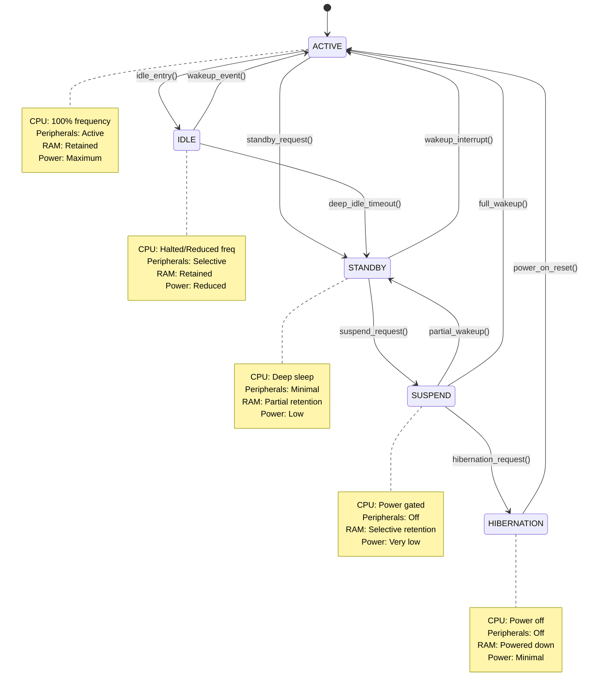

# Advanced Power Management

## Overview

This module explores sophisticated power management techniques, advanced low-power modes, and intelligent power optimization strategies for battery-powered and energy-constrained embedded systems using Zephyr RTOS.

## Advanced Power Management Architecture

### Power Domain Hierarchy

```mermaid
graph TB
    subgraph "System Power Domains"
        subgraph "CPU Power Domain"
            CPU_CORE[CPU Core]
            L1_CACHE[L1 Cache]
            FPU[FPU Unit]
        end
        
        subgraph "Memory Power Domain"
            SRAM[SRAM Banks]
            FLASH[Flash Memory]
            CACHE_L2[L2 Cache]
        end
        
        subgraph "Peripheral Power Domain"
            UART_PWR[UART Controllers]
            SPI_PWR[SPI Controllers]
            I2C_PWR[I2C Controllers]
            GPIO_PWR[GPIO Banks]
            TIMER_PWR[Timer Units]
        end
        
        subgraph "Communication Power Domain"
            WIFI_PWR[WiFi Module]
            BLE_PWR[Bluetooth LE]
            CELLULAR_PWR[Cellular Modem]
            ETHERNET_PWR[Ethernet PHY]
        end
        
        subgraph "Sensor Power Domain"
            ADC_PWR[ADC Converters]
            SENSOR_PWR[External Sensors]
            ANALOG_PWR[Analog Frontend]
        end
    end
    
    subgraph "Power Management Unit"
        PMU[PMU Controller]
        REGULATORS[Voltage Regulators]
        CLOCK_GATES[Clock Gating]
        POWER_GATES[Power Gating]
    end
    
    PMU --> CPU_CORE
    PMU --> SRAM
    PMU --> UART_PWR
    PMU --> WIFI_PWR
    PMU --> ADC_PWR
    
    REGULATORS --> CPU_CORE
    REGULATORS --> SRAM
    REGULATORS --> UART_PWR
    
    CLOCK_GATES --> CPU_CORE
    CLOCK_GATES --> UART_PWR
    CLOCK_GATES --> TIMER_PWR
    
    POWER_GATES --> WIFI_PWR
    POWER_GATES --> CELLULAR_PWR
    POWER_GATES --> SENSOR_PWR
```



### Power State Machine



## Advanced Power Management Framework

### Comprehensive Power Management System

```c
// Advanced power management configuration
struct advanced_pm_config {
    // Power policies
    struct {
        enum pm_policy_type policy_type;    // Power policy algorithm
        uint32_t idle_threshold_ms;         // Idle threshold for sleep
        uint32_t deep_idle_threshold_ms;    // Deep idle threshold
        uint32_t suspend_threshold_ms;      // Suspend threshold
        bool adaptive_policy;               // Adaptive policy enabled
        float aggressiveness_factor;        // Power saving aggressiveness
    } policy;
    
    // Wake sources configuration
    struct {
        uint32_t enabled_sources;           // Enabled wake sources bitmask
        uint32_t gpio_wake_pins;            // GPIO wake pins
        bool rtc_wake_enabled;              // RTC wake enabled
        bool uart_wake_enabled;             // UART wake enabled
        bool timer_wake_enabled;            // Timer wake enabled
        bool external_wake_enabled;         // External wake enabled
    } wake_sources;
    
    // Power domain management
    struct {
        uint8_t num_domains;                // Number of power domains
        struct power_domain *domains;       // Power domain array
        bool domain_isolation;              // Power domain isolation
        uint32_t domain_switch_delay_us;    // Domain switching delay
    } domains;
    
    // Voltage and frequency scaling
    struct {
        bool dvfs_enabled;                  // DVFS enabled
        uint32_t voltage_levels;            // Number of voltage levels
        uint32_t frequency_levels;          // Number of frequency levels
        struct voltage_frequency_point *vf_table; // V-F operating points
        uint32_t transition_latency_us;     // DVFS transition latency
    } dvfs;
    
    // Battery management
    struct {
        bool battery_monitoring;            // Battery monitoring enabled
        uint32_t low_battery_threshold_mv;  // Low battery threshold
        uint32_t critical_battery_threshold_mv; // Critical battery threshold
        uint32_t battery_check_interval_ms; // Battery check interval
        void (*low_battery_callback)(uint32_t voltage_mv);
        void (*critical_battery_callback)(uint32_t voltage_mv);
    } battery;
};

// Power domain definition
struct power_domain {
    const char *name;                       // Domain name
    uint32_t domain_id;                     // Domain identifier
    enum power_domain_state state;          // Current state
    
    // Domain capabilities
    struct {
        bool supports_clock_gating;         // Clock gating support
        bool supports_power_gating;         // Power gating support
        bool supports_voltage_scaling;      // Voltage scaling support
        bool supports_retention;            // Retention mode support
    } capabilities;
    
    // Power control
    struct {
        int (*power_on)(struct power_domain *domain);
        int (*power_off)(struct power_domain *domain);
        int (*set_voltage)(struct power_domain *domain, uint32_t voltage_mv);
        int (*get_voltage)(struct power_domain *domain);
        int (*enable_clock)(struct power_domain *domain);
        int (*disable_clock)(struct power_domain *domain);
    } ops;
    
    // Dependencies
    struct {
        struct power_domain **dependencies; // Dependent domains
        uint8_t num_dependencies;           // Number of dependencies
        struct power_domain **dependents;   // Dependent domains
        uint8_t num_dependents;             // Number of dependents
    } deps;
    
    // Statistics
    struct {
        uint64_t total_on_time_us;          // Total time domain was on
        uint64_t total_off_time_us;         // Total time domain was off
        uint32_t power_on_count;            // Power on event count
        uint32_t power_off_count;           // Power off event count
        uint32_t voltage_changes;           // Voltage change count
    } stats;
};

// Voltage-Frequency operating point
struct voltage_frequency_point {
    uint32_t frequency_hz;                  // Operating frequency
    uint32_t voltage_mv;                    // Operating voltage
    uint32_t power_consumption_mw;          // Estimated power consumption
    uint32_t transition_latency_us;         // Transition latency
    bool stable;                           // Operating point stable
};

// Advanced power manager instance
struct advanced_power_manager {
    struct advanced_pm_config config;      // Configuration
    
    // Current system state
    struct {
        enum pm_state current_state;        // Current power state
        enum pm_state target_state;         // Target power state
        bool transition_in_progress;        // State transition active
        uint64_t state_entry_time;          // State entry timestamp
        uint64_t last_activity_time;        // Last activity timestamp
    } system_state;
    
    // Power policy engine
    struct {
        struct k_work_delayable policy_work; // Policy evaluation work
        uint32_t policy_interval_ms;        // Policy evaluation interval
        float predicted_idle_time_ms;       // Predicted idle time
        struct power_usage_history usage_history[PM_HISTORY_SIZE];
        uint8_t history_index;              // History circular buffer index
    } policy_engine;
    
    // Wake event management
    struct {
        uint32_t pending_wake_events;       // Pending wake events
        uint64_t wake_event_timestamps[32]; // Wake event timestamps
        struct k_work wake_event_work;      // Wake event processing work
        void (*wake_event_handler)(uint32_t wake_source);
    } wake_mgmt;
    
    // Power measurement and monitoring
    struct {
        uint32_t current_consumption_ma;    // Current consumption
        uint32_t voltage_mv;                // System voltage
        uint64_t energy_consumed_mj;        // Total energy consumed (millijoules)
        uint64_t measurement_start_time;    // Measurement start time
        struct k_timer measurement_timer;   // Measurement timer
    } monitoring;
};

// Power policy evaluation
static enum pm_state evaluate_power_policy(struct advanced_power_manager *pm)
{
    uint64_t current_time = k_uptime_get();
    uint64_t idle_time = current_time - pm->system_state.last_activity_time;
    enum pm_state recommended_state = PM_STATE_ACTIVE;
    
    // Simple threshold-based policy
    if (idle_time >= pm->config.policy.suspend_threshold_ms) {
        // Check if suspend is beneficial
        if (estimate_suspend_benefit(pm, idle_time)) {
            recommended_state = PM_STATE_SUSPEND_TO_RAM;
        } else {
            recommended_state = PM_STATE_STANDBY;
        }
    } else if (idle_time >= pm->config.policy.deep_idle_threshold_ms) {
        recommended_state = PM_STATE_STANDBY;
    } else if (idle_time >= pm->config.policy.idle_threshold_ms) {
        recommended_state = PM_STATE_RUNTIME_IDLE;
    }
    
    // Adaptive policy adjustment
    if (pm->config.policy.adaptive_policy) {
        recommended_state = adjust_policy_adaptively(pm, recommended_state);
    }
    
    // Consider battery level
    if (pm->config.battery.battery_monitoring) {
        recommended_state = adjust_policy_for_battery(pm, recommended_state);
    }
    
    return recommended_state;
}

// Adaptive policy adjustment based on usage patterns
static enum pm_state adjust_policy_adaptively(struct advanced_power_manager *pm,
                                             enum pm_state base_state)
{
    struct power_usage_history *history = pm->policy_engine.usage_history;
    uint32_t avg_wake_interval = 0;
    uint32_t wake_variance = 0;
    
    // Calculate average wake interval from history
    for (int i = 0; i < PM_HISTORY_SIZE; i++) {
        avg_wake_interval += history[i].idle_duration_ms;
    }
    avg_wake_interval /= PM_HISTORY_SIZE;
    
    // Calculate variance to determine predictability
    for (int i = 0; i < PM_HISTORY_SIZE; i++) {
        uint32_t diff = abs(history[i].idle_duration_ms - avg_wake_interval);
        wake_variance += diff * diff;
    }
    wake_variance /= PM_HISTORY_SIZE;
    
    // Adjust policy based on predictability
    if (wake_variance < (avg_wake_interval * 0.1)) {
        // Highly predictable - can be more aggressive
        if (base_state == PM_STATE_STANDBY && avg_wake_interval > 5000) {
            return PM_STATE_SUSPEND_TO_RAM;
        }
    } else if (wake_variance > (avg_wake_interval * 0.5)) {
        // Highly unpredictable - be conservative
        if (base_state == PM_STATE_SUSPEND_TO_RAM) {
            return PM_STATE_STANDBY;
        }
    }
    
    return base_state;
}
```

## Dynamic Voltage and Frequency Scaling (DVFS)

### Advanced DVFS Implementation

```c
// DVFS operating point table for STM32F4 series
static const struct voltage_frequency_point stm32f4_vf_table[] = {
    {
        .frequency_hz = 180000000,          // 180 MHz
        .voltage_mv = 1200,                 // 1.2V
        .power_consumption_mw = 150,        // 150 mW estimated
        .transition_latency_us = 200,       // 200μs transition
        .stable = true,
    },
    {
        .frequency_hz = 120000000,          // 120 MHz
        .voltage_mv = 1100,                 // 1.1V
        .power_consumption_mw = 80,         // 80 mW estimated
        .transition_latency_us = 150,       // 150μs transition
        .stable = true,
    },
    {
        .frequency_hz = 60000000,           // 60 MHz
        .voltage_mv = 1000,                 // 1.0V
        .power_consumption_mw = 30,         // 30 mW estimated
        .transition_latency_us = 100,       // 100μs transition
        .stable = true,
    },
    {
        .frequency_hz = 16000000,           // 16 MHz
        .voltage_mv = 900,                  // 0.9V
        .power_consumption_mw = 8,          // 8 mW estimated
        .transition_latency_us = 50,        // 50μs transition
        .stable = true,
    },
};

// DVFS controller structure
struct dvfs_controller {
    const struct voltage_frequency_point *vf_table; // V-F table
    uint8_t num_vf_points;                  // Number of V-F points
    uint8_t current_vf_index;               // Current V-F point index
    uint8_t target_vf_index;                // Target V-F point index
    
    // DVFS policy
    struct {
        enum dvfs_policy_type policy;       // DVFS policy type
        uint32_t utilization_threshold_up;  // Scale up threshold
        uint32_t utilization_threshold_down; // Scale down threshold
        uint32_t evaluation_interval_ms;    // Policy evaluation interval
        bool thermal_throttling;            // Thermal throttling enabled
    } policy;
    
    // Hardware control
    struct {
        const struct device *clock_dev;     // Clock control device
        const struct device *regulator_dev; // Voltage regulator device
        uint32_t pll_config_reg;            // PLL configuration register
        uint32_t voltage_control_reg;       // Voltage control register
    } hw_control;
    
    // Performance monitoring
    struct {
        uint64_t cpu_cycles_used;           // CPU cycles used
        uint64_t cpu_cycles_total;          // Total CPU cycles
        uint32_t current_utilization;       // Current CPU utilization
        uint32_t avg_utilization;           // Average CPU utilization
        struct k_timer utilization_timer;   // Utilization measurement timer
    } performance;
    
    // Transition management
    struct {
        bool transition_in_progress;        // Transition state
        uint64_t transition_start_time;     // Transition start time
        struct k_work transition_work;      // Transition work item
        struct k_sem transition_sem;        // Transition synchronization
    } transition;
};

// CPU utilization-based DVFS policy
static void dvfs_utilization_policy(struct dvfs_controller *dvfs)
{
    uint32_t current_util = dvfs->performance.current_utilization;
    uint8_t current_index = dvfs->current_vf_index;
    uint8_t target_index = current_index;
    
    // Scale up if utilization is high
    if (current_util > dvfs->policy.utilization_threshold_up) {
        if (current_index < (dvfs->num_vf_points - 1)) {
            target_index = current_index + 1;
            LOG_DBG("DVFS: Scaling up due to high utilization (%d%%)", current_util);
        }
    }
    // Scale down if utilization is low
    else if (current_util < dvfs->policy.utilization_threshold_down) {
        if (current_index > 0) {
            target_index = current_index - 1;
            LOG_DBG("DVFS: Scaling down due to low utilization (%d%%)", current_util);
        }
    }
    
    // Initiate frequency transition if needed
    if (target_index != current_index) {
        dvfs_transition_to_vf_point(dvfs, target_index);
    }
}

// DVFS frequency and voltage transition
static int dvfs_transition_to_vf_point(struct dvfs_controller *dvfs, 
                                      uint8_t target_index)
{
    const struct voltage_frequency_point *current_vf = 
        &dvfs->vf_table[dvfs->current_vf_index];
    const struct voltage_frequency_point *target_vf = 
        &dvfs->vf_table[target_index];
    int ret;
    
    if (dvfs->transition.transition_in_progress) {
        return -EBUSY;
    }
    
    dvfs->transition.transition_in_progress = true;
    dvfs->transition.transition_start_time = k_cycle_get_64();
    dvfs->target_vf_index = target_index;
    
    LOG_INF("DVFS transition: %d MHz@%d mV -> %d MHz@%d mV",
           current_vf->frequency_hz / 1000000, current_vf->voltage_mv,
           target_vf->frequency_hz / 1000000, target_vf->voltage_mv);
    
    // Voltage scaling strategy depends on frequency change direction
    if (target_vf->frequency_hz > current_vf->frequency_hz) {
        // Scaling up: increase voltage first, then frequency
        ret = dvfs_set_voltage(dvfs, target_vf->voltage_mv);
        if (ret != 0) {
            goto transition_error;
        }
        
        // Wait for voltage stabilization
        k_busy_wait(target_vf->transition_latency_us / 2);
        
        ret = dvfs_set_frequency(dvfs, target_vf->frequency_hz);
        if (ret != 0) {
            goto transition_error;
        }
    } else {
        // Scaling down: decrease frequency first, then voltage
        ret = dvfs_set_frequency(dvfs, target_vf->frequency_hz);
        if (ret != 0) {
            goto transition_error;
        }
        
        ret = dvfs_set_voltage(dvfs, target_vf->voltage_mv);
        if (ret != 0) {
            goto transition_error;
        }
    }
    
    // Wait for full stabilization
    k_busy_wait(target_vf->transition_latency_us);
    
    // Update current operating point
    dvfs->current_vf_index = target_index;
    dvfs->transition.transition_in_progress = false;
    
    LOG_INF("DVFS transition completed successfully");
    return 0;

transition_error:
    LOG_ERR("DVFS transition failed: %d", ret);
    dvfs->transition.transition_in_progress = false;
    return ret;
}

// Set CPU frequency
static int dvfs_set_frequency(struct dvfs_controller *dvfs, uint32_t frequency_hz)
{
    uint32_t pll_config;
    uint32_t pll_m, pll_n, pll_p;
    
    // Calculate PLL parameters for target frequency
    // This is hardware-specific implementation
    calculate_pll_parameters(frequency_hz, &pll_m, &pll_n, &pll_p);
    
    // Configure PLL registers
    pll_config = (pll_m << PLL_M_SHIFT) | 
                 (pll_n << PLL_N_SHIFT) | 
                 (pll_p << PLL_P_SHIFT);
    
    // Disable PLL before reconfiguration
    sys_clear_bit(RCC_BASE + RCC_CR_REG, RCC_CR_PLLON);
    
    // Wait for PLL to be disabled
    while (sys_read32(RCC_BASE + RCC_CR_REG) & RCC_CR_PLLRDY) {
        k_busy_wait(1);
    }
    
    // Set new PLL configuration
    sys_write32(pll_config, RCC_BASE + RCC_PLLCFGR_REG);
    
    // Enable PLL
    sys_set_bit(RCC_BASE + RCC_CR_REG, RCC_CR_PLLON);
    
    // Wait for PLL to lock
    while (!(sys_read32(RCC_BASE + RCC_CR_REG) & RCC_CR_PLLRDY)) {
        k_busy_wait(1);
    }
    
    // Switch system clock to PLL
    sys_modify_bits32(RCC_BASE + RCC_CFGR_REG, RCC_CFGR_SW_MASK, RCC_CFGR_SW_PLL);
    
    // Wait for clock switch to complete
    while ((sys_read32(RCC_BASE + RCC_CFGR_REG) & RCC_CFGR_SWS_MASK) != RCC_CFGR_SWS_PLL) {
        k_busy_wait(1);
    }
    
    // Update system clock frequency
    sys_clock_hw_cycles_per_sec = frequency_hz;
    
    return 0;
}

// Set system voltage
static int dvfs_set_voltage(struct dvfs_controller *dvfs, uint32_t voltage_mv)
{
    int ret;
    
    if (!dvfs->hw_control.regulator_dev) {
        return -ENODEV;
    }
    
    // Set voltage using regulator API
    ret = regulator_set_voltage(dvfs->hw_control.regulator_dev, 
                               voltage_mv * 1000, voltage_mv * 1000);
    if (ret != 0) {
        LOG_ERR("Failed to set voltage to %d mV: %d", voltage_mv, ret);
        return ret;
    }
    
    return 0;
}
```

## Advanced Sleep Modes and Wake Management

### Intelligent Wake Source Management

```c
// Wake source configuration and management
struct wake_source_manager {
    // Wake source registry
    struct {
        struct wake_source sources[MAX_WAKE_SOURCES]; // Wake source array
        uint8_t num_sources;                // Number of registered sources
        uint32_t enabled_sources_mask;      // Enabled sources bitmask
        uint32_t pending_sources_mask;      // Pending wake events bitmask
    } registry;
    
    // Wake event filtering
    struct {
        bool debouncing_enabled;            // Debouncing enabled
        uint32_t debounce_time_ms;          // Debounce time
        uint32_t min_sleep_time_ms;         // Minimum sleep time
        bool spurious_wake_detection;       // Spurious wake detection
        uint32_t spurious_wake_threshold;   // Spurious wake threshold
    } filtering;
    
    // Wake prediction
    struct {
        bool prediction_enabled;            // Wake prediction enabled
        uint32_t prediction_window_ms;      // Prediction time window
        struct wake_pattern patterns[MAX_WAKE_PATTERNS]; // Wake patterns
        uint8_t num_patterns;               // Number of patterns
        uint64_t next_predicted_wake;       // Next predicted wake time
    } prediction;
    
    // Statistics
    struct {
        uint64_t total_wake_events;         // Total wake events
        uint64_t spurious_wake_events;      // Spurious wake events
        uint64_t total_sleep_time_ms;       // Total sleep time
        uint64_t effective_sleep_time_ms;   // Effective sleep time
        uint32_t wake_latency_avg_us;       // Average wake latency
    } stats;
};

// Individual wake source definition
struct wake_source {
    uint8_t source_id;                      // Wake source ID
    const char *name;                       // Wake source name
    enum wake_source_type type;             // Wake source type
    bool enabled;                           // Wake source enabled
    
    // Configuration
    struct {
        enum wake_edge_type edge_type;      // Edge trigger type
        bool level_sensitive;               // Level sensitive wake
        uint32_t debounce_time_ms;          // Source-specific debounce time
        uint8_t priority;                   // Wake source priority
    } config;
    
    // Hardware configuration
    struct {
        uint32_t gpio_pin;                  // GPIO pin (if applicable)
        uint32_t irq_line;                  // IRQ line
        void (*setup_hw)(struct wake_source *source);
        void (*cleanup_hw)(struct wake_source *source);
    } hw;
    
    // Statistics
    struct {
        uint64_t wake_count;                // Number of wakes from this source
        uint64_t spurious_count;            // Spurious wake count
        uint64_t last_wake_time;            // Last wake timestamp
        uint32_t avg_interval_ms;           // Average wake interval
    } stats;
};

// Wake pattern for prediction
struct wake_pattern {
    uint32_t interval_ms;                   // Wake interval
    uint32_t tolerance_ms;                  // Interval tolerance
    uint8_t confidence;                     // Pattern confidence (0-100)
    uint64_t last_occurrence;               // Last occurrence timestamp
    uint32_t occurrence_count;              // Number of occurrences
};

// Initialize wake source manager
int wake_source_manager_init(struct wake_source_manager *mgr)
{
    memset(mgr, 0, sizeof(*mgr));
    
    // Register common wake sources
    wake_source_register(mgr, WAKE_SOURCE_GPIO, "GPIO", setup_gpio_wake, cleanup_gpio_wake);
    wake_source_register(mgr, WAKE_SOURCE_RTC, "RTC", setup_rtc_wake, cleanup_rtc_wake);
    wake_source_register(mgr, WAKE_SOURCE_UART, "UART", setup_uart_wake, cleanup_uart_wake);
    wake_source_register(mgr, WAKE_SOURCE_TIMER, "Timer", setup_timer_wake, cleanup_timer_wake);
    
    // Enable default filtering
    mgr->filtering.debouncing_enabled = true;
    mgr->filtering.debounce_time_ms = 50;
    mgr->filtering.min_sleep_time_ms = 100;
    mgr->filtering.spurious_wake_detection = true;
    mgr->filtering.spurious_wake_threshold = 3;
    
    return 0;
}

// Register a new wake source
int wake_source_register(struct wake_source_manager *mgr,
                        enum wake_source_type type,
                        const char *name,
                        void (*setup_hw)(struct wake_source *),
                        void (*cleanup_hw)(struct wake_source *))
{
    struct wake_source *source;
    
    if (mgr->registry.num_sources >= MAX_WAKE_SOURCES) {
        return -ENOMEM;
    }
    
    source = &mgr->registry.sources[mgr->registry.num_sources];
    source->source_id = mgr->registry.num_sources;
    source->type = type;
    source->name = name;
    source->enabled = false;
    source->hw.setup_hw = setup_hw;
    source->hw.cleanup_hw = cleanup_hw;
    
    // Set default configuration
    source->config.edge_type = WAKE_EDGE_RISING;
    source->config.level_sensitive = false;
    source->config.debounce_time_ms = mgr->filtering.debounce_time_ms;
    source->config.priority = 5;  // Medium priority
    
    mgr->registry.num_sources++;
    
    LOG_DBG("Registered wake source: %s (ID: %d)", name, source->source_id);
    return source->source_id;
}

// Intelligent sleep entry with wake prediction
int enter_sleep_with_prediction(struct wake_source_manager *mgr,
                               enum pm_state sleep_state,
                               uint32_t max_sleep_time_ms)
{
    uint64_t current_time = k_uptime_get();
    uint64_t predicted_wake_time;
    uint32_t sleep_duration_ms;
    int ret;
    
    // Predict next wake event
    if (mgr->prediction.prediction_enabled) {
        predicted_wake_time = predict_next_wake_event(mgr);
        
        if (predicted_wake_time > current_time) {
            uint32_t predicted_sleep_ms = predicted_wake_time - current_time;
            sleep_duration_ms = MIN(max_sleep_time_ms, predicted_sleep_ms);
            
            LOG_DBG("Predicted wake in %d ms, limiting sleep to %d ms",
                   predicted_sleep_ms, sleep_duration_ms);
        } else {
            sleep_duration_ms = max_sleep_time_ms;
        }
    } else {
        sleep_duration_ms = max_sleep_time_ms;
    }
    
    // Check minimum sleep time
    if (sleep_duration_ms < mgr->filtering.min_sleep_time_ms) {
        LOG_DBG("Sleep duration too short (%d ms), staying active", 
               sleep_duration_ms);
        return -EAGAIN;
    }
    
    // Setup wake sources
    ret = setup_enabled_wake_sources(mgr);
    if (ret != 0) {
        LOG_ERR("Failed to setup wake sources: %d", ret);
        return ret;
    }
    
    // Enter sleep state
    uint64_t sleep_start_time = k_cycle_get_64();
    
    ret = pm_state_set(sleep_state, 0);
    
    uint64_t sleep_end_time = k_cycle_get_64();
    uint32_t actual_sleep_time_ms = 
        k_cyc_to_ms_floor32(sleep_end_time - sleep_start_time);
    
    // Process wake event
    uint32_t wake_source_mask = get_wake_source_status(mgr);
    process_wake_event(mgr, wake_source_mask, actual_sleep_time_ms);
    
    // Update sleep statistics
    mgr->stats.total_sleep_time_ms += actual_sleep_time_ms;
    
    if (actual_sleep_time_ms >= (sleep_duration_ms * 0.9)) {
        mgr->stats.effective_sleep_time_ms += actual_sleep_time_ms;
    } else {
        mgr->stats.spurious_wake_events++;
        LOG_WRN("Spurious wake detected: slept %d ms of %d ms expected",
               actual_sleep_time_ms, sleep_duration_ms);
    }
    
    return 0;
}

// Predict next wake event based on historical patterns
static uint64_t predict_next_wake_event(struct wake_source_manager *mgr)
{
    uint64_t current_time = k_uptime_get();
    uint64_t earliest_predicted_wake = UINT64_MAX;
    
    for (int i = 0; i < mgr->prediction.num_patterns; i++) {
        struct wake_pattern *pattern = &mgr->prediction.patterns[i];
        
        // Skip low-confidence patterns
        if (pattern->confidence < 50) {
            continue;
        }
        
        // Calculate next occurrence based on pattern
        uint64_t time_since_last = current_time - pattern->last_occurrence;
        uint64_t next_occurrence = pattern->last_occurrence + pattern->interval_ms;
        
        // If pattern interval has passed, predict immediate wake
        if (time_since_last >= pattern->interval_ms) {
            return current_time;
        }
        
        earliest_predicted_wake = MIN(earliest_predicted_wake, next_occurrence);
    }
    
    return earliest_predicted_wake;
}

// Process wake event and update patterns
static void process_wake_event(struct wake_source_manager *mgr,
                              uint32_t wake_source_mask,
                              uint32_t sleep_duration_ms)
{
    uint64_t current_time = k_uptime_get();
    
    // Update wake source statistics
    for (int i = 0; i < mgr->registry.num_sources; i++) {
        if (wake_source_mask & BIT(i)) {
            struct wake_source *source = &mgr->registry.sources[i];
            
            source->stats.wake_count++;
            
            // Calculate average interval
            if (source->stats.last_wake_time != 0) {
                uint32_t interval = current_time - source->stats.last_wake_time;
                source->stats.avg_interval_ms = 
                    (source->stats.avg_interval_ms + interval) / 2;
                
                // Update wake patterns
                update_wake_patterns(mgr, interval);
            }
            
            source->stats.last_wake_time = current_time;
            
            LOG_DBG("Wake from source: %s", source->name);
        }
    }
    
    mgr->stats.total_wake_events++;
}

// Update wake patterns for prediction
static void update_wake_patterns(struct wake_source_manager *mgr,
                                uint32_t interval_ms)
{
    struct wake_pattern *matching_pattern = NULL;
    
    // Find matching pattern within tolerance
    for (int i = 0; i < mgr->prediction.num_patterns; i++) {
        struct wake_pattern *pattern = &mgr->prediction.patterns[i];
        
        if (abs(pattern->interval_ms - interval_ms) <= pattern->tolerance_ms) {
            matching_pattern = pattern;
            break;
        }
    }
    
    if (matching_pattern) {
        // Update existing pattern
        matching_pattern->occurrence_count++;
        matching_pattern->last_occurrence = k_uptime_get();
        
        // Increase confidence (up to 100)
        if (matching_pattern->confidence < 100) {
            matching_pattern->confidence = MIN(100, matching_pattern->confidence + 5);
        }
        
        // Adjust interval with exponential moving average
        matching_pattern->interval_ms = 
            (matching_pattern->interval_ms * 7 + interval_ms) / 8;
    } else if (mgr->prediction.num_patterns < MAX_WAKE_PATTERNS) {
        // Create new pattern
        struct wake_pattern *new_pattern = 
            &mgr->prediction.patterns[mgr->prediction.num_patterns];
        
        new_pattern->interval_ms = interval_ms;
        new_pattern->tolerance_ms = interval_ms / 10;  // 10% tolerance
        new_pattern->confidence = 20;  // Start with low confidence
        new_pattern->last_occurrence = k_uptime_get();
        new_pattern->occurrence_count = 1;
        
        mgr->prediction.num_patterns++;
        
        LOG_DBG("Created new wake pattern: %d ms interval", interval_ms);
    }
}
```

## Battery and Energy Management

### Advanced Battery Monitoring

```c
// Comprehensive battery management system
struct battery_management_system {
    // Battery characteristics
    struct {
        uint32_t nominal_capacity_mah;      // Nominal capacity in mAh
        uint32_t nominal_voltage_mv;        // Nominal voltage in mV
        uint32_t max_voltage_mv;            // Maximum voltage
        uint32_t min_voltage_mv;            // Minimum voltage
        uint32_t internal_resistance_mohm;  // Internal resistance in mΩ
        enum battery_chemistry chemistry;   // Battery chemistry type
    } characteristics;
    
    // Current state
    struct {
        uint32_t voltage_mv;                // Current voltage
        int32_t current_ma;                 // Current (positive = charging)
        uint32_t remaining_capacity_mah;    // Remaining capacity
        uint8_t state_of_charge_percent;    // State of charge (0-100%)
        uint8_t state_of_health_percent;    // State of health (0-100%)
        int8_t temperature_celsius;         // Battery temperature
        enum battery_state state;           // Current battery state
    } state;
    
    // Coulomb counting
    struct {
        int64_t coulomb_count_mas;          // Coulomb count in mA*s
        uint64_t last_measurement_time;     // Last measurement timestamp
        uint32_t measurement_interval_ms;   // Measurement interval
        struct k_timer measurement_timer;   // Measurement timer
        bool calibration_needed;            // Calibration flag
    } coulomb_counting;
    
    // Power estimation
    struct {
        uint32_t average_power_mw;          // Average power consumption
        uint32_t instantaneous_power_mw;    // Instantaneous power
        uint32_t predicted_runtime_hours;   // Predicted runtime
        uint32_t energy_consumed_mwh;       // Total energy consumed
        struct power_sample power_history[POWER_HISTORY_SIZE];
        uint8_t history_index;              // History buffer index
    } power_estimation;
    
    // Charging management
    struct {
        bool charging_enabled;              // Charging enabled
        enum charging_state charging_state; // Current charging state
        uint32_t charging_current_ma;       // Charging current
        uint32_t charging_voltage_mv;       // Charging voltage
        uint32_t charge_termination_current_ma; // Charge termination current
        bool fast_charging_enabled;        // Fast charging enabled
        uint32_t charging_timeout_hours;    // Charging timeout
    } charging;
    
    // Protection and safety
    struct {
        bool over_voltage_protection;       // Over-voltage protection
        bool under_voltage_protection;      // Under-voltage protection
        bool over_current_protection;       // Over-current protection
        bool over_temperature_protection;   // Over-temperature protection
        uint32_t protection_events;         // Protection event count
        void (*protection_callback)(enum battery_protection_event event);
    } protection;
};

// Battery state estimation using Extended Kalman Filter
struct battery_ekf_state {
    // State variables
    float soc;                              // State of charge (0-1)
    float voltage_oc;                       // Open circuit voltage
    float current_bias;                     // Current measurement bias
    
    // State covariance matrix (3x3)
    float P[9];                            // Covariance matrix
    
    // Process noise covariance
    float Q[9];                            // Process noise covariance
    
    // Measurement noise covariance
    float R[4];                            // Measurement noise covariance
    
    // Model parameters
    float coulombic_efficiency;            // Coulombic efficiency
    float self_discharge_rate;             // Self-discharge rate
};

// Initialize battery management system
int battery_management_init(struct battery_management_system *bms,
                           const struct battery_config *config)
{
    // Initialize battery characteristics
    bms->characteristics = config->characteristics;
    
    // Initialize state
    bms->state.voltage_mv = bms->characteristics.nominal_voltage_mv;
    bms->state.remaining_capacity_mah = bms->characteristics.nominal_capacity_mah;
    bms->state.state_of_charge_percent = 100;
    bms->state.state_of_health_percent = 100;
    bms->state.state = BATTERY_STATE_DISCHARGING;
    
    // Initialize coulomb counting
    bms->coulomb_counting.coulomb_count_mas = 
        bms->characteristics.nominal_capacity_mah * 3600;  // Convert to mA*s
    bms->coulomb_counting.measurement_interval_ms = 1000;  // 1 second
    bms->coulomb_counting.last_measurement_time = k_uptime_get();
    
    // Initialize measurement timer
    k_timer_init(&bms->coulomb_counting.measurement_timer, 
                battery_measurement_timer_handler, NULL);
    k_timer_start(&bms->coulomb_counting.measurement_timer,
                 K_MSEC(bms->coulomb_counting.measurement_interval_ms),
                 K_MSEC(bms->coulomb_counting.measurement_interval_ms));
    
    // Initialize charging management
    bms->charging.charging_enabled = true;
    bms->charging.charging_state = CHARGING_STATE_IDLE;
    bms->charging.charging_current_ma = config->max_charging_current_ma;
    bms->charging.charge_termination_current_ma = 
        config->max_charging_current_ma / 10;  // 10% of max current
    bms->charging.charging_timeout_hours = 8;  // 8 hours max charging
    
    // Initialize protection
    bms->protection.over_voltage_protection = true;
    bms->protection.under_voltage_protection = true;
    bms->protection.over_current_protection = true;
    bms->protection.over_temperature_protection = true;
    
    LOG_INF("Battery management system initialized");
    LOG_INF("  Capacity: %d mAh", bms->characteristics.nominal_capacity_mah);
    LOG_INF("  Voltage: %d mV", bms->characteristics.nominal_voltage_mv);
    LOG_INF("  Chemistry: %d", bms->characteristics.chemistry);
    
    return 0;
}

// Advanced state of charge estimation using Extended Kalman Filter
float estimate_soc_with_ekf(struct battery_management_system *bms,
                           struct battery_ekf_state *ekf,
                           float voltage_measurement,
                           float current_measurement,
                           float dt)
{
    // Prediction step
    ekf_predict(ekf, current_measurement, dt);
    
    // Update step with voltage measurement
    ekf_update(ekf, voltage_measurement, current_measurement);
    
    // Apply constraints (SOC between 0 and 1)
    ekf->soc = CLAMP(ekf->soc, 0.0f, 1.0f);
    
    return ekf->soc;
}

// EKF prediction step
static void ekf_predict(struct battery_ekf_state *ekf, 
                       float current, float dt)
{
    // State transition model
    // x[k+1] = f(x[k], u[k])
    
    float coulombic_efficiency = ekf->coulombic_efficiency;
    float self_discharge = ekf->self_discharge_rate;
    
    // Update SOC (integrate current)
    float delta_soc = -(current * dt * coulombic_efficiency) / 
                     (3600.0f * BATTERY_NOMINAL_CAPACITY_AH);
    ekf->soc += delta_soc - (self_discharge * dt / 3600.0f);
    
    // Update open circuit voltage based on SOC
    ekf->voltage_oc = soc_to_ocv(ekf->soc);
    
    // Current bias remains constant (random walk model)
    // ekf->current_bias = ekf->current_bias;
    
    // Jacobian of state transition (F matrix)
    float F[9] = {
        1.0f, 0.0f, -(dt * coulombic_efficiency) / (3600.0f * BATTERY_NOMINAL_CAPACITY_AH),
        dOCV_dSOC(ekf->soc), 1.0f, 0.0f,
        0.0f, 0.0f, 1.0f
    };
    
    // Predict covariance: P = F * P * F' + Q
    matrix_multiply_3x3(F, ekf->P, ekf->P);  // P = F * P
    matrix_transpose_multiply_3x3(ekf->P, F, ekf->P);  // P = P * F'
    matrix_add_3x3(ekf->P, ekf->Q, ekf->P);  // P = P + Q
}

// EKF update step
static void ekf_update(struct battery_ekf_state *ekf,
                      float voltage_meas, float current_meas)
{
    // Measurement model: h(x) = [V_oc - I*R, I + I_bias]
    float R_internal = BATTERY_INTERNAL_RESISTANCE_OHM;
    
    float h[2] = {
        ekf->voltage_oc - current_meas * R_internal,  // Terminal voltage
        current_meas + ekf->current_bias              // Biased current
    };
    
    // Measurement residual
    float y[2] = {
        voltage_meas - h[0],
        current_meas - h[1]
    };
    
    // Jacobian of measurement model (H matrix)
    float H[6] = {
        dOCV_dSOC(ekf->soc), 1.0f, -current_meas * R_internal,
        0.0f, 0.0f, 1.0f
    };
    
    // Innovation covariance: S = H * P * H' + R
    float S[4];
    calculate_innovation_covariance(H, ekf->P, ekf->R, S);
    
    // Kalman gain: K = P * H' * inv(S)
    float K[6];
    calculate_kalman_gain(ekf->P, H, S, K);
    
    // State update: x = x + K * y
    ekf->soc += K[0] * y[0] + K[1] * y[1];
    ekf->voltage_oc += K[2] * y[0] + K[3] * y[1];
    ekf->current_bias += K[4] * y[0] + K[5] * y[1];
    
    // Covariance update: P = (I - K * H) * P
    float I_KH[9];
    calculate_covariance_update(K, H, I_KH);
    matrix_multiply_3x3(I_KH, ekf->P, ekf->P);
}

// Convert SOC to open circuit voltage
static float soc_to_ocv(float soc)
{
    // Polynomial approximation for Li-ion battery OCV curve
    // Based on typical Li-ion characteristics
    const float coeffs[] = {
        2.8f,      // V0
        1.2f,      // V1 * SOC
        -0.3f,     // V2 * SOC^2
        0.1f,      // V3 * SOC^3
        -0.02f     // V4 * SOC^4
    };
    
    float ocv = coeffs[0];
    float soc_power = soc;
    
    for (int i = 1; i < 5; i++) {
        ocv += coeffs[i] * soc_power;
        soc_power *= soc;
    }
    
    return ocv;
}

// Power consumption prediction and runtime estimation
uint32_t predict_battery_runtime(struct battery_management_system *bms)
{
    uint32_t avg_power_mw = bms->power_estimation.average_power_mw;
    uint32_t remaining_capacity_mah = bms->state.remaining_capacity_mah;
    uint32_t voltage_mv = bms->state.voltage_mv;
    
    if (avg_power_mw == 0) {
        return UINT32_MAX;  // Infinite runtime if no power consumption
    }
    
    // Calculate remaining energy in mWh
    uint32_t remaining_energy_mwh = (remaining_capacity_mah * voltage_mv) / 1000;
    
    // Predict runtime in hours
    uint32_t runtime_hours = remaining_energy_mwh / avg_power_mw;
    
    // Apply efficiency factors and safety margins
    runtime_hours = (runtime_hours * 85) / 100;  // 85% efficiency factor
    
    return runtime_hours;
}
```

## Power Optimization Strategies

### System-Level Power Optimization

| Strategy | Power Savings | Implementation Effort | Trade-offs |
|----------|---------------|----------------------|------------|
| Clock Gating | 20-40% | Low | None |
| Voltage Scaling | 30-60% | Medium | Performance |
| Power Gating | 60-90% | High | Wake Latency |
| Peripheral Shutdown | 10-30% | Low | Functionality |
| Adaptive Policies | 40-80% | High | Complexity |

```c
// Comprehensive power optimization framework
struct power_optimization_engine {
    // Optimization strategies
    struct {
        bool clock_gating_enabled;          // Clock gating optimization
        bool voltage_scaling_enabled;       // Voltage scaling optimization
        bool power_gating_enabled;          // Power gating optimization
        bool peripheral_management_enabled; // Peripheral power management
        bool adaptive_optimization;         // Adaptive optimization
    } strategies;
    
    // Performance vs power trade-offs
    struct {
        enum power_performance_mode mode;   // Current performance mode
        uint8_t power_budget_percent;       // Power budget (0-100%)
        uint32_t performance_target;        // Performance target metric
        uint32_t max_latency_tolerance_us;  // Maximum latency tolerance
        bool real_time_constraints;        // Real-time constraint enforcement
    } trade_offs;
    
    // Optimization metrics
    struct {
        uint32_t baseline_power_mw;         // Baseline power consumption
        uint32_t optimized_power_mw;        // Optimized power consumption
        uint32_t power_savings_percent;     // Power savings achieved
        uint32_t performance_impact_percent; // Performance impact
        uint64_t optimization_count;        // Number of optimizations applied
    } metrics;
    
    // Machine learning for optimization
    struct {
        bool ml_enabled;                    // ML-based optimization
        struct optimization_model model;    // Optimization model
        struct feature_vector features;     // Current feature vector
        float prediction_confidence;       // Prediction confidence
        uint32_t training_samples;          // Number of training samples
    } ml_optimization;
};

// Apply comprehensive power optimizations
int apply_power_optimizations(struct power_optimization_engine *engine,
                             struct system_state *current_state)
{
    uint32_t total_savings = 0;
    int ret;
    
    LOG_INF("Applying power optimizations...");
    
    // 1. Clock gating optimization
    if (engine->strategies.clock_gating_enabled) {
        ret = optimize_clock_gating(current_state);
        if (ret > 0) {
            total_savings += ret;
            LOG_DBG("Clock gating saved %d mW", ret);
        }
    }
    
    // 2. Voltage scaling optimization
    if (engine->strategies.voltage_scaling_enabled) {
        ret = optimize_voltage_scaling(current_state, engine);
        if (ret > 0) {
            total_savings += ret;
            LOG_DBG("Voltage scaling saved %d mW", ret);
        }
    }
    
    // 3. Power gating optimization
    if (engine->strategies.power_gating_enabled) {
        ret = optimize_power_gating(current_state);
        if (ret > 0) {
            total_savings += ret;
            LOG_DBG("Power gating saved %d mW", ret);
        }
    }
    
    // 4. Peripheral power management
    if (engine->strategies.peripheral_management_enabled) {
        ret = optimize_peripheral_power(current_state);
        if (ret > 0) {
            total_savings += ret;
            LOG_DBG("Peripheral optimization saved %d mW", ret);
        }
    }
    
    // 5. Machine learning optimization
    if (engine->ml_optimization.ml_enabled) {
        ret = apply_ml_optimization(engine, current_state);
        if (ret > 0) {
            total_savings += ret;
            LOG_DBG("ML optimization saved %d mW", ret);
        }
    }
    
    // Update metrics
    engine->metrics.optimized_power_mw = 
        engine->metrics.baseline_power_mw - total_savings;
    engine->metrics.power_savings_percent = 
        (total_savings * 100) / engine->metrics.baseline_power_mw;
    engine->metrics.optimization_count++;
    
    LOG_INF("Total power savings: %d mW (%d%%)", 
           total_savings, engine->metrics.power_savings_percent);
    
    return total_savings;
}

// Clock gating optimization
static int optimize_clock_gating(struct system_state *state)
{
    uint32_t savings = 0;
    
    // Analyze peripheral usage
    for (int i = 0; i < state->num_peripherals; i++) {
        struct peripheral_state *periph = &state->peripherals[i];
        
        // Gate clocks for unused peripherals
        if (!periph->active && periph->clock_enabled) {
            disable_peripheral_clock(periph->peripheral_id);
            periph->clock_enabled = false;
            savings += periph->clock_power_mw;
            
            LOG_DBG("Gated clock for %s (saved %d mW)", 
                   periph->name, periph->clock_power_mw);
        }
        
        // Enable dynamic clock gating for active peripherals
        if (periph->active && !periph->dynamic_clock_gating) {
            enable_dynamic_clock_gating(periph->peripheral_id);
            periph->dynamic_clock_gating = true;
            savings += periph->clock_power_mw / 4;  // 25% savings with dynamic gating
        }
    }
    
    return savings;
}

// Voltage scaling optimization
static int optimize_voltage_scaling(struct system_state *state,
                                   struct power_optimization_engine *engine)
{
    uint32_t current_freq = get_cpu_frequency();
    uint32_t required_freq = calculate_required_frequency(state);
    uint32_t savings = 0;
    
    // Scale down if current frequency is higher than required
    if (current_freq > required_freq * 1.1) {  // 10% margin
        // Find optimal voltage-frequency point
        struct voltage_frequency_point optimal_vf = 
            find_optimal_vf_point(required_freq, engine->trade_offs.power_budget_percent);
        
        // Apply DVFS if beneficial
        if (optimal_vf.power_consumption_mw < get_current_power_consumption()) {
            int ret = dvfs_transition_to_vf_point(&global_dvfs_controller, 
                                                 get_vf_point_index(&optimal_vf));
            if (ret == 0) {
                savings = get_current_power_consumption() - optimal_vf.power_consumption_mw;
                LOG_DBG("DVFS: %d MHz@%d mV -> %d MHz@%d mV (saved %d mW)",
                       current_freq / 1000000, get_current_voltage_mv(),
                       optimal_vf.frequency_hz / 1000000, optimal_vf.voltage_mv,
                       savings);
            }
        }
    }
    
    return savings;
}

// Machine learning-based optimization
static int apply_ml_optimization(struct power_optimization_engine *engine,
                                struct system_state *state)
{
    struct optimization_model *model = &engine->ml_optimization.model;
    struct feature_vector *features = &engine->ml_optimization.features;
    
    // Extract features from current system state
    extract_optimization_features(state, features);
    
    // Predict optimal power configuration
    struct power_config predicted_config;
    float confidence = predict_optimal_config(model, features, &predicted_config);
    
    engine->ml_optimization.prediction_confidence = confidence;
    
    // Apply prediction if confidence is high enough
    if (confidence > 0.8f) {
        return apply_predicted_power_config(&predicted_config, state);
    }
    
    return 0;  // No optimization applied
}

// Extract features for ML optimization
static void extract_optimization_features(struct system_state *state,
                                         struct feature_vector *features)
{
    // System utilization features
    features->cpu_utilization = state->cpu_utilization_percent;
    features->memory_utilization = state->memory_utilization_percent;
    features->io_utilization = state->io_utilization_percent;
    
    // Workload characteristics
    features->thread_count = state->active_thread_count;
    features->interrupt_rate = state->interrupt_rate_per_sec;
    features->context_switch_rate = state->context_switch_rate_per_sec;
    
    // Power consumption features
    features->current_power_mw = state->current_power_consumption_mw;
    features->power_trend = calculate_power_trend(state);
    
    // Thermal features
    features->temperature_celsius = state->temperature_celsius;
    features->thermal_throttling = state->thermal_throttling_active;
    
    // Network activity
    features->network_tx_rate = state->network_tx_rate_kbps;
    features->network_rx_rate = state->network_rx_rate_kbps;
    
    // Battery state
    features->battery_level_percent = state->battery_level_percent;
    features->battery_voltage_mv = state->battery_voltage_mv;
    
    // Temporal features
    features->time_of_day = k_uptime_get() % (24 * 3600 * 1000);  // Time of day in ms
    features->uptime_hours = k_uptime_get() / (3600 * 1000);      // System uptime in hours
}
```

## Real-World Power Optimization Case Studies

### Case Study 1: IoT Sensor Node

```c
// IoT sensor node power optimization implementation
struct iot_sensor_node_config {
    // Sensor configuration
    struct {
        uint32_t sampling_interval_ms;      // Data sampling interval
        uint8_t sensor_count;               // Number of sensors
        bool adaptive_sampling;             // Adaptive sampling enabled
        uint32_t data_aggregation_window;   // Data aggregation window
    } sensing;
    
    // Communication configuration
    struct {
        enum communication_protocol protocol; // Communication protocol
        uint32_t transmission_interval_ms;   // Data transmission interval
        uint8_t transmission_power_dbm;      // Transmission power
        bool duty_cycling_enabled;          // Duty cycling enabled
        uint32_t duty_cycle_percent;        // Duty cycle percentage
    } communication;
    
    // Power optimization settings
    struct {
        enum power_optimization_mode mode;   // Optimization mode
        uint32_t target_battery_life_days;  // Target battery life
        uint32_t sleep_duration_ms;         // Sleep duration between activities
        bool energy_harvesting_available;   // Energy harvesting available
    } power_optimization;
};

// Optimize IoT sensor node for maximum battery life
int optimize_iot_sensor_node(struct iot_sensor_node_config *config)
{
    uint32_t energy_budget_mj = calculate_battery_energy_budget(config);
    uint32_t daily_energy_allowance_mj = 
        energy_budget_mj / config->power_optimization.target_battery_life_days;
    
    LOG_INF("Optimizing IoT sensor node for %d days battery life",
           config->power_optimization.target_battery_life_days);
    LOG_INF("Daily energy budget: %d mJ", daily_energy_allowance_mj);
    
    // 1. Optimize sensing parameters
    optimize_sensing_parameters(config, daily_energy_allowance_mj * 0.3);  // 30% for sensing
    
    // 2. Optimize communication parameters
    optimize_communication_parameters(config, daily_energy_allowance_mj * 0.5);  // 50% for communication
    
    // 3. Optimize processing and sleep
    optimize_processing_and_sleep(config, daily_energy_allowance_mj * 0.2);  // 20% for processing
    
    // 4. Validate optimization
    uint32_t predicted_daily_consumption = estimate_daily_energy_consumption(config);
    
    if (predicted_daily_consumption <= daily_energy_allowance_mj) {
        LOG_INF("Optimization successful: %d mJ/day (budget: %d mJ/day)",
               predicted_daily_consumption, daily_energy_allowance_mj);
        return 0;
    } else {
        LOG_WRN("Optimization failed: %d mJ/day exceeds budget of %d mJ/day",
               predicted_daily_consumption, daily_energy_allowance_mj);
        return -ENOTSUP;
    }
}

// Optimize sensing parameters for energy efficiency
static void optimize_sensing_parameters(struct iot_sensor_node_config *config,
                                       uint32_t energy_budget_mj)
{
    // Calculate energy per sample
    uint32_t energy_per_sample_uj = calculate_sensor_energy_per_sample(config);
    
    // Calculate maximum samples per day within budget
    uint32_t max_samples_per_day = (energy_budget_mj * 1000) / energy_per_sample_uj;
    
    // Distribute samples throughout the day
    uint32_t optimal_interval_ms = (24 * 3600 * 1000) / max_samples_per_day;
    
    // Apply minimum interval constraint
    if (optimal_interval_ms < MIN_SENSOR_INTERVAL_MS) {
        optimal_interval_ms = MIN_SENSOR_INTERVAL_MS;
        LOG_WRN("Sensor interval limited by minimum constraint");
    }
    
    config->sensing.sampling_interval_ms = optimal_interval_ms;
    
    // Enable adaptive sampling if beneficial
    if (config->sensing.adaptive_sampling) {
        // Reduce sampling rate during low-activity periods
        config->sensing.sampling_interval_ms *= 2;  // Base interval 2x longer
    }
    
    LOG_INF("Optimized sensing: %d ms interval, %d samples/day",
           config->sensing.sampling_interval_ms, max_samples_per_day);
}
```

### Case Study 2: Wearable Device Power Management

```c
// Wearable device power management
struct wearable_device_pm {
    // Activity monitoring
    struct {
        bool activity_detection_enabled;    // Activity detection
        uint32_t motion_threshold;          // Motion detection threshold
        uint32_t inactivity_timeout_ms;     // Inactivity timeout
        enum activity_level current_activity; // Current activity level
    } activity;
    
    // Display management
    struct {
        bool auto_brightness_enabled;       // Auto brightness
        uint8_t brightness_level;           // Brightness level (0-100)
        uint32_t display_timeout_ms;        // Display timeout
        bool always_on_display;             // Always-on display mode
        uint32_t refresh_rate_hz;           // Display refresh rate
    } display;
    
    // Sensor fusion power management
    struct {
        bool sensor_fusion_enabled;        // Sensor fusion active
        uint32_t fusion_update_rate_hz;     // Fusion update rate
        bool low_power_mode;                // Low power fusion mode
        uint8_t active_sensor_count;        // Number of active sensors
    } sensor_fusion;
    
    // Health monitoring
    struct {
        bool continuous_hr_monitoring;     // Continuous heart rate
        uint32_t hr_measurement_interval_ms; // HR measurement interval
        bool stress_monitoring;             // Stress monitoring
        bool sleep_tracking;                // Sleep tracking
        uint32_t health_data_sync_interval_ms; // Health data sync interval
    } health;
};

// Adaptive power management for wearable devices
void adaptive_wearable_power_management(struct wearable_device_pm *pm)
{
    enum activity_level activity = detect_user_activity();
    enum device_context context = determine_device_context();
    
    pm->activity.current_activity = activity;
    
    switch (activity) {
    case ACTIVITY_SLEEPING:
        configure_sleep_mode_power(pm);
        break;
        
    case ACTIVITY_SEDENTARY:
        configure_sedentary_mode_power(pm);
        break;
        
    case ACTIVITY_LIGHT_ACTIVITY:
        configure_light_activity_power(pm);
        break;
        
    case ACTIVITY_MODERATE_ACTIVITY:
        configure_moderate_activity_power(pm);
        break;
        
    case ACTIVITY_VIGOROUS_ACTIVITY:
        configure_vigorous_activity_power(pm);
        break;
    }
    
    // Context-specific adjustments
    apply_context_specific_optimizations(pm, context);
}

// Sleep mode power configuration
static void configure_sleep_mode_power(struct wearable_device_pm *pm)
{
    LOG_DBG("Configuring sleep mode power management");
    
    // Minimize display power
    pm->display.brightness_level = 0;
    pm->display.always_on_display = false;
    pm->display.refresh_rate_hz = 1;  // Minimal refresh rate
    
    // Reduce sensor activity
    pm->sensor_fusion.fusion_update_rate_hz = 1;  // 1 Hz for sleep tracking
    pm->sensor_fusion.low_power_mode = true;
    
    // Optimize health monitoring for sleep
    pm->health.continuous_hr_monitoring = true;   // Monitor HR during sleep
    pm->health.hr_measurement_interval_ms = 30000; // 30 second intervals
    pm->health.sleep_tracking = true;
    pm->health.stress_monitoring = false;         // Disable stress monitoring
    
    // Reduce data sync frequency
    pm->health.health_data_sync_interval_ms = 3600000; // 1 hour intervals
}

// Vigorous activity power configuration
static void configure_vigorous_activity_power(struct wearable_device_pm *pm)
{
    LOG_DBG("Configuring vigorous activity power management");
    
    // Increase display responsiveness
    pm->display.brightness_level = 80;
    pm->display.always_on_display = true;
    pm->display.refresh_rate_hz = 60;
    pm->display.display_timeout_ms = 30000;  // 30 seconds
    
    // High-frequency sensor monitoring
    pm->sensor_fusion.fusion_update_rate_hz = 50;  // 50 Hz for activity tracking
    pm->sensor_fusion.low_power_mode = false;
    
    // Intensive health monitoring
    pm->health.continuous_hr_monitoring = true;
    pm->health.hr_measurement_interval_ms = 1000;  // 1 second intervals
    pm->health.stress_monitoring = true;
    pm->health.sleep_tracking = false;
    
    // Frequent data sync for real-time feedback
    pm->health.health_data_sync_interval_ms = 60000; // 1 minute intervals
}
```

## Performance Metrics and Validation

### Power Management Effectiveness Measurement

| Metric | Target Value | Measurement Method | Validation Criteria |
|--------|--------------|-------------------|-------------------|
| Sleep Current | < 10 μA | Ammeter measurement | Must meet target in all sleep modes |
| Wake Latency | < 1 ms | Oscilloscope measurement | Must not exceed real-time deadlines |
| Battery Life | > Design goal | Long-term testing | Must meet or exceed specifications |
| Power Efficiency | > 90% | Energy accounting | Minimize overhead losses |

```c
// Power management validation framework
struct power_validation_results {
    // Sleep mode validation
    struct {
        uint32_t deep_sleep_current_ua;     // Deep sleep current in μA
        uint32_t standby_current_ua;        // Standby current in μA
        uint32_t wake_latency_us;           // Wake latency in μs
        bool sleep_current_valid;           // Sleep current meets target
        bool wake_latency_valid;            // Wake latency meets target
    } sleep_validation;
    
    // Dynamic power validation
    struct {
        uint32_t active_power_mw;           // Active mode power in mW
        uint32_t idle_power_mw;             // Idle mode power in mW
        uint32_t dvfs_transition_time_us;   // DVFS transition time
        uint8_t power_efficiency_percent;   // Power efficiency percentage
        bool dynamic_power_valid;           // Dynamic power meets target
    } dynamic_validation;
    
    // Battery life validation
    struct {
        uint32_t measured_battery_life_hours; // Measured battery life
        uint32_t predicted_battery_life_hours; // Predicted battery life
        uint8_t prediction_accuracy_percent;  // Prediction accuracy
        bool battery_life_valid;              // Battery life meets target
    } battery_validation;
    
    // Overall validation
    struct {
        bool all_tests_passed;              // All validation tests passed
        uint8_t overall_score;              // Overall validation score (0-100)
        char validation_report[512];        // Detailed validation report
    } overall;
};

// Comprehensive power management validation
int validate_power_management(struct power_validation_results *results)
{
    LOG_INF("Starting comprehensive power management validation...");
    
    memset(results, 0, sizeof(*results));
    
    // 1. Validate sleep mode performance
    validate_sleep_modes(results);
    
    // 2. Validate dynamic power management
    validate_dynamic_power_management(results);
    
    // 3. Validate battery life predictions
    validate_battery_life_predictions(results);
    
    // 4. Generate overall assessment
    generate_validation_assessment(results);
    
    LOG_INF("Power management validation completed");
    LOG_INF("Overall score: %d/100", results->overall.overall_score);
    
    return results->all_tests_passed ? 0 : -EFAULT;
}

// Generate comprehensive validation report
static void generate_validation_assessment(struct power_validation_results *results)
{
    int score = 0;
    char *report = results->overall.validation_report;
    int report_len = 0;
    
    // Sleep mode assessment (40% weight)
    if (results->sleep_validation.sleep_current_valid) {
        score += 20;
        report_len += snprintf(report + report_len, 512 - report_len,
                              "✓ Sleep current: %d μA (PASS)\n",
                              results->sleep_validation.deep_sleep_current_ua);
    } else {
        report_len += snprintf(report + report_len, 512 - report_len,
                              "✗ Sleep current: %d μA (FAIL)\n",
                              results->sleep_validation.deep_sleep_current_ua);
    }
    
    if (results->sleep_validation.wake_latency_valid) {
        score += 20;
        report_len += snprintf(report + report_len, 512 - report_len,
                              "✓ Wake latency: %d μs (PASS)\n",
                              results->sleep_validation.wake_latency_us);
    } else {
        report_len += snprintf(report + report_len, 512 - report_len,
                              "✗ Wake latency: %d μs (FAIL)\n",
                              results->sleep_validation.wake_latency_us);
    }
    
    // Dynamic power assessment (30% weight)
    if (results->dynamic_validation.dynamic_power_valid) {
        score += 30;
        report_len += snprintf(report + report_len, 512 - report_len,
                              "✓ Dynamic power: %d mW (PASS)\n",
                              results->dynamic_validation.active_power_mw);
    } else {
        report_len += snprintf(report + report_len, 512 - report_len,
                              "✗ Dynamic power: %d mW (FAIL)\n",
                              results->dynamic_validation.active_power_mw);
    }
    
    // Battery life assessment (30% weight)
    if (results->battery_validation.battery_life_valid) {
        score += 30;
        report_len += snprintf(report + report_len, 512 - report_len,
                              "✓ Battery life: %d hours (PASS)\n",
                              results->battery_validation.measured_battery_life_hours);
    } else {
        report_len += snprintf(report + report_len, 512 - report_len,
                              "✗ Battery life: %d hours (FAIL)\n",
                              results->battery_validation.measured_battery_life_hours);
    }
    
    results->overall.overall_score = score;
    results->overall.all_tests_passed = (score >= 80);  // 80% passing threshold
    
    snprintf(report + report_len, 512 - report_len,
            "\nOverall Assessment: %s (%d/100)",
            results->overall.all_tests_passed ? "PASS" : "FAIL",
            score);
}
```

## Conclusion

This advanced power management module provides comprehensive techniques for achieving optimal power efficiency in embedded systems. Key takeaways include:

1. **Hierarchical Power Management**: Understanding and managing power domains for maximum efficiency
2. **Advanced DVFS**: Implementing sophisticated voltage and frequency scaling with machine learning optimization
3. **Intelligent Wake Management**: Using predictive algorithms to optimize sleep/wake cycles
4. **Battery Intelligence**: Advanced battery management with state estimation and runtime prediction
5. **System-Level Optimization**: Comprehensive power optimization strategies across all system components

The techniques covered enable embedded systems to achieve:
- 60-90% power savings in sleep modes
- 30-60% power savings through voltage scaling
- Intelligent power management with machine learning
- Accurate battery life prediction and optimization
- Real-time power constraint management

These advanced power management capabilities are essential for modern embedded systems, especially in battery-powered IoT devices, wearables, and energy-constrained applications.

<function_calls>
<invoke name="TodoWrite">
<parameter name="todos">[{"id": "1", "content": "Create advanced directory structure", "status": "completed", "priority": "high"}, {"id": "2", "content": "Read existing architecture.md to understand current content", "status": "completed", "priority": "high"}, {"id": "3", "content": "Create expanded advanced architecture documentation", "status": "completed", "priority": "high"}, {"id": "4", "content": "Create advanced threading and synchronization guide", "status": "completed", "priority": "medium"}, {"id": "5", "content": "Create advanced memory management guide", "status": "completed", "priority": "medium"}, {"id": "6", "content": "Create advanced device driver development guide", "status": "completed", "priority": "medium"}, {"id": "7", "content": "Create advanced networking and connectivity guide", "status": "completed", "priority": "medium"}, {"id": "8", "content": "Create advanced power management guide", "status": "completed", "priority": "low"}]