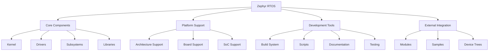
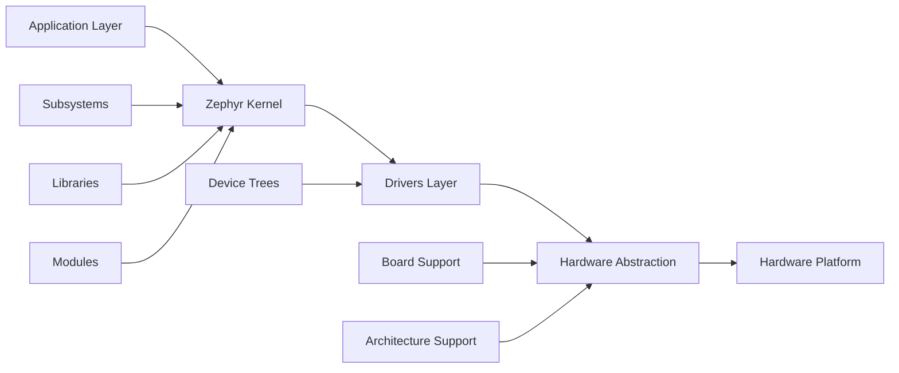
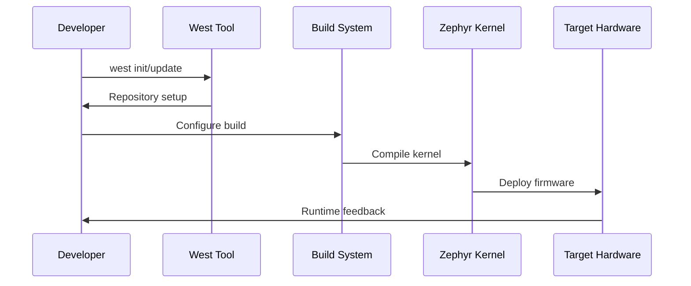

# Zephyr Project Directory Structure

## Overview

The Zephyr Project is an open-source real-time operating system (RTOS) designed for embedded devices. Its directory structure is meticulously organized to facilitate development, configuration, and management of the OS and its components across multiple hardware architectures and platforms.

## Project Architecture

## Directory Structure

| Directory | Type | Description | Key Components |
|-----------|------|-------------|----------------|
| `arch` | Core | Architecture-specific code and configurations | CPU architectures, low-level hardware abstraction |
| `boards` | Platform | Board-specific configurations and support files | Hardware platform definitions, board configs |
| `build` | Build | Build output files and temporary build data | Compiled objects, build artifacts |
| `cmake` | Build | CMake modules and build scripts | Build system configuration, toolchain files |
| `doc` | Documentation | Project documentation and resources | API docs, guides, specifications |
| `drivers` | Core | Hardware driver implementations | Peripheral drivers, hardware interfaces |
| `dts` | Platform | Device Tree Source files | Hardware description, device configurations |
| `include` | Core | Header files and API declarations | Public APIs, kernel headers, driver interfaces |
| `kernel` | Core | Core kernel implementation | Scheduler, memory management, IPC |
| `lib` | Core | Additional libraries and utilities | Standard libraries, utility functions |
| `misc` | Utility | Miscellaneous files and resources | Various support files |
| `modules` | External | Third-party components and modules | External libraries, middleware |
| `samples` | Development | Example applications and demos | Reference implementations, tutorials |
| `scripts` | Build | Development and build automation scripts | Build tools, utilities, automation |
| `share` | Utility | Shared resources across project | Common resources, templates |
| `snippets` | Development | Reusable code blocks | Code templates, snippets |
| `soc` | Platform | System-on-Chip specific implementations | SoC drivers, platform code |
| `submanifests` | Build | Dependency and component manifests | External component management |
| `subsys` | Core | System subsystems | Networking, filesystems, power management |
| `tests` | Development | Test suites and frameworks | Unit tests, integration tests |
| `workspace` | Development | User workspace and temporary files | Development workspace |

## Core System Components

## Key Configuration Files

| File | Purpose | Description |
|------|---------|-------------|
| `CMakeLists.txt` | Build System | Main CMake configuration for project building |
| `CODE_OF_CONDUCT.md` | Community | Contributor behavior guidelines |
| `CODEOWNERS` | Maintenance | Project component ownership and maintainers |
| `CONTRIBUTING.rst` | Community | Contribution guidelines and procedures |
| `Kconfig*` | Configuration | Build options and feature configuration system |
| `LICENSE` | Legal | Project licensing terms |
| `MAINTAINERS.yml` | Maintenance | Component maintainer assignments |
| `README.rst` | Documentation | Project overview and getting started guide |
| `SDK_VERSION` | Build | Required SDK version specification |
| `VERSION` | Release | Current project version information |
| `version.h.in` | Build | Version header template |
| `west.yml` | Build | West tool manifest for repository management |
| `zephyr-env.*` | Environment | Development environment setup scripts |

## Build and Development Flow

## Subsystem Organization

The Zephyr RTOS organizes its functionality into well-defined subsystems:

- **Kernel Subsystem**: Core OS functionality including scheduling, synchronization, and memory management
- **Driver Subsystem**: Hardware abstraction layer with standardized driver interfaces
- **Networking Subsystem**: TCP/IP stack, wireless protocols, and network management
- **Storage Subsystem**: File systems, flash management, and persistent storage
- **Power Management**: Energy-efficient operation and power state management
- **Security Subsystem**: Cryptographic services, secure boot, and security frameworks
